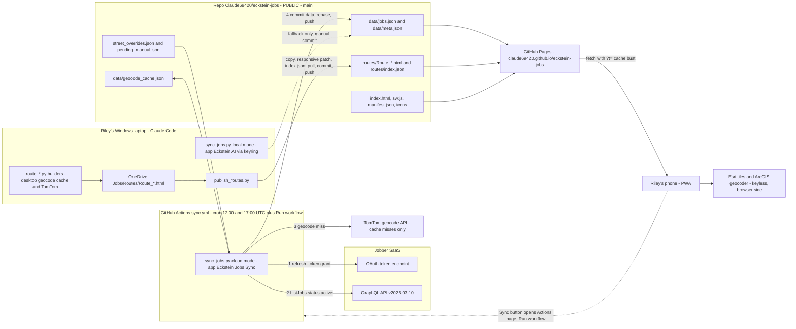

# Eckstein Jobs: APP MASTER (handoff and single source of truth)

> **Read this file first**, at the start of every session and again after any context compaction.
> This repo is **public**, so this file contains **no secret values**. Secrets are named, and their storage locations are described, but their values never appear here.
> Last full rewrite: **2026-09-25** (baseline HEAD `dd9cf03`, 53 jobs).

**Contents**
0. [Read first](#0-read-first)
1. [Business context and users](#1-business-context-and-users)
2. [Quick reference](#2-quick-reference)
3. [Architecture and data flow](#3-architecture-and-data-flow)
4. [Components in depth](#4-components-in-depth)
5. [Data files and schemas](#5-data-files-and-schemas)
6. [Secrets and auth](#6-secrets-and-auth)
7. [Operations runbook](#7-operations-runbook)
8. [Troubleshooting matrix](#8-troubleshooting-matrix)
9. [Design decisions](#9-design-decisions-adr-style)
10. [Known limitations and tech debt](#10-known-limitations-and-tech-debt)
11. [Roadmap and in-flight work](#11-roadmap--in-flight)
12. [CHANGELOG](#12-changelog)

---

## 0. READ FIRST

**What this is.** "Eckstein Jobs" is a phone-first PWA (installed to Riley's home screen). It has three tabs:
- **Jobs:** a map and list of every active Jobber job.
- **Routes:** route maps that Claude built on the desktop and published.
- **Plan a Route:** an in-browser route optimizer that works without Claude.

It is a static site on GitHub Pages at <https://claude69420.github.io/eckstein-jobs/>. A GitHub Actions cron (`sync.yml`) refreshes the data headlessly at **7:00 AM and 12:00 PM Winnipeg time (CDT)**. The cron calls the Jobber GraphQL API with a dedicated read-only Jobber app, and does not use Claude or the Max plan.

### Standing rules (Claude must follow these every time)

| # | Rule |
|---|---|
| 1 | **Never read, print, or relay secret values.** This covers the Jobber client ID, secret and refresh tokens; the TomTom key; the Windows keyring contents (`eckstein_jobber`); `%USERPROFILE%\.config\eckstein_jobber\credentials.json`; `%USERPROFILE%\.config\eckstein_jobs_sync\refresh_token.txt`; and GitHub secrets. **Riley pastes secrets himself.** Name a secret and say where it lives; never show its value. |
| 2 | **The repo is PUBLIC.** Never commit secret values, phone numbers, emails, or other personal contact details. **Never copy a desktop builder's `TOMTOM_KEY = "..."` line into this repo.** Private-individual client names already appear in `data/jobs.json` (the "Other" bucket), which is a known, accepted tradeoff (see §10). Don't add more personal data. |
| 3 | **Log every app change in the [CHANGELOG](#12-changelog) of this file, in the same commit as the change.** Also keep §11 (ROADMAP / IN-FLIGHT) current while a feature is mid-build, so a resumed session knows exactly where work stopped. Bot data syncs are not logged individually. |
| 4 | **After building any route map, run the publish step:** `python C:/Users/Riley/eckstein-jobs/publish_routes.py`. The file must be named `Route_*.html` in `C:/Users/Riley/OneDrive/Documents/Eckstein/Riley/Jobs/Routes`, or it never reaches the app. |
| 5 | **Commands given to Riley must be PowerShell-safe.** His terminal is Windows PowerShell 5.1. No `&&`, no `/c/...` paths, and no `<` input redirection. Use forms like `git -C C:/Users/Riley/eckstein-jobs pull --rebase`, one command per line. **Claude's own Bash tool is Git Bash**: `/c/Users/...` paths work there, but `git -C C:/Users/Riley/eckstein-jobs …` works in **both** shells, so prefer that form in any command Riley might end up running. Put gh on the PATH first with `export PATH="$PATH:/c/Program Files/GitHub CLI"`. Bash-only lines (`export`, `grep`, `cat`, `sleep`, `/c/...`) must be labelled Claude-only. |
| 6 | **Route numbering rule.** When a route starts at the shop, the shop marker is **`S`** (green) and the first site is **#1**. When a route starts at a site, that site is **#1**. **Estimates:** haversine km × **1.39** gives drive km. Drive time uses **40 km/h** urban or **70–80 km/h** rural. Always prefix estimates with `~` and label them "no live traffic". |
| 7 | **Manual refresh means "Run workflow"** (`gh workflow run sync.yml -R Claude69420/eckstein-jobs`). **Never use "Re-run jobs"** on an old run. |
| 8 | **Never hand-edit `data/jobs.json` or `data/meta.json`.** The bot rebuilds both from scratch every run. Put per-job user state in a **separate file keyed by `jobNumber`**. Street overrides and pending jobs are merged by `sync_jobs.py`. **Stages are merged by the frontend and never written by the bot** (see §5 "Stage data"). |
| 9 | **Keep the two Jobber apps separate.** The desktop MCP app is "Eckstein AI" (read/write, keyring, port 8080). The cloud sync app is "Eckstein Jobs Sync" (read-only, GitHub secrets, port 8081). Never put desktop credentials in GitHub, and never run `get_refresh_token.py` with desktop credentials. |
| 10 | **Pull before you push.** The bot commits `data/` twice a day. **Commit first, then pull, then push:** `git -C C:/Users/Riley/eckstein-jobs add index.html APP_MASTER.md` (the files you changed) → `git -C C:/Users/Riley/eckstein-jobs commit -m "app: what changed"` → `git -C C:/Users/Riley/eckstein-jobs pull --rebase` → `git -C C:/Users/Riley/eckstein-jobs push` (this exact path form works in both PowerShell and Git Bash). A plain `pull --rebase` **refuses to run with uncommitted edits** ("cannot pull with rebase: You have unstaged changes"), because this clone has no `rebase.autoStash` and `pull.rebase=false`; `git pull --rebase --autostash` (what `publish_routes.py` uses) is the alternative. If Claude's `git push` is **blocked by the auto-mode safety classifier** (it once flagged a push of job data to this public repo as "data exfiltration"), **stop and ask Riley to run the push himself** with `git -C C:/Users/Riley/eckstein-jobs push`. |
| 11 | **Geocodes: read back and verify.** Check TomTom's `freeformAddress` and postal code. TomTom mis-snaps rural towns and duplicate street names to other provinces. Server-side sync has a Manitoba bounding-box guard; the desktop builders don't. |
| 12 | **Adding a client key touches 4 places in 2 files:** `CLIENT_KEYS` in `sync_jobs.py`, and `COL` (L78), `LABEL` (L79) and `keys` (L100) in `index.html`. If you miss `keys`, that client's jobs **silently vanish** from the app. |
| 13 | **Multi-step feature work never sits on local `main`.** Any push of `main` deploys to Riley's phone in about 1 minute, and `publish_routes.py` runs `git pull --rebase --autostash` + `git push` on the *current* branch.<br>(a) Do R-1 and other multi-session work on a branch: `git -C C:/Users/Riley/eckstein-jobs switch -c r1-stages`. Commit there, with the CHANGELOG entry in the same commit. Optionally run `git -C C:/Users/Riley/eckstein-jobs push -u origin r1-stages` as an off-site backup (Pages serves only `main`).<br>(b) **Before running `publish_routes.py` or making any hotfix**, commit or stash the branch work and run `git -C C:/Users/Riley/eckstein-jobs switch main`. On a branch with no upstream, the script dies at `git pull` ("There is no tracking information for the current branch"), with the route files written but not committed. On a branch pushed with `-u`, it silently commits and pushes the routes to that branch, and they never go live, because Pages serves only `main`.<br>(c) To ship: `git switch main`, then `git pull --rebase`, then `git merge --ff-only r1-stages` (rebase the branch onto `main` first if needed), then push and verify live.<br>(d) Record the branch name, and whether it is pushed or merged, in the §11 Work log. |

**Where the other context lives:**
- `C:/Users/Riley/OneDrive/Documents/University/Year 5/Claude Code/ROUTING_PLAYBOOK.md` is private and holds routing rules and the TomTom key. **Read it before any routing work.** Some parts are stale (see §10).
- Claude memory (folder `C:/Users/Riley/.claude/projects/C--Users-Riley-OneDrive-Documents-University-Year-5-Claude-Code/memory/`):
  - `project_route_mapping.md` (routing workflow);
  - `project_eckstein_jobs_app.md` (this app; indexed in that folder's `MEMORY.md`).
- **Pointers to this file** (all in place as of 2026-09-25):
  - `C:/Users/Riley/eckstein-jobs/CLAUDE.md` (in the repo, not yet committed) auto-loads when the Claude Code session's working directory is the repo.
  - `C:/Users/Riley/OneDrive/Documents/University/Year 5/Claude Code/CLAUDE.md` (out of repo) auto-loads in Claude's usual working directory and routes app work here.
  - Memory `…/memory/project_eckstein_jobs_app.md` (out of repo, listed in `MEMORY.md`): "Read APP_MASTER.md before any app work". The auto-memory entry **points here (done 2026-09-25)**, so this file is found after compaction even from the Claude Code folder.
  - `ROUTING_PLAYBOOK.md`, section "Eckstein Jobs phone app", first bullet ("Master doc").
- The out-of-repo stale pointers found during the 2026-09-25 doc review (folder `CLAUDE.md` routing table, `ROUTING_PLAYBOOK.md` "Leaflet + OSM" heading and local-run wording) were **fixed on 2026-09-25**.

### Current state and in-flight work (as of 2026-09-25, after the 17:05 UTC sync)

The app is **live and healthy**:
- **53 jobs, 53 mapped, 0 failed**: 52 active in Jobber plus 1 pending manual job, 9001.
- Geocode cache: 312 entries.
- 63 published routes.
- When this was written, local `main` was level with `origin/main` at `dd9cf03`. **Every number in this box is a snapshot** and goes stale twice a day. After `git pull --rebase`, re-read `data/meta.json` before quoting counts to Riley.
- Every scheduled sync since the 2026-09-17 token fix has been green. The one failure since then was a "Re-run jobs" push rejection on 09-24, now fixed by `8b2e72f`.
- The two previously unpublished desktop routes (`Route_Setup_ShopToEmily.html`, `Route_Princess_Cuts.html`) were published 2026-09-25 right after the docs commit.
- **Open security item:** `%USERPROFILE%\.config\eckstein_jobs_sync\refresh_token.txt` still exists (32 bytes, written 2026-09-15 22:05 CDT, never deleted) and likely holds the live sync-app refresh token in plaintext. Ask Riley to run (PowerShell): `Remove-Item "$env:USERPROFILE\.config\eckstein_jobs_sync\refresh_token.txt"`. Claude never reads it. Remove this bullet (and the matching §10 item) once Riley confirms.

**In flight:** Riley's 2026-09-25 request for:
- **Job stage tracking**: Ready to start → Excavation → Base → Prep → Passed inspection → Poured.
- **Filtering** by client **or** by stage.
- **One-click shop-start routing** for every job in a stage.
- A **stage slider** on map dots and sidebar rows.
- An **Apple-style "Liquid Glass" reskin**.

Status: **Design in progress (2026-09-25).** Riley answered the clarifying questions (recorded in §11 "Answers from Riley"). Storage is **decided**: a dedicated public repo `Claude69420/eckstein-jobs-state` written from the app with a fine-grained key scoped to that repo only, plus a "setup link" to share edit access. **PC (Chrome/Edge on Windows) is a first-class target alongside iPhone**, and both must get the Liquid Glass look. Liquid Glass research (repos, technique, iOS Safari support, Apple HIG) is running; the build follows on branch `r1-stages`. See the §11 Work log for the exact next step.

### Resuming after compaction or in a new session (do this before anything else)
1. Read §0 and the §11 **Work log**.
2. **Claude only, in Git Bash (Bash tool):**
   ```bash
   git -C C:/Users/Riley/eckstein-jobs status --short
   git -C C:/Users/Riley/eckstein-jobs branch -vv
   git -C C:/Users/Riley/eckstein-jobs stash list
   git -C C:/Users/Riley/eckstein-jobs log --oneline --decorate -10 --all
   git -C C:/Users/Riley/eckstein-jobs diff --stat
   git -C C:/Users/Riley/eckstein-jobs log --oneline origin/main..HEAD
   ```
3. Compare what git shows with the Work log's *Uncommitted* and *Half-done* lines. If they disagree, trust git, describe the difference to Riley, and never discard changes without his OK.
4. Compare the newest CHANGELOG entry with `git -C C:/Users/Riley/eckstein-jobs log -5 --oneline`. A missing entry means the previous session stopped before logging, so add it.
5. Run `preview_list`. If the preview is down, `preview_start` with name `eckstein-jobs`.
6. Check §11 *Answers from Riley*. Open questions stay blocking (see §11 "If the answers are not recorded here").
7. Continue from *Next step*. Update the Work log after every meaningful step, not only at the end.

---

## 1. Business context and users

- **Eckstein Repair** is Riley's concrete and asphalt restoration contractor in Winnipeg, Manitoba. Crews restore **utility cuts** (sidewalk, street, asphalt path, paving stone, driveway) after gas and sewer work.
- **Shop:** 1279 Loudoun Rd, Winnipeg, at (49.8401, −97.2546). Some desktop builders use the more precise 49.840127, −97.254552.
- **Commercial clients (client keys and map colours):**

| Key | Jobber companyName (exact) | Colour | Typical work and identifiers |
|---|---|---|---|
| `Crown` | Crown Pipeline Ltd. | `#2563eb` blue | Gas utility cuts; 6-digit permits (35xxxx, including 357xxx), City `M0xxxxx` permits (`M` plus 6 digits; seen only on Crown jobs), gas numbers, "(gas)" |
| `Harris` | Harris Holdings Ltd. | `#dc2626` red | 6-digit permits (35xxxx including 357xxx, 32xxxx, 34xxxx) and TM traffic permits (`TM` plus 5 digits) |
| `ACV` | ACV Sewer & Water | `#16a34a` green | Sewer/water restorations |
| `MyTec` | MyTec Industry Ltd | `#7c3aed` purple | — |
| `NoLimits` | No Limits Underground Ltd. | `#0d9488` teal | Added 2026-09-23 (first job was on Beaumont St) |
| `Other` | anything else | `#f59e0b` amber | "Other / Residential": one-off accounts and private homeowners |

- **Crew roles** that appear in route names: cuts & cleanup, setup, excavation, base, prep, asphalt, steel, measurements. David's measurements route is one example.
- **Users:**
  - **Riley** uses the app on his phone in the field. The PWA is pinned to his home screen. On 2026-09-25 he said it has been "very helpful this week".
  - He triggers manual syncs from the header's **Sync** button, which needs a GitHub login with write access (the `Claude69420` account).
  - The site is public, but nobody else is a known regular user yet. Sharing with crew is part of the stage-tracking discussion.
- **Where Claude works:** Claude Code on Riley's Windows laptop (a Surface Laptop Studio). The working directory is `C:/Users/Riley/OneDrive/Documents/University/Year 5/Claude Code`. The app repo lives **outside OneDrive** at `C:/Users/Riley/eckstein-jobs`.

---

## 2. Quick reference

| Item | Value |
|---|---|
| Live URL | <https://claude69420.github.io/eckstein-jobs/> |
| Repo | <https://github.com/Claude69420/eckstein-jobs> (**PUBLIC**, branch `main`, created 2026-09-16 02:55 UTC) |
| Local clone | `C:/Users/Riley/eckstein-jobs` (outside OneDrive) |
| GitHub account | `Claude69420`. It was created by Riley for this app. The gh CLI is logged in as this account through a device login. |
| gh CLI | `C:/Program Files/GitHub CLI/gh.exe`. In Git Bash, run `export PATH="$PATH:/c/Program Files/GitHub CLI"` first. |
| Actions page | <https://github.com/Claude69420/eckstein-jobs/actions/workflows/sync.yml> (the app's **Sync** button links here) |
| Secrets page | <https://github.com/Claude69420/eckstein-jobs/settings/secrets/actions> |
| Pages settings | <https://github.com/Claude69420/eckstein-jobs/settings/pages> (legacy build, source `main` at `/`, HTTPS enforced, no custom domain) |
| Jobber app: cloud sync | **"Eckstein Jobs Sync"**: Clients read and Jobs read only, refresh-token rotation **OFF**. Callback registered as `https://claude69420.github.io/eckstein-jobs/callback`; `get_refresh_token.py` actually uses `http://localhost:8081/callback`. |
| Jobber app: desktop MCP | **"Eckstein AI"**: read/write. Token in Windows Credential Manager (keyring service `eckstein_jobber`, user `token`), callback `http://localhost:8080/callback`. |
| GitHub secrets (names) | `JOBBER_CLIENT_ID`, `JOBBER_CLIENT_SECRET`, `JOBBER_REFRESH_TOKEN`, `TOMTOM_KEY`. `GH_PAT` is referenced by the workflow but **not set**. |
| Schedule | Cron `0 12 * * *` and `0 17 * * *` UTC. That is 7:00 AM and 12:00 PM CDT, or **6:00 AM and 11:00 AM CST** from 2026-11-01 to 2027-03-14. Runs start about 5 minutes late and data is live about 6 minutes after the cron time. |
| Jobber API | GraphQL `https://api.getjobber.com/api/graphql`, header `X-JOBBER-GRAPHQL-VERSION: 2026-03-10`. OAuth token endpoint `https://api.getjobber.com/api/oauth/token`. |
| Geocoders | Server: TomTom Search (cache misses only). Browser planner: Esri ArcGIS World Geocoder (no key). |
| Map tiles | Esri `Canvas/World_Light_Gray_Base` plus `World_Light_Gray_Reference` |
| Desktop route output | `C:/Users/Riley/OneDrive/Documents/Eckstein/Riley/Jobs/Routes` |
| Desktop builders and playbook | `C:/Users/Riley/OneDrive/Documents/University/Year 5/Claude Code/` (`_route_*.py`, `_map_*.py`, `ROUTING_PLAYBOOK.md`) |
| Local preview | The `.claude/launch.json` config `eckstein-jobs` in the Claude Code folder runs `python -m http.server 8765 --directory C:/Users/Riley/eckstein-jobs`, served at <http://localhost:8765/> |
| Python for local sync | `C:/Users/Riley/OneDrive/Documents/Agents/.venv/Scripts/python.exe` (has `keyring` and `requests`) |

**Key files in the repo:**

| File | Role |
|---|---|
| `index.html` | The entire frontend: 185 lines, inline CSS and JS, Leaflet 1.9.4 from unpkg |
| `sw.js` | Service worker: network-first, cache `ej-v1` |
| `manifest.json`, `icons/icon-192.png`, `icons/icon-512.png` | PWA install metadata |
| `sync_jobs.py` | Jobber to `data/*.json` sync (stdlib only, 222 lines) |
| `.github/workflows/sync.yml` | Cron and manual workflow ("Sync jobs from Jobber") |
| `get_refresh_token.py` | One-time OAuth consent helper for the sync app (run by Riley) |
| `publish_routes.py` | Copies desktop `Route_*.html` into `routes/`, makes them responsive, rebuilds `routes/index.json`, then commits and pushes |
| `data/jobs.json`, `data/meta.json` | Generated by the bot every run |
| `data/geocode_cache.json` | Repo geocode cache, committed by the bot |
| `data/street_overrides.json`, `data/pending_manual.json` | Hand-maintained inputs to the sync |
| `routes/Route_*.html`, `routes/index.json` | Published route maps and their index |
| `CLAUDE.md` | Short pointer to this file |
| `APP_MASTER.md` | This file |
| `.gitignore` | `__pycache__/` and `*.pyc` |

---

## 3. Architecture and data flow



**Data flow narrative:**
1. **Sync.** At 12:00 and 17:00 UTC (actual start about 12:04 and 17:05), or on a manual **Run workflow**, GitHub Actions runs `python sync_jobs.py` with the four secrets. The script:
   - swaps the stored refresh token for an access token;
   - pages through all **active** Jobber jobs;
   - cleans addresses, applies `street_overrides.json`, extracts permits and maps clients to colour keys;
   - geocodes cache-first (TomTom only on a miss, Manitoba box guard);
   - appends `pending_manual.json` entries;
   - writes `data/geocode_cache.json`, `data/jobs.json` and `data/meta.json`.
2. **Commit.** The workflow commits `data/` as `eckstein-sync-bot` ("Sync jobs YYYY-MM-DD HH:MM UTC"), rebases onto `origin/main` with `-X theirs` (fresh data wins), and pushes with up to 4 tries.
3. **Deploy.** The push to `main` triggers GitHub's "pages build and deployment", which takes about 31–106 s (typically 35–47 s). Files are served with `Cache-Control: max-age=600`.
4. **App.** On load or on the ↻ button, `index.html` fetches `data/jobs.json`, `data/meta.json` and `routes/index.json` with `?t=<now>`. It renders the Jobs map and list and the Routes cards. The Plan tab geocodes typed addresses with Esri in the browser and runs an in-browser TSP optimizer.
5. **Routes.** Claude builds route maps on the desktop with per-route Python builders into OneDrive `.../Jobs/Routes/Route_*.html`. Then `publish_routes.py`:
   - copies new or changed files into `routes/`;
   - injects a phone-responsive media query;
   - rebuilds `routes/index.json`;
   - runs `git pull --rebase --autostash`, commits and pushes.
6. **Local fallback.** With no Jobber cloud env vars set, `sync_jobs.py` borrows the desktop MCP's keyring token ("Eckstein AI"). It writes only `data/`, and a human or Claude commits and pushes by hand.

---

## 4. Components in depth

### 4.1 Sync pipeline: `sync_jobs.py`

It uses only the standard library (`urllib`, no `requests`), so the workflow has no pip step. All paths are relative to the script (`ROOT = Path(__file__).resolve().parent`), so the working directory doesn't matter.

**Execution flow:**
1. `DATA.mkdir(exist_ok=True)`.
2. `get_access_token()` (auth modes below).
3. `raw = fetch_active_jobs(token)` (the function itself prints nothing); then `main()` prints `jobber: N active jobs` (L172).
4. It loads four inputs:
   - `geocode_cache.json` (default `{}`)
   - `street_overrides.json` (keys converted to `int`)
   - `pending_manual.json` (default `[]`)
   - env `TOMTOM_KEY` (stripped)

   `load_json` swallows **any** exception and returns the default. A corrupt file is silently treated as empty, and a corrupt cache means every address gets re-geocoded.
5. For each Jobber job, it builds a record and, if `street` is non-empty, geocodes it. After any job where `api_calls` is a nonzero multiple of 5, it sleeps 0.2 s. Quirk: this repeats on later cache hits until the next API call.
6. It appends pending manual jobs, geocoded the same way.
7. It sorts by `-jobNumber`, so 9001 comes first, then 699, 698 and so on.
8. It writes `geocode_cache.json` (indent=2), `jobs.json` (indent=1) and `meta.json` (indent=1), in that order.
9. It prints `done: N jobs, M mapped, F failed, A geocode calls, cache C`, then `  FAILED: #<n> '<street>' / <city>` for each unmapped job.
10. It returns 0. **Geocode failures never fail the run.** Only exceptions do (auth, GraphQL, network, KeyError/TypeError on an unexpected response shape).

**Auth: cloud mode.** It is used when `JOBBER_CLIENT_ID`, `JOBBER_CLIENT_SECRET` and `JOBBER_REFRESH_TOKEN` are **all** non-empty after `.strip()`.
- It prints `auth: cloud mode (refresh_token grant) [client_id len 36, secret len 64, refresh len N]`. Only lengths are printed. **The baseline is 36 / 64 / 32**; the refresh length was 59 before the 09-17 fix.
- It sends a form-encoded `POST https://api.getjobber.com/api/oauth/token` with `grant_type=refresh_token`, `refresh_token`, `client_id` and `client_secret`. Timeout 20 s.
- On an `HTTPError` it prints `auth: Jobber token endpoint HTTP <code> -> <first 300 chars of body>`, then a hint (`sync_jobs.py` L75, verbatim: `auth: invalid_client => JOBBER_CLIENT_ID/JOBBER_CLIENT_SECRET wrong; invalid_grant => JOBBER_REFRESH_TOKEN wrong/expired`), and re-raises.
- **Rotation:** if the response's `refresh_token` differs from the input, it writes the new one to the file named by env `ROTATED_TOKEN_FILE` and prints `auth: Jobber ROTATED the refresh token -> written to ROTATED_TOKEN_FILE...`. If that env var is unset, it prints `auth: WARNING Jobber rotated ... ROTATED_TOKEN_FILE not set`.
- It returns `tok["access_token"]`.

**Auth: local mode.** It is used when any Jobber env var is missing. It prints `auth: local mode (desktop keyring)`, then:
```python
sys.path.insert(0, r"C:\Users\Riley\OneDrive\Documents\Agents")
from agents.services.eckstein_jobber.auth import get_access_token as _local
```
- This reuses the **desktop MCP app "Eckstein AI"**. Its credentials are in `%USERPROFILE%\.config\eckstein_jobber\credentials.json` (client_id, client_secret, redirect_uri). Its tokens (access, refresh, `expires_at`) are in Windows Credential Manager through keyring, service `eckstein_jobber`, user `token`.
- The order it tries:
  1. Use the cached access token if it is still valid (60 s buffer).
  2. Otherwise refresh and save the result back to keyring. If Jobber omits a new refresh token, the old one is kept.
  3. If the refresh fails, it **silently falls back to an interactive browser consent flow on `http://localhost:8080/callback`**, which blocks until consent is given.
- It needs `keyring` and `requests`, both present in the Agents venv.

**Jobber GraphQL fetch:**
- URL `https://api.getjobber.com/api/graphql`.
- Headers: `Authorization: Bearer <token>`, `X-JOBBER-GRAPHQL-VERSION: 2026-03-10` (`sync_jobs.py` line 30; the same value is in the desktop `server.py` lines 59–60, so **bump both together**), and `Content-Type: application/json`.
- Query `ListJobs($filter: JobFilterAttributes, $first: Int, $after: String)` on `jobs(filter, first, after)`:
  - `nodes { id jobNumber title jobStatus client { id name companyName } property { address { street1 city } } createdAt updatedAt }`
  - `pageInfo { hasNextPage endCursor }`

  This is the same shape as the MCP tool `jobber_list_jobs` (`server.py:916`).
- Variables: `{"filter": {"status": "active"}, "first": 100, "after": <cursor>}`. "Active" also covers on-hold jobs.
- Pagination: at most 50 pages × 100, a **5,000-job hard cap** with silent truncation.
- Retries: 5 attempts per page on any exception, sleeping `2**attempt` (1, 2, 4, 8 s), then it raises. A 401 is retried pointlessly.
- GraphQL errors:
  - `"errors"` with no `data` raises `RuntimeError("Jobber GraphQL error: [...]")`, **not retried**. Throttling shows up this way.
  - Errors alongside data are silently accepted.
  - `data` null with no `errors` key passes the guard (`if "errors" in res and not res.get("data")`, L117) and then raises `TypeError: 'NoneType' object is not subscriptable` at `res["data"]["jobs"]` (L119). A missing `data` key (or a missing `jobs` inside it) raises `KeyError`.
  - A GraphQL-level **401** (token exchange fine, access token rejected) is retried 5 times over about 15 s inside `fetch_active_jobs` with **no logging**, then surfaces as a bare `urllib.error.HTTPError: HTTP Error 401: Unauthorized` traceback. The body is never printed (only token-endpoint errors print a body, L72–76). See §7.13.
- `id`, `client.id`, `createdAt` and `updatedAt` are fetched but **not written out**, so `jobNumber` is the only stable key in the output.
- Statuses seen on 2026-09-25: `action_required` 33, `unscheduled` 11, `upcoming` 4, `late` 4, plus the synthetic `pending` 1.

**Transform rules:**
- `client = companyName or name or "Unknown"`.
- `jobNumber = int(jobNumber)`.
- `city = address.city or "Winnipeg"`.
- `clientKey = CLIENT_KEYS.get(client, "Other")`. `CLIENT_KEYS` is at `sync_jobs.py` around lines 36–42:
  ```python
  "Crown Pipeline Ltd.": "Crown", "Harris Holdings Ltd.": "Harris", "ACV Sewer & Water": "ACV",
  "MyTec Industry Ltd": "MyTec", "No Limits Underground Ltd.": "NoLimits"
  ```
- `street = overrides.get(jobNumber) or clean_addr(street1)`. An override replaces the street wholesale and is **not** cleaned.
- `clean_addr`, applied in order:
  ```python
  s = (s or "").replace("&amp;", "&")
  s = re.sub(r"\s*\(.*?\)\s*", " ", s)      # (parenthetical)
  s = re.sub(r"\s*\[.*?\]\s*", " ", s)      # [bracketed]
  s = re.sub(r"\bUnits?\s*[\d\-,\s]+", "", s, flags=re.I)
  s = re.sub(r"\b(Rear Lane|Lane)\b", "", s, flags=re.I)
  return re.sub(r"\s+", " ", s).strip(" -,")
  ```
  Quirks, verified by running it:
  - `"Unit 2 59 Market Blvd"` becomes `"Market Blvd"`: a leading unit eats the civic number.
  - `"Units 1-4, 200 Portage Ave"` becomes `"Portage Ave"`.
  - `"Kildonan Lane"` becomes `"Kildonan"`: real "Lane" names get stripped.
  - A trailing `(Unit 2)` or `Unit 2` is handled correctly.
- `extract_permit(title)`:
  ```python
  t = (title or "").replace("&amp;", "&")
  perms = re.findall(r"\b(?:M\d{5,6}|TM\d{4,6}|CTR\d+|\d{5,6})\b", t)
  if perms: return " / ".join(dict.fromkeys(perms))   # order-preserving de-dupe
  return "(gas)" if "Gas" in t else ""                # case-sensitive "Gas"
  ```
  Any standalone 5–6 digit number counts as a permit.
- **Pending manual jobs** (`pending_manual.json`):
  - Output fields: `streetRaw = street`, `permit ""`, `status "pending"`, `unscheduled false`, `pending true`, and `city` defaulting to Winnipeg.
  - They are geocoded through the same cache, but their TomTom calls are **not counted** in `geocode_api_calls`.
  - They are never auto-removed.
- **Every run rebuilds `jobs.json` from scratch.** Any user-set per-job state must live in a separate file keyed by `jobNumber`. Overrides and pending jobs are merged in by the sync; **stages are merged by the frontend and never written by the bot** (§5 "Stage data").

### 4.2 GitHub Actions workflow: `.github/workflows/sync.yml` ("Sync jobs from Jobber")

**Triggers:**
- `schedule` `0 12 * * *` and `0 17 * * *` (UTC only).
- `workflow_dispatch: {}` for manual **Run workflow**.
- In practice runs start a median of 4.9 min late (range 4.3–5.6 min over 20 scheduled runs; none dropped). GitHub cron can be delayed or dropped under load.

**Permissions and concurrency:**
- `permissions: contents: write` is required, because the repo's default workflow permission is read.
- `concurrency: group: sync-jobs, cancel-in-progress: false` makes runs queue. GitHub keeps at most one *pending* run per group, so a newer pending run replaces an older pending one.

**Steps** (on `ubuntu-latest`):
1. `actions/checkout@v5` with `fetch-depth: 0` (full history, needed for the rebase).
2. `actions/setup-python@v6` with Python `3.12`.
3. **Pull jobs + geocode**: `python sync_jobs.py` with env `JOBBER_CLIENT_ID`, `JOBBER_CLIENT_SECRET`, `JOBBER_REFRESH_TOKEN` and `TOMTOM_KEY` from secrets, plus `ROTATED_TOKEN_FILE=${{ runner.temp }}/rotated_refresh_token`.
4. **Persist rotated refresh token (if any)** (`if: always()`, `GH_TOKEN=${{ secrets.GH_PAT }}`). If the rotated file is non-empty:
   - With `GH_TOKEN` set, it runs `gh secret set JOBBER_REFRESH_TOKEN --repo <repo> < file` and prints `Updated JOBBER_REFRESH_TOKEN secret.`
   - Otherwise it emits `::warning::Jobber rotated the refresh token but no GH_PAT secret is set; add GH_PAT (repo scope) or re-paste JOBBER_REFRESH_TOKEN.`
   - Either way it runs `rm -f` on the file.

   The built-in `GITHUB_TOKEN` cannot write secrets. **`GH_PAT` is not set today.**
5. **Commit updated data** (no `always()`, so it is skipped if step 3 failed):
   1. Set the git identity to `eckstein-sync-bot` / `sync-bot@users.noreply.github.com`.
   2. `git add data/`. If nothing is staged it prints `No changes.` and exits 0. That never happens in practice, because `updated_utc` changes every run, so **every successful run commits** (about 2 per day).
   3. Commit `Sync jobs YYYY-MM-DD HH:MM UTC`.
   4. Push loop, `for i in 1..4`:
      - `git fetch origin main`, then `git rebase -X theirs origin/main`. "theirs" is the commit being replayed, so **fresh data wins**. On a rebase failure: `git rebase --abort`, `::error::Rebase onto main failed`, exit 1.
      - `git push origin HEAD:main`. On success it prints `Pushed.`. On rejection it prints `Push rejected (attempt i); retrying...` and sleeps `i*5` s (5, 10, 15, 20).
      - After 4 failures: `::error::Could not push after retries`, exit 1.
6. The push triggers GitHub's own "pages build and deployment", which takes about 31–106 s (typically 35–47 s; measured over 26 successful builds, min 31.1 s for `b9e06af`, max 105.6 s for `8478daf`).

**Timing:** the job itself takes a median of 12 s (max 28 s). End to end, data is live at about the cron time + 6 min, so roughly **7:06 AM and 12:06 PM CDT**. Example from 2026-09-25: cron 17:00, start 17:04:54, commit 17:05:01, live 17:06:12.

**Run history** (27 runs, 2026-09-16 to 2026-09-25):
- 20 succeeded and 7 failed, across 28 attempts with 21 successful.
- Schedule: 20 runs, 17 succeeded.
- Dispatch: 7 runs, 3 succeeded and 4 failed. Three of those failures were setup-time 401s. The fourth was run 35943677247, whose attempt 1 succeeded and whose re-run attempt 2 failed.
- The 21 successful attempts match the 21 bot commits, from `9740cd4` to `dd9cf03`.
- All successful runs had `0 failed` geocodes.
- There have been 0 "Jobber ROTATED" messages ever.

### 4.3 Frontend: `index.html`, `sw.js`, `manifest.json`, `icons/`

All line numbers refer to `index.html` as of `8b2e72f` (185 lines). None of these files contains a secret; the geocoder is keyless.

**Head and libraries:**
- Leaflet 1.9.4 from unpkg (`https://unpkg.com/leaflet@1.9.4/dist/leaflet.css` and `.../leaflet.js`, L11–12). There are **no SRI attributes** and no other dependencies.
- Meta tags:
  - `viewport` is `width=device-width,initial-scale=1,viewport-fit=cover`.
  - `theme-color` is `#0f172a` (L4).
  - `apple-mobile-web-app-capable=yes`.
  - `apple-mobile-web-app-status-bar-style=black-translucent`.
  - `apple-mobile-web-app-title="Eckstein Jobs"`.
- Links: `manifest.json`. `apple-touch-icon` and `icon` both point to `icons/icon-192.png`; there is no 180 px Apple icon.
- `<title>`: "Eckstein Jobs".

**DOM ids:**

| id | Element | Purpose |
|---|---|---|
| `top` | div | Sticky header (`z-index:1000`), top padding `env(safe-area-inset-top)`. Contains `.bar` (h1 plus controls). |
| `upd` | div.upd | Status text: "loading…", then `"{mapped}/{total} mapped · updated {Mon D, h:mm}"`, or "failed to load data" / "refreshing…" |
| `rf` | button.tb "↻" | Sets `#upd` to "refreshing…", then calls `location.reload()` |
| (no id) | a.tb "Sync" | Opens `https://github.com/Claude69420/eckstein-jobs/actions/workflows/sync.yml` in a new tab (`target=_blank rel=noopener`). The user taps **Run workflow** there, which needs a GitHub login with write access. |
| `tabs` | div | Buttons with `data-v="jobs"`, `"routes"`, `"plan"`, labelled Jobs / Routes / Plan a Route |
| `v-jobs` | div.view.on | Jobs view. Holds `.split`, which contains `#jmap` and `.side`. |
| `jmap` | div.mapbox | Jobs Leaflet map |
| `chips` | div.chips | Client filter chips |
| `q` | input | Search ("Search address, permit, job #…"); `oninput = renderJobs` |
| `jlist` | div | Job list grouped by client |
| `v-routes` | div.view | Routes view |
| `rlist` | div.muted | Route cards |
| `v-plan` | div.view (.pane) | Plan a Route view |
| `stops` | ul.stops | Editable stop list |
| `addr` | input | Address entry. Pressing Enter clicks `#addAddr`. |
| `addAddr` | button.btn.sm | Geocode the address and add it as a stop |
| `addShop` | button.btn.sm.alt | "+ Shop" |
| `pickJob` | button.btn.sm.alt | "+ From jobs list". Toggles `#pickbox`. |
| `clearStops` | button.btn.sm.alt | Empties the stops and clears `#pres` |
| `pickbox` | div.picker | Job picker: hidden by default, max-height 220 px, scrolls |
| `fxs` | checkbox (checked by default) | "First stop is fixed start" |
| `fxe` | checkbox | "Last stop is fixed end" |
| `rt` | checkbox | "Return to start" |
| `opt` | button.btn.go | "Optimize route" |
| `pres` | div | Result panel, rebuilt by `showResult` on every run |
| `saveR` | button (dynamic, inside `#pres`) | Save the current result |
| `pmap` | div.mapbox (dynamic, 44vh) | Planned-route map |
| `plist` | div (dynamic) | Ordered result stops |
| `savedlist` | div.muted | Saved-route cards ("none yet" when empty) |

**Tabs (L87–89):**
- A click moves `.on` to the clicked button and to `#v-{data-v}`. CSS: `.view{display:none}`, `.view.on{display:block}`.
- 50 ms later it calls `invalidateSize()` on `jmap` (Jobs) or `pmap` (Plan).
- There is no hash routing and the tab is not remembered. Every load opens on Jobs.

**CSS tokens (L14):**

| Token | Value | Used? |
|---|---|---|
| `--crown` | `#2563eb` | no (JS `COL` is used instead) |
| `--harris` | `#dc2626` | no |
| `--acv` | `#16a34a` | no |
| `--mytec` | `#7c3aed` | no |
| `--other` | `#f59e0b` | no |
| `--ink` | `#0f172a` | yes (header background) |
| `--bg` | `#f4f5f7` | yes (body background) |

- There is no NoLimits CSS variable. JS `COL` has `NoLimits:'#0d9488'`.

**Hard-coded colours** (a retheme must tokenise these):

| Area | Colours |
|---|---|
| Text | Body `#111`; muted `#6b7280`; `.leg` `#9ca3af` |
| Header | Tab bar `#1e293b`; tab text `#cbd5e1`; active tab white with a 3 px `#38bdf8` bottom border; `.tb` buttons `#334155` |
| Borders | `#d0d4db`, `#e0e4eb` (rows), `#cbd5e1` (inputs), `#eee` (picker rows), `#999` (list-dot ring, a `box-shadow`); row `:active` `#eef2ff` |
| Buttons | `.btn` `#0369a1`; `.btn.alt` `#475569`; `.btn.go` `#16a34a` (full width); `.ib` white with a `#cbd5e1` border |
| Result panel | `.res .hd` background `#e0f2fe` with `#0369a1` bold text; link buttons `#0369a1` |
| Status | Unscheduled `#b45309`; pending `#7c3aed`; unmapped tag `#6b7280` |
| Route pins | Start `#16a34a`; end `#dc2626`; middle `#0369a1`; planner stop-number circles `#334155`; polyline `#0369a1` |

**Other styling:**
- Radii are mostly 3–8 px; exceptions are the planner's stop-number circles (`.stops li .n{…border-radius:12px…}`, L43) and the `50%` circles (markers and pins). Shadows appear on markers and pins, plus the list dots: `.dot` (L31) has `border:2px solid #fff;box-shadow:0 0 0 1px #999`. There is no dark mode.
- Fonts: `-apple-system, Segoe UI, Roboto, Arial, sans-serif`. Permit badges use `Menlo, Consolas, monospace`.
- One breakpoint, `min-width:900px`:
  - `.split{display:flex;height:calc(100vh - 92px)}` (**the 92 px header height is hard-coded**, L24).
  - `.mapbox{flex:1}`.
  - `.side` is 440 px wide, scrolls, and has a left border.
- Below 900 px: `.mapbox` is 52vh (min 280 px), the list sits under the map, and the page scrolls.
- Markers:
  - `.mk` is a 16 px circle with a 2 px white border.
  - `.mk.uns` has a 2 px solid `#b45309` border.
  - `.mk.pend` has a 2 px **dashed** `#7c3aed` border.
  - `.pin` is a 28 px circle with white bold text.

**Constants (L78–80):**
- `COL = {Crown:'#2563eb', Harris:'#dc2626', ACV:'#16a34a', MyTec:'#7c3aed', NoLimits:'#0d9488', Other:'#f59e0b'}`
- `LABEL = {Crown:'Crown Pipeline', Harris:'Harris Holdings', ACV:'ACV Sewer & Water', MyTec:'MyTec', NoLimits:'No Limits Underground', Other:'Other / Residential'}`
- `SHOP = {name:'Shop (1279 Loudoun Rd)', lat:49.8401, lon:-97.2546, shop:true}`
- `bust()` returns `'?t=' + Date.now()`.

**Data loading (`loadAll`, L93–97):**
1. Fetches `data/jobs.json?t=…` and `data/meta.json?t=…` in parallel.
2. Sets `JOBS` and `#upd` (using `toLocaleString([], {month:'short', day:'numeric', hour:'numeric', minute:'2-digit'})`).
3. Calls `renderJobs()`.

Details:
- Any error shows "failed to load data" and logs to `console.error`. `r.ok` is never checked, so a 404 fails at `.json()` and lands in the same catch.
- `routes/index.json?t=…` is fetched separately and passed to `renderRoutes`. On failure, `#rlist` shows "no routes published yet".
- Data reloads **only** on a full page reload (the ↻ button). There is no polling and no reload when the app comes back into view.
- The UI uses only `updated_utc`, `mapped` and `total` from meta. It never displays the Jobber `status`.

**Jobs view (`renderJobs`, L98–117):**
- **Map:** `jmap` is created lazily with `L.map('jmap')` plus `baseTiles`. There is no initial `setView`. It fits to the markers **once** (custom flag `jmap._fitted`, 30 px padding).
- **Full rebuild on every render:** all markers, chips and list rows are rebuilt on every search keystroke and every chip click.
- **Chips:**
  - `keys = ['Crown','Harris','ACV','MyTec','NoLimits','Other']` (L100) is fixed and sets the order of chips and groups.
  - `vis[k]` defaults to `true`.
  - A chip is drawn only if that client has more than 0 jobs in **all** of `JOBS`; the count ignores the search box.
  - Chip background is `COL[k]`, and the text is `LABEL[k]` plus a `.ct` count. `.chip.off` has opacity .3, and a click toggles the client and re-renders.
  - **A `clientKey` missing from `keys` gets `vis` = undefined, so its jobs silently disappear.**
- **Search:** a lowercase substring test on `street + ' ' + permit + ' ' + jobNumber + ' ' + title + ' ' + city`. The client name, `status` and `streetRaw` are **not** searched.
- **Markers:**
  - Only jobs with `ok` get one.
  - Class is `'mk' + (pending ? ' pend' : unscheduled ? ' uns' : '')`.
  - `L.divIcon` with `iconSize [16,16]`, `iconAnchor [8,8]` and `className:''`. Background is `COL[clientKey]`.
  - The job number is stored as `m._jn`, and markers are kept in the array `jmarkers`.
- **Popup (L108), an HTML string built with `bindPopup(pop)`:**
  - `<b>#{jobNumber} · {client}</b>`.
  - `{street}`, plus `, <i>{city}</i>` when the city is not Winnipeg.
  - `Permit: {permit}` if there is one.
  - `{title}` in grey `#888`.
  - "UNSCHEDULED" (`#b45309`) or "PENDING – not in Jobber yet" (`#7c3aed`) where they apply.
  - A **Navigate** link to `https://www.google.com/maps/dir/?api=1&destination={lat},{lon}` (new tab).
  - It opens on click only; there is no hover behaviour.
- **List:**
  - Per key: a `.grp` header with background `COL[k]` and text `"{LABEL} ({filtered count})"`.
  - Each `.row` has a coloured `.dot`, `#jobNumber`, the street in bold (or "(no address)"), "– City" when not Winnipeg, the permit `.badge` in the client colour, and tags where they apply: UNSCHED `#b45309`, PENDING `#7c3aed`, UNMAPPED `#6b7280` (when `!ok`).
  - If nothing matches, it shows "no jobs match".
- **Row click (L115):** unmapped rows do nothing. Otherwise it calls `jmap.setView([lat,lon],16)`, finds the marker by `_jn`, opens its popup, and smooth-scrolls the window to the top.

**Routes view (L120–121):**
- One `a.card` per entry, with `href="routes/"+file` (**same window**, no target). Each card shows `<b>{title}</b>` and a `.d` line with `{date}`.
- In iOS standalone mode a route page opens with **no back button**, so the user has to relaunch the app.

**Plan a Route:**
- **Stop model:** `stops = [{name, lat, lon, shop?}]`.
  - A typed address becomes `{name: typedText, lat, lon}`. The geocoder's matched address is thrown away.
  - The shop is added as `{...SHOP}`, a new copy each time, so it can be added twice.
  - A job becomes `{name: street + (permit ? ' · '+permit : ''), lat, lon}`. **`jobNumber`, client and colour are not stored.**
- **`renderStops` (L125–128):** each `li` shows the number 1..n, the name, and `lat.toFixed(4)`/`lon.toFixed(4)` in a `<small>`, with ▲ / ▼ / ✕ buttons. When there are no stops it shows a grey hint.
- **Geocoder (L129–130):** ArcGIS `findAddressCandidates`, with no key:
  ```
  https://geocode.arcgis.com/arcgis/rest/services/World/GeocodeServer/findAddressCandidates
   ?f=json&maxLocations=1&countryCode=CAN
   &searchExtent=-98.6,49.2,-95.8,50.7        (xmin,ymin,xmax,ymax WGS84)
   &outFields=Match_addr
   &singleLine=<text + (/(mb|manitoba|winnipeg)/i.test(text) ? '' : ', Winnipeg, MB')>
  ```
  - It takes the first candidate as `{name, lat: location.y, lon: location.x, match}`, and throws "not found" when there is none.
  - While a lookup runs the button shows "…". A failure shows `alert('Could not find: '+t)`.
- **Jobs picker (L135–137):**
  - It lists **every** mapped job in raw `JOBS` order, ignoring chips and search, with no grouping.
  - Each row: coloured ●, `#jobNumber`, street, (city) when not Winnipeg, and the permit in grey.
  - A click adds **one** stop and closes the picker. Duplicates are allowed.
- **Optimize (`#opt`, L175):**
  - It needs at least 2 stops, otherwise it shows "Add at least 2 stops".
  - It runs `seq = optimize(stops, fxs, fxe, rt)` and then `showResult(seq, rt)`.
  - The optimized order is **not written back** to `stops`.

**TSP implementation (L140–154):**
- `hav(a,b)`: great-circle km, R = 6371.
- `plen(p, rt)`: the sum of `hav` over consecutive stops, plus the closing leg to `p[0]` when `rt`.
- `perms(a, n)`: a recursive Heap's-algorithm generator (n iterations of recurse then swap, `j = n%2 ? 0 : i`). It mutates `a` and yields `a.slice()`. Verified to produce exactly n! distinct permutations for n = 1..8.
- `nn(start, pool)`: greedy nearest neighbour. Ties go to the first element (strict `<`). It ignores any fixed end and returns `[start, ...pool ordered]`.
- `localOpt(route, lo, hi, rt)`: repeats until a pass finds no improvement, accepting the first improvement and continuing (threshold `1e-9`). It recomputes the full `plen` for each candidate. Each pass runs:
  - **2-opt:** i from lo to hi−1, k from i+1 to hi, reverse `best[i..k]`.
  - **Or-opt:** chunk sizes 1, 2 and 3, i from `lo` while `i+seg-1 <= hi`. It removes the chunk and reinserts it at every j from `lo` to `hi-seg+1`, keeping its direction.
- `optimize(st, fxs, fxe, rt)`:
  1. If there are fewer than 3 stops, return a copy.
  2. `first = fxs ? st[0] : null`.
  3. `last = (fxe && !rt) ? st[st.length-1] : null`. **A fixed end is silently ignored when Return-to-start is on**, and the UI gives no sign of it.
  4. `free` is every stop except first and last (by object identity), and `wrap(p)` returns `[first?] + p + [last?]`.
  5. **Branch A (exact):** runs when `free.length <= 8 && (first || last || rt || free.length <= 7)`. It brute-forces all permutations. 8 free stops with a fixed start takes about 180 ms in Node.
  6. **Branch B (L151): dead code**, because Branch A already covers `free.length <= 7`.
  7. **Heuristic** (9 or more free stops, or exactly 8 with nothing fixed and no round trip):
     - **Seed pass:** with a fixed start, nearest-neighbour runs once from `first`. Otherwise it runs from every free stop. Each result is wrapped and passed through `localOpt(lo = first ? 1 : 0, hi = len-1-(last ? 1 : 0))`, and the best is kept.
     - **300 "random restarts"** (L154) using a biased shuffle `sort(()=>Math.random()-.5)`, then `nn`, then `localOpt`. **They are useless**: nearest-neighbour doesn't depend on pool order apart from ties (300 shuffles gave 1 distinct tour), and they are very slow. They run synchronously on the main thread with **no spinner**, so the UI freezes.

  | Case | Seed pass only | Full `optimize` | Result |
  |---|---|---|---|
  | n=15, fixed start | 12 ms | ~2 s | identical |
  | n=20, fixed start | 28 ms | 6–12 s | identical |
  | n=25, fixed start | 116 ms | ~30 s | identical |
  | n=40, fixed start | — | ~35 s | — |
  | n=40, nothing fixed | — | ~68 s | — |

  These are desktop Node timings; a phone is slower.

  Other oddities:
  - The or-opt `j` loop bound `rest.length-(hi+1-rest.length>0?0:0)` is a no-op; `j <= hi-seg+1` is the effective bound, and it is correct.
  - Or-opt builds candidates from a stale `rest` after an improvement. That is harmless, because every candidate is still a valid permutation.
  - The exact threshold is inconsistent: 8 free stops with nothing fixed goes to the heuristic.
  - Round trips without a fixed start check all n rotations. That is wasteful but correct.
  - With `rt` on, a shop added at the end is a free stop, so the route can visit the shop twice.

**`showResult(seq, rt, name)` (L157–174):**
- **Legs:** `km = hav×1.39` and `min = km/40×60`, rounded to 0.1 min and 0.01 km. When `rt`, it adds a return leg to `seq[0]`. Totals add the rounded values.
- **Header:** `~{round(tm)} min · ~{tk.toFixed(1)} km · {n} stops[ · round trip]`, with the caption "~ haversine×1.39 @ 40 km/h · no live traffic".
- **Google Maps links:**
  - `gm(pts)` builds `https://www.google.com/maps/dir/` plus `lat,lon` segments joined with `/` (the path form).
  - `pts = rt ? seq+[seq[0]] : seq`.
  - The full link is **always** shown, even when it is over Google's waypoint limit.
  - When `pts.length > 10` it adds Part 1 `pts[0..mid]` and Part 2 `pts[mid..]`, with `mid = floor(len/2)`, so the midpoint is shared. With only a 2-way split, each part stays at 10 points or fewer only up to 19 points.
- **Labels:** `startShop = !!seq[0].shop`, and `lbl(i) = startShop ? (i===0 ? 'S' : String(i)) : String(i+1)`. This matches the numbering rule. A shop anywhere other than the start gets a number.
- **Pins:**
  - `i===0` is green `#16a34a`, the last stop (when not a round trip) is red `#dc2626`, and the rest are blue `#0369a1`.
  - They are divIcons, 28×28, anchored at 14,14, with popup `<b>{lbl}</b> {name}`.
- **Polyline:** straight lines, `#0369a1`, weight 3, opacity .75, `dashArray '8,6'`. The map fits with 30 px padding.
- **Map leak:** every call creates a **new `L.map('pmap')` without `.remove()`ing the old one**, leaking one map per optimize.
- **`#plist`:** one `.row` per stop with a pin number, and `+~{min} min · ~{km} km` after the first. A click calls `pmap.setView(…,15)`. With `rt`, it adds a red "Return to {seq[0].name}" row labelled `lbl(0)`.

**Saved routes:**
- `#saveR` runs `prompt('Name this route:', name || today)`, unshifts `{name, when: ISO, seq, rt}`, and writes `localStorage['ej_routes'] = JSON.stringify(all.slice(0,50))`.
- `renderSaved` (L177–180): each card shows the name and `"{n} stops · {when.toLocaleString()}"`.
  - A click copies `seq` into `stops` and calls `showResult(r.seq, r.rt, r.name)` **without re-optimizing**.
  - A "delete" `.ib` button (with `stopPropagation`) removes the entry.
- **Robustness bug:** `JSON.parse(localStorage…)` has no try/catch. Startup runs `renderStops(); renderSaved(); loadAll();` (L183), so corrupt or blocked storage means **`loadAll()` and the service worker registration never run, and the app stays blank**.

**Map tiles (`baseTiles`, L82–84, used by both maps):**
- **Base:** Esri `https://server.arcgisonline.com/ArcGIS/rest/services/Canvas/World_Light_Gray_Base/MapServer/tile/{z}/{y}/{x}`, `maxZoom 19`, `maxNativeZoom 16`, attribution "Tiles © Esri". The container gets the CSS filter **`brightness(0.9) contrast(1.2)`** (L83, in a try/catch).
- **Labels:** `.../Canvas/World_Light_Gray_Reference/MapServer/tile/{z}/{y}/{x}`, same zoom options, no filter.
- **Visual bug:** Leaflet's `.leaflet-top` and `.leaflet-bottom` share `z-index:1000` with the sticky `#top`, so on mobile the zoom controls can draw over the header while scrolling.

**Service worker (`sw.js`, cache `ej-v1`):**
- `install` calls `skipWaiting()` and `activate` calls `clients.claim()`. **Old caches are never cleaned.**
- Fetch: GET only, **network-first**. A successful (`r.ok`) **same-origin** response is cloned into `ej-v1`. On a network failure it falls back to `caches.match(e.request)`. Cross-origin requests (unpkg Leaflet, Esri, ArcGIS, GitHub) are never cached.
- Registered at L184 with `navigator.serviceWorker.register('sw.js')`, errors swallowed.
- Oddities:
  - Every load stores **new** entries for `jobs.json?t=…`, `meta.json?t=…` and `routes/index.json?t=…`, so the cache grows without limit.
  - Offline, a fresh `?t=` never matches, so data never loads (the fix is `ignoreSearch:true`).
  - Leaflet isn't cached, so offline `L` is undefined.
  - **In practice, offline mode doesn't work.** The service worker mainly makes the app installable, and new deploys show up immediately online.

**Manifest and icons:**
- Manifest: `name` and `short_name` "Eckstein Jobs"; `description` "All open Eckstein Repair jobs, route maps, and a route planner."; `start_url` `./index.html`; `scope` `./`; `display` `standalone`; `orientation` `any`; `background_color` `#f4f5f7`; `theme_color` `#0f172a`.
- Icons:
  - `icons/icon-192.png` (192×192 RGB, purpose `any`).
  - `icons/icon-512.png` (512×512 RGB, purpose `any`, and the same file again as `maskable`).
  - The artwork is a white "EJ" on a blue (about `#0369a1`) rounded square, on a dark navy (about `#0f172a`) background, with no transparency.

**Other frontend issues:**
- **No HTML escaping anywhere.** Job fields, typed stop names and saved-route names go into `innerHTML` or popups raw. The risk is low, but a stray `<` or `&` breaks the markup.
- **The geocoder regex `/(mb|manitoba|winnipeg)/i` has no word boundaries.** "Pembina Hwy", "Lombard Ave", "Kimberly Ave" and "Chambers St" all match `mb`, so ", Winnipeg, MB" is not appended to them. Out-of-town addresses without MB get ", Winnipeg, MB" wrongly.
- **The geocoder `searchExtent` has a southern edge of 49.2°N.** Altona (49.107, −97.558) is outside it, while Carman and Portage la Prairie are inside. Typed Altona or other southern addresses fail or mis-match.

### 4.4 Route publishing: `publish_routes.py`

Run it with `python C:/Users/Riley/eckstein-jobs/publish_routes.py`. It is stdlib only, so any Python works. With `--no-push`, it writes the files and `index.json` locally but skips git. In order, it does this:

1. **Copy.**
   - `SRC = C:/Users/Riley/OneDrive/Documents/Eckstein/Riley/Jobs/Routes` and `DST = <repo>/routes/`.
   - It globs **only `Route_*.html`**, so `Map_*.html` and the older names (`Excavation_Route*`, `Two_Crew_Dispatch`, `Tuesday_Route_from_Acure*`, `Crown_OutOfWinnipeg_*`, `Paving_Stones_Route`, `Prepour_Inspection_Route`, `Asphalt_Combined_Route`, `April_28th_Route_Map`, `Winnipeg_Route_Map*`) are never published.
   - It builds the responsive version, compares it to the repo copy, and writes only the files that changed (counted as `changed`).
2. **Responsive patch.**
   - `ANCHOR = "#wrap{display:flex;height:100vh}#map{flex:1}"`
   - `RESP = "@media(max-width:760px){#wrap{flex-direction:column}#map{flex:none;height:52vh}#side{width:100%!important;flex:1;min-height:0;border-left:0;border-top:1px solid #d0d4db}}"`
   - `make_responsive`: if `RESP` is already in the HTML, it leaves the file alone. Otherwise it runs `html.replace(ANCHOR, ANCHOR+RESP, 1)`.
   - **This is an exact string match that fails silently.** Any change to the anchor (a `;` before `}`, spaces, `height:100%`, reordered rules, renamed ids, or different minification) means the page publishes without the patch and shows a 450 px sidebar on phones. A slightly *different* embedded media query gets a second one appended, which is harmless.
   - Today all 65 desktop `Route_*.html` files contain the anchor and all 63 repo copies contain RESP. 70 of the 86 `_route_*.py`/`_map_*.py` builders embed the exact RESP string themselves; 71 `_*.py` files contain ANCHOR (those 70 plus `_multiclient_map.py`).
   - **Any reskin of the builder template must keep that exact anchor, or `ANCHOR`/`RESP` must be updated to match.**
3. **`routes/index.json`.**
   - It is rebuilt from the **repo's** `routes/Route_*.html`, not the desktop folder. There is no delete sync.
   - Title: `<title>` found by regex, with only `&amp;`→`&` unescaped, falling back to the file stem.
   - Date: the mtime of the desktop source file, or of the repo file if the source is gone. Format `"%b %d, %Y %I:%M %p"`, local time.
   - Sorted newest first and written with `indent=1`.
4. **Git** (runs in the repo; `check=True` on pull, add, commit and push; the `diff --cached --quiet` return code decides whether to commit):
   1. `git pull --rebase --autostash -q` (added in `fd9a073`, because the bot commits `data/` at about 12:04 and 17:05 UTC).
   2. `git add routes/`.
   3. `git diff --cached --quiet`. If there is nothing to commit, it prints `nothing to commit` and stops here.
   4. `git commit -m "Publish routes (N updated)"`.
   5. `git push`, then it prints "pushed".

   Any failure throws a traceback, leaving the files written but not committed. There is no co-author trailer.

**State on 2026-09-25:**
- `git log -- routes/` shows only `5ffea76`. **No "Publish routes" commit has ever been made.**
- `routes/index.json` has **63 entries**. The newest is `Route_David_Measurements.html` (Sep 15, 2026 06:39 AM) and the oldest is `Route_14Sites_Map.html` (May 03).
- Two desktop routes are unpublished: `Route_Setup_ShopToEmily.html` (Sep 21, "Setup Route - Shop to Emily & McDermot") and `Route_Princess_Cuts.html` (Sep 24, "Route from Princess & William").

### 4.5 Desktop route builders (on Riley's laptop, not in the repo)

- **Scripts:**
  - 82 `_route_*.py` scripts, often in pairs or versions (`_x.py` + `_x_finalize.py`, `_v2`/`_v3`).
  - 4 `_map_*.py`: `_map_all_outstanding.py`, `_map_asphalt_aug26.py`, `_map_marc_list.py`, `_map_restoration_zones.py`.
  - **There is no shared module.** Each builder is a self-contained copy-and-edit of an earlier one, using only stdlib (`math, json, os, itertools/random, urllib`). A representative example is `_route_david_measurements.py`.
- **Inputs, hand-edited at the top of each builder:**
  - `START`: `{addr, note, lat/lon or q}`.
  - `REST`: `[{addr, note, [permit], lat/lon or q}]`.
  - An optional fixed end.
  - Stops come from Riley's chat lists, Jobber, or spreadsheets.
  - The April-era `new-jobs-route` skill (`C:/Users/Riley/.claude/skills/new-jobs-route/`, which reads the Harris/Crown spreadsheets plus `Routes/route_registry.{csv,json}` and `Routes/_pending_jobs.json`) has been **dormant since Apr 27**. It is still installed and its trigger phrases ("build the next route", "new jobs route") still match. **Do not use it**; follow §7.5a instead.
- **Geocoding:**
  - Desktop cache: `C:/Users/Riley/OneDrive/Documents/Eckstein/Riley/Jobs/Routes/geocode_cache.json` (296 entries, same key format).
  - 30 `_route_*`/`_map_*` builders (31 `_*.py` in total) define a local `geocode()` that is cache-first with TomTom on a miss (`https://api.tomtom.com/search/2/geocode/{q}.json?key=…&limit=1&countrySet=CA`), saving after each hit. 5 more read the desktop cache only. The rest hardcode coordinates.
  - **The TomTom key is a literal in 31 desktop `_*.py` files and in the playbook** (`<redacted — see ROUTING_PLAYBOOK.md>`). It has been verified absent from every tracked repo file, commit and published HTML.
  - There is **no Manitoba guard**. For rural towns, bound the search by hand (`&lat=&lon=&radius=`) and pin corrections manually (see the playbook's "Manually-corrected geocodes").
- **Optimizer:**
  - Up to about 8 free stops: `itertools.permutations`.
  - More than that: nearest-neighbour, then 2-opt, then or-opt, then random restarts (`range(300…2500)`, most often 500; `range(2500)` is in `_route_combined_v3.py`).
  - Shapes: fixed start with open end; fixed start and end; fully open; fixed prefix; "rounds".
- **Estimates:**
  - km × 1.39, at 40 km/h. 70 km/h is used only in `_route_crown_south.py` and `_route_outoftown_south.py`.
  - Always `~`, with the note "~ estimated (haversine x 1.39 @ 40 km/h) - no live traffic".
- **Numbering:** shop-start builders (42 `_route_*`/`_map_*` files) label the start `S`.
  - Most (32 files, 35 occurrences) use `label = "S" if is_start else ("E" if is_end else str(i))`, i.e. a **fixed end shows `E`**, not a number.
  - 5 use `"S" if is_start else str(i)`; a few use `i==0` / `i==len(seq)-1` variants of the same S/E pattern.
  - Site-start builders use `str(i+1)`.
- **Colours:**
  - Start `#16a34a`, end `#dc2626`, and other stops a per-route theme colour (for example `#0891b2` or `#0369a1`), which is also used for the header, stats, buttons and badges.
  - Polyline: theme colour, weight 3, dash `8,6`.
  - The all-jobs client palette is the same as the app's.
- **HTML layout:**
  - `#wrap{display:flex;height:100vh}#map{flex:1}` plus `#side{width:450px…}` (450–500 px).
  - The sidebar has `.hdr`, `.stats` (`~N min · ~N km`), `.est` (a yellow disclaimer), `.btns` (Google Maps links) and `ol.stops`. Each row has a number badge, a bold address, an optional note, a permit badge, and `+~X min · ~Y km`.
  - Markers are 30 px divIcons. A row click runs `setView(...,14)` and opens the popup. The map starts with `fitBounds` padding 40–50.
  - **`<title>` becomes the app card title.**
- **Google Maps links:**
  - `https://www.google.com/maps/dir/lat,lon/lat,lon/...`.
  - For more than 10 stops, Part 1 is `SEQ[:mid]` and Part 2 is `SEQ[mid-1:]` (25 builders, overlapping at index `mid-1`; 2 use `[:mid+1]`/`[mid:]`), with `mid=len(SEQ)//2` (27 builders). Example: `_route_acure_v2.py` `url1 = gm(SEQ[:mid])`.
- **Tiles:** Leaflet 1.9.4 with the Esri Light Gray Base and Reference layers (`maxZoom:19, maxNativeZoom:16`, base filter `brightness(0.9) contrast(1.2)`). 71 of 86 `_route_*`/`_map_*` builders use Esri arcgis, and none of them uses OSM or CARTO. **But 3 older builders (`_build_route_map.py`, `_multiclient_map.py`, `_route2_finalize.py`) still hardcode raw `tile.openstreetmap.org` tiles** (the provider that returns 403); don't reuse them as templates.
- **Output:**
  - Files go to `.../Jobs/Routes/<Name>.html`. Open one with **Claude only, in Git Bash:** `start "" "C:/Users/Riley/OneDrive/Documents/Eckstein/Riley/Jobs/Routes/Route_Name.html"`. **Riley, in PowerShell:** `Invoke-Item "C:\Users\Riley\OneDrive\Documents\Eckstein\Riley\Jobs\Routes\Route_Name.html"` (replace Route_Name with the real file name).
  - Print only ASCII to the console to avoid a Windows `UnicodeEncodeError`.
  - **Name it `Route_*.html` to publish it.**
- **Routes folder today:**
  - 85 `.html` files: 65 `Route_*`, 5 `Map_*`, and 15 with legacy names.
  - Also April-era CSV/TXT/XLSX/PDF files, `route_registry.*`, `_pending_jobs.json` (dormant; a dict with `spreadsheet_total_winnipeg`, `registry_keys`, `new_jobs` and `already_routed`, **not** the manual-pending mechanism), and `geocode_cache.json`.
- **Legacy all-jobs map:**
  - `_map_all_outstanding.py` (249 lines, last changed 09-21) reads `_jobber_all_open.json` (44 jobs, last changed 09-17) and the desktop `_pending_manual.json`, and writes `Routes/Map_AllOutstanding_Jobber.html`.
  - It has client colours, an amber border for unscheduled jobs, a dashed purple border for pending jobs, legend filter chips, its own hardcoded TomTom key, and uses the desktop cache.
  - **It has been SUPERSEDED by the app since 2026-09-17.** It still runs, but it is not the source of truth, and `publish_routes.py` never publishes it.

### 4.6 Geocoding: server (TomTom) vs browser (Esri) vs desktop

| | Server sync (`sync_jobs.py`) | Browser planner (`index.html`) | Desktop builders |
|---|---|---|---|
| Provider | TomTom Search `…/search/2/geocode/{quote(key)}.json?key=<TOMTOM_KEY>&limit=1&countrySet=CA` | Esri ArcGIS `findAddressCandidates`, no key | TomTom (hardcoded key) or hand-set coordinates |
| Key location | GitHub secret `TOMTOM_KEY` | none (keeps the public repo keyless) | literal in 31 scripts plus the playbook |
| Cache | `data/geocode_cache.json` (312 entries), key `"<street>, <city>, MB, Canada"` → `[lat, lon]` | none | `…/Jobs/Routes/geocode_cache.json` (296 entries) |
| Guard | `MB_BOX = (48.9, 50.9, -99.8, -95.3)`: outside the box counts as a failure | `searchExtent=-98.6,49.2,-95.8,50.7` (misses Altona) | none |

Server failure handling. None of these is cached, so each is retried, and billed again where an API call happens, on every run:

| Log line | Meaning | Counted as API call |
|---|---|---|
| `  !! no TOMTOM_KEY; cannot geocode: <key>` | Key missing | no |
| `  !! geocode error <key>: <exc>` | HTTP or network error | yes |
| `  !! geocode NONE: <key>` | No results | yes |
| `  !! geocode OUTSIDE MB (mis-snap): <key> -> lat,lon` | Outside the box | yes |
| (none) | Blank street, skipped | no |

- A success prints `  geocoded: <key> -> lat,lon` and is cached. **A wrong result inside Manitoba is cached forever.** Fix it by editing or deleting the key, or by adding a street override.
- **Cache divergence (desktop vs repo), as of 2026-09-25:**
  - 293 keys in common, with 0 coordinate conflicts.
  - 19 keys only in the repo (bot geocodes of Jobber spellings like "350 River Avenue").
  - 3 keys only on the desktop ("Beaumont St", "Des Hivernants & Cinnamon Teal", "Ellice Ave & Kennedy St").
  - **Nothing syncs them.** New corrections must go into **both**. A merge (union, preferring manually corrected values) is safe but needs Riley's go-ahead.
- **Known mis-snaps:** Oakbank → Ontario, Steinbach → Alberta, 38 Penrose → Moncton NB, and Hillbrook/Highcliff/Allard mis-snapped by a bad bias. Both caches contain the playbook's manual corrections (Oakbank Co-Op Dr, Barnes, Steinbach Market Blvd, Landmark Eagle Cove, St Adolphe 420 Main, Portage & Harris).

### 4.7 Relationship to the desktop Business OS

- The `eckstein_jobber` MCP server (Ernest's full read/write Jobber server) lives at `C:/Users/Riley/OneDrive/Documents/Agents/agents/services/eckstein_jobber/` (`auth.py`, `server.py`). It is registered in `%APPDATA%\Claude\claude_desktop_config.json`.
- It is **not part of the app's runtime**. The app shares only the GraphQL version and query shape, plus the keyring token in local mode.
- `agents/services/jobber_field/` is a restricted variant that uses the same credentials path, keyring entry and 8080 callback. It is not registered today.
- Possible, but not observed: several MCP processes (Claude Desktop plus each Claude Code session) sharing one keyring token could try to refresh it at the same moment.

---

## 5. Data files and schemas

### `data/jobs.json` (generated; array, sorted by jobNumber descending)
Snapshot 2026-09-25: 53 records (Winnipeg plus Altona, Portage la Prairie and Carman).

| Field | Type | Meaning |
|---|---|---|
| `jobNumber` | int | Jobber job number. **9000+ means a pending manual job.** This is the only stable key. |
| `client` | str | companyName, falling back to name, then "Unknown" |
| `clientKey` | str | `Crown`, `Harris`, `ACV`, `MyTec`, `NoLimits` or `Other` (drives colour and filter) |
| `street` | str | Override or `clean_addr` result; may be `""` |
| `streetRaw` | str | Jobber `property.address.street1` as-is (not used by the UI) |
| `city` | str | Default "Winnipeg" |
| `title` | str | `&amp;` decoded |
| `permit` | str | Permits joined with `" / "`, or `"(gas)"`, or `""` (21 of 53 are empty) |
| `status` | str | `action_required`, `unscheduled`, `upcoming`, `late`, or `pending` (not displayed) |
| `unscheduled` | bool | `status == "unscheduled"` |
| `pending` | bool | True only for jobs from `pending_manual.json` |
| `lat`, `lon` | float or null | Coordinates |
| `ok` | bool | Mapped |

There is **no `stage` field yet** (see §11, and "Stage data" below for the canonical definition).

### `data/meta.json` (generated)

| Field | Meaning |
|---|---|
| `updated_utc` | ISO-8601 time to the second, with `+00:00` (e.g. `2026-09-25T17:05:01+00:00`) |
| `total` | Records in jobs.json, including pending |
| `mapped` | Count with `ok == true` |
| `failed` | List of `"#<jobNumber> <street or '(blank)'>"` |
| `by_client` | Count per clientKey |
| `cache_entries` | Geocode cache size after the run |
| `geocode_api_calls` | TomTom calls for Jobber jobs this run, failures included, pending jobs excluded |

Snapshot: 53 total, 53 mapped, 0 failed. Crown 21, Harris 14, Other 8, ACV 7, MyTec 2, NoLimits 1. Cache 312; 2 calls.

**Job count over time:** 45 (09-17) → 44–46 (09-18 to 09-23) → 49 (09-24 01:36, commit `1b1baca`) → 52 (09-24 17:05) → 51 (09-25 12:04) → 53 (09-25 17:05).

### `data/geocode_cache.json` (generated and committed by the bot; hand-editable to fix geocodes)
`{ "<street>, <city>, MB, Canada": [lat, lon], ... }`. It has 312 entries, all ending `, MB, Canada`.

### `data/street_overrides.json` (hand-maintained)
`{ "<jobNumber>": "<clean street>" }`. The string keys are converted to int by the sync. There are 16 entries today (571, 636–643, 648, 660, 661, 665, 666, 670, 671), many of them intersections like `"Princess St & William Ave"`. Entries for finished jobs are harmless.

### `data/pending_manual.json` (hand-maintained)
An array of `{jobNumber, client, street, city?, title?}`, with jobNumber 9001 and up by convention. Current contents:
```json
[
 {"jobNumber":9001,"client":"Crown Pipeline Ltd.","street":"Jessie Ave & Warsaw Ave","city":"Winnipeg","title":"PENDING - Jessie & Warsaw (permit TBD, not in Jobber yet)"}
]
```
The desktop copy `…/Claude Code/_pending_manual.json` holds the same entry, but only the legacy map reads it. **Only the repo file matters for the app.**

### Stage data (R-1): canonical definition (use these exact keys everywhere)

| Order | Key | Label (Riley's wording) | Colour (placeholder until Riley answers Q5) |
|---|---|---|---|
| 0 | `ready` | Ready to start | `#94a3b8` |
| 1 | `excavation` | Excavation | `#a16207` |
| 2 | `base` | Base | `#ea580c` |
| 3 | `prep` | Prep | `#ca8a04` |
| 4 | `inspected` | Passed inspection | `#0284c7` |
| 5 | `poured` | Poured | `#15803d` |

- **Store shape** (the same for every backend): `{"version":1,"stages":{"<jobNumber>":{"stage":"<key>","at":"<ISO-8601 UTC>","by":"<device label>"}}}`. Only non-default entries are stored. A missing or unknown entry means `ready`.
- **The frontend is authoritative and does the merge** in `loadAll()`: `x.stage = (S.stages[x.jobNumber]||{}).stage || 'ready'`. That way a change shows at once. For stages, this replaces the older "have `sync_jobs.py` merge it in" pattern (Rule 8, ADR-08). `sync_jobs.py` may *read* the store and copy `stage` into `jobs.json` for convenience, but the UI must not rely on that.
- **The sync bot must never write the stage store.** `sync.yml` pushes after `git rebase -X theirs` (L68), which would silently overwrite a stage change made between checkout and push. Orphan cleanup (job numbers no longer in `jobs.json`) is done by the app's writer or by hand, never by `sync_jobs.py`.
- **Where the code goes:**
  - `index.html` (ADR-14: one file, no build step) holds `STAGES`, the filter mode, the slider and the stage route.
  - **Decided 2026-09-25:** the store is `stages.json` at the root of a **separate public repo, `Claude69420/eckstein-jobs-state`** (branch `main`), not in this repo. The edit key can only touch that repo, so a leaked setup link can move stages but cannot change the app. Stage writes also never trigger this site's Pages builds and never collide with the sync bot. See §11 "Decided design".
  - If `index.html` is split into `app.js` and `app.css`, add them to §2 and bump `sw.js`.
- **Pending jobs:** when a pending 9000+ job is replaced by its real Jobber job (§7.6), move its stage entry to the new jobNumber in the same change.

### `routes/index.json` (generated by `publish_routes.py`)
`[{"file": "Route_X.html", "title": "<title text>", "date": "Sep 15, 2026 06:39 AM"}, ...]`, newest first. It has 63 entries.

### Browser-side state

| Key or store | Where | Shape | Notes |
|---|---|---|---|
| `localStorage['ej_routes']` | per device and browser | `[{name, when (ISO), seq: [{name, lat, lon, shop?}], rt}]` newest first, cap 50 | Saved planner routes. No sync. Unguarded `JSON.parse`. |
| Cache Storage `ej-v1` | per device | same-origin GET responses keyed by full URL (including `?t=`) | Grows without limit and is never cleaned |

There are no other localStorage keys today. **Any new key must be wrapped in try/catch.**

---

## 6. Secrets and auth

**Claude never reads or relays any value below. Riley pastes and rotates secrets himself. Claude can name them, say where they live, and walk Riley through the steps.**

| Secret | Lives in | Used by | Last set (UTC) | Notes |
|---|---|---|---|---|
| `JOBBER_CLIENT_ID` | GitHub Actions secret | sync step | 2026-09-16 03:09:02 | "Eckstein Jobs Sync" app, 36 chars |
| `JOBBER_CLIENT_SECRET` | GitHub Actions secret | sync step | 2026-09-16 03:09:23 | 64 chars |
| `JOBBER_REFRESH_TOKEN` | GitHub Actions secret | sync step | **2026-09-17 16:44:43** | 32 chars. Rotation is OFF, so it is stable. |
| `TOMTOM_KEY` | GitHub Actions secret, plus a plaintext copy in `ROUTING_PLAYBOOK.md` (line 15) and 31 desktop scripts | server geocoding and desktop builders | 2026-09-16 03:11:14 | Never copy into the repo |
| `GH_PAT` | **not set** | workflow step "Persist rotated refresh token" | — | Only needed if Jobber ever rotates the token |
| Desktop Jobber app credentials | `%USERPROFILE%\.config\eckstein_jobber\credentials.json` (client_id, client_secret, redirect_uri) | desktop MCP and local-mode sync | — | Outside OneDrive on purpose |
| Desktop Jobber tokens | Windows Credential Manager via keyring: service `eckstein_jobber`, user `token` (JSON: access_token, refresh_token, expires_at) | desktop MCP and local-mode sync | auto-refreshes about hourly | Never read |
| Sync-app refresh token file | `%USERPROFILE%\.config\eckstein_jobs_sync\refresh_token.txt` | written by `get_refresh_token.py` | 2026-09-15 22:05 CDT (file mtime) | Temporary. Delete it right after pasting (recipe A step 5). Claude never reads it. **It still exists as of 2026-09-25** (32 bytes, never deleted) and likely holds the live token; see §0 "Current state" and §10. |
| gh CLI auth | gh's own credential store (device login as `Claude69420`) | Claude's `gh`/`git push` | — | — |

Public-repo note: Actions logs are public. Secret values are masked (`***`), but the auth line's **lengths** are visible, which is intended.

### The two Jobber apps (and why they are separate)

| | Desktop MCP app | Cloud sync app |
|---|---|---|
| Jobber app name | **"Eckstein AI"** (Private) | **"Eckstein Jobs Sync"** |
| Used by | `eckstein_jobber` MCP (Ernest); `sync_jobs.py` in local mode | `sync_jobs.py` in cloud mode (GitHub Actions) |
| Scopes | Read/write on clients, quotes, jobs, invoices, properties, schedules, requests, products and users | **Read-only: Clients and Jobs** |
| Refresh-token rotation | Not documented; `auth.py` copes either way | **OFF** |
| Callback | `http://localhost:8080/callback` | `http://localhost:8081/callback` in the script. The registered URL is `https://claude69420.github.io/eckstein-jobs/callback`, because Jobber's form rejects localhost entries while still allowing localhost automatically. |
| Code | `Agents/agents/services/eckstein_jobber/auth.py`, `server.py` | `sync_jobs.py`, `get_refresh_token.py`, `sync.yml` |

**Why separate.** A refresh token belongs to one OAuth grant. The desktop MCP refreshes about every 60 minutes and saves back to keyring. If Actions shared that grant, one side's refresh or re-consent could invalidate the other's stored token. The result would be `invalid_grant` in CI, and the desktop MCP falling back to browser consent. A dedicated read-only app with rotation off gives a stable, least-privilege token that is safe to keep in a public repo's Actions secrets and never disturbs Ernest.

**Rules:**
- Never put desktop app credentials in GitHub secrets.
- Never run `get_refresh_token.py` with desktop credentials.
- Never point the desktop MCP at the sync app.

Claude declined to extract or relay the desktop token during setup, and must keep doing so.

### Regenerate or rotate: step lists (Riley performs the secret-handling steps)

**A. Replace `JOBBER_REFRESH_TOKEN`** (after a 401 "refresh token is not valid", a rotation, or re-consent). All commands are PowerShell.
1. Have the sync app's Client ID and Client secret ready. They are in the Jobber Developer Center (<https://developer.getjobber.com/>) under Apps → "Eckstein Jobs Sync".
2. Run:
   ```powershell
   python C:\Users\Riley\eckstein-jobs\get_refresh_token.py
   ```
   It asks for the client_id (visible) and client_secret (hidden) and starts a listener on `localhost:8081`. It then **prints and opens** the consent URL, `https://api.getjobber.com/api/oauth/authorize?client_id=...&redirect_uri=http%3A%2F%2Flocalhost%3A8081%2Fcallback&response_type=code` (`redirect_uri` is URL-encoded). **That printed URL contains the sync app's client_id, so don't paste the terminal output into chat** (get_refresh_token.py L43–44).
3. Approve in Jobber. The page says "Eckstein Jobs Sync authorized." The script:
   - exchanges the code (`grant_type=authorization_code`) at the token endpoint;
   - writes the refresh token to `%USERPROFILE%\.config\eckstein_jobs_sync\refresh_token.txt`;
   - never prints the secret or the refresh token. If there is no code, it prints a redirect-URI hint. If there is no refresh token, it prints only the response keys.
4. Paste the token into GitHub, using either option:
   - **Web:** <https://github.com/Claude69420/eckstein-jobs/settings/secrets/actions> → `JOBBER_REFRESH_TOKEN` → Update, then paste the file's contents.
   - **PowerShell** (no `<` redirection in PS 5.1):
     ```powershell
     Get-Content "$env:USERPROFILE\.config\eckstein_jobs_sync\refresh_token.txt" -Raw | gh secret set JOBBER_REFRESH_TOKEN -R Claude69420/eckstein-jobs
     ```
     If `gh` isn't found, use `& "C:\Program Files\GitHub CLI\gh.exe"` in place of `gh`.
5. Delete the file:
   ```powershell
   Remove-Item "$env:USERPROFILE\.config\eckstein_jobs_sync\refresh_token.txt"
   ```
6. Trigger **Run workflow**. In the log, confirm `auth: cloud mode ... [client_id len 36, secret len 64, refresh len 32]` and `Pushed.`
7. Add a CHANGELOG entry (the secret *name* and date only).

**B. Rotate `JOBBER_CLIENT_SECRET` (or replace the whole sync app).**
1. In the Jobber Developer Center → "Eckstein Jobs Sync", regenerate the secret. For a new app, create it with **Clients read and Jobs read only**, **refresh-token rotation OFF**, and callback `https://claude69420.github.io/eckstein-jobs/callback`.
2. Riley updates `JOBBER_CLIENT_SECRET` (and `JOBBER_CLIENT_ID` for a new app) on the secrets page.
3. Do recipe A to get a refresh token under the new credentials.
4. Run the workflow and check the lengths line.

**C. Rotate `TOMTOM_KEY`.**
1. Create a new key in the TomTom developer portal.
2. Riley updates the GitHub secret `TOMTOM_KEY`.
3. **Riley** updates the private copies. Claude never handles the key value. The copies are `ROUTING_PLAYBOOK.md` line 15 and the `TOMTOM_KEY = ` line in 31 desktop `_*.py` builders. To list those files (both forms print file paths only, never the key):
   - **Riley, in PowerShell:**
     ```powershell
     Select-String -Path "C:\Users\Riley\OneDrive\Documents\University\Year 5\Claude Code\_*.py" -Pattern 'TOMTOM_KEY = ' -List | Select-Object -ExpandProperty Path
     ```
   - **Claude only, in Git Bash:** `grep -l "TOMTOM_KEY = " "/c/Users/Riley/OneDrive/Documents/University/Year 5/Claude Code/"_*.py`

   Riley replaces the old key in each listed file on the laptop only. These files are never committed to the repo.
4. Revoke the old key, then Run workflow. A run with no new addresses makes 0 calls, so check the next run that geocodes something new.

**D. Add `GH_PAT`** (optional hardening for token rotation).
1. Logged in as `Claude69420`, create a token:
   - a fine-grained PAT limited to `Claude69420/eckstein-jobs` with **Secrets: Read and write** (plus the Metadata read it implies), or
   - a classic PAT with `repo` scope.
2. Riley pastes it as the repo secret `GH_PAT`.
3. Log it in the CHANGELOG. Set a calendar reminder for its expiry date.

**E. Desktop "Eckstein AI" re-auth** (only if the MCP or local sync can't refresh).
- The next local call opens browser consent on `localhost:8080`. Riley approves, and the new token is saved to keyring automatically.
- Make sure nothing else is holding port 8080.

---

## 7. Operations runbook

**Conventions:**
- Repo paths are written `C:/Users/Riley/eckstein-jobs`, which works in both Git Bash and PowerShell (`git -C /c/...` fails in PowerShell with exit 128).
- Bash-only lines (`export`, `grep`, `cat`, `sleep`, `/c/...`) are labelled **Claude only**.
- Commands for Riley are PowerShell and use `C:/...` or `C:\...`. Never put `<placeholder>` text in a command Riley may paste: `<` is a parse error in PowerShell 5.1.
- In Git Bash, always run `export PATH="$PATH:/c/Program Files/GitHub CLI"` before `gh`.
- Claude's Bash tool **blocks foreground `sleep`**. Re-run a list command until the result appears, or use the Monitor tool with an until-loop.

### 7.1 Riley says "update all jobs" (or asks for the current job list or map)
1. Trigger the cloud sync, wait for it, pull, and diff. Don't use the desktop `_map_all_outstanding.py`, which is superseded. **Claude only, in Git Bash (Bash tool). Riley: use the PowerShell line in §7.2 instead.** Shell state (env vars such as `PATH` and `OLD`) does **not** persist between Bash tool calls, so each call below re-exports `PATH`, and it takes **three separate calls**:
   - **Call A** (trigger):
     ```bash
     export PATH="$PATH:/c/Program Files/GitHub CLI"; gh workflow run sync.yml -R Claude69420/eckstein-jobs
     ```
   - **Call B** (repeat this call until a new run with a newer `createdAt` appears; don't use `sleep`):
     ```bash
     export PATH="$PATH:/c/Program Files/GitHub CLI"; gh run list --workflow sync.yml --event workflow_dispatch -R Claude69420/eckstein-jobs -L 1 --json databaseId,status,createdAt
     ```
   - **Call C** (paste the `databaseId` from Call B in place of `RUNID`; never write `<run-id>`, because bash parses `<` as input redirection):
     ```bash
     export PATH="$PATH:/c/Program Files/GitHub CLI"; gh run watch RUNID -R Claude69420/eckstein-jobs --exit-status; OLD=$(git -C C:/Users/Riley/eckstein-jobs rev-parse HEAD); git -C C:/Users/Riley/eckstein-jobs pull --rebase -q; cat /c/Users/Riley/eckstein-jobs/data/meta.json; python -c "import json,subprocess as s;R='C:/Users/Riley/eckstein-jobs';o={x['jobNumber']:x for x in json.loads(s.check_output(['git','-C',R,'show','$OLD:data/jobs.json']))};n={x['jobNumber']:x for x in json.load(open(R+'/data/jobs.json'))};print('NEW',[(k,n[k]['street'],n[k]['city'],n[k]['clientKey']) for k in sorted(set(n)-set(o))]);print('GONE',[(k,o[k]['street']) for k in sorted(set(o)-set(n))])"
     ```
   `OLD` pins the pre-sync commit, so the diff is right even when the clone was several bot commits behind (a `HEAD~1` diff is not). Taking `OLD` just before the pull is equivalent to taking it before the trigger, because local HEAD doesn't move until the pull. **Capture `OLD` in the same call as the pull and diff.**
2. Report to Riley:
   - total, mapped and failed;
   - NEW jobs, and any out-of-town ones;
   - GONE jobs (closed or completed in Jobber).
3. Fix failures (§7.7). Remind Riley the live site updates about 1–2 minutes after the push; he should tap ↻, and the CDN cache can add up to about 10 minutes.
4. If the run fails, go to §7.13 (triage), §7.3 and §8.

### 7.2 Force a sync
- **Riley, on his phone:**
  1. Tap **Sync** in the app header. It opens the Actions page, which needs a GitHub login as `Claude69420`.
  2. Tap **Run workflow** → branch `main` → **Run workflow**.
  3. Wait 1–2 minutes and tap ↻.
  4. **Never tap "Re-run jobs" on an old run.**
- **Riley, in PowerShell:** `gh workflow run sync.yml -R Claude69420/eckstein-jobs`
- **Claude:** see §7.1 step 1.

### 7.3 Watch or debug a run
**Claude only, in Git Bash (Bash tool). Not for Riley's PowerShell.** Replace `RUNID` with the id from the list (never type `<run-id>`: bash reads `<` as input redirection). Each Bash call starts fresh, so keep the `export` in the same call as `gh`.
```bash
export PATH="$PATH:/c/Program Files/GitHub CLI"
gh run list --workflow sync.yml -R Claude69420/eckstein-jobs -L 10
gh run view RUNID -R Claude69420/eckstein-jobs              # summary + annotations
gh run view RUNID -R Claude69420/eckstein-jobs --log-failed # failing step's log
gh run view RUNID -R Claude69420/eckstein-jobs --log | grep -E "auth:|jobber:|done:|FAILED|!!|Pushed|rejected|::"
```
What a healthy log looks like:
- `auth: cloud mode ... [client_id len 36, secret len 64, refresh len 32]`
- `jobber: N active jobs`
- `done: N jobs, N mapped, 0 failed, A geocode calls, cache C`
- `Pushed.`

Then match any error against §8. Pages builds are listed at <https://github.com/Claude69420/eckstein-jobs/deployments>, or via `gh api repos/Claude69420/eckstein-jobs/pages/builds/latest`.

### 7.4 Run the sync locally (fallback when Actions or cloud auth is broken)
**Riley, in PowerShell.** Only if a street isn't cached yet, first run this line **on its own** (not pasted as part of the block below). It prompts for the key, so the key never lands in PowerShell history. Press Enter to skip.
```powershell
$env:TOMTOM_KEY = Read-Host "Paste the TomTom key from ROUTING_PLAYBOOK.md"
```
Don't set `TOMTOM_KEY` to placeholder text: a non-empty bogus value turns every cache miss into `!! geocode error … HTTP Error 4xx` (counted as an API call) instead of the clear `!! no TOMTOM_KEY` message (`sync_jobs.py` L152–159, L177). Then run:
```powershell
Remove-Item Env:JOBBER_CLIENT_ID, Env:JOBBER_CLIENT_SECRET, Env:JOBBER_REFRESH_TOKEN -ErrorAction SilentlyContinue
git -C C:/Users/Riley/eckstein-jobs pull --rebase
& "C:\Users\Riley\OneDrive\Documents\Agents\.venv\Scripts\python.exe" C:\Users\Riley\eckstein-jobs\sync_jobs.py
git -C C:/Users/Riley/eckstein-jobs add data/
git -C C:/Users/Riley/eckstein-jobs commit -m "Sync jobs (local)"
git -C C:/Users/Riley/eckstein-jobs push
```
**Claude, in Git Bash:**
```bash
"/c/Users/Riley/OneDrive/Documents/Agents/.venv/Scripts/python.exe" /c/Users/Riley/eckstein-jobs/sync_jobs.py
```
Run it without the Jobber env vars set, and don't print or paste the TomTom key into commands or logs. If new addresses need geocoding, prefer the cloud run.

What to expect:
- `auth: local mode (desktop keyring)`. If the desktop token can't refresh, a browser consent opens on port 8080.
- It writes only `data/`, so commit and push as shown above.

### 7.5a Build a new route map (desktop)
1. Read `ROUTING_PLAYBOOK.md` for the rules. Never print its TomTom key. Its heading "HTML map format (Leaflet + OSM…)" is stale: tiles are Esri Light Gray (ADR-06).
2. Confirm with Riley:
   - the start (the shop or a site);
   - a fixed end or an open end, and whether to return to the shop;
   - the exact stops;
   - the crew or purpose, for the title.
3. Pull first (`git -C C:/Users/Riley/eckstein-jobs pull --rebase`). Take coordinates for any active job from `data/jobs.json` by jobNumber or street. They are already verified with the MB guard. Geocode only addresses that are not in `jobs.json`, checking the desktop cache first, and read back `freeformAddress` and the postal code (Rule 11).
4. Copy the closest template to a new `_route_<name>.py` in the Claude Code folder:
   - shop start with hardcoded coordinates and `S` labels: `_route_setup_shop2.py` (writes `Route_Setup_ShopToEmily.html`);
   - site start: `_route_david_measurements.py` (starts at Watt St & Munroe Ave; no `geocode()`, no `S` labels);
   - needs geocoding: `_route_princess_cuts.py`. It contains a TomTom key literal: keep it local, and never print it or copy it into the repo.
   - Never use `_build_route_map.py`, `_multiclient_map.py` or `_route2_finalize.py` (raw OSM tiles, §4.5).
5. Write `C:/Users/Riley/OneDrive/Documents/Eckstein/Riley/Jobs/Routes/Route_<Name>.html` with a meaningful `<title>`, and keep the exact ANCHOR. Run it with any Python and print ASCII only.
6. Publish from `main` (§7.5 and Rule 13). This also publishes every other unpublished desktop `Route_*.html` (today `Route_Setup_ShopToEmily.html` and `Route_Princess_Cuts.html`), so tell Riley.
7. Verify that live `routes/index.json` lists the new file.

**Do not use the April `new-jobs-route` skill** (`C:/Users/Riley/.claude/skills/new-jobs-route/`), even when its trigger phrases match ("build the next route", "new jobs route"). It reads obsolete spreadsheets and the April route registry. Use this recipe instead.

### 7.5 Publish a route (a standing step after every route build)
1. The builder writes `C:/Users/Riley/OneDrive/Documents/Eckstein/Riley/Jobs/Routes/Route_<Name>.html`, with a meaningful `<title>` (it becomes the card title) and the **exact** anchor `#wrap{display:flex;height:100vh}#map{flex:1}`.
2. Run `python C:/Users/Riley/eckstein-jobs/publish_routes.py`. **Run it only while `main` is checked out and holds no unfinished feature commits** (Rule 13). It prints `index: N routes (M new/changed)`, then either `pushed` or `nothing to commit` (it still runs `git pull --rebase --autostash` either way). Use `--no-push` to only stage the files locally.
3. Verify: `git -C C:/Users/Riley/eckstein-jobs log -1 --oneline` should show "Publish routes (N updated)". Open the live Routes tab after about 1–2 minutes.
4. If the push is blocked by the auto-mode classifier, ask Riley to run this in PowerShell:
   ```powershell
   git -C C:/Users/Riley/eckstein-jobs push
   ```
   If the script died before committing, ask him to run `python C:/Users/Riley/eckstein-jobs/publish_routes.py` himself.
5. **Removing a published route:** rename or move the desktop source first (for example to `Old_Route_X.html`), or the next publish re-copies it. Then (**Claude in Git Bash, or Riley in PowerShell; both shells accept these paths**):
   ```powershell
   git -C C:/Users/Riley/eckstein-jobs rm routes/Route_X.html
   python C:/Users/Riley/eckstein-jobs/publish_routes.py --no-push
   git -C C:/Users/Riley/eckstein-jobs add routes/
   git -C C:/Users/Riley/eckstein-jobs commit -m "Remove route X"
   git -C C:/Users/Riley/eckstein-jobs pull --rebase
   git -C C:/Users/Riley/eckstein-jobs push
   ```
   Running with `--no-push` regenerates `index.json` from the repo files.

### 7.6 Add or remove a pending manual job (a job not in Jobber yet)
1. `git -C C:/Users/Riley/eckstein-jobs pull --rebase`
2. Edit `data/pending_manual.json`:
   - **Add:** `{"jobNumber":9002,"client":"<exact companyName for colour, e.g. Crown Pipeline Ltd.>","street":"<street or 'A St & B Ave'>","city":"Winnipeg","title":"PENDING - <short> (permit TBD, not in Jobber yet)"}`. Use the next unused 9000+ number.
   - **Remove:** delete the entry once the real job exists in Jobber, or the job **shows twice**. If the pending job has a stage entry (§5 "Stage data"), move it to the new jobNumber in the same change.
3. Commit ("pending: add 9002 …" or "pending: remove 9001 (now Jobber #NNN)") with a CHANGELOG entry, then `git -C C:/Users/Riley/eckstein-jobs pull --rebase`, then push.
4. Trigger a sync (§7.2). The frontend reads `jobs.json`, not the pending file, so the change only shows after a sync. Check that `meta.json` shows it mapped (the dashed purple PENDING pin).
5. The desktop copy `…/Claude Code/_pending_manual.json` only matters for the legacy map. Keep it in step only if Riley still uses that map.

### 7.7 Add a street override (unmapped, badly parsed or mis-placed job)
1. Find the job: `meta.json` → `failed`, the log `FAILED: #n '<street>' / <city>`, or an UNMAPPED tag in the app.
2. Edit `data/street_overrides.json` and add `"<jobNumber>": "<clean street>"`, for example `"672": "Princess St & William Ave"`.
3. If the old location was **cached wrong inside Manitoba**, also delete or correct that key in `data/geocode_cache.json`, and correct the desktop cache the same way.
4. Commit with a CHANGELOG entry, then `git -C C:/Users/Riley/eckstein-jobs pull --rebase`, push, and trigger a sync. Verify with `done: … 0 failed`, and the `geocoded: <key> -> lat,lon` line (read back that the location is right).
5. For a manual coordinate, add `"<street>, <city>, MB, Canada": [lat, lon]` to **both** caches, verified against a map.

### 7.8 Add a new client colour
0. If Riley gives only a display name (for example "Acme Paving"), find the exact Jobber `companyName`:
   - `grep -i acme /c/Users/Riley/eckstein-jobs/data/jobs.json` (Claude only, Git Bash) works only if the client has an active job.
   - Otherwise use the read-only desktop MCP tool `jobber_search_clients`.
   - The match is exact and case-sensitive, including punctuation such as "Ltd." (compare `"Crown Pipeline Ltd."` with `"MyTec Industry Ltd"` in `sync_jobs.py` L36–42). For an individual with no companyName, the sync uses `name`.

**Key, colour and verification rules:**
- **Key:** PascalCase, with no spaces or punctuation (for example `Acme`).
- **Colour:**
  - Must not already be used by a client (blue, red, green, purple, teal or amber).
  - Must not clash with the stage palette (§5 "Stage data"), the unscheduled border `#b45309`, the pending border `#7c3aed`, or route pins.
  - White chip text must stay readable (contrast of at least 3:1).
  - Suggested next colours: pink `#db2777`, then indigo `#4f46e5`, then lime `#65a30d`.
- **Verify:** after the sync, `data/meta.json` `by_client` shows `"Acme": N`. If Acme's jobs still count under `Other`, the companyName did not match exactly. A client with 0 active jobs shows no chip, which is expected.
- **Line numbers** below are as of `8b2e72f`. Locate the lines with **Claude only, in Git Bash:** `grep -n "const COL\|const LABEL\|const keys" /c/Users/Riley/eckstein-jobs/index.html` (**Riley, in PowerShell:** `Select-String -Path C:\Users\Riley\eckstein-jobs\index.html -Pattern 'const (COL|LABEL|keys)'`), and update this recipe and Rule 12 when R-1 moves client keys into a mode descriptor.

**Steps:**
1. Get the **exact** Jobber `companyName` (from `jobs.json` `client`, or the Jobber MCP; see step 0).
2. `sync_jobs.py`: add `"<exact companyName>": "<Key>"` to `CLIENT_KEYS` (around lines 36–42).
3. `index.html`:
   - L78 `COL`: add `<Key>:'#hex'`, a colour distinct from blue, red, green, purple, teal and amber.
   - L79 `LABEL`: add `<Key>:'<Display name>'`.
   - L100 `keys`: add `'<Key>'` before `'Other'`. **Without this, the jobs vanish.**
   - Optionally add a `--<key>` CSS token at L14.
4. Optional: add it to `_map_all_outstanding.py` and the playbook's colour list, both private and desktop-side.
5. Preview locally (§7.12), then commit with a CHANGELOG entry, pull `--rebase`, and push.
6. Trigger a sync so `clientKey` is regenerated, and check the app.

### 7.9 Re-authorize Jobber or replace the refresh token
Follow §6 recipe A. Riley runs it; Claude only guides. To confirm afterwards, trigger Run workflow and check for `refresh len 32` and `Pushed.`

### 7.10 Change the schedule (and the DST note)
- The crons are in UTC in `.github/workflows/sync.yml`.
  - **Current:** `0 12 * * *` and `0 17 * * *`, which is 7:00 and 12:00 CDT, or 6:00 and 11:00 CST.
  - To keep **7 AM and noon during CST** (2026-11-01 to 2027-03-14), change them to `0 13 * * *` and `0 18 * * *`, then change them back on 2027-03-14.
  - The alternative is to leave them as they are and tell Riley.
- Edit the file, update the comment lines, add a CHANGELOG entry, then commit and push. Check the next scheduled run on the Actions page.
- GitHub cron starts about 5 minutes late and can be dropped under load. Public-repo crons are auto-disabled after 60 days without repo activity; bot commits should count as activity.

### 7.11 Make the site private later (outline: Cloudflare Pages plus Cloudflare Access)
1. **Export first.** Saved planner routes live in each device's `localStorage` (`ej_routes`) and won't carry over to a new origin.
2. Create a Cloudflare account. In **Workers & Pages → Create → Pages → Connect to Git**, pick `Claude69420/eckstein-jobs` on branch `main`, with no build command and output directory `/`. The result is `https://<project>.pages.dev`.
3. **Zero Trust → Access → Applications → Add → Self-hosted.** Set the domain to `<project>.pages.dev` (and preview subdomains). The policy is **Allow** for emails in an allowlist (Riley plus crew), using the One-time PIN login. Set a long session duration (for example 1 month), because iOS standalone PWAs re-prompt.
4. Verify the gated site works on the phone, and reinstall it on the home screen from the new URL.
5. Make the GitHub repo **private** (Settings → General → Danger zone). Actions minutes on a private repo are about 60 per month at 2 runs per day, well within the free tier. **Disable GitHub Pages**, since a private repo on the free plan can't serve Pages anyway.
6. Update the app's **Sync** link if needed (it still points at GitHub Actions, which is fine for Riley). Update the URLs in this doc and in `CLAUDE.md`.
7. Caveat: data that was already public (git history, possible forks, crawls) can't be recalled. Consider a stage-data backend behind the same Access policy (see §11).

**Who does what, and in what order** (these override the outline above where they differ):
- **Riley does the account steps himself:**
  - creates the Cloudflare account;
  - installs the Cloudflare Workers & Pages GitHub App on the `Claude69420` account, with access to `eckstein-jobs` (needed to build a private repo);
  - sets up Zero Trust / Access.
  Claude guides and verifies, but never creates accounts or enters credentials.
- **Order:**
  1. Connect Cloudflare Pages while the repo is still public. Verify that `<project>.pages.dev` serves the app **and** redeploys after the next bot commit.
  2. Add the Access policy, then verify the login and data loading on Riley's phone.
  3. Riley exports any saved planner routes and reinstalls the PWA from the new URL.
  4. Only then change visibility. Riley does it in Settings, or Claude runs `gh repo edit Claude69420/eckstein-jobs --visibility private --accept-visibility-change-consequences` only after Riley's explicit OK in chat.
  5. Disable GitHub Pages.
  6. Confirm the next scheduled sync is green and that Cloudflare redeployed.
- **Update every pointer to the old URL:**
  - this file (§0, §2, §3);
  - repo `CLAUDE.md`;
  - `C:/Users/Riley/OneDrive/Documents/University/Year 5/Claude Code/CLAUDE.md`;
  - memory files `project_eckstein_jobs_app.md` and `project_route_mapping.md`;
  - `ROUTING_PLAYBOOK.md` (Eckstein Jobs section).
  Log the change in the CHANGELOG.
- The sync app's registered callback `https://claude69420.github.io/eckstein-jobs/callback` stops resolving. That is harmless, because `get_refresh_token.py` uses `localhost:8081`.
- After the move, see the §8 row "(After Cloudflare Access only) 'failed to load data' while the app was left open".

### 7.12 Preview or test a frontend change locally, then deploy
1. Start the preview: from the Claude Code folder run `preview_start` with name `eckstein-jobs`, which runs `python -m http.server 8765 --directory C:/Users/Riley/eckstein-jobs`. Then open <http://localhost:8765/>.
   - Test at phone width too.
   - The service worker registers on localhost as well. Use a hard reload, or clear site data if it gets stale.
2. If `sw.js` changes, bump the cache name (for example `ej-v2`) and add old-cache cleanup in `activate`.
3. Commit the change **together with its CHANGELOG entry**. Commit directly on `main` only for a single, complete change. For multi-step work, follow Rule 13 (feature branch). Commit first, then pull, then push (a plain `pull --rebase` refuses to run with uncommitted edits; Rule 10). These paths work in both Git Bash and PowerShell:
   ```bash
   git -C C:/Users/Riley/eckstein-jobs add index.html APP_MASTER.md
   git -C C:/Users/Riley/eckstein-jobs commit -m "app: what changed"
   git -C C:/Users/Riley/eckstein-jobs pull --rebase
   git -C C:/Users/Riley/eckstein-jobs push
   ```
4. Wait about 31–106 s (typically 35–47 s) for the Pages build, then verify <https://claude69420.github.io/eckstein-jobs/?t=1>. The CDN `max-age=600` can delay changes by up to about 10 minutes.
5. Backfill the commit hash in the CHANGELOG on the next commit.

### 7.13 Triage a failed sync ("the sync failed", "got a 401")
- **There is no nightly run.** Scheduled runs are at 12:00 and 17:00 UTC: 7:00 AM and noon CDT, or 6:00 and 11:00 AM CST. "Last night" or "this morning" means the 12:00 UTC run.

**Claude only, in Git Bash (Bash tool):**
1. `gh run list --workflow sync.yml -R Claude69420/eckstein-jobs -L 10` gives the failed run's id, event and time.
2. `gh run view RUNID -R Claude69420/eckstein-jobs --log-failed | grep -E "auth:|jobber:|Traceback|HTTPError|Error|::"` (replace `RUNID` with the id from step 1; `<run-id>` would be parsed as a redirection)
3. Classify the failure:
   - `auth: Jobber token endpoint HTTP 401 -> …` means the token endpoint failed. Body `invalid_grant` or "refresh token is not valid" means the refresh token (recipe A). `invalid_client` means the client ID or secret (recipe B). Compare the lengths line with 36 / 64 / 32.
   - A normal `auth: cloud mode …` line and **no** token-endpoint line, followed after about 15 s of retries by a traceback in `fetch_active_jobs` ending `HTTPError: HTTP Error 401: Unauthorized`, means GraphQL rejected the access token (see §8).
   - `auth: local mode` means a secret is empty (see §8).
4. `gh secret list -R Claude69420/eckstein-jobs` shows when each secret was last updated (names and dates only). A recent change points to a mis-paste. Also check the previous green run for a rotation: `gh run view <prev-id> -R Claude69420/eckstein-jobs --log | grep ROTATED`.
5. Give Riley the recipe as PowerShell. Claude never runs `get_refresh_token.py`, never reads the token file, and never sets a secret value.
6. After Riley's fix:
   - Run `gh workflow run sync.yml -R Claude69420/eckstein-jobs` and watch the run.
   - Confirm `refresh len 32`, `done: … 0 failed` and `Pushed.`
   - Add an INC entry to the CHANGELOG: date, cause, secret *name*, and the failed and fixing run ids. Then update §0.

---

## 8. Troubleshooting matrix

| Symptom | Cause | Fix |
|---|---|---|
| Sync run red: `auth: Jobber token endpoint HTTP 401 -> The provided refresh token is not valid.` | `JOBBER_REFRESH_TOKEN` is wrong, expired or rotated. INC-1 (09-16 to 09-17) was a mis-paste: the logged length was 59 instead of 32. | §6 recipe A (Riley re-runs `get_refresh_token.py` and re-pastes). |
| `HTTP 400/401 -> ...invalid_client...` | Client ID or secret wrong | Re-paste both (lengths should be 36 and 64). §6 recipe B. |
| `auth: cloud mode …` looks normal, then a traceback in `fetch_active_jobs` ending `urllib.error.HTTPError: HTTP Error 401: Unauthorized` (no `auth: Jobber token endpoint` line; the body is not logged) | The token exchange worked, but Jobber rejected the access token at GraphQL. The "Eckstein Jobs Sync" app was disconnected or its access revoked in Jobber, or the account's API access changed. | Riley checks in Jobber that "Eckstein Jobs Sync" is still connected. If it was removed, use recipe A (re-consent). If it is connected, Run workflow once; if the 401 repeats, use recipe A. Full triage: §7.13. |
| Lengths in `auth: cloud mode [...]` differ from 36 / 64 / 32 | Mis-pasted secret (extra characters, or the wrong value) | Re-paste. Whitespace is already stripped (`b9e06af`). |
| CI log shows `auth: local mode (desktop keyring)` then `ModuleNotFoundError: No module named 'agents'` | A Jobber secret is missing or empty in Actions | Restore the secret. |
| `auth: Jobber ROTATED ...` plus `::warning::... no GH_PAT ...` | Jobber rotated the token. The current run is fine; **the next run gets a 401.** | Add `GH_PAT` (§6 D) or do recipe A. It has never happened so far (0 of 21). |
| Traceback `URLError` or timeout with no `auth: Jobber token endpoint` line | Network blip | Run workflow again. |
| `RuntimeError: Jobber GraphQL error: [...]` | GraphQL error, including throttling (not retried) | Run again later. |
| `KeyError: 'data'`/`'jobs'` or `TypeError: 'NoneType' object is not subscriptable` | API response shape changed (`data` missing gives KeyError; `data: null` with no `errors` gives TypeError) or version header problem | Check `GRAPHQL_VERSION = "2026-03-10"` in `sync_jobs.py` and the desktop `server.py`, and bump both. |
| `! [rejected] main -> main (fetch first)` on a **re-run** of an old run (INC-2, 09-24) | A re-run is pinned to its original commit; before the fix, the plain push lost to a newer bot commit. | Fixed by `8b2e72f` (rebase plus retries). Use **Run workflow**, not "Re-run jobs". |
| `::error::Rebase onto main failed` | A conflict that `-X theirs` can't resolve (for example modify/delete) | Inspect `main`, then trigger a fresh Run workflow. |
| `::error::Could not push after retries` | Persistent contention or branch protection | Check for overlapping runs or protection rules, then re-run. |
| "Node.js 20 is deprecated" annotations | Old action versions | Fixed (`checkout@v5`, `setup-python@v6`, `8b2e72f`). Bump again if new warnings appear. |
| Scheduled runs stopped | Workflow auto-disabled (60 days without activity) or a GitHub outage | Actions → workflow → **Enable workflow**, then Run workflow. |
| Sync happens an hour early in winter | DST: the cron is UTC | §7.10. |
| Job shows an **UNMAPPED** tag, `meta.failed` is non-empty, or the log has `FAILED: #n` | Blank or unparseable street, `geocode NONE`, `OUTSIDE MB (mis-snap)`, or no TomTom key | Street override (§7.7) or a manual cache entry, then sync. The run itself stays green. |
| Pin in the wrong place **inside Manitoba** | A bad geocode cached forever | Edit or delete that key in `data/geocode_cache.json` (and the desktop cache), or add an override, then sync. |
| Geocode lands in the **wrong province** (Oakbank→Ontario, Steinbach→Alberta, 38 Penrose→Moncton NB; Hillbrook/Highcliff/Allard from a bad bias) | TomTom mis-snap of duplicate or rural names | The server has the MB box guard. For desktop builders, bound the search by hand (`&lat=&lon=&radius=`), read back `freeformAddress` and the postal code, and pin manually. |
| Job missing from the app even though it is in `jobs.json` | Its `clientKey` isn't in `keys` (L100), so `vis` is undefined | §7.8. |
| Same job shows twice (PENDING plus real) | The pending entry wasn't removed after the job was ticketed in Jobber | §7.6 remove, then sync. |
| App shows old data | The CDN caches for 10 minutes; the app never auto-reloads; or the sync hasn't run yet | Check `data/meta.json` `updated_utc` on the live site and tap ↻. If a run is missing, check Actions. The service worker is network-first, so it only serves cached data when offline. If data is stuck for a long time, clear the site's website data or reinstall the home-screen app. |
| "failed to load data" | `jobs.json` or `meta.json` is 404 or corrupt; the device is offline (offline mode doesn't work); **or Leaflet (unpkg) failed to load**, because `renderJobs` runs inside `loadAll`'s try (L93–96) | Open `/data/jobs.json` on the live site. Check the last bot commit and the Pages build. |
| App completely blank (the status never changes from "loading…") | Corrupt or blocked `localStorage['ej_routes']` throws before `loadAll()` | Clear the site data on the phone (Safari: Settings → Safari → Advanced → Website Data). Longer term, wrap it in try/catch (§10). |
| (After Cloudflare Access only, §7.11) "failed to load data" while the app was left open | The Access session expired, so `fetch('data/jobs.json')` is redirected cross-origin to the Access login and fails | Tap ↻; a full reload shows the login. Use a long session duration. |

#### Map is blank grey: decision tree
1. **Which map?** The Jobs tab (`#jmap`), the Plan tab (`#pmap`), or a published route page (`routes/Route_*.html`, a separate page with its own Leaflet setup)?
2. **Read the status text under the title (`#upd`):**
   - Stuck on "loading…": a script error before `loadAll()`, usually corrupt `ej_routes` localStorage (see "App completely blank").
   - "failed to load data": the data fetch failed, **or Leaflet failed to load**. `renderJobs()` runs inside `loadAll()`'s try, so `ReferenceError: L is not defined` (unpkg blocked or offline) also lands here.
   - "N/N mapped · updated …": the data loaded. Go to step 3.
3. **Are the coloured dots visible on the grey?**
   - **Dots but no tiles:** tiles are blocked or Esri is down. From Git Bash (Claude only): `curl -s -o /dev/null -w "%{http_code}\n" "https://server.arcgisonline.com/ArcGIS/rest/services/Canvas/World_Light_Gray_Base/MapServer/tile/10/347/235"` (a downtown Winnipeg tile; expect 200). On the phone, check content blockers, VPN and Low Data Mode.
   - **No dots and no tiles:** the map has no view. `L.map('jmap')` is created without `setView` (L98) and fits only once, when the first render has mapped markers (L110, `jmap._fitted`). Zero markers on that render (the search box restored with text, every job unmapped, or a filter hiding everything) leaves it grey. Clear the search, toggle a chip, or tap ↻. Code fix: give the map an initial `setView([49.8951,-97.1384],11)`.
   - **Grey in part of the map, or the wrong size:** the container was sized while hidden or while the layout was changing. Call `invalidateSize()` after tab switches (L89 does this after 50 ms) and after header or layout changes (the reskin, L24).
4. **Reproduce from the desktop:** open <https://claude69420.github.io/eckstein-jobs/> in Claude's browser pane (`preview_start` with that `url`), then read the console errors and failed network requests.

| Symptom | Cause | Fix |
|---|---|---|
| Map grey or blank, with **"Access blocked / tile usage policy" (403)** | Raw `tile.openstreetmap.org` blocks `file://` and unidentified use (09-14) | Use Esri Light Gray Canvas (current). Never use OSM tiles. |
| Map tiles with **"API KEY REQUIRED"** watermarks | Keyless CARTO (09-14/15) | Use Esri. Never use keyless CARTO. |
| CARTO tiles never load | Host typo `basemap` vs `basemaps` | Moot: use Esri. |
| Map looks topographic or busy | Esri `World_Street_Map` was tried and rejected | Esri Light Gray Base plus Reference, with base filter `brightness(0.9) contrast(1.2)`. |
| Tiles look soft past zoom 16 | `maxNativeZoom 16` upscales tiles | Expected. |
| `L is not defined`, empty maps | unpkg unreachable, or offline (Leaflet isn't cached) | Retry online. Consider self-hosting Leaflet (§10). |
| **404 "There isn't a GitHub Pages site here"** right after enabling Pages or the first push | The first Pages deployment takes a few minutes | Wait 1–10 minutes. Check Settings → Pages shows the source `main` at `/` and a successful build. |
| A Pages build shows **errored** ("Page build failed") | Superseded by a newer push seconds later (for example `8b2e72f` at 09-24 01:44) | Harmless if the next build is `built`. |
| Route missing from the Routes tab | The file isn't named `Route_*.html`; the publish step was skipped; the push failed; or the CDN is caching | Rename and run `publish_routes.py`. Check `git log -- routes/`. |
| Route page shows side-by-side panes on a phone | The builder's CSS no longer matches `ANCHOR` exactly, so the patch was silently skipped | Restore the exact anchor, or update `ANCHOR`/`RESP`, then republish. |
| A deleted route comes back | Its desktop source still exists, so publish re-copies it | Rename the desktop file first (§7.5). |
| Route opened from the app has no way back (iOS) | Standalone PWA with a same-window link | Relaunch the app. A fix is on the roadmap. |
| `publish_routes.py` traceback at `git pull --rebase` or `push` | Network trouble, a conflict, or a local change | Resolve, then re-run. The files are already written to `routes/`. |
| **Claude's `git push` is blocked by the auto-mode safety classifier** (flagged as "data exfiltration" to a public repo; this happened on the first push, 09-15) | Harness safety policy, not a git error | **Don't work around it.** Ask Riley to run `git -C C:/Users/Riley/eckstein-jobs push` in PowerShell. |
| Riley's command fails: "The token '&&' is not a valid statement separator", or `/c/...` path not found | Bash syntax given to PowerShell 5.1 | Re-issue it PowerShell-safe: one command per line, `git -C C:/Users/Riley/eckstein-jobs …`. |
| Planner: a typed address isn't found or lands in the wrong place (Altona and other southern towns; streets containing "mb") | `searchExtent` south edge is 49.2; the regex has no word boundaries | Type the town plus ", MB" explicitly, or add the stop from the jobs list. Fix listed in §10 and §11. |
| Planner freezes for seconds to a minute with 15+ stops | 300 useless restarts run synchronously | Wait. The fix (remove restarts, or use a Web Worker) is a prerequisite for stage routing. |
| Google Maps "Part" links have more than 10 stops (20+ points) | Only a 2-way split | Split manually. Fix: chunk into ≤10-point parts. |
| Local sync opens a browser consent page, or fails binding port 8080 | Desktop token expired or unrefreshable; 8080 in use | Complete the consent; stop whatever holds 8080. |
| Local sync prints `!! no TOMTOM_KEY; cannot geocode` | The env var isn't set locally | Riley sets the key with the Read-Host line in §7.4, or use the cloud run. |
| Map zoom controls draw over the header while scrolling on mobile | z-index 1000 clash | Known cosmetic bug. Fix it in the reskin. |

---


**Added 2026-09-25:** `publish_routes.py` fails with `CalledProcessError: ['git', 'commit', …] returned non-zero exit status 128` → the clone has no git identity → run `git -C C:/Users/Riley/eckstein-jobs config user.name "Riley"` and `git -C C:/Users/Riley/eckstein-jobs config user.email "<Riley's usual commit email>"`, then re-run the publish (files already written are picked up).

## 9. Design decisions (ADR-style)

- **ADR-01 Hosting: GitHub Pages on a dedicated account (`Claude69420`), public repo** (2026-09-15).
  - Free, zero-ops, with deploy-on-push.
  - Riley was told about the privacy tradeoff and hasn't asked to change it.
  - Upgrade path: Cloudflare Pages plus Access (§7.11).
- **ADR-02 Headless refresh through a GitHub Actions cron calling Jobber GraphQL directly.**
  - No Claude and no Max-plan usage.
  - Runs at 7 AM and noon CDT, as Riley asked, plus manual dispatch (the Sync button).
- **ADR-03 A dedicated Jobber app "Eckstein Jobs Sync".**
  - Read-only (Clients and Jobs), least privilege.
  - Rotation OFF, so the stored token stays stable.
  - Its own grant, so it never contends with the desktop "Eckstein AI" token.
  - Callback registered as the Pages `/callback` because Jobber rejects localhost entries (localhost is allowed automatically). The helper uses port 8081 so it doesn't clash with the MCP on 8080.
- **ADR-04 Claude never handles secret values.**
  - Riley pasted all 4 secrets.
  - Claude declined to extract the desktop token.
  - Logs show only lengths.
- **ADR-05 Browser geocoding through keyless Esri; server geocoding through TomTom from a secret.**
  - This keeps any key out of the public repo.
- **ADR-06 Tiles: Esri World Light Gray Canvas (Base plus Reference), with the base dimmed by `brightness(0.9) contrast(1.2)` and `maxNativeZoom 16`.**
  - Chosen after OSM returned 403 and CARTO showed a typo and then "API KEY REQUIRED" watermarks, and after World_Street_Map looked too topographic.
  - Applied to the app and to the desktop builders in use at the time (reported then as "all 68"). Today 71 of 86 `_route_*`/`_map_*` builders use Esri; 3 older builders (`_build_route_map.py`, `_multiclient_map.py`, `_route2_finalize.py`) still use raw OSM tiles (§4.5).
- **ADR-07 `sync_jobs.py` is stdlib-only.** No pip step, so the workflow is fast (about 12 s) and has no dependency drift.
- **ADR-08 `jobs.json` is rebuilt from scratch every run.**
  - The output is always a faithful mirror of Jobber's active jobs.
  - Human inputs live in separate files keyed by `jobNumber` (`street_overrides.json`, `pending_manual.json`), and the sync merges them. **Future per-job state (stages) also lives in a separate store keyed by `jobNumber`, but is merged by the frontend and never written by the bot** (§5 "Stage data"), so a stage change shows at once and the bot's `-X theirs` rebase can't overwrite it.
- **ADR-09 Manitoba bounding-box guard (`48.9–50.9 N, −99.8 to −95.3 E`) on server geocodes.** Wrong-province snaps become visible failures, not silently wrong pins.
- **ADR-10 The geocode cache is committed to the repo.** That minimises TomTom calls (2 on the last run) and makes fixes auditable. It was seeded from the desktop cache on 2026-09-15.
- **ADR-11 Route maps stay desktop-built, self-contained HTML and are published by copying.**
  - Builders stay flexible per route.
  - The phone-responsive patch is injected at publish time.
  - Only `Route_*.html` files are published, which is an explicit opt-in.
- **ADR-12 The workflow rebases with `-X theirs` and retries the push 4 times.**
  - Freshly generated data always wins.
  - Re-runs and overlapping runs can't fail the push (INC-2).
  - `concurrency` queues runs instead of cancelling them.
- **ADR-13 `publish_routes.py` runs `pull --rebase --autostash` before committing.** Local route publishes never collide with bot commits (`fd9a073`).
- **ADR-14 The frontend is one vanilla `index.html` with Leaflet from a CDN and no build step.**
  - Trivial to deploy and edit.
  - PWA via `manifest.json` and a network-first service worker, so installs work and new deploys appear immediately.
- **ADR-15 Estimate and numbering conventions are shared across the desktop and the app planner.**
  - 1.39 × haversine, at 40 or 70 km/h, always with `~`.
  - Shop = `S` and the first site = #1.
  - Google Maps coordinate URLs, with Part 1 and Part 2 when there are more than 10 stops.
- **ADR-16 Commands for Riley are PowerShell; Claude's tooling is Git Bash.** This follows the incident where bash syntax failed in Riley's terminal.

---

## 10. Known limitations and tech debt

**Privacy and ops**
- **The repo, Pages site and Actions logs are public.** `jobs.json` exposes client names (including 5 private homeowners in "Other"), addresses and permits. The fix is §7.11.
- **`GH_PAT` isn't set.** If Jobber ever rotates the refresh token, the run that sees it succeeds and the next run fails with a 401. Risk is low (0 rotations in 21 runs).
- **DST shift:** from 2026-11-01 the syncs run at 6:00 and 11:00 AM local unless the crons change (§7.10).
- GitHub cron starts about 5 minutes late and can be dropped. Public-repo crons auto-disable after 60 days without activity (a hedged risk).
- Every successful run commits (about 2 per day), so history grows by about 730 commits a year. This is acceptable.
- Delete the refresh-token file after each paste (§6 A step 5).
- **Open:** `%USERPROFILE%\.config\eckstein_jobs_sync\refresh_token.txt` still exists (32 bytes, written 2026-09-15 22:05 CDT, never deleted) and likely holds the live sync-app refresh token. Ask Riley to run: `Remove-Item "$env:USERPROFILE\.config\eckstein_jobs_sync\refresh_token.txt"`. Claude never reads it. Remove this item once Riley confirms.
- Local mode shares the desktop keyring token with several MCP processes, so concurrent refreshes could race (not observed). It can also block on browser consent on port 8080.

**Sync and data**
- Pagination has a 5,000-job cap with silent truncation.
- GraphQL `errors` responses aren't retried, and 401s are retried pointlessly.
- `load_json` silently swallows corruption, so a corrupt cache means a full re-geocode.
- Failed geocodes aren't cached, so they are re-billed every run. Wrong results inside Manitoba are cached forever.
- `clean_addr` quirks: a leading "Unit N" eats the civic number, and real "Lane" street names get stripped.
- `extract_permit` treats any 5–6 digit number as a permit, and its "Gas" check is case-sensitive.
- Jobber `id`, `createdAt` and `updatedAt` are dropped, so `jobNumber` is the only key.
- Pending manual jobs are never auto-removed (duplicate risk). There are separate desktop and repo copies.
- **Geocode-cache divergence risk:**
  - The desktop cache has 296 entries and the repo cache 312. 19 keys are repo-only and 3 are desktop-only; there are 0 conflicts.
  - Nothing syncs them. Corrections must be made twice.
  - Jobber's "Avenue" and the hand-typed "Ave" create duplicate keys.
  - The desktop side has no MB guard.
- The TomTom key is a literal in 31 desktop scripts and the playbook. That is local only, but it must never reach the repo.

**Route publishing and desktop**
- Only `Route_*.html` files are published.
- There is no delete sync, and publish re-copies desktop sources.
- `ANCHOR` is an exact-match string that fails silently.
- A failure mid-script leaves files uncommitted.
- **No "Publish routes" commit has been made since setup.** Two routes are pending.
- Builders have no shared module (copy-and-edit drift). 3 older builders still use raw OSM tiles (§4.5). The playbook is stale: it says the cache has "~225" entries, its colour list is missing NoLimits, its "update all jobs" section is superseded (and L99 still presents a local run as normal), and its "HTML map format" heading still says "Leaflet + OSM".

**Frontend** (`index.html`, `sw.js`)
- **Planner performance:** the 300 useless random restarts (L154) freeze the UI for 2–68 s with 15–40 stops, with no spinner. This **blocks** one-click stage routing.
- Planner correctness and UX:
  - Branch B (L151) is dead code, and the or-opt bound is a no-op.
  - Fixed end is silently ignored when Return-to-start is on.
  - A round trip can visit the shop twice.
  - The shuffle is biased.
  - The exact-search threshold is inconsistent at 8 free stops.
- Planner leaks: `pmap` is never `.remove()`d (one map per optimize).
- Google Maps links:
  - Only a 2-way split, so parts exceed 10 points at 20+ points.
  - The full link is shown even when it is over the limit.
- Planner stop model: stops lose `jobNumber`, client and colour. The picker ignores filters and search, adds one stop per open, and allows duplicates.
- Planner geocoder:
  - The typed geocoder's matched address is discarded (the user can't confirm it).
  - The regex `/(mb|manitoba|winnipeg)/i` has no word boundaries.
  - `searchExtent` excludes Altona (south edge 49.2).
- **No HTML escaping anywhere.**
- **Unguarded `localStorage` JSON.parse** can blank the whole app. Saved routes are **per device** (`ej_routes`, cap 50, no sync, lost if site data is cleared or the origin changes).
- Service worker:
  - The `ej-v1` cache grows without limit (`?t=` keys) and old caches are never cleaned.
  - **Offline doesn't work:** there is no `ignoreSearch`, and Leaflet isn't cached.
  - Leaflet loads from unpkg with no SRI.
- Data loading: `r.ok` is never checked. There is no auto-refresh on resume, only ↻, and the tab choice isn't remembered.
- Jobs view:
  - `renderJobs` rebuilds every marker and row on every keystroke or chip click.
  - Chip counts ignore search.
  - Search skips the client name, `status` and `streetRaw`. Jobber `status` (late/upcoming) is never shown.
  - An unknown `clientKey` silently hides jobs.
- Layout: the 92 px header height is hard-coded (L24), and there is a z-index 1000 clash between the header and the Leaflet controls.
- iOS standalone: route pages open in the same window with no back button.
- Theming: only 7 CSS tokens (5 unused), dozens of hard-coded colours, and no dark mode. There is no 180 px apple-touch-icon, and the icons are opaque RGB.

---

## 11. ROADMAP / IN-FLIGHT

### R-1: Job stages, stage filter, stage routing, stage slider, and "Liquid Glass" reskin

**Status: Design in progress (2026-09-25).** Answers received and storage decided (below). No app code has changed yet. Update this block as work proceeds (decisions made, files touched, what's half-done, what's next).

**Work log** (newest first; update after every step)
- Last updated: 2026-09-25 late (brief + reconciled build spec saved; ready to launch the build; no app code yet)
- Branch: none yet (planned `r1-stages`, Rule 13) · pushed to origin: no · merged to main: no
- Answers from Riley: **recorded 2026-09-25**, see "Answers from Riley" below
- Decisions: stage keys and store shape in §5 "Stage data"; storage = separate state repo + scoped key + setup link ("Decided design" below); PC is first-class for Liquid Glass (full SVG refraction on Chromium, frosted fallback on Safari)
- Done: master doc + pointers (2026-09-25); Liquid Glass research workflow launched (repos, technique, WebKit support, Apple HIG -> design brief)
- Half-done: nothing. Design brief saved as `docs/liquid-glass-brief.md` (critic-corrected; material from sohumsuthar/liquid-glass MIT, desktop refraction via vendored hyalite v0.5.0 MIT, Chromium only). **`docs/r1-build-spec.md` reconciles the brief with Riley's answers and OVERRIDES it** (GitHubStageStore on the state repo; no key in URLs because an iOS Home Screen app does not share storage with Safari, so crew get a "Share edit access" message and paste the key inside the installed app; defaults for the brief's open calls; PC first-class; one squash merge).
- Uncommitted files: none after the docs commit
- **Next step (resume here):** launch the R-1 build workflow exactly as `docs/r1-build-spec.md` §2 describes (branch `r1-stages`; parallel build agents for `js/tsp.js`, `js/stages.js`, UI; one browser-verification agent; review lenses; fix loop), then commit, update APP_MASTER, squash-merge, verify live, and give Riley the §3 steps. Earlier steps: (1) ~~save the design brief~~ DONE; (2) ~~create the empty state repo~~ DONE 2026-09-25 (`Claude69420/eckstein-jobs-state`, local clone `C:/Users/Riley/eckstein-jobs-state`); (3) build R-1 on branch `r1-stages`; (4) verify at 375x812 and desktop width, light + dark; (5) give Riley the key-creation steps (he creates the key himself)
- Blocked on: nothing for the build. Riley must create the fine-grained key before stage **writes** work on his devices

**Riley's request, 2026-09-25 (verbatim):**
> "I have been using the web app this week. Very helpful. I would like to add the ability to track each job through its different stages. Ready to start, excavation, base, Prep, Passed inspection, Poured. I would like the ability to filter by either client like how we have it, or to choose to filter by stage. I would also like the ability to one click route map from the shop all jobs in a given stage. In order to move jobs between stages, I should be able to click or hover on the dot on the map or click on the job in the sidebar list and there's a slider that moves through the different stages that I can click into a given stage. I would like you to also reskin and re theme this app to have app liquid glass theme and to fit into what looks like an Apple esque Very smooth very sleek UI. I believe there is a Github repository for Liquid Glass you might want to use online for the styling and visuals."

He also asked that:
- this master doc exist **before any work starts** (done 2026-09-25);
- it be read automatically after compaction (pointers in `CLAUDE.md` and Claude memory);
- **all changes to the app are logged in it** from now on.

**Answers from Riley (2026-09-25, via the question panel):**
- **Where stages are saved:** "GitHub + one-time key (Recommended)". Stages live in a GitHub repo file; every move is a timestamped commit; syncs across devices; Riley creates one GitHub key.
- **Who can move stages:** "Anyone with the link". Interpreted as: anyone Riley sends the **setup link** to can edit. The key is **never** embedded in the public site code (GitHub secret scanning would revoke it, and anyone could then edit). People with only the plain site link see stages read-only.
- **Default stage for new jobs:** "Ready to start". Poured jobs stay visible until the job is closed in Jobber, then drop off automatically (they leave `jobs.json`).
- **Phone:** "iPhone". Then, in a follow-up message: *"Note that I also wanted to render nicely on my PC and have the liquid glass look on my PC in the web."* So **PC (Chrome/Edge on Windows) is a first-class target** with the full Liquid Glass look.
- Not asked; Claude defaults (change if Riley objects): stage route starts at the shop, open end, with a "return to shop" toggle; includes pending 9000+ jobs; out-of-town jobs (city not Winnipeg) are listed separately and excluded by default with a toggle; Stage mode colours dots by stage and shows the client as a small badge; desktop shows a hover preview and a click opens the stage control; stages are **not** written back to Jobber; the published desktop route maps keep their current look.

**Decided design (2026-09-25):**
- **State repo:** `Claude69420/eckstein-jobs-state` (public, no Pages), file `stages.json` on `main`, shape per §5 "Stage data". Separate from the app repo so the edit key cannot modify the app, stage writes do not trigger Pages builds, and the sync bot never touches it.
- **Edit key:** a fine-grained personal access token that **Riley** creates on the `Claude69420` account: Repository access = only `eckstein-jobs-state`; Permissions = Contents: Read and write; expiry 1 year or less (log the expiry date, never the value). Stored per device in localStorage (key `ej_gh_token`, inside try/catch). Claude never sees or types the value.
- **Sharing edit access (amended 2026-09-25 after research):** no setup link and no key in any URL. An iOS Home Screen app does not share storage with Safari (WebKit bug 181849), so a link opened from Messages could never hand the key to the installed app. Instead Settings → Stages has a masked "Paste edit key" field and a **"Share edit access"** button that sends (share sheet / clipboard) the app link, the key and install steps; the recipient pastes the key inside the installed app. See `docs/r1-build-spec.md` §1.2.
- **Reads:** devices with a key use the GitHub API (`GET https://api.github.com/repos/Claude69420/eckstein-jobs-state/contents/stages.json`, `Accept: application/vnd.github.raw+json`), which is fresh, and poll every ~60 s while the app is visible. Devices without a key read `https://raw.githubusercontent.com/Claude69420/eckstein-jobs-state/main/stages.json` (read-only; CDN up to ~5 min stale; no API rate limit).
- **Writes:** optimistic UI, then `PUT` with `sha`. On 409/422, re-GET, re-apply this device's pending change on top (last write per job wins) and retry up to 3 times; on failure roll back and show an error. Batch changes made within ~3 s into one commit, message like `stage: #684 SW Corner Ellice & Kennedy -> base`.
- **History/undo:** the state repo's commit log is the audit trail; any stage can be restored from it.

**Requirements breakdown:**
1. **Stages:** Ready to start → Excavation → Base → Prep → Passed inspection → Poured, per job, keyed by `jobNumber` (pending 9000+ jobs included).
2. **Filter mode:** a toggle between **Client** (current chips) and **Stage** (chips per stage). The map colours and list groups follow the chosen mode.
3. **One-click stage route:** from the shop through every mapped job in a stage, using the numbering rule (shop `S`, then #1..n) and the standard estimates.
4. **Stage control:** a segmented "slider" with 6 tappable stops in the map popup (tap on the phone, hover or click on desktop) and inline in the sidebar row.
5. **Reskin:** an Apple-like "Liquid Glass" look (translucent blurred surfaces, soft depth, smooth motion). Riley thinks there is a GitHub repo for it.
   - **Identify and vet it before using it.** Check the licence, the size, and whether it works on **iOS Safari**. Riley's app is an iOS home-screen PWA, and SVG-displacement "refraction" effects commonly work in Chromium only.
   - Fall back to pure CSS `backdrop-filter` / `-webkit-backdrop-filter` glass.

**Key open design question: where stage data lives.** The site is static, with no backend.

| Option | Shared across devices and crew | Private | Cost and complexity | Notes |
|---|---|---|---|---|
| (a) Browser `localStorage` only | No | Yes (per device) | Trivial | Lost on clearing data or changing device. Not visible to crew. |
| **(b) CHOSEN 2026-09-25, as a separate state repo (see "Decided design")**: repo file `data/stages.json` written from the app via the GitHub API with a **per-device fine-grained token** (contents:write on this repo only), stored in that device's localStorage and entered once by Riley | Yes | **No: public repo** | Free. Versioned history (every change is a commit). | The token lives in the browser, so scope it tightly and let it expire. The bot never writes this file, so its `-X theirs` rebase is unaffected. The frontend merges at load (§5 "Stage data"); `sync_jobs.py` may copy `stage` into `jobs.json` only as a convenience. |
| (c) Cloudflare Worker plus KV behind Cloudflare Access | Yes | **Yes** | Free tier. Adds infrastructure and a Cloudflare account. | Pairs naturally with moving the site to Cloudflare Pages plus Access (§7.11). No secret in the page. |
| (d) Jobber custom field, written through a small server | Yes (also visible in Jobber) | Yes | Needs write scopes: a re-consent of the sync app or a new app, plus a server, since the browser can't hold a secret | **Must not borrow the desktop "Eckstein AI" app.** Re-consent is Riley's step. |

**If option (b) is chosen, implementation rules:**
- **Read** stages from the GitHub API, not the Pages URL: `GET https://api.github.com/repos/Claude69420/eckstein-jobs/contents/data/stages.json?ref=main`, with headers `Authorization: Bearer <device token>` and `Accept: application/vnd.github.raw+json`.
  - The Pages copy lags each save by the Pages build (about 31–106 s, typically 35–47 s), plus up to 10 minutes of CDN cache (`max-age=600`), so a just-saved stage would look reverted after ↻.
  - Unauthenticated API reads are capped at 60 per hour per IP. Devices without a token fall back to the Pages copy, read-only.
- **Write** with `PUT` to the same URL, sending `message`, base64 `content`, the current `sha` and `branch: main`.
  - On 409 or 422 (the sha changed), re-GET, re-apply the pending change, and retry up to 3 times.
  - If it still fails, roll back the optimistic UI and show an error.
- **Debounce:** batch the changes made within about 5 s into one commit (message `stages: #699 -> base, …`). Every commit to `main` starts a Pages build, and Pages has a soft limit of about 10 builds per hour.
- **Local git:** stage commits land on `main`, so always commit, then `pull --rebase`, then push (Rule 10). The bot's rebase is unaffected, because the bot never touches `data/stages.json`.
- **Token:** a fine-grained PAT owned by `Claude69420`, limited to the `eckstein-jobs` repository, with Contents: Read and write and an expiry of 1 year or less.
  - It is stored only in that device's localStorage (key `ej_gh_token`, inside try/catch).
  - Riley creates it and enters it himself.
  - Log the expiry date (not the value) in the CHANGELOG.

**Implementation notes** (from the frontend analysis; line numbers are `index.html` @ `8b2e72f`):
- **Data:**
  - Define `STAGES = [{key, label, colour}]` next to `COL`, `LABEL` and `SHOP` (L78–80), using the exact keys, labels and colours in §5 "Stage data".
  - In `loadAll()` (L94–96), after `JOBS = j`, fetch the stage store and merge: `JOBS.forEach(x => x.stage = (S.stages[x.jobNumber]||{}).stage || 'ready')`. Treat unknown or missing values as the first stage.
  - Orphaned entries (jobs that have left Jobber's active list) are cleaned up by the app's writer or by hand, **never by `sync_jobs.py`** (§5).
- **Filter mode:**
  - Generalise `renderJobs` into a mode descriptor, `{keys, colorOf, labelOf, keyOf}`, with a separate `vis` map per mode. The places to change are `keys`/`vis` (L100), chips (L102), the predicate (L104), marker colour (L107), group headers (L112), and dot and badge colours (L114).
  - Add a segmented control before `#chips` (L62), and remember the mode in localStorage (inside try/catch).
  - Consider letting search match client, stage and status.
- **Stage route:**
  - `stops = [{...SHOP}, ...JOBS.filter(x => x.ok && x.stage === k).map(x => ({name, lat, lon, jobNumber}))]`.
  - Switch to the Plan tab (`document.querySelector('#tabs button[data-v=plan]').click()`), then `showResult(optimize(stops, true, false, rt), rt, stageLabel)`.
  - **Prerequisites:**
    - delete the 300-restart loop (L154), or move `optimize` to a Web Worker and show a spinner;
    - chunk Google Maps links into ≤10-point parts with overlapping endpoints;
    - add `jobNumber` to stops;
    - call `pmap.remove()` before re-creating the map.
  - **Rural legs:** the planner uses 40 km/h for every leg (L157), which breaks Rule 6's 70–80 km/h rural convention for Altona (~100 km), Carman and Portage la Prairie jobs. Until Riley answers Q4, either:
    - exclude jobs outside Winnipeg from one-click stage routes by default and list them separately under the result; **or**
    - apply 70 km/h to legs over 15 km.
    Either way, keep `~` and "no live traffic". Record which one was used in the Work log.
  - Show the stop count before building. Ask for confirmation above ~25 stops. On day one every job is `ready`, so that route would hold every mapped job (~53, 6+ Google Maps parts).
- **Stage slider:**
  - Build the popup as a DOM element, either `bindPopup(el)` or wiring it up on `popupopen`.
  - Click or tap is the primary trigger, since phones have no hover.
  - On desktop, open on `mouseover` but do **not** close on `mouseout` (a popup that closes on `mouseout` vanishes as the pointer moves into it). Close on a map click or when another marker opens, so the pointer can reach the slider.
  - In the row (L115), expand the control inline and stop the tap from also panning.
  - **Update in place** (`m.setIcon`, patch the row) rather than calling `renderJobs()`, which would close the popup. Keep `jmap._fitted`.
  - Use optimistic UI with rollback on a save error.
  - Until Q3 is answered, Poured jobs stay visible, and the Stage filter can hide them.
- **Reskin:**
  - Tokenise every hard-coded colour (§4.3) into `:root` and add a dark-mode block.
  - Update the colours set in JS: `COL` (L78), popup (L108), tags (L114), picker bullet (L136), pins (L167, L170, L173), polyline (L169). Handle the tile filter (L83), possibly with Esri Dark Gray for dark mode.
  - Glass surfaces: `#top`, `#tabs` (as a segmented control), `.chips`, `.side`, `.card`, `.res`, the Leaflet popup wrapper and tip, and the zoom controls.
  - Keep the blur modest over the moving map on phones.
  - Replace the hard-coded 92 px header height (L24) and fix the z-index clash. Keep `env(safe-area-inset-*)`.
  - Update `<meta theme-color>` (L4), the manifest `theme_color` and `background_color`, and the icons (add a 180 px apple-touch-icon).
  - Bump `sw.js` to `ej-v2` with old-cache cleanup.
  - The desktop route-builder template is out of scope unless Riley asks. If it is restyled, keep publish's `ANCHOR`.
  - **Library constraints:**
    - ADR-14 (no build step) rules out React or Vue component packages installed via npm.
    - Use a Liquid Glass repo only if it is plain CSS or vanilla JS, MIT or Apache licensed, and either loaded from a pinned CDN URL with SRI or vendored into the repo.
    - It must degrade gracefully on iOS Safari, because WebKit ignores SVG `backdrop-filter: url(#…)` refraction.
    - Otherwise, build the glass effect directly: `backdrop-filter: blur(20px) saturate(180%)` together with `-webkit-backdrop-filter`, semi-transparent fills, a 1 px inner highlight border and soft shadows.
    - Record the repo URL, its licence and the decision in the Work log.
  - **Keep every DOM id listed in §4.3 stable.** The stage route and the tab switching code use them.
  - **Icons:** generate 180, 192, 512 and maskable PNGs with Pillow. It is available in `C:/Users/Riley/OneDrive/Documents/Agents/.venv/Scripts/python.exe` and in the system Python (both Pillow 12.2.0). Add `<link rel="apple-touch-icon" sizes="180x180">`.
  - **Acceptance:**
    - Claude checks the local preview at 375×812 and at desktop width, in light and dark.
    - **Riley verifies on his iPhone home-screen PWA**, which Claude cannot test. Record his OK in the Work log before marking the reskin done.
    - Rollback is `git revert` of the merge commit.
  - **Order:** reskin and stages ship as separate merges to `main`, so either can be reverted alone.
- **Cheap fixes to make alongside:**
  - try/catch around localStorage (L174, L177, L180);
  - `ignoreSearch:true` in the service worker;
  - `\b` in the geocoder regex and a `searchExtent` south edge of about 49.0;
  - show `Match_addr`;
  - an `escapeHtml` helper;
  - a multi-select picker that respects filters and stores `jobNumber`;
  - delete Branch B (L151);
  - disable the fixed-end checkbox when Return-to-start is ticked.

**Open questions for Riley** (sent 2026-09-25; the answers that matter are recorded above under "Answers from Riley", and Claude's defaults cover the rest):
1. Storage: should stages be **shared** (crew or partners see and move them) or only on Riley's phone? Must they be **private** (not on the public internet)? This picks the option in the table above.
2. Who can move stages: only Riley, or crew too? Is change history (who and when) needed?
3. Default stage for new jobs is "Ready to start"? What happens after **Poured**: keep it visible, hide it by default, or drop it once Jobber closes the job?
4. Stage route: always start at the shop? Return to the shop, or end at the last job? Include PENDING (9000+) jobs? Should it also respect the current client filter?
5. Colours in Stage mode: colour the dots by stage (and show the client some other way, such as a ring or badge)?
6. Should the slider open on **hover** on desktop and on tap on the phone (confirm)?
7. Should stages be written back into Jobber (custom field or note)?
8. Liquid Glass: which GitHub repo did he mean? Light only, or automatic dark mode? Should the app icon be redesigned? Keep the light-gray map tiles?
9. Should the published desktop route maps get the same new look?
10. Should the site go private (Cloudflare Access) as part of this, given that stage writes add sensitivity?

**If the answers are not recorded here:**
- Do not choose a storage backend, create tokens or accounts, or change repo visibility.
- Ask Riley. If a transcript-search tool is available, you may first recover his answers from the earlier session, then record them here (and in the Work log) with the date.

**Safe to build before the answers** (do it on the R-1 branch, Rule 13):
1. The planner prerequisites: delete the L154 restart loop, call `pmap.remove()`, split Google Maps links into parts of 10 points or fewer, and put `jobNumber` on stops.
2. The "Cheap fixes" list.
3. `STAGES`, the Client/Stage filter toggle, the slider and the one-click stage route. They all call a small adapter, `StageStore = {load(): Promise<map>, set(jobNumber, key): Promise}`. Its first implementation uses the localStorage key `ej_stages` (inside try/catch). The chosen backend later replaces only the adapter.
4. The reskin.

**Account and secret steps are Riley's.** He creates a fine-grained PAT (option b) or a Cloudflare account (option c), and types any token into the app himself. Claude only guides and never sees or enters the value.

**Acceptance checklist** (tick in the Work log with the date and how it was verified):
- [ ] Move job #N to Base from the map popup and from the list row. The dot and row update without the popup closing. After ↻ the stage persists on the same device, and on a second device if the backend is shared.
- [ ] Client/Stage toggle: chips, dot colours and list groups follow the mode. The choice is remembered after reload.
- [ ] "Route this stage" builds from the shop, labelled `S` then #1..n, with `~` min and km and "no live traffic". Every Google Maps part has 10 points or fewer. With 25 stops the UI does not freeze.
- [ ] Pending 9000+ jobs show their stage. Unknown or missing stages show as Ready to start.
- [ ] Reskin checked at 375×812 and at desktop width, in light and dark. Riley confirmed it on his iPhone PWA.
- [ ] `sw.js` cache bumped with old-cache cleanup. CHANGELOG entries exist for every commit. §4.3, §5 and §7.8 are updated to the new line numbers and structure.

When every box is ticked, mark R-1 done here and summarise it in the CHANGELOG.

### Backlog (not requested yet; suggest only)
- Add `GH_PAT`, or accept the risk. Decide on the DST cron (§7.10).
- Publish the 2 pending routes. Consider a periodic geocode-cache union (with Riley's OK).
- Self-host Leaflet, fix offline mode, add auto-refresh on app resume, and show Jobber `status` (late/upcoming).

---

## 12. CHANGELOG

### How to log a change (protocol)
1. **Every** change to app code, workflow, data-input files (`street_overrides.json`, `pending_manual.json`, manual cache edits), secrets (name and date only), schedule, or hosting gets an entry here, **in the same commit** as the change. The bot's `Sync jobs …` data commits are **not** logged individually.
2. Newest entry first. Use the template below.
3. The hash isn't known before committing, so write `Commit: (this commit)`. Next time you touch this file, backfill the short hash (for example `git -C C:/Users/Riley/eckstein-jobs log --oneline -3 -- APP_MASTER.md`; substitute the file you changed).
4. Also update the affected sections (schemas §5, runbook §7, limitations §10) and the ROADMAP status (§11). If work stops mid-feature, write in the §11 **Work log** exactly what is done, what is half-done, which files are uncommitted, and what comes next.
5. Never include secret values or personal contact details.

```markdown
### YYYY-MM-DD — <short title>
- **What:** <the change, concretely>
- **Why:** <request / incident / reason>
- **Files:** <paths>
- **Commit:** `<short hash>` (or "(this commit)" → backfill)
- **Verified:** <run id / live URL check / preview test>
- **Rollback:** `git revert <hash>` (+ any manual steps, e.g. secret or schedule)
```

---

### 2026-09-25 — R-1 design brief + reconciled build spec (docs only)
- **What:** Saved the Liquid Glass research output as `docs/liquid-glass-brief.md` and wrote `docs/r1-build-spec.md`, which overrides the brief with Riley's answers (GitHub state-repo storage, no key in URLs, defaults for open calls, PC first-class, single squash merge). Amended §11 "Decided design" (setup link replaced by "Share edit access").
- **Why:** R-1 needs one build-ready spec that a fresh or post-compaction session can execute without re-deriving decisions.
- **Files:** `docs/liquid-glass-brief.md` (new), `docs/r1-build-spec.md` (new), `APP_MASTER.md`.
- **Commit:** (this commit; backfill hash).
- **Verified:** docs only.
- **Rollback:** `git revert <hash>`.

### 2026-09-25 — Created the stage state repo `Claude69420/eckstein-jobs-state` (R-1 step 2)
- **What:** New public repo with `stages.json` = `{"version":1,"stages":{}}` and a README. Local clone at `C:/Users/Riley/eckstein-jobs-state` (repo-local git identity set). No Pages.
- **Why:** R-1 decided design (§11): stages live in a separate repo so the app's edit key cannot modify the app, and stage writes never trigger Pages builds or collide with the sync bot.
- **Files:** in the new repo only (`stages.json`, `README.md`). No change to this repo except this entry.
- **Commit:** state repo initial commit (`Initial empty stage store`); this entry is logged in (this commit).
- **Verified:** `https://raw.githubusercontent.com/Claude69420/eckstein-jobs-state/main/stages.json` returns the empty store; repo is public on branch `main`.
- **Rollback:** `gh repo delete Claude69420/eckstein-jobs-state` (only if R-1 is abandoned; it would erase stage history).

### 2026-09-25 — Fix: `publish_routes.py` could not commit (no git identity in the clone)
- **What:** Set a repo-local git identity (`git config user.name` / `user.email` in `C:/Users/Riley/eckstein-jobs/.git/config`; not versioned). Then published the two waiting routes (`Route_Setup_ShopToEmily.html`, `Route_Princess_Cuts.html`); the site now lists 65 routes.
- **Why:** `publish_routes.py` runs a plain `git commit`. This clone had no identity configured (Claude's own commits pass `-c user.name=… -c user.email=…`), so the first publish with real changes died with `git commit … returned non-zero exit status 128`. Earlier test runs had nothing to commit, which hid the bug.
- **Files:** none versioned (local `.git/config` only); `routes/` via the publish commit.
- **Commit:** `bce1803` (publish; its message says "0 updated" because the failed run had already written the files).
- **Verified:** publish pushed `476a442..bce1803`; `routes/index.json` has 65 entries.
- **Rollback:** none needed. If the clone is ever re-created, re-run the two `git config` commands (see §8 row "publish_routes.py commit exit 128").

### 2026-09-25 — Created APP_MASTER.md + CLAUDE.md pointers (doc only)
- **What:**
  - Created this master handoff document: architecture, runbook, troubleshooting, ADRs, limitations, roadmap and changelog.
  - Added `CLAUDE.md` in the repo root, pointing here with the standing rules.
  - Added out-of-repo pointers, because sessions usually run from the Claude Code folder, not the repo: a folder `CLAUDE.md`, the auto-memory entry `project_eckstein_jobs_app.md` (indexed in `MEMORY.md`), and a "Master doc" bullet in `ROUTING_PLAYBOOK.md`.
- **Why:** Riley asked, before any work on R-1 (stages and Liquid Glass reskin) begins, for a detailed doc that future or compacted sessions read first, and for every app change to be logged here.
- **Files:** `APP_MASTER.md` (new), `CLAUDE.md` (new). No code changes. Out of repo (not versioned here): `C:/Users/Riley/OneDrive/Documents/University/Year 5/Claude Code/CLAUDE.md`, `C:/Users/Riley/.claude/projects/C--Users-Riley-OneDrive-Documents-University-Year-5-Claude-Code/memory/project_eckstein_jobs_app.md` + its `MEMORY.md` index line, `ROUTING_PLAYBOOK.md` ("Master doc" bullet).
- **Commit:** `476a442`. Baseline HEAD at the time of writing: `dd9cf03`.
- **Verified:** documentation only; no secret values included.
- **Rollback:** `git rm APP_MASTER.md CLAUDE.md`.

- **Same day, after review:** recorded Riley's answers (§11), the decided stage-storage design (separate state repo + scoped key + setup link) and the PC-first-class requirement; fixed the stale out-of-repo pointers (folder `CLAUDE.md` routing table, `ROUTING_PLAYBOOK.md` OSM heading and local-run wording).

### 2026-09-25 — R-1 requested (planning only)
- **What:** Riley requested job stages, a stage filter, one-click stage routes, a stage slider, and a Liquid Glass reskin. Clarifying questions were sent. See §11.
- **Files:** none. **Commit:** none.

### 2026-09-17 → ongoing — Bot sync cadence
- **What:**
  - `eckstein-sync-bot` commits `data/` on every successful run, about twice a day at roughly 12:04 and 17:05 UTC, plus manual dispatches.
  - 21 bot commits so far, from `9740cd4` (2026-09-17 16:45:51 UTC) to `dd9cf03` (2026-09-25 17:05:01 UTC).
  - Every successful attempt had 0 failed geocodes.
  - Job count: 45 → 53.
- **Commit:** bot commits `Sync jobs YYYY-MM-DD HH:MM UTC` (not logged individually).

### 2026-09-24 01:44 UTC — Verified the hardened workflow (INC-2 closed)
- **What:** Dispatch run 35944223677 was green and logged "Pushed.", producing bot commit `9e7ae70`. The Pages build for `8b2e72f` errored because it was superseded 9 s later by the `9e7ae70` build (harmless).
- **Commit:** `9e7ae70` (bot).

### 2026-09-23 20:44 CDT (2026-09-24 01:44 UTC) — Workflow: rebase before push, bump actions; add No Limits client colour
- **What:**
  - `sync.yml`: `fetch-depth: 0`; `git fetch origin main` + `git rebase -X theirs origin/main` before pushing; push to `HEAD:main` with 4 retries (5/10/15/20 s back-off); `actions/checkout@v5` and `actions/setup-python@v6`.
  - `sync_jobs.py`: `"No Limits Underground Ltd.": "NoLimits"`.
  - `index.html`: `NoLimits:'#0d9488'` in `COL`, plus `LABEL` "No Limits Underground" and the `keys` entry.
- **Why:**
  - INC-2: a "Re-run jobs" on an old run (pinned to `8478daf`) was rejected with `! [rejected] main -> main (fetch first)`.
  - Clears the Node 20 deprecation warning.
  - A new client, No Limits Underground (a job on Beaumont St), was landing in "Other".
- **Files:** `.github/workflows/sync.yml`, `sync_jobs.py`, `index.html`.
- **Commit:** `8b2e72f`.
- **Verified:** run 35944223677 green, "Pushed.". The Node 20 warnings are gone on every run since.

### 2026-09-24 01:38 UTC — INC-2: re-run push rejected (no code change at the time)
- **What:**
  - Run 35943677247: attempt 1 (dispatch 01:36:34 on `8478daf`) succeeded and pushed `1b1baca`.
  - Attempt 2 ("Re-run jobs", 01:37:57) synced correctly: 48 active → 49 jobs, 4 new geocodes (137 Innovation Dr, Donnelly & Waller, Main St Altona, Colony St).
  - Its local commit `abcb250` was rejected on push at 01:38:07. The live site was never stale.
- **Fix:** `8b2e72f` (above). **Rule:** use Run workflow, not Re-run jobs.

### 2026-09-17 11:47 CDT — publish: rebase onto bot data commits before pushing
- **What:** `publish_routes.py` runs `git pull --rebase --autostash -q` before `git add routes/`, commit and push.
- **Why:** the bot now commits `data/` twice a day. Local route publishes would otherwise be rejected or diverge.
- **Files:** `publish_routes.py`.
- **Commit:** `fd9a073`.

### 2026-09-17 16:44 UTC — INC-1 resolved: `JOBBER_REFRESH_TOKEN` re-pasted (secret change, no commit)
- **What:** Riley re-pasted the existing 32-char refresh token from `refresh_token.txt` (written by `get_refresh_token.py` on 2026-09-15 22:05 CDT) into `JOBBER_REFRESH_TOKEN` at 16:44:43. The logged refresh length went from 59 to 32. No new consent was needed (the token file was never rewritten after 09-15).
- **Verified:** dispatch 35248569053 at 16:45:38 was green (45 jobs, 45 mapped), producing the first bot commit `9740cd4`. Green ever since.

### 2026-09-16 03:11 UTC → 2026-09-17 16:45 UTC — INC-1: Jobber auth 401 (6 failed runs, about 37.5 h outage)
- **Timing:** first failure 35050867644 at 2026-09-16 03:11:41; last failure 35219120178 at 2026-09-17 12:04:56 (about 33 h of failed runs); secret updated 16:44:43 and first green run 35248569053 started 16:45:38.
- **What:**
  - Every run failed at `get_access_token()` with `HTTP Error 401`: dispatches 35050867644, 35051053892 and 35051131645, then scheduled runs 35093801776, 35126009808 and 35219120178.
  - After `1f8b0bf`, the logged body was "The provided refresh token is not valid." (invalid_grant). So the client ID and secret were fine, and `JOBBER_REFRESH_TOKEN` was mis-pasted.
- **Fix:** see the 2026-09-17 entry. The diagnostics came from `b9e06af` and `1f8b0bf`.

### 2026-09-15 22:17 CDT — app: refresh + force-sync buttons in header
- **What:**
  - Added the header "↻" button (`#rf`, reloads the page).
  - Added the "Sync" link to the Actions workflow page (Run workflow).
- **Why:** Riley asked for a force-update button.
- **Files:** `index.html`.
- **Commit:** `3ddfcd1`.

### 2026-09-15 22:15 CDT — sync: log Jobber auth error body + secret lengths (diagnostic)
- **What:** On a token-endpoint `HTTPError`, print the HTTP code, the first 300 chars of the body, and an invalid_client / invalid_grant hint. Print the secret lengths (never the values) in the cloud-mode line.
- **Why:** to diagnose INC-1.
- **Files:** `sync_jobs.py`.
- **Commit:** `1f8b0bf`.

### 2026-09-15 22:14 CDT — sync: strip pasted whitespace from secrets
- **What:** `.strip()` on the Jobber env vars and `TOMTOM_KEY`.
- **Why:** the first cloud run got a 401, and pasted whitespace was suspected. It was not the cause, but the guard is kept.
- **Files:** `sync_jobs.py`.
- **Commit:** `b9e06af`.

### 2026-09-15 21:49 CDT — Eckstein Jobs app: PWA, Jobber sync, routes (initial)
- **What:**
  - Initial repo: `index.html` (Jobs, Routes and Plan a Route tabs; Leaflet; Esri Light Gray tiles; in-browser TSP; Esri geocoder), `sw.js` (`ej-v1`), `manifest.json` and `icons/`.
  - `sync_jobs.py`, `.github/workflows/sync.yml` (cron 12:00 and 17:00 UTC plus dispatch), `get_refresh_token.py`, `publish_routes.py`.
  - `data/` seeded (geocode cache seeded from the desktop cache; `street_overrides.json`; `pending_manual.json` with 9001 Jessie & Warsaw).
  - `routes/` with 63 existing desktop `Route_*.html` files and `index.json`.
- **Why:** Riley wanted a mobile-friendly site with:
  - the all-jobs list;
  - every route map Claude builds pushed to it automatically;
  - automatic refresh each morning and at noon, as headless as possible;
  - pinning to his home screen;
  - later, a route-planning tab usable without Claude, and a force-update button.
- **Files:** everything in the repo.
- **Commit:** `5ffea76`.
- **Note:** Claude's first push was blocked by the auto-mode safety classifier ("data exfiltration" to a new public repo). **Riley ran the first push himself**; later pushes by Claude worked.

### 2026-09-15/16 — Manual setup steps (no commits)
- **Riley:**
  - created the GitHub account `Claude69420` and approved the gh CLI device login;
  - ran the first `git push`;
  - ran `get_refresh_token.py` in PowerShell to consent the sync app;
  - pasted `JOBBER_CLIENT_ID`, `JOBBER_CLIENT_SECRET`, `JOBBER_REFRESH_TOKEN` and `TOMTOM_KEY` (03:09 to 03:11 UTC 09-16).
- **Claude:**
  - used the Claude-in-Chrome extension to create the Jobber developer app "Eckstein Jobs Sync" (Clients and Jobs read, rotation OFF, callback `https://claude69420.github.io/eckstein-jobs/callback`);
  - completed the GitHub device-authorization page;
  - enabled GitHub Pages (legacy, `main` at `/`).
- Repo created 2026-09-16 02:55:42 UTC.
- **Lesson:** Claude once gave Riley bash syntax (`cd /c/... && ...`), which failed in PowerShell 5.1. Commands for Riley must be PowerShell-safe (standing rule 5).

### 2026-09-15 — PWA creation request (pre-app milestone)
- Riley asked for the phone app. Decisions ADR-01 to ADR-05 were made (GitHub Pages; Actions cron; dedicated read-only Jobber app; Claude never handles secrets; keyless Esri geocoding in the browser).

### 2026-09-14/15 — Map tile provider switches (desktop builders, later the app)
1. `tile.openstreetmap.org` returned 403 "Access blocked / tile usage policy" for `file://` pages.
2. CARTO first failed because of a host typo (`basemap` vs `basemaps`), then showed "API KEY REQUIRED" watermarks.
3. Esri `World_Street_Map` worked but looked topographic.
4. **Settled** on Esri World Light Gray Canvas Base plus Light Gray Reference labels, with the base dimmed by `brightness(0.9) contrast(1.2)` and `maxNativeZoom 16`.

This was applied to the desktop builders in use at the time (reported then as all 68), and to the app from day one. Three older builders (`_build_route_map.py`, `_multiclient_map.py`, `_route2_finalize.py`) were never switched and still use raw OSM tiles (§4.5).

### ~2026-08 — Route numbering rule standardised
- Starting at the shop gives shop `S` and first site #1. Starting at a site makes that site #1. Estimates are ~haversine×1.39 at 40 km/h urban (70–80 rural) with "no live traffic".

### ~Spring/summer 2026 — Desktop route-map era (pre-app)
- Claude built dozens of optimized route maps as self-contained Leaflet HTML through per-route Python builders (`_route_*.py`), plus a desktop all-jobs map from Jobber (`_map_all_outstanding.py`).
- The rules are in `ROUTING_PLAYBOOK.md` and Claude memory `project_route_mapping.md`.
- The April-era `new-jobs-route` skill (spreadsheets plus route registry) has been dormant since Apr 27.
- The oldest route in the app is `Route_14Sites_Map.html` (May 03).
