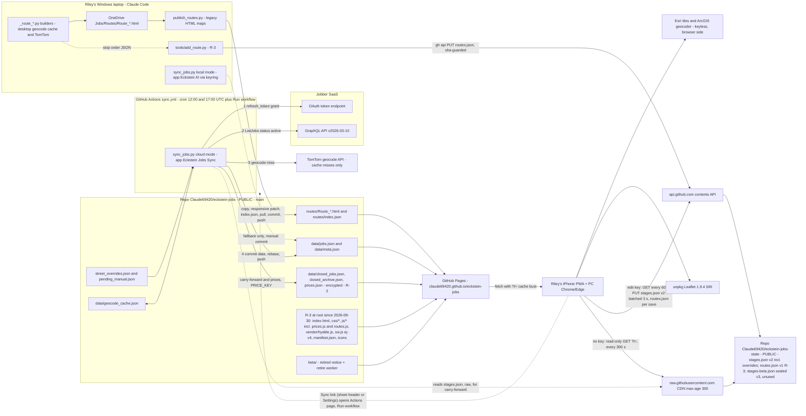

# Eckstein Jobs: APP MASTER (handoff and single source of truth)

> **Read this file first**, at the start of every session and again after any context compaction.
> This repo is **public**, so this file contains **no secret values**. Secrets are named, and their storage locations are described, but their values never appear here.
> Last full rewrite: **2026-09-25** (baseline HEAD `dd9cf03`, 53 jobs).
> Last major update: **R-1 (2026-09-26)**: job stages, Liquid Glass reskin, multi-file frontend (`index.html`, `css/`, `js/`, `vendor/`).
> R-2 PROMOTED 2026-09-26: version 2 is the main app at the original link (root `/`); R-1 v1 and the `/beta/` trial are retired (§0, §4.3b, §7.17, §7.19, §11 "R-2").
> Latest: **R-3 SHIPPED 2026-09-30 as `f0b6c94`** (one squash commit of branch `r3`; live-verified, first sync green): confirm before a closed job leaves the app, route start switch + "Start from my location", selection totals, chip gesture fixes, rename/relocate a job, range streets in the sync, one **Route** tab with synced saved routes (`routes.json` in the state repo), and `tools/add_route.py` replacing HTML route publishing (§0, §4.3b "R-3", §5, §7.21, §7.22, ADR-31 to ADR-33, §11 "R-3", §12).
> Soft update: **R-3.1 (2026-10-04, no new version name; About still "version R-3")**: residential jobs are stageless (one **Residential** chip in Stage mode, no stage or job items, removed automatically when Jobber closes them unless kept), and the commercial clients come from **`data/commercial_clients.json`** (Riley's 8; everyone else is residential) (§0, Rule 12, §4.1 "R-3.1", §4.3b "R-3.1", §5, §7.8, ADR-34, §12).

**Contents**
0. [Read first](#0-read-first)
1. [Business context and users](#1-business-context-and-users)
2. [Quick reference](#2-quick-reference)
3. [Architecture and data flow](#3-architecture-and-data-flow)
4. [Components in depth](#4-components-in-depth)
5. [Data files and schemas](#5-data-files-and-schemas)
6. [Secrets and auth](#6-secrets-and-auth)
7. [Operations runbook](#7-operations-runbook)
8. [Troubleshooting matrix](#8-troubleshooting-matrix)
9. [Design decisions](#9-design-decisions-adr-style)
10. [Known limitations and tech debt](#10-known-limitations-and-tech-debt)
11. [Roadmap and in-flight work](#11-roadmap--in-flight)
12. [CHANGELOG](#12-changelog)

---

## 0. READ FIRST

**What this is.** "Eckstein Jobs" is an iPhone Home Screen PWA **and** a first-class desktop web app on Riley's PC (Chrome/Edge, 1440×900), with an Apple-style "Liquid Glass" look. Since 2026-09-26 the app at the original link is R-2 ("version 2", §4.3b); **R-3 ships on top of it on 2026-09-30** (About "Eckstein Jobs · version R-3"; §4.3b "R-3"). Views (R-3: two tabs, **Jobs · Route**):
- **Jobs:** a full-screen map plus a list of every active Jobber job **plus every job Jobber closed that nobody has confirmed as Completed yet** (R-3, ADR-31), filtered by Client **or** by Stage (stage chips plus list chips: Unassessed, Book lane, Street cuts, Cuts & cleanup, Asphalt, Pavers; since R-3.1 **residential jobs have no stage** and sit under one amber **Residential** chip instead, ADR-34), "N jobs · $total" for the current selection (totals only with the pricing key), a one-click shop route that opens the route editor, and a pencil on each job to fix its name and pin ("Edit name & location", shared).
- **Route** (R-3; replaces R-2's "Routes" and "Plan" tabs): the route editor (skip, drag, add stop, Re-optimize; start at the shop, at a site, or "Start from my location") plus the **saved routes, synced for everyone** through `routes.json` in the state repo: "Mine" first, then "Team" (owner = each device's "Your name"; Claude's routes show as "Claude"). Routes Claude builds are added here with `tools/add_route.py` (§7.21). The old published HTML maps stay under Settings → Routes → "Old route maps (N)".
- **Settings** (from the ⚙ control): theme, glass style, the stage edit key, the pricing key, Routes (Your name, Old route maps), Data (sync, Recently removed).
- **Closed in Jobber popup** (R-3): on app open, a device that can save stages lists the jobs Jobber closed with nothing outstanding: **Completed** (removes it on every device), **Still needs work** (opens the job at its items), **Later**.

**Job stages** (Ready to start → Setup → Excavation → Base → Prep → Passed inspection → Poured) and **job items** (Assessed, Lane closure, Street cut, Asphalt, Pavers, Cuts & cleanup, with gates) are stored in ONE file, `stages.json` (format version 2), in the separate public repo `Claude69420/eckstein-jobs-state` (§5 "Stage data (R-2)", ADR-20, ADR-27, ADR-30). Since R-3 the same file also holds the per-job name / pin fixes in a top-level `"overrides"` object (ADR-32), and the same repo holds the shared saved routes, `routes.json` (ADR-33). Devices with an edit key can change them; others see them read-only. Jobber totals are published encrypted and shown only on devices with the pricing key (ADR-26).

**One app, one stage file (since the promotion, 2026-09-26; ADR-30):**
- **R-2** at the root <https://claude69420.github.io/eckstein-jobs/> (the existing Home Screen app "Eckstein Jobs"; manifest and icons unchanged from v1): the app the crew and Riley use; **R-3 ships on top of it on 2026-09-30** (built on branch `r3`, squashed to `main`; same stage file, plus `routes.json`). Source = branch `r2` (Rule 13), `r3` for R-3; default config (no `EJ_CONFIG`: `ns "ej_"`, state file `stages.json`, no overlay).
- **R-1 v1 is retired** (replaced at the root; its code is in git history, `a538397` = last R-1 root). Its `stages.json` v1 is converted to v2 by `tools/promote_stages.py` right after the code deploy (§7.17 steps 3–4; until the §11 Work log records it as done, check with `--check --api`).
- **`/beta/` is retired**: <https://claude69420.github.io/eckstein-jobs/beta/> is a static notice ("EJ Beta is now the main Eckstein Jobs app", button to the main URL) whose inline script and retire worker unregister the beta service worker and delete the `ejb-` caches. `stages-beta.json` is sealed (version 3, content kept as a backup) and read by nothing. `tools/build_beta.py` is kept for future betas (§7.16, ADR-24).

It is a static site on GitHub Pages at <https://claude69420.github.io/eckstein-jobs/>. A GitHub Actions cron (`sync.yml`) refreshes the data headlessly at **7:00 AM and 12:00 PM Winnipeg time (CDT)**. The cron calls the Jobber GraphQL API with a dedicated read-only Jobber app, and does not use Claude or the Max plan.

### Standing rules (Claude must follow these every time)

| # | Rule |
|---|---|
| 1 | **Never read, print, or relay secret values.** This covers the Jobber client ID, secret and refresh tokens; the TomTom key; the Windows keyring contents (`eckstein_jobber`); `%USERPROFILE%\.config\eckstein_jobber\credentials.json`; `%USERPROFILE%\.config\eckstein_jobs_sync\refresh_token.txt`; GitHub secrets (including **`PRICE_KEY`**, the prices encryption key); the **stage edit key** (a fine-grained PAT stored per device in `localStorage['ej_gh_token']`, and in Riley's password manager); and the **pricing key** (the same value as `PRICE_KEY`, stored per device in `localStorage['ej_price_key']` since the promotion, and in Riley's password manager). **Legacy copies:** `ejb_gh_token` / `ejb_price_key` from the retired beta may still exist on a device (the main app copies them once into missing `ej_` keys and then deletes them on that browser; an iPhone "EJ Beta" app keeps its own until the icon is deleted); they are just as secret. **Riley pastes secrets himself.** Name a secret and say where it lives; never show its value. In the Browser pane, never read `localStorage.ej_gh_token`, `ej_price_key`, `ejb_gh_token` or `ejb_price_key`, never call `EJ.store.getKeyForShare()`, never decrypt or print `data/prices.json`, and never type a key into Settings → Stages or Settings → Pricing. |
| 2 | **The repo is PUBLIC.** Never commit secret values, phone numbers, emails, or other personal contact details. **Never copy a desktop builder's `TOMTOM_KEY = "..."` line into this repo.** Private-individual client names already appear in `data/jobs.json` (the "Other" bucket; `clientKey` "Residential" since R-3.1), which is a known, accepted tradeoff (see §10). Don't add more personal data. The stage edit key never goes into either repo. The state repo is public too: `stages.json` (including each device label `by`) and its commit messages (`stage: #684 <street> -> base`) are visible to anyone, so device names must not contain personal info. **Since R-3** the state repo also holds `routes.json` (shared saved routes: route names, stop addresses, the owner's "Your name" and the device label, all public) and the `"overrides"` object of `stages.json` (job names / pins): owner names are **first names or initials only**, and route / stop names never carry client names, phone numbers, emails or prices. |
| 3 | **Log every app change in the [CHANGELOG](#12-changelog) of this file, in the same commit as the change.** Also keep §11 (ROADMAP / IN-FLIGHT) current while a feature is mid-build, so a resumed session knows exactly where work stopped. Bot data syncs are not logged individually. |
| 4 | **After building any route for Riley, add it to the app with `tools/add_route.py`** (since R-3, 2026-09-30; §7.21, ADR-33): write the stop order as a JSON list of `{name, lat, lon, jobNumber?}`, run `python C:/Users/Riley/eckstein-jobs/tools/add_route.py --name "Route name" --stops FILE` (dry run, check the summary), then the same with `--write`. **Claude only, in Git Bash**, one call: `export PATH="$PATH:/c/Program Files/GitHub CLI"; GH_TOKEN="$(gh auth token)" python C:/Users/Riley/eckstein-jobs/tools/add_route.py … --write` (gh launched from Python cannot see its login in this sandbox; the token is only passed in the environment, never printed). Owner "Claude" (the default). `routes.json` is **public**: stop names are street addresses / intersections only. `publish_routes.py` is **only for legacy HTML maps** (optional; they appear under Settings → Routes → "Old route maps"; file named `Route_*.html` in `C:/Users/Riley/OneDrive/Documents/Eckstein/Riley/Jobs/Routes`, run from `main`, §7.5). |
| 5 | **Commands given to Riley must be PowerShell-safe.** His terminal is Windows PowerShell 5.1. No `&&`, no `/c/...` paths, and no `<` input redirection. Use forms like `git -C C:/Users/Riley/eckstein-jobs pull --rebase`, one command per line. **Claude's own Bash tool is Git Bash**: `/c/Users/...` paths work there, but `git -C C:/Users/Riley/eckstein-jobs …` works in **both** shells, so prefer that form in any command Riley might end up running. Put gh on the PATH first with `export PATH="$PATH:/c/Program Files/GitHub CLI"`. Bash-only lines (`export`, `grep`, `cat`, `sleep`, `/c/...`) must be labelled Claude-only. |
| 6 | **Route numbering rule.** When a route starts at the shop, the shop marker is **`S`** (green) and the first site is **#1**. When a route starts at a site, that site is **#1**. **Estimates:** haversine km × **1.39** gives drive km. Drive time uses **40 km/h** urban or **70–80 km/h** rural. Always prefix estimates with `~` and label them "no live traffic". |
| 7 | **Manual refresh means "Run workflow"** (`gh workflow run sync.yml -R Claude69420/eckstein-jobs`). **Never use "Re-run jobs"** on an old run. |
| 8 | **Never hand-edit `data/jobs.json` or `data/meta.json`.** The bot rebuilds both from scratch every run. Put per-job user state in a **separate file keyed by `jobNumber`**. Street overrides and pending jobs are merged by `sync_jobs.py`. **Stages are merged by the frontend and never written by the bot** (see §5 "Stage data"). |
| 9 | **Keep the two Jobber apps separate.** The desktop MCP app is "Eckstein AI" (read/write, keyring, port 8080). The cloud sync app is "Eckstein Jobs Sync" (read-only, GitHub secrets, port 8081). Never put desktop credentials in GitHub, and never run `get_refresh_token.py` with desktop credentials. |
| 10 | **Pull before you push.** The bot commits `data/` twice a day. **Commit first, then pull, then push:** `git -C C:/Users/Riley/eckstein-jobs add js/app.js APP_MASTER.md` (list the paths you actually changed) → `git -C C:/Users/Riley/eckstein-jobs commit -m "app: what changed"` → `git -C C:/Users/Riley/eckstein-jobs pull --rebase` → `git -C C:/Users/Riley/eckstein-jobs push` (this exact path form works in both PowerShell and Git Bash). A plain `pull --rebase` **refuses to run with uncommitted edits** ("cannot pull with rebase: You have unstaged changes"), because this clone has no `rebase.autoStash` and `pull.rebase=false`; `git pull --rebase --autostash` (what `publish_routes.py` uses) is the alternative. If Claude's `git push` is **blocked by the auto-mode safety classifier** (it once flagged a push of job data to this public repo as "data exfiltration"), **stop and ask Riley to run the push himself** with `git -C C:/Users/Riley/eckstein-jobs push`. |
| 11 | **Geocodes: read back and verify.** Check TomTom's `freeformAddress` and postal code. TomTom mis-snaps rural towns and duplicate street names to other provinces. Server-side sync has a Manitoba bounding-box guard; the desktop builders don't. |
| 12 | **Adding a commercial client = one entry in `data/commercial_clients.json`** (since R-3.1, 2026-10-04; ADR-34; recipe §7.8). Both readers load that file: the sync (`sync_jobs.py` `load_commercial_clients`, L471; it sets `clientKey` at the next run) and the app (`js/app.js` `loadData` fetches it, `validClients` L117), so the file is the only change that alters behaviour (no code, no build-id bump for the file itself). Every client not on the list is **Residential** (stageless). Both readers validate it **all or nothing** (key = letter + letters/digits ≤ 32, unique, not `Residential` / `Other` / `AllOther`; non-empty `label`, `short`, `match`; `color` `#rrggbb`): a bad file is ignored with a `::warning::clients: …` sync log line, and the built-in copies are used: `BUILTIN_COMMERCIAL_CLIENTS` (`sync_jobs.py` L144) and `BUILTIN_CLIENTS` (`js/app.js` L20). **Keep those two copies identical to the file** in the same commit (`tests/test_sync.py` and `tests/ui.test.js` fail until they match; editing `js/app.js` is a frontend deploy, so Rule 14 applies to that commit). Check the file (**Riley, PowerShell**, one line): `python -c "import sys; sys.path.insert(0, r'C:\Users\Riley\eckstein-jobs'); import sync_jobs as s; c, p = s.load_commercial_clients(s.Path(r'C:\Users\Riley\eckstein-jobs\data\commercial_clients.json')); print(p or 'OK: %d commercial clients' % len(c))"` (expect `OK: 8 commercial clients`, or the problem). **History:** R-1 to R-3 used an exact-companyName map `CLIENT_KEYS` in `sync_jobs.py` plus `CLIENT_KEYS` / `COL` / `LABEL` / `SHORT` in `js/app.js` (5 places in 2 files; unknown keys went to "Other / Residential"); all of that is gone. |
| 13 | **Multi-step feature work never sits on local `main`.** Any push of `main` deploys to Riley's phone in about 1 minute, and `publish_routes.py` runs `git pull --rebase --autostash` + `git push` on the *current* branch.<br>(a) Do R-1 and other multi-session work on a branch: `git -C C:/Users/Riley/eckstein-jobs switch -c r1-stages`. Commit there, with the CHANGELOG entry in the same commit. Optionally run `git -C C:/Users/Riley/eckstein-jobs push -u origin r1-stages` as an off-site backup (Pages serves only `main`).<br>(b) **Before running `publish_routes.py` or making any hotfix**, commit or stash the branch work and run `git -C C:/Users/Riley/eckstein-jobs switch main`. On a branch with no upstream, the script dies at `git pull` ("There is no tracking information for the current branch"), with the route files written but not committed. On a branch pushed with `-u`, it silently commits and pushes the routes to that branch, and they never go live, because Pages serves only `main`.<br>(c) To ship R-1: ONE squash commit (build spec §1.7): `git -C C:/Users/Riley/eckstein-jobs switch main` → `git -C C:/Users/Riley/eckstein-jobs pull --rebase` → `git -C C:/Users/Riley/eckstein-jobs merge --squash r1-stages` → commit with the CHANGELOG entry → push → verify live. Rollback = `git revert` of that single commit (§7.15). For later multi-session work either a squash or `merge --ff-only` is fine; record which one was used in §11.<br>(d) Record the branch name, and whether it is pushed or merged, in the §11 Work log.<br>(e) **`r2` after the promotion (since 2026-09-26):** R-2 is live at the root, so `main`'s root frontend (`index.html`, `css/`, `js/` incl. `js/prices.js`, `sw.js`, `manifest.json`, `icons/`, `vendor/`) **is** the R-2 app, and `main` now carries the same code as `r2` (frontend, `beta/` notice, `sync_jobs.py`, `tests/` incl. every JS suite, `tools/`, docs). Multi-step work continues on `r2` (kept as the development branch) or on a new branch cut from `main` (e.g. `git -C C:/Users/Riley/eckstein-jobs switch -c r3`); record which in §11. **A ship is now the whole root frontend** (plus any changed sync/tests/tools/docs), in ONE commit on `main` with its CHANGELOG entry, never a hand-picked subset of `js/` or `css/` files (the `?v=` build id ties them together, Rule 14). Before a ship, merge `main` into the branch (bot data, route publishes). **Never take `data/` or `routes/` from a feature branch** (they are stale there). `tools/build_beta.py` refuses the retired `beta/` unless `--force` (a future beta, §7.16). |
| 14 | **Bump the build id on every frontend deploy.** `index.html` loads every local stylesheet and script with a `?v=<build id>` query (**`?v=r3.1` since the R-3.1 soft update**, 2026-10-04; `r3.0` from R-3, 2026-09-30; `r2.0` before). GitHub Pages sends `Cache-Control: max-age=600`, so without a new query a fresh `index.html` could run with HTTP-cached older `css/` / `js/` files. On **every** deploy that changes any root `css/`, `js/`, `index.html` or `sw.js` file: (1) bump the query on **all 9** local `css/`/`js/` URLs in `index.html` together (3 CSS + 6 JS since R-3 added `js/routes.js`; e.g. `r3.0` → `r3.1`; the service worker stores and matches them without the query, so nothing else changes), and (2) bump the service-worker cache name `C` in `sw.js` (**`ej-v5` since R-3.1** → next `ej-v6`; `ej-v4` in R-3; `PREFIX "ej-"` cleanup removes the old one, never an `ejb-` cache). A new local script also goes into `SHELL` in `sw.js`. Record the new build id and cache name in the CHANGELOG entry. |

**Where the other context lives:**
- `C:/Users/Riley/OneDrive/Documents/University/Year 5/Claude Code/ROUTING_PLAYBOOK.md` is private and holds routing rules and the TomTom key. **Read it before any routing work.** Some parts are stale (see §10).
- Claude memory (folder `C:/Users/Riley/.claude/projects/C--Users-Riley-OneDrive-Documents-University-Year-5-Claude-Code/memory/`):
  - `project_route_mapping.md` (routing workflow);
  - `project_eckstein_jobs_app.md` (this app; indexed in that folder's `MEMORY.md`).
- **Pointers to this file** (all in place as of 2026-09-25):
  - `C:/Users/Riley/eckstein-jobs/CLAUDE.md` (tracked in the repo) auto-loads when the Claude Code session's working directory is the repo.
  - `C:/Users/Riley/OneDrive/Documents/University/Year 5/Claude Code/CLAUDE.md` (out of repo) auto-loads in Claude's usual working directory and routes app work here.
  - Memory `…/memory/project_eckstein_jobs_app.md` (out of repo, listed in `MEMORY.md`): "Read APP_MASTER.md before any app work". The auto-memory entry **points here (done 2026-09-25)**, so this file is found after compaction even from the Claude Code folder.
  - `ROUTING_PLAYBOOK.md`, section "Eckstein Jobs phone app", first bullet ("Master doc").
- The out-of-repo stale pointers found during the 2026-09-25 doc review (folder `CLAUDE.md` routing table, `ROUTING_PLAYBOOK.md` "Leaflet + OSM" heading and local-run wording) were **fixed on 2026-09-25**.
- **Out-of-repo pointers updated for R-1 on 2026-09-26** (not versioned here): memory `project_eckstein_jobs_app.md` now says R-1 shipped as one squash commit and R-2 is next (`docs/r2-plan.md`); `ROUTING_PLAYBOOK.md` "Eckstein Jobs phone app" section (L88–90) now lists the views Jobs (Client or Stage filter, stage slider, stage route) / Routes / Plan / Settings and the state repo.
- **Out-of-repo pointers updated for R-3 on 2026-09-30** (not versioned here): the Claude Code folder `CLAUDE.md` (routing table row + rule 3: after building ANY route, add it to the app with `tools/add_route.py`, §7.21; `publish_routes.py` only for legacy HTML maps); `ROUTING_PLAYBOOK.md` "Eckstein Jobs phone app" (R-3 facts: Jobs · Route tabs, synced saved routes, Old route maps, confirm-before-removal; the standing step is now `add_route.py`); the skill `C:/Users/Riley/.claude/skills/new-jobs-route/SKILL.md` gained a final "Phase 10 — Add the route to the Eckstein Jobs app" (the rest unchanged; the skill itself is still not to be used for new routes, §7.5a).

### Current state and in-flight work (as of 2026-10-04, R-3.1 soft update)

**R-3.1 SOFT UPDATE shipping 2026-10-04 (this commit; built on branch `r3-1` from `main` @ `1982d4e`; spec `docs/r3-plan.md` §G; decision rows D-R31-1 to D-R31-4 in §11 "R-3"; §12).** No new version name (Riley: "This you can do right away and dont need another release version for, just do a soft update"): About still says "Eckstein Jobs · version R-3"; build id **`?v=r3.1`**, `sw.js` cache **`ej-v5`** (Rule 14). Riley: "Residential jobs should not be in the stages but rather exist as stageless jobs on the stage view that can be toggled off just like the other stages." What changes:
- **Commercial = Riley's list** (ADR-34): new hand-maintained, public file **`data/commercial_clients.json`** with exactly 8 clients: Crown Pipeline, Harris Holdings, ACV Sewer & Water, MyTec, No Limits Underground, **AECON** (Riley: "Also AECON is a commercial client just FYI"), Tricore, Swift Underground. The sync matches each Jobber client name against it (case-insensitive, whole words, first match wins; "Gary Harris Builders" is not Harris Holdings) and writes that `clientKey`, or `clientKey` **"Residential"** + `residential: true`; the app reads the same file. **Adding a client = edit that file** (Rule 12, §7.8). The old hard-coded `CLIENT_KEYS` maps and `clientKey` "Other" are gone.
- **Residential jobs are stageless:** no stage, no job items, never in a stage or list chip. Stage mode: one amber **Residential** chip after the stages (it toggles like a stage; routable; counted in the totals; amber pins with a house glyph). Client mode: a **Residential** chip. The residential job sheet has no stage slider and no items (address, client, price, Directions / Add to route / Copy and the rename pencil stay).
- **Client chips (Riley, D-R31-2):** "All commercial clients get their own chips unless there are 9 or more. In which case, the 8 with the most jobs get their own chips and the rest are lumped under all other"; plus Residential. Only clients with jobs get a chip, so **Tricore and Swift show no chip until they have a job**.
- **Closed residential jobs leave automatically** (D-R31-3): the sync moves them to `closed_archive.json` (`droppedWhy` "residential, closed in Jobber"). Settings → Data → Recently removed → **Restore** stores `keep: true` on that job's stage entry; it then comes back at the next sync and waits for Completed like a commercial job.
- **Data at build time** (bot sync `1982d4e`, 2026-10-04 21:01 UTC, classified with the new rule; counts only): 54 active jobs = Crown 21, Harris 14, ACV 6, MyTec 2, No Limits 2, AECON 1 (counted under "Other" before), Residential 8; the 4 closed jobs kept are all commercial, so the first R-3.1 sync drops nothing.
- Tests on `r3-1` (2026-10-04): stages 97, routes 32, prices 26, tsp 15, ui 21, ui_route 11, test_sync 135 OK, test_add_route 18 OK, test_build_beta 11 OK, test_promote 36 OK.

**R-3.1 post-ship checks (Claude):**
1. Pages build finished; the root serves `?v=r3.1` on all 9 URLs (**Claude only, in Git Bash:** `curl -s "https://claude69420.github.io/eckstein-jobs/?t=$(date +%s)" | grep -c "v=r3.1"`, expect 9); in the Browser pane: Cache Storage `ej-v5` only, 0 console errors, Stage mode shows the Residential chip after the stages, a residential job's sheet has no stage slider or items, Client mode shows Crown / Harris / ACV / MyTec / No Limits / AECON / Residential.
2. The next sync (7 AM / noon; a dispatch only when Riley asks, §7.2): the log has `clients: 8 commercial clients from commercial_clients.json; everyone else is residential` and **no** `::warning::clients:`; `data/meta.json` `by_client` has `AECON` and `Residential` and no `Other`; no `dropped #N … (residential, closed in Jobber)` line unless Jobber closed a residential job since the last run.
3. Backfill the hash and the run id in §11 "R-3" and the §12 entry.

**Riley's steps (R-3.1): none required.** (The R-3 list below still applies.)

**R-3 SHIPPED 2026-09-30 as `f0b6c94` (ONE squash commit of branch `r3`, code complete at `71c1667`; spec `docs/r3-plan.md`; §11 "R-3", §12).** Riley chose "Straight to the app". What changes at the root (About "Eckstein Jobs · version R-3", build id `?v=r3.0`, `sw.js` `ej-v4`):
- **(A) Confirm before removal** (ADR-31): the sync keeps **every** job Jobber closes in `data/closed_jobs.json` until its stage entry has `removed: true` (then `closed_archive.json`, `droppedWhy` "removed in app", plain log line; restored at the next sync when `removed` is cleared). On app open, a device that can save stages shows "Closed in Jobber" (after a fresh stage read) for the closed jobs with nothing outstanding: **Completed** / **Still needs work** per job, **Later** for the whole dialog; closed jobs' sheets say "Completed — remove from app"; Settings → Data → **Recently removed** (60 days) has **Restore**. A stale `removed: true` is cleared when Jobber lists the job as active again (only once a writable device opens the app then).
- **(B) Route start:** a switch on the start row (off = the first stop is the start, #1) and **Start from my location** (GPS "Me", never saved to the state repo).
- **(C) Totals:** "N jobs · $total" for the whole current selection (All, one or several chips, plus search; prices shown only).
- **(D) Chip gestures (iPhone):** selecting a chip never jumps the row; a swipe that starts on a chip scrolls it (JS fallback after 24 px sideways); no toggle after a swipe. **Needs Riley's iPhone check.**
- **(E) Rename / relocate:** range streets in the sync ("Portage Ave (Lipton St to Lenore St)" → street "Portage Ave & Lipton St", new `jobs.json` key `range` "Lipton St to Lenore St", pin at the midpoint when both ends are within 2 km, else fallbacks); **#688, #690, #691, #698 change at the first R-3 sync**. In the app: pencil → "Edit name & location" (shared; stored in the top-level `"overrides"` object of `stages.json`, file stays version 2, ADR-32).
- **(F) One Route tab:** tabs **Jobs · Route**; saved routes synced through `routes.json` in the state repo (ADR-33; owner names public: first names), Settings → Routes → **Your name** and **Old route maps (N)**, a one-time "Sync my N saved routes" button for routes saved on a device before R-3. **`tools/add_route.py` replaces `publish_routes.py`** as the way Claude's routes reach the app (Rule 4, §7.21).
- Tests on `r3` @ `71c1667` (2026-09-30): stages 95, routes 32, prices 26, tsp 15, ui 15, ui_route 11, test_sync 119 OK, test_add_route 18 OK, test_build_beta 11 OK, test_promote 36 OK.

**Post-ship checks (Claude), in order:**
1. Pages build of this commit finished; <https://claude69420.github.io/eckstein-jobs/?t=1> serves `js/app.js?v=r3.0` and `js/routes.js?v=r3.0` (**Claude only, in Git Bash:** `curl -s "https://claude69420.github.io/eckstein-jobs/?t=$(date +%s)" | grep -c "v=r3.0"`, expect 9); in the Browser pane: About "Eckstein Jobs · version R-3", tabs Jobs · Route, 0 console errors, Cache Storage `ej-v4` only.
2. Dispatch the sync (§7.1 Calls A–C) and check it with §7.18 "R-3": green, `Pushed.`, **no `::warning::`**; `range: #688 …`, `#690`, `#691`, `#698` lines with their pins (read back that each pin is on the right street, Rule 11); `jobs.json` has `range` on those 4; `carry-forward: kept #664 closed in Jobber (…)` and every other closed job kept (`meta.json` `closed` ≥ 1); no `dropped` line unless someone already tapped Completed.
3. Record the run id and results in §11 "R-3" and the §12 entry's Verified line; backfill the ship hash.

**Riley's steps (R-3):**
1. On **each** device (iPhone "Eckstein Jobs" app, PC browser): ⚙ → Routes → **Your name** (first name or initials; it is public on saved routes).
2. **iPhone:** check that the client / stage chips swipe sideways when the swipe starts on a chip and that a tap still selects; in the Route tab tap **Start from my location** once and allow location (the prompt comes from iOS; if denied, §8).
3. When the **"Closed in Jobber"** popup appears, answer it: **Completed** for jobs that are done, **Still needs work** (then set pavers / asphalt / cleanup), or **Later**. Nothing leaves the app without a Completed.
4. **Saved routes:** on each device that had saved routes before R-3, open the Route tab and tap **"Sync my N saved routes"** once (needs the edit key on that device).
5. Still open from earlier: delete `refresh_token.txt` (below), iPhone OK of the look (R-1), share edit access with the crew (§6 F).

**Health and open items** (the app is live and healthy; the R-2 promotion numbers are kept for reference):
- **Snapshot 2026-09-30 20:36 UTC (bot sync `bb19494`): 56 jobs, 56 mapped, 0 failed, 1 closed in Jobber kept (#664), geocode cache 317 entries, 65 published (old) route maps.** At the promotion: 51 jobs, 51 mapped, 0 failed (bot sync 2026-09-26 19:12 UTC, `f31e7d7`; first R-2 sync 22:18 UTC green, 0 closed); pending job 9001 was removed (`c2a1d43`). Highest Jobber jobNumber at the beta launch 699 (= `ASSESS_CUTOFF`).
- Geocode cache then: 312 entries. 65 published routes.
- **Every number in this box is a snapshot** and goes stale twice a day. After `git pull --rebase`, re-read `data/meta.json` before quoting counts to Riley.
- Every scheduled sync since the 2026-09-17 token fix has been green. The one failure since then was a "Re-run jobs" push rejection on 09-24, now fixed by `8b2e72f`; INC-3 (invalid workflow YAML, 2026-09-26) missed no run.
- **Stage edit key: created by Riley and in use on the PC.** Dry run 2026-09-26 (before the conversion): `stages.json` v1 31 entries (all `by` "PC") + `stages-beta.json` 1 entry (#412, assess On site) → **32 merged, 0 dropped**. Re-check 2026-09-27 01:18 UTC (raw CDN, read only): the beta was still in use, `stages-beta.json` now 3 entries (items on #411, #412, #679) → **33 merged, 0 dropped**. The count to expect is whatever the fresh `--api` dry run after the pre-flight reports.
- **Open security item:** `%USERPROFILE%\.config\eckstein_jobs_sync\refresh_token.txt` still exists (32 bytes, written 2026-09-15 22:05 CDT, never deleted) and likely holds the live sync-app refresh token in plaintext. Ask Riley to run (PowerShell): `Remove-Item "$env:USERPROFILE\.config\eckstein_jobs_sync\refresh_token.txt"`. Claude never reads it. Remove this bullet (and the matching §10 item) once Riley confirms.

**R-2 PROMOTED 2026-09-26 as `c06bcba` (deployed ~01:24 UTC 2026-09-27): version 2 is the main app at <https://claude69420.github.io/eckstein-jobs/>.** State repo converted right after (`25eb462` stages.json v2, 33 entries; `a13e241` stages-beta.json sealed). Riley (verbatim): "Looks good please push the beta to the final release of version 2 so that the original link will work." One commit on `main` brings the `r2` code to the root (default config, `?v=r2.0` build id, `sw.js` `ej-v3`, one-time `ejb_` → `ej_` key copy, "Assessed before this update", About "Eckstein Jobs · version R-2"), retires `/beta/` (static notice + retire worker; `tools/build_beta.py` kept for future betas) and switches the sync to **single-file mode** (`BETA_STATE_FILE = None`). The state repo is converted **after** the deploy with `tools/promote_stages.py` (ADR-30): `stages.json` → v2 (the reviewed dry run's count: 32 at the first dry run, 33 at the 2026-09-27 01:18 UTC re-check), `stages-beta.json` sealed (version 3). Procedure as run: §7.17; recovery: §7.20; rollback: §7.19. Tests (on `r2` @ `8707243`, and on `main` after this ship): stages 87, prices 26, tsp 15, test_sync 101, test_build_beta 11, test_promote 35. Earlier milestones: R-1 `005a671` (retired), R-2 beta `6613835` (retired).

**R-2 post-ship checks (Claude; §7.17 steps 2–6; all done 2026-09-27, §12 "Post-promotion"), kept for reference:**
1. Pages build of this commit finished; a hard reload of the root loads `js/app.js?v=r2.0` and About says "Eckstein Jobs · version R-2"; `/beta/` shows the notice.
2. `python C:/Users/Riley/eckstein-jobs/tools/promote_stages.py --api` (review: N entries (33 at the last re-check), 0 dropped) → `python C:/Users/Riley/eckstein-jobs/tools/promote_stages.py --write --expect SHA12 --seal-beta` (SHA12 = the first 12+ hex of the reviewed "proposal sha256"). Until this runs, R-2 devices hold moves on the device ("… still in the v1 format … saving is paused (changes wait on this device)"): nothing is lost.
3. About 10 min later, and again later that day: `python C:/Users/Riley/eckstein-jobs/tools/promote_stages.py --check --api` (exit 0). If it says NOT version 2: §7.20 (`--repair`).
4. Dispatch the sync (§7.1): `meta.json` `stages_read` "ok", `stages_beta_read` "not read (single-file mode)", `stage_entries` `{"stages.json": N}` (N = the `WROTE stages.json v2 (N entries)` count).
5. Fill in the state-repo commit shas in the §12 "State repo" entry and the §11 Work log.

**R-2 Riley steps (2026-09-26; the still-open ones are carried into the R-3 list above)** (Claude guides, never handles a key):
1. **Before the ship (pre-flight):** close and reopen every Eckstein Jobs tab/app that has the edit key (a PC tab loaded 2026-09-26 12:17–12:20 CDT could still run R-1 build `005a671`, which lacks the newer-format guard); force-quit "EJ Beta" with 0 pending changes; ask the crew to open the app once online after the deploy.
2. **iPhone:** open the main **"Eckstein Jobs"** Home Screen app (not EJ Beta) → ⚙ → Stages → paste the edit key (if not already there) → Save; ⚙ → Pricing → paste the pricing key (if `PRICE_KEY` exists, §6 G) → Save. Then delete the "EJ Beta" icon (its saved routes are not copied: iPhone Home Screen apps don't share storage).
3. **PC:** nothing to paste: the main app copies the beta's keys (and merges its saved routes) once, automatically, in the same browser profile. Check ⚙ → Pricing shows the key once.
4. Send feedback on the main app; later changes are made on `r2` or a new branch such as `r3` (Rule 13e).
5. Still open from R-1: iPhone OK of the look, share edit access with crew (§6 F), delete `refresh_token.txt`.

### Resuming after compaction or in a new session (do this before anything else)
1. Read §0 and the §11 **Work log**.
2. **Claude only, in Git Bash (Bash tool):**
   ```bash
   git -C C:/Users/Riley/eckstein-jobs status --short
   git -C C:/Users/Riley/eckstein-jobs branch -vv
   git -C C:/Users/Riley/eckstein-jobs stash list
   git -C C:/Users/Riley/eckstein-jobs log --oneline --decorate -10 --all
   git -C C:/Users/Riley/eckstein-jobs diff --stat
   git -C C:/Users/Riley/eckstein-jobs log --oneline origin/main..HEAD
   ```
3. Compare what git shows with the Work log's *Uncommitted* and *Half-done* lines. If they disagree, trust git, describe the difference to Riley, and never discard changes without his OK.
4. Compare the newest CHANGELOG entry with `git -C C:/Users/Riley/eckstein-jobs log -5 --oneline`. A missing entry means the previous session stopped before logging, so add it.
5. Run `preview_list`. If the preview is down, `preview_start` with name `eckstein-jobs`.
   - **App work (since the R-2 promotion):** confirm the branch (`r2` / `r3` or a newer feature branch for multi-step changes; `main` for data, route publishing and single complete fixes; Rule 13e) and run the ten test suites (§2 "Tests"; six before R-3). If the promotion's state-repo steps are not recorded as done in §11, run `python C:/Users/Riley/eckstein-jobs/tools/promote_stages.py --check --api` first (§7.17, §7.20).
6. Check the *Answers from Riley* of the §11 block you are working on. An unanswered question that changes storage, accounts, keys or repo visibility stays blocking: ask Riley.
7. Continue from *Next step*. Update the Work log after every meaningful step, not only at the end.

---

## 1. Business context and users

- **Eckstein Repair** is Riley's concrete and asphalt restoration contractor in Winnipeg, Manitoba. Crews restore **utility cuts** (sidewalk, street, asphalt path, paving stone, driveway) after gas and sewer work.
- **Shop:** 1279 Loudoun Rd, Winnipeg, at (49.8401, −97.2546). Some desktop builders use the more precise 49.840127, −97.254552.
- **Commercial clients (client keys and map colours).** **Since R-3.1 (2026-10-04, ADR-34) the list lives in `data/commercial_clients.json`** (8 clients: these 5 plus `AECON` `#db2777` pink, `Tricore` `#475569` slate, `Swift` (Swift Underground) `#a16207` dark amber), matched on words of the Jobber name (`match`), not the exact companyName below; every other client is `Residential` (amber `#f59e0b`, stageless). The table is the R-1 view, kept for the permit notes:

| Key | Jobber companyName (exact) | Colour | Typical work and identifiers |
|---|---|---|---|
| `Crown` | Crown Pipeline Ltd. | `#2563eb` blue | Gas utility cuts; 6-digit permits (35xxxx, including 357xxx), City `M0xxxxx` permits (`M` plus 6 digits; seen only on Crown jobs), gas numbers, "(gas)" |
| `Harris` | Harris Holdings Ltd. | `#dc2626` red | 6-digit permits (35xxxx including 357xxx, 32xxxx, 34xxxx) and TM traffic permits (`TM` plus 5 digits) |
| `ACV` | ACV Sewer & Water | `#16a34a` green | Sewer/water restorations |
| `MyTec` | MyTec Industry Ltd | `#7c3aed` purple | — |
| `NoLimits` | No Limits Underground Ltd. | `#0d9488` teal | Added 2026-09-23 (first job was on Beaumont St) |
| `Other` | anything else | `#f59e0b` amber | "Other / Residential": one-off accounts and private homeowners. **Since R-3.1: key `Residential`** (stageless; "Other" is no longer written) |

- **Crew roles** that appear in route names: cuts & cleanup, setup, excavation, base, prep, asphalt, steel, measurements. David's measurements route is one example.
- **Users:**
  - **Riley** uses the app on his phone in the field. The PWA is pinned to his home screen. On 2026-09-25 he said it has been "very helpful this week".
  - Since R-1 the PC (Chrome/Edge) is a first-class device too (Riley, 2026-09-25).
  - He triggers manual syncs from the **Sync** link beside the status line in the sheet header (`.sheet-sub`, index.html L105; on iPhone visible only while the sheet is open, on the PC panel always), or Settings → Data → "Sync from Jobber now" (L189). Both open the Actions page, which needs a GitHub login with write access (the `Claude69420` account).
  - The site is public, but nobody else is a known regular user yet. Crew get stage edit access through Settings → Stages → "Share edit access" (§6 recipe F).
- **Where Claude works:** Claude Code on Riley's Windows laptop (a Surface Laptop Studio). The working directory is `C:/Users/Riley/OneDrive/Documents/University/Year 5/Claude Code`. The app repo lives **outside OneDrive** at `C:/Users/Riley/eckstein-jobs`.

---

## 2. Quick reference

| Item | Value |
|---|---|
| Live URL | <https://claude69420.github.io/eckstein-jobs/> (**R-3** since 2026-09-30, plus the **R-3.1** soft update of 2026-10-04 (stageless residential jobs; same About text), on top of R-2 "version 2" of 2026-09-26; Home Screen app "Eckstein Jobs"; About "Eckstein Jobs · version R-3"; built on branch `r3`, §4.3b) |
| Beta URL (retired) | <https://claude69420.github.io/eckstein-jobs/beta/>: a static notice ("EJ Beta is now the main Eckstein Jobs app") that unregisters the old beta service worker and deletes `ejb-` caches (§4.3b h). A future beta would be built there again with `tools/build_beta.py --force` (§7.16) |
| Repo | <https://github.com/Claude69420/eckstein-jobs> (**PUBLIC**, branch `main`, created 2026-09-16 02:55 UTC) |
| Local clone | `C:/Users/Riley/eckstein-jobs` (outside OneDrive) |
| GitHub account | `Claude69420`. It was created by Riley for this app. The gh CLI is logged in as this account through a device login. |
| gh CLI | `C:/Program Files/GitHub CLI/gh.exe`. In Git Bash, run `export PATH="$PATH:/c/Program Files/GitHub CLI"` first. |
| Actions page | <https://github.com/Claude69420/eckstein-jobs/actions/workflows/sync.yml> (the app's **Sync** links point here) |
| Secrets page | <https://github.com/Claude69420/eckstein-jobs/settings/secrets/actions> |
| Pages settings | <https://github.com/Claude69420/eckstein-jobs/settings/pages> (legacy build, source `main` at `/`, HTTPS enforced, no custom domain) |
| Jobber app: cloud sync | **"Eckstein Jobs Sync"**: Clients read and Jobs read only, refresh-token rotation **OFF**. Callback registered as `https://claude69420.github.io/eckstein-jobs/callback`; `get_refresh_token.py` actually uses `http://localhost:8081/callback`. |
| Jobber app: desktop MCP | **"Eckstein AI"**: read/write. Token in Windows Credential Manager (keyring service `eckstein_jobber`, user `token`), callback `http://localhost:8080/callback`. |
| GitHub secrets (names) | `JOBBER_CLIENT_ID`, `JOBBER_CLIENT_SECRET`, `JOBBER_REFRESH_TOKEN`, `TOMTOM_KEY`; **`PRICE_KEY`** (R-2 prices encryption; Riley creates it, §6 recipe G; until it exists prices are skipped). `GH_PAT` is referenced by the workflow but **not set**. |
| Schedule | Cron `0 12 * * *` and `0 17 * * *` UTC. That is 7:00 AM and 12:00 PM CDT, or **6:00 AM and 11:00 AM CST** from 2026-11-01 to 2027-03-14. Runs start about 5 minutes late and data is live about 6 minutes after the cron time. |
| Jobber API | GraphQL `https://api.getjobber.com/api/graphql`, header `X-JOBBER-GRAPHQL-VERSION: 2026-03-10`. OAuth token endpoint `https://api.getjobber.com/api/oauth/token`. |
| Geocoders | Server: TomTom Search (cache misses only). Browser planner: Esri ArcGIS World Geocoder (no key). |
| Map tiles | Esri Canvas, keyless: light `World_Light_Gray_Base` + `World_Light_Gray_Reference`, dark `World_Dark_Gray_Base` + `World_Dark_Gray_Reference`; `maxNativeZoom 16`, `maxZoom 19`, **no CSS filter**. Reference (label) tiles sit in a custom pane `labels` (z 450: above route lines at 400, below markers at 600). |
| Leaflet | 1.9.4 from unpkg with SRI (`crossorigin=""`): CSS `sha256-p4NxAoJBhIIN+hmNHrzRCf9tD/miZyoHS5obTRR9BMY=`, JS `sha256-20nQCchB9co0qIjJZRGuk2/Z9VM+kNiyxNV1lvTlZBo=`. Cached cache-first by `sw.js`. |
| State repo | `Claude69420/eckstein-jobs-state` (**PUBLIC**, no Pages, branch `main`). **`stages.json`** = the ONE stage file, format **version 2** (stage + job items) since the promotion (converted by `tools/promote_stages.py` after the code deploy, §7.17; confirm with `--check --api` until §11 records it), written by the R-2 app. `stages-beta.json` = the retired beta's file, **sealed as version 3** (content kept as a backup; nothing reads it). **R-3:** `stages.json` also carries a top-level `"overrides"` object (job name / pin fixes, ADR-32; still version 2), and **`routes.json`** (version 1) holds the shared saved routes (ADR-33), written by the app with the same edit key and by `tools/add_route.py`. Local clone `C:/Users/Riley/eckstein-jobs-state`: **pull before any hand edit** (§7.14). |
| Stage API | With a key: `https://api.github.com/repos/Claude69420/eckstein-jobs-state/contents/stages.json`. Without: `https://raw.githubusercontent.com/Claude69420/eckstein-jobs-state/main/stages.json` (CDN `Cache-Control: max-age=300`). **Saved routes (R-3):** the same two URLs with `routes.json` (poll 60 s with a key, 300 s without). |
| Stage edit key | Fine-grained PAT on `Claude69420`, "Only select repositories → eckstein-jobs-state", Contents: Read and write, expiry ≤ 1 year. Stored per device in `localStorage['ej_gh_token']` and in Riley's password manager (legacy beta copy `ejb_gh_token`, removed by the main app on the same browser after the one-time copy). The value never appears in docs (§6). |
| Pricing key | The value of the GitHub secret `PRICE_KEY` (base64 of 32 random bytes). Pasted per device in Settings → Pricing (`localStorage['ej_price_key']`; on the PC copied once from the beta's `ejb_price_key`) and kept in Riley's password manager; decrypts `data/prices.json` in the browser only. **Secret** (Rule 1, §6 recipe G). |
| Promotion tool | `python C:/Users/Riley/eckstein-jobs/tools/promote_stages.py` (stdlib; `gh` on PATH for `--api`, `--write` and `--repair`, which reads the history through `gh` even as a dry run): dry run (default, raw CDN), `--api` (fresh, read only), `--write --expect SHA12 [--seal-beta]`, `--check` (exit 0 = `stages.json` is v2, 4 = not), `--repair`, `--rollback`. Never prints keys or device labels. §7.17, §7.19, §7.20 |
| Tests | **Since R-3 (on `r3` @ `71c1667`, and on `main` after the ship), ten suites:** `node C:/Users/Riley/eckstein-jobs/tests/stages.test.js` (95; includes the stale R-2 client fixture `tests/fixtures/stages_r2.js`), `node C:/Users/Riley/eckstein-jobs/tests/routes.test.js` (32; `js/routes.js`), `node C:/Users/Riley/eckstein-jobs/tests/prices.test.js` (26), `node C:/Users/Riley/eckstein-jobs/tests/tsp.test.js` (15), `node C:/Users/Riley/eckstein-jobs/tests/ui.test.js` (15; static UI contracts: ids, glass placement, one build id, chip touch rules; pure R-3 helpers: name / pin overrides, awaitingOk, popup freshness, totals, stale-removed clearing), `node C:/Users/Riley/eckstein-jobs/tests/ui_route.test.js` (11; Route tab contracts; start modes and numbering, Re-optimize keeps the start, GPS error texts, Mine / Team, never a GPS position in a saved route), `python C:/Users/Riley/eckstein-jobs/tests/test_sync.py` (119), `python C:/Users/Riley/eckstein-jobs/tests/test_add_route.py` (18; compares with the real `js/routes.js` in node), `python C:/Users/Riley/eckstein-jobs/tests/test_build_beta.py` (11), `python C:/Users/Riley/eckstein-jobs/tests/test_promote.py` (36; it also runs `js/stages.js` in node). (R-2 counts: stages 87, prices 26, tsp 15, test_sync 101, test_build_beta 11, test_promote 35.) **R-3.1 counts (on `r3-1`, 2026-10-04):** stages 97, routes 32, prices 26, tsp 15, ui 21 (adds the client list / chip rule / residential helpers), ui_route 11, test_sync 135 (adds commercial matching, residential flag, closed-residential drop and `keep`), test_add_route 18, test_build_beta 11, test_promote 36. `python C:/Users/Riley/eckstein-jobs/tools/build_beta.py --check` only reports "beta/ is retired" (exit 0). Use the full `C:/Users/Riley/eckstein-jobs/` prefix; the same lines work in PowerShell. Node v24, no npm. |
| Add-route tool (R-3) | `python C:/Users/Riley/eckstein-jobs/tools/add_route.py --name "Route name" --stops FILE` (stdlib; dry run by default, raw CDN; `--api` fresh read via `gh`; `--write` = sha-guarded PUT of `routes.json` via `gh api`; `--owner` (default "Claude"), `--start shop|stop`, `--rt`, `--out`, `--current`). From Git Bash in this sandbox run it as `GH_TOKEN="$(gh auth token)" python …` (Claude only). Never prints a key. §7.21 |
| Desktop route output | `C:/Users/Riley/OneDrive/Documents/Eckstein/Riley/Jobs/Routes` (legacy HTML maps; since R-3 routes reach the app through `tools/add_route.py`) |
| Desktop builders and playbook | `C:/Users/Riley/OneDrive/Documents/University/Year 5/Claude Code/` (`_route_*.py`, `_map_*.py`, `ROUTING_PLAYBOOK.md`) |
| Local preview | The `.claude/launch.json` config `eckstein-jobs` in the Claude Code folder runs `python -m http.server 8765 --directory C:/Users/Riley/eckstein-jobs`, served at <http://localhost:8765/> (`/beta/` = the retired notice). It serves whatever branch is checked out (the root is the R-2 app with the default config on both `main` and `r2`). On localhost / 127.0.0.1 / [::1] **with no key**, stages run in **local mode** (`localStorage['ej_stages']`, v2 shape; this machine only, never shared), and so do saved routes (`localStorage['ej_saved_routes_local']`, R-3). |
| Python for local sync | `C:/Users/Riley/OneDrive/Documents/Agents/.venv/Scripts/python.exe` (has `keyring` and `requests`) |

**Key files in the repo** (sizes are approximate committed sizes; a Windows checkout with `core.autocrlf=true` can show CRLF copies a little larger). Since the promotion (2026-09-26) the root frontend rows describe **R-2**, and since 2026-09-30 **R-3** (sizes as on `r3` @ `71c1667`); the R-1 sizes are in git history (`a538397`):

| File | Role |
|---|---|
| `index.html` | Markup, inline boot script (theme/glass before first paint; reads `EJ_CONFIG.ns`, default `ej_`), stylesheet and script tags, every local `css/`/`js/` URL with `?v=r3.1` since R-3.1 (`r3.0` in R-3; 9 URLs, Rule 14); R-3: tabs Jobs · Route, the "Closed in Jobber" dialog, "Edit name & location", Settings → Routes / Recently removed. 373 lines, 27.6 KB |
| `css/tokens.css` | Design tokens: light, `[data-theme="dark"]`, Tinted overrides, stage colours `--stage-1..7` (Setup teal). 178 lines, 8.5 KB |
| `css/glass.css` | Glass material; MIT notice for sohumsuthar/liquid-glass in its header (L1–31), file rules L33–42. 171 lines, 8.7 KB (unchanged since R-1) |
| `css/components.css` | Geometry and content styles, desktop ≥900 px block, reduced motion, items/editor/pricing; R-3 popup, edit card, saved-route list, chip `touch-action: pan-x`. 769 lines, 59.2 KB |
| `js/tsp.js` | Global `TSP`: optimizer, leg estimates, Google Maps parts; also a Node module. 375 lines, 15.1 KB (unchanged since R-1) |
| `js/stages.js` | Global `Stages`: 7 stages, items, gates, `resolveConfig`, the v2 stage store, `migrateFromBeta`; R-3 `name` / `loc` (written to the top-level `"overrides"` object), `awaitingOk`, `MB_BOX`; also a Node module. 1,644 lines, ~88 KB |
| `js/prices.js` | Global `Prices`: WebCrypto decrypt of `data/prices.json`, the pricing-key store (`ej_price_key`, `ej_show_prices`). 290 lines, 13.7 KB |
| `js/ui.js` | Global `UI`: shell, sheets, toast, 7-stop `StageSlider` with gate locks, refraction gate; R-3 views `jobs` / `route` / `settings` (an old view name falls back to Jobs), late press glow on chips. 586 lines, 33.9 KB |
| `js/routes.js` | **R-3.** Global `SavedRoutes`: the synced saved-route store (`routes.json` in the state repo, same edit key; github / readonly / local / invalid modes, sha-guarded PUT, per-route merge, offline queue, damaged / newer-format guards), sanitizers, `fromLegacy`; also a Node module. 863 lines, 44.7 KB |
| `js/app.js` | App logic (one IIFE). Constants block (L13–37): `BUILTIN_CLIENTS` (the fallback copy of `data/commercial_clients.json`), `RES_KEY` / `RES_STAGE` / `RES_COL` (Residential), `OTHER_KEY` ("All other"), `CHIP_MAX` 8, `SHOP`; the R-1 `CLIENT_KEYS`/`COL`/`LABEL`/`SHORT` are gone since R-3.1. 3,047 lines in R-3; 3,209 lines on `r3-1` (R-3.1) |
| `vendor/hyalite.js`, `vendor/hyalite.LICENSE` | Third-party desktop refraction, byte-for-byte, **never edit** (51,559 B; LICENSE 1,070 B). §9 "Third-party code" |
| `sw.js` | Service worker, cache `ej-v5` since R-3.1 (`ej-v4` in R-3; prefix cleanup `ej-` only; `SHELL` adds `js/routes.js` since R-3). 136 lines, 6.3 KB |
| `manifest.json` | PWA install metadata (638 B; unchanged since R-1, so the existing Home Screen app keeps working) |
| `icons/icon-180.png` · `icon-192.png` · `icon-512.png` · `icon-maskable-512.png` | apple-touch-icon · favicon + manifest `any` · manifest `any` · manifest `maskable` (17.4 / 19.4 / 100.6 / 95.8 KB; all opaque RGB; unchanged since R-1) |
| `tests/stages.test.js`, `tests/prices.test.js`, `tests/tsp.test.js` | Node tests, no npm (stages test mocks `fetch`; includes the promotion / key-copy / format-hold tests, the contract vectors and, since R-3, the overrides object and the stale R-2 client) |
| `tests/routes.test.js`, `tests/ui.test.js`, `tests/ui_route.test.js` | **R-3** Node tests: `js/routes.js` store and sanitizers (32); UI static contracts + pure R-3 helpers extracted from `js/app.js` (15); Route tab contracts + start modes (11) |
| `tests/fixtures/stages_r2.js` | **R-3:** a byte copy of the R-2 `js/stages.js`, the "stale client" in `tests/stages.test.js` (proves an R-2 page still open after the ship passes the `"overrides"` object through; ADR-32). Never edit it |
| `beta/` | **RETIRED beta** (hand-written, 7 files): `index.html` static notice (`<meta name="ej-beta" content="retired">`, button to the main URL, inline script that unregisters the `/beta/` worker and deletes `ejb-v<N>` caches), `sw.js` retire worker, `manifest.json` ("Eckstein Jobs Beta (retired)"), orange `icons/`. `tools/build_beta.py` refuses to overwrite it unless `--force` (§4.3b, §7.16) |
| `tests/test_sync.py`, `tests/fixtures/` | Python unit tests for `sync_jobs.py` (119 since R-3: keep-until-removed, archive restore, range streets; no network, single- and dual-file modes) and shared fixtures: `contract_vectors.json` + `overlay_vectors.json` (JS and Python must agree), sync fixtures (`sync_stages_promoted.json` = a v2 `stages.json`), promotion fixtures (`promote_v1.json`, `promote_beta.json`), a test-key prices fixture (`prices.enc.json` / `prices.plain.json`, made by `make_prices_fixture.py`; test values only) |
| `.github/requirements-sync.txt` | Hash-locked pins for the workflow's optional `cryptography` install (cryptography 46.0.6, cffi 2.0.0, pycparser 3.0; manylinux wheels only) |
| `tools/promote_stages.py`, `tests/test_promote.py` | The state-repo promotion / check / repair / rollback tool (991 lines; §7.17, §7.19, §7.20) and its tests (36 since R-3, which added the `"overrides"` pass-through test; 35 in R-2; compares the output with the real `js/stages.js` in node) |
| `tools/build_beta.py`, `tests/test_build_beta.py`, `tools/make_icons.py`, `tools/beta_icons.json` | The beta builder (kept for future betas: `--force` over the retired `beta/`, `--out DIR` for trial builds) and its tests (11), the icon generator (`--variant beta`) and the beta icon hashes |
| `docs/liquid-glass-brief.md` | R-1 design brief (137 KB) |
| `docs/r1-build-spec.md` | R-1 build spec; **overrides the brief** (6.8 KB) |
| `docs/r2-plan.md` | R-2 plan and build spec (§2a shared contract, §9 beta channel + promotion as run, §10 Assessed default), §11 "R-2" |
| `docs/r3-plan.md` | R-3 plan (A confirm before removal, B route start, C totals, D chip gestures, E rename/relocate + range streets, F one Route tab + synced saved routes), §11 "R-3" |
| `tools/add_route.py`, `tests/test_add_route.py` | **R-3:** adds a route Claude built to `routes.json` in the state repo (dry run default; `--write` via `gh api`, sha-guarded; 515 lines; §7.21) and its tests (18; sanitizers checked against the real `js/routes.js` in node) |
| `.gitattributes` | `vendor/* -text` and `beta/vendor/* -text` (never convert line endings, so the hyalite hash stays stable; the `beta/` line is kept for a future beta) |
| `sync_jobs.py` | Jobber to `data/*.json` sync (stdlib, plus optional `cryptography` for prices only; ~1,160 lines since R-3, single-file stage mode, keep-until-removed, range streets, §4.1) |
| `.github/workflows/sync.yml` | Cron and manual workflow ("Sync jobs from Jobber") |
| `get_refresh_token.py` | One-time OAuth consent helper for the sync app (run by Riley) |
| `publish_routes.py` | **Legacy since R-3 (optional):** copies desktop `Route_*.html` into `routes/`, makes them responsive, rebuilds `routes/index.json`, then commits and pushes; the maps show only under Settings → Routes → "Old route maps" |
| `data/jobs.json`, `data/meta.json` | Generated by the bot every run |
| `data/closed_jobs.json`, `data/closed_archive.json`, `data/prices.json` | Generated by the bot from the first R-2 sync on (read by the R-2 app): carried-forward closed jobs, the 60-day safety archive, the encrypted prices (§5) |
| `data/geocode_cache.json` | Repo geocode cache, committed by the bot |
| `data/street_overrides.json`, `data/pending_manual.json` | Hand-maintained inputs to the sync |
| `data/commercial_clients.json` | **R-3.1, hand-maintained, public:** THE list of commercial clients (`{"version": 1, "clients": [{key, label, short, match, color}]}`, 8 clients; §5). Read by the sync (`--data`, sets `clientKey` / `residential`) and by the app (chips, labels, colours); everyone not on it is Residential. Adding a client = editing this file (Rule 12, §7.8). The built-in copies in `sync_jobs.py` / `js/app.js` must stay identical (tests) |
| `routes/Route_*.html`, `routes/index.json` | Published (old) route maps and their index; since R-3 read only by Settings → Routes → "Old route maps (N)" |
| `routes.json` in the **state repo** (not this repo) | **R-3:** the shared saved routes (§5 "`routes.json`", ADR-33); written by the app (edit key) and `tools/add_route.py`; public |
| `CLAUDE.md` | Short pointer to this file |
| `APP_MASTER.md` | This file |
| `.gitignore` | `__pycache__/` and `*.pyc` |

---

## 3. Architecture and data flow


```mermaid
flowchart LR
  subgraph JOBBER["Jobber SaaS"]
    JO["OAuth token endpoint"]
    JG["GraphQL API v2026-03-10"]
  end
  TT["TomTom geocode API - cache misses only"]
  subgraph GHA["GitHub Actions sync.yml - cron 12:00 and 17:00 UTC plus Run workflow"]
    SJ["sync_jobs.py cloud mode - app Eckstein Jobs Sync"]
  end
  subgraph REPO["Repo Claude69420/eckstein-jobs - PUBLIC - main"]
    IN["street_overrides.json and pending_manual.json"]
    GC["data/geocode_cache.json"]
    OUT["data/jobs.json and data/meta.json"]
    CL["data/closed_jobs.json, closed_archive.json, prices.json - encrypted - R-2"]
    RT["routes/Route_*.html and routes/index.json"]
    FE["R-3 at root since 2026-09-30: index.html, css/*, js/* incl. prices.js and routes.js, vendor/hyalite.js, sw.js ej-v4, manifest.json, icons"]
    BETA["beta/ - retired notice + retire worker"]
  end
  STATE["Repo Claude69420/eckstein-jobs-state - PUBLIC - stages.json v2 incl. overrides; routes.json v1 R-3; stages-beta.json sealed v3, unused"]
  GHAPI["api.github.com contents API"]
  RAW["raw.githubusercontent.com CDN max-age 300"]
  UNPKG["unpkg Leaflet 1.9.4 SRI"]
  PAGES["GitHub Pages - claude69420.github.io/eckstein-jobs"]
  PHONE["Riley's iPhone PWA + PC Chrome/Edge"]
  ESRI["Esri tiles and ArcGIS geocoder - keyless, browser side"]
  subgraph DESK["Riley's Windows laptop - Claude Code"]
    BLD["_route_*.py builders - desktop geocode cache and TomTom"]
    RH["OneDrive Jobs/Routes/Route_*.html"]
    PUB["publish_routes.py - legacy HTML maps"]
    ADDR["tools/add_route.py - R-3"]
    LOC["sync_jobs.py local mode - app Eckstein AI via keyring"]
  end

  SJ -- "1 refresh_token grant" --> JO
  SJ -- "2 ListJobs status active" --> JG
  IN --> SJ
  GC <--> SJ
  SJ -- "3 geocode miss" --> TT
  SJ -- "4 commit data, rebase, push" --> OUT
  SJ -- "carry-forward and prices, PRICE_KEY" --> CL
  SJ -. "reads stages.json, raw, for carry-forward" .-> RAW
  OUT --> PAGES
  CL --> PAGES
  RT --> PAGES
  FE --> PAGES
  BETA --> PAGES
  PAGES -- "fetch with ?t= cache bust" --> PHONE
  PHONE --> ESRI
  PHONE --> UNPKG
  PHONE -- "edit key: GET every 60 s; PUT stages.json v2 batched 3 s, routes.json per save" --> GHAPI
  GHAPI --> STATE
  PHONE -- "no key: read-only GET ?t=, every 300 s" --> RAW
  RAW --> STATE
  PHONE -. "Sync link (sheet header or Settings) opens Actions page, Run workflow" .-> GHA
  BLD --> RH
  RH --> PUB
  PUB -- "copy, responsive patch, index.json, pull, commit, push" --> RT
  BLD -. "stop order JSON" .-> ADDR
  ADDR -- "gh api PUT routes.json, sha-guarded" --> GHAPI
  LOC -. "fallback only, manual commit" .-> OUT
```

**Data flow narrative:**
1. **Sync.** At 12:00 and 17:00 UTC (actual start about 12:04 and 17:05), or on a manual **Run workflow**, GitHub Actions runs `python sync_jobs.py` with the four Jobber/TomTom secrets plus `PRICE_KEY` (R-2). The script:
   - swaps the stored refresh token for an access token;
   - pages through all **active** Jobber jobs;
   - cleans addresses, applies `street_overrides.json`, extracts permits and maps clients to colour keys;
   - geocodes cache-first (TomTom only on a miss, Manitoba box guard);
   - appends `pending_manual.json` entries;
   - writes `data/geocode_cache.json`, `data/jobs.json` and `data/meta.json`;
   - since R-2 also: reads `stages.json` (single-file mode since the promotion) and writes `data/closed_jobs.json` + `data/closed_archive.json`, and `data/prices.json` when `PRICE_KEY` is set (§4.1 "R-2 changes").
2. **Commit.** The workflow commits `data/` as `eckstein-sync-bot` ("Sync jobs YYYY-MM-DD HH:MM UTC"), rebases onto `origin/main` with `-X theirs` (fresh data wins), and pushes with up to 4 tries.
3. **Deploy.** The push to `main` triggers GitHub's "pages build and deployment", which takes about 31–106 s (typically 35–47 s). Files are served with `Cache-Control: max-age=600`.
4. **App.** `js/app.js` `loadData()` (L1100 in R-2) fetches `data/jobs.json`, `data/meta.json` (optional), `data/closed_jobs.json` and `routes/index.json` with `?t=<now>` and `cache:'no-store'`, checking `r.ok`. In parallel it calls `store.load()` for the stages (and `js/prices.js` decrypts `data/prices.json` on a device with the pricing key), then merges them and renders the Jobs map and list and the Routes cards. ↻ (`#rf`) re-runs `loadData()` in place (no page reload). The Plan view geocodes typed addresses with Esri in the browser and runs the optimizer in `js/tsp.js`. **Since R-3** (`loadData` L1352): it also loads `data/closed_archive.json` (Settings → Data → Recently removed) and the shared saved routes (`js/routes.js`, `routes.json` in the state repo), `routes/index.json` feeds only Settings → Routes → "Old route maps", the "Closed in Jobber" dialog is checked once jobs and a fresh stage read are in, and the Route tab (the old Plan view) holds the editor and the saved routes.
5. **Routes.** **Since R-3:** Claude builds the route on the desktop, then adds its stop order to the shared saved routes (`routes.json` in the state repo) with `tools/add_route.py` (§7.21); every device shows it in the Route tab (owner "Claude"), and devices with the edit key save and share their own routes there too (ADR-33). **Legacy (optional):** per-route Python builders still write OneDrive `.../Jobs/Routes/Route_*.html`, and `publish_routes.py` (these maps show only under Settings → Routes → "Old route maps"):
   - copies new or changed files into `routes/`;
   - injects a phone-responsive media query;
   - rebuilds `routes/index.json`;
   - runs `git pull --rebase --autostash`, commits and pushes.
6. **Local fallback.** With no Jobber cloud env vars set, `sync_jobs.py` borrows the desktop MCP's keyring token ("Eckstein AI"). It writes only `data/`, and a human or Claude commits and pushes by hand.
7. **Stages.** The frontend is authoritative. Devices with an edit key read and write `stages.json` in the state repo through the GitHub contents API (poll 60 s; writes batched 3 s into one commit); devices without a key read the raw CDN copy (poll 300 s). The sync bot **never writes** the stage store (since R-2 it **reads** `stages.json`, raw, for carry-forward), and stage writes never trigger this site's Pages builds (§5 "Stage data", ADR-20).
8. **One stage file (since the promotion, 2026-09-26; ADR-30).** The root app runs with the default config (no `window.EJ_CONFIG`): `ns "ej_"`, state file `stages.json` (format version 2: stage + items per job), no overlay. From 2026-09-26 until the promotion the R-2 beta ran at `/beta/` with its own `stages-beta.json` and a read-only v1 overlay (ADR-24); `tools/promote_stages.py` merged both into `stages.json` v2 and sealed `stages-beta.json` (version 3, read by nothing). `/beta/` is now a static notice.
9. **Closed jobs (R-2, ADR-25).** The sync keeps a job that left Jobber's active list in `data/closed_jobs.json` (`closed: true`) when its `stages.json` entry says work has started and field work is not done; a job it stops keeping goes to `data/closed_archive.json` for 60 days. `jobs.json` keeps the R-1 job set (active + pending); the app adds the closed jobs itself.
10. **Prices (R-2, ADR-26).** The sync fetches Jobber `total` / `uninvoicedTotal` and writes them AES-256-GCM encrypted with the secret `PRICE_KEY` to `data/prices.json` (skipped while `PRICE_KEY` is not set). Only the app on a device where Riley pasted the pricing key decrypts it (WebCrypto, in the browser).
11. **Confirm before removal (R-3, ADR-31).** Since R-3 the sync keeps every job Jobber closes in `closed_jobs.json` until its `stages.json` entry has `removed: true` (set by "Completed" in the app); only then does it move to `closed_archive.json`. Name / pin fixes made in the app live in the top-level `"overrides"` object of `stages.json` and are applied by the app only (ADR-32); range streets ("Main St (A to B)") are turned into "Main St & A" plus `range` by the sync.

---

## 4. Components in depth

### 4.1 Sync pipeline: `sync_jobs.py`

It uses only the standard library (`urllib`, no `requests`) for everything except the optional prices encryption, which imports `cryptography` lazily (installed by a hash-locked, `continue-on-error` workflow step; without it prices are skipped, never the sync). Paths default to the repo's `data/` (`ROOT = Path(__file__).resolve().parent`), so the working directory doesn't matter; `--out DIR` / `--data DIR` redirect them for local test runs (see "R-2 changes" at the end of this section, which **supersedes** the R-1 details below where they differ: page size, retries, the extra inputs and output files, the log lines incl. `done:`).

**Execution flow:**
1. `out_dir.mkdir(parents=True, exist_ok=True)` (since R-2; R-1: `DATA.mkdir(exist_ok=True)`).
2. `get_access_token()` (auth modes below).
3. `raw = fetch_active_jobs(token)` (R-1: the function printed nothing; since R-2 it logs the first page's query cost and any page warnings); then `main()` prints `jobber: N active jobs` (L863 since R-2).
4. It loads four inputs:
   - `geocode_cache.json` (default `{}`)
   - `street_overrides.json` (keys converted to `int`)
   - `pending_manual.json` (default `[]`)
   - env `TOMTOM_KEY` (stripped)

   `load_json` swallows **any** exception and returns the default. A corrupt file is silently treated as empty, and a corrupt cache means every address gets re-geocoded.
5. For each Jobber job, it builds a record and, if `street` is non-empty, geocodes it. After any job where `api_calls` is a nonzero multiple of 5, it sleeps 0.2 s. Quirk: this repeats on later cache hits until the next API call.
6. It appends pending manual jobs, geocoded the same way.
7. It sorts by `-jobNumber`, so 9001 comes first, then 699, 698 and so on.
8. It writes `geocode_cache.json` (indent=2), `jobs.json` (indent=1) and `meta.json` (indent=1), in that order.
9. It prints `done: N jobs, M mapped, F failed, A geocode calls, cache C`, then `  FAILED: #<n> '<street>' / <city>` for each unmapped job.
10. It returns 0. **Geocode failures never fail the run.** Only exceptions do (auth, GraphQL, network, KeyError/TypeError on an unexpected response shape).

**Auth: cloud mode.** It is used when `JOBBER_CLIENT_ID`, `JOBBER_CLIENT_SECRET` and `JOBBER_REFRESH_TOKEN` are **all** non-empty after `.strip()`.
- It prints `auth: cloud mode (refresh_token grant) [client_id len 36, secret len 64, refresh len N]`. Only lengths are printed. **The baseline is 36 / 64 / 32**; the refresh length was 59 before the 09-17 fix.
- It sends a form-encoded `POST https://api.getjobber.com/api/oauth/token` with `grant_type=refresh_token`, `refresh_token`, `client_id` and `client_secret`. Timeout 20 s.
- On an `HTTPError` it prints `auth: Jobber token endpoint HTTP <code> -> <first 300 chars of body>`, then a hint (`sync_jobs.py` L159 since R-2, was L75; verbatim: `auth: invalid_client => JOBBER_CLIENT_ID/JOBBER_CLIENT_SECRET wrong; invalid_grant => JOBBER_REFRESH_TOKEN wrong/expired`), and re-raises.
- **Rotation:** if the response's `refresh_token` differs from the input, it writes the new one to the file named by env `ROTATED_TOKEN_FILE` and prints `auth: Jobber ROTATED the refresh token -> written to ROTATED_TOKEN_FILE...`. If that env var is unset, it prints `auth: WARNING Jobber rotated ... ROTATED_TOKEN_FILE not set`.
- It returns `tok["access_token"]`.

**Auth: local mode.** It is used when any Jobber env var is missing. It prints `auth: local mode (desktop keyring)`, then:
```python
sys.path.insert(0, r"C:\Users\Riley\OneDrive\Documents\Agents")
from agents.services.eckstein_jobber.auth import get_access_token as _local
```
- This reuses the **desktop MCP app "Eckstein AI"**. Its credentials are in `%USERPROFILE%\.config\eckstein_jobber\credentials.json` (client_id, client_secret, redirect_uri). Its tokens (access, refresh, `expires_at`) are in Windows Credential Manager through keyring, service `eckstein_jobber`, user `token`.
- The order it tries:
  1. Use the cached access token if it is still valid (60 s buffer).
  2. Otherwise refresh and save the result back to keyring. If Jobber omits a new refresh token, the old one is kept.
  3. If the refresh fails, it **silently falls back to an interactive browser consent flow on `http://localhost:8080/callback`**, which blocks until consent is given.
- It needs `keyring` and `requests`, both present in the Agents venv.

**Jobber GraphQL fetch** (R-1 baseline; **R-2 changed the query, page size, retries and error handling**: see "R-2 changes" at the end of §4.1, which wins where they differ):
- URL `https://api.getjobber.com/api/graphql`.
- Headers: `Authorization: Bearer <token>`, `X-JOBBER-GRAPHQL-VERSION: 2026-03-10` (`sync_jobs.py` L76 since R-2, was line 30; the same value is in the desktop `server.py` lines 59–60, so **bump both together**), and `Content-Type: application/json`.
- Query `ListJobs($filter: JobFilterAttributes, $first: Int, $after: String)` on `jobs(filter, first, after)`:
  - `nodes { id jobNumber title jobStatus client { id name companyName } property { address { street1 city } } createdAt updatedAt }`
  - `pageInfo { hasNextPage endCursor }`

  This is the same shape as the MCP tool `jobber_list_jobs` (`server.py:916`).
- Variables: `{"filter": {"status": "active"}, "first": 100, "after": <cursor>}`. "Active" also covers on-hold jobs.
- Pagination: at most 50 pages × 100, a **5,000-job hard cap** with silent truncation.
- Retries: 5 attempts per page on any exception, sleeping `2**attempt` (1, 2, 4, 8 s), then it raises. A 401 is retried pointlessly.
- GraphQL errors:
  - `"errors"` with no `data` raises `RuntimeError("Jobber GraphQL error: [...]")`, **not retried**. Throttling shows up this way.
  - Errors alongside data are silently accepted.
  - `data` null with no `errors` key passes the guard (`if "errors" in res and not res.get("data")`, L117) and then raises `TypeError: 'NoneType' object is not subscriptable` at `res["data"]["jobs"]` (L119). A missing `data` key (or a missing `jobs` inside it) raises `KeyError`.
  - A GraphQL-level **401** (token exchange fine, access token rejected) is retried 5 times over about 15 s inside `fetch_active_jobs` with **no logging**, then surfaces as a bare `urllib.error.HTTPError: HTTP Error 401: Unauthorized` traceback. The body is never printed (only token-endpoint errors print a body, L72–76). See §7.13.
- `client.id`, `createdAt` and `updatedAt` are fetched but **not written out**. Since R-2 the Jobber job `id` is written (`jobs.json` `id`, used to refresh closed jobs), but `jobNumber` stays the key every file uses.
- Statuses seen on 2026-09-25: `action_required` 33, `unscheduled` 11, `upcoming` 4, `late` 4, plus the synthetic `pending` 1.

**Transform rules:**
- `client = companyName or name or "Unknown"`.
- `jobNumber = int(jobNumber)`.
- `city = address.city or "Winnipeg"`.
- **Superseded by R-3.1 (2026-10-04; see "R-3.1 changes" at the end of §4.1):** `clientKey` now comes from `data/commercial_clients.json` (word match), else `"Residential"` + `residential: true`; `CLIENT_KEYS` is gone. R-1 to R-3 text: `clientKey = CLIENT_KEYS.get(client, "Other")`. `CLIENT_KEYS` is at `sync_jobs.py` L87–93 (since R-2; was around lines 36–42):
  ```python
  "Crown Pipeline Ltd.": "Crown", "Harris Holdings Ltd.": "Harris", "ACV Sewer & Water": "ACV",
  "MyTec Industry Ltd": "MyTec", "No Limits Underground Ltd.": "NoLimits"
  ```
- `street = overrides.get(jobNumber) or clean_addr(street1)`. An override replaces the street wholesale and is **not** cleaned.
- `clean_addr`, applied in order:
  ```python
  s = (s or "").replace("&amp;", "&")
  s = re.sub(r"\s*\(.*?\)\s*", " ", s)      # (parenthetical)
  s = re.sub(r"\s*\[.*?\]\s*", " ", s)      # [bracketed]
  s = re.sub(r"\bUnits?\s*[\d\-,\s]+", "", s, flags=re.I)
  s = re.sub(r"\b(Rear Lane|Lane)\b", "", s, flags=re.I)
  return re.sub(r"\s+", " ", s).strip(" -,")
  ```
  Quirks, verified by running it:
  - `"Unit 2 59 Market Blvd"` becomes `"Market Blvd"`: a leading unit eats the civic number.
  - `"Units 1-4, 200 Portage Ave"` becomes `"Portage Ave"`.
  - `"Kildonan Lane"` becomes `"Kildonan"`: real "Lane" names get stripped.
  - A trailing `(Unit 2)` or `Unit 2` is handled correctly.
- `extract_permit(title)`:
  ```python
  t = (title or "").replace("&amp;", "&")
  perms = re.findall(r"\b(?:M\d{5,6}|TM\d{4,6}|CTR\d+|\d{5,6})\b", t)
  if perms: return " / ".join(dict.fromkeys(perms))   # order-preserving de-dupe
  return "(gas)" if "Gas" in t else ""                # case-sensitive "Gas"
  ```
  Any standalone 5–6 digit number counts as a permit.
- **Pending manual jobs** (`pending_manual.json`):
  - Output fields: `streetRaw = street`, `permit ""`, `status "pending"`, `unscheduled false`, `pending true`, and `city` defaulting to Winnipeg.
  - They are geocoded through the same cache, but their TomTom calls are **not counted** in `geocode_api_calls`.
  - They are never auto-removed.
- **Every run rebuilds `jobs.json` from scratch.** Any user-set per-job state must live in a separate file keyed by `jobNumber`. Overrides and pending jobs are merged in by the sync; **stages are merged by the frontend and never written by the bot** (§5 "Stage data").

**R-2 changes (shipped to `main` with the beta, 2026-09-26; `docs/r2-plan.md` §2a, §5, §6, §9).** The module docstring (L1–69) is the authoritative summary. Line numbers as of `r2` @ `8707243` (the promoted `sync_jobs.py`; re-derive with grep). v1 is unaffected: `jobs.json` keeps exactly the R-1 membership (active + pending) and only gains optional fields v1 ignores.
- **Query** (`list_query`, L193): adds `total uninvoicedTotal` and `lineItems(first: $li) { nodes { name description } pageInfo { hasNextPage } }` (`$li` = `LINE_ITEMS_PAGE` 50; a job with more logs `jobber: N job(s) have more than 50 line items; hints use the first 50`). **Fallbacks** (`LIST_VARIANTS`): if Jobber refuses the query (GraphQL errors and no data, e.g. the read-only app may not read totals), it retries without totals, then without line items too, logging `::warning::jobber: job list query refused (...); retrying without ...`. The job list always syncs; prices and/or hints are degraded for that run.
- **Paging and cost:** pages of `JOBS_PAGE` 25 (halved automatically when a page costs more than the bucket maximum), `MAX_PAGES` 200 (5,000 jobs; beyond that the run **fails** instead of silently truncating); the first page logs `jobber: query cost N per page of 25 (bucket A / M)`; after each page it waits for the bucket to refill if needed. `gql()` (L246) retries network errors / 5xx (up to `NET_ATTEMPTS` 5 attempts, waiting 1, 2, 4, 8 s) and THROTTLED / HTTP 429 (up to `THROTTLE_ATTEMPTS` 10 tries, each wait ≤ 60 s); other HTTP errors (401) are **not retried** and are logged as `jobber: jobs page 1 HTTP 401 (not retried)`. A job without a job number fails the run (it would otherwise look closed). A page with data **and** errors is accepted with `jobber: WARNING page N returned data with errors`, and its jobs keep last run's hints.
- **Hints** (`compute_hints`, L378): `hints: {asphalt, pavers}` booleans from the title + line-item names/descriptions (`ASPHALT_RE` asphalt / blacktop; `PAVERS_RE` paving stone(s), (unit) paver(s), interlock(ing); "asphalt paving" is asphalt only). The text is never written anywhere. When line items are missing for a job, last run's hints are OR-ed in (`::warning::jobber: N job(s) came back without complete line items ...`).
- **`jobs.json` record** gains `id` (Jobber encoded id, `null` for pending) and `hints`.
- **Carry-forward** (`carry_forward`; ADR-25). **Single-file mode since the promotion (2026-09-26, `BETA_STATE_FILE = None`, the default):** reads only `stages.json` raw (`read_stage_files` / `stage_files()`); its v2 entries (stage + items) are evaluated directly; `stages-beta.json` is never requested (sealed v3 after the promotion). A 404 on `stages.json` is a read failure (keep everything). **Rollback lever:** `BETA_STATE_FILE = "stages-beta.json"` restores the dual-file mode of the beta trial (below; the tests exercise both). Dual-file mode (the beta trial): reads `stages.json` and `stages-beta.json` raw (`fetch_stages`; a 404 on the beta file = no entries yet; any other failure = "unreadable") and merges them per job exactly like the beta (`merge_entry`, L566; v1's stage wins when the beta entry has no `sat` or v1's `at` > the beta entry's `sat`). A job that left the active list is kept, with `closed: true`, in **`data/closed_jobs.json`** when `keep_when_closed` holds (stage beyond Ready, or asphalt/pavers/cut Required, or lane Required/Booked, and not field-work-done, and not removed). **Superseded by R-3 (below): kept until `removed: true`.** Kept jobs with an `id` are refreshed (`job(id)`: status + totals) within one 90 s budget (`REFRESH_BUDGET_S`). **Safety rules:** an unreadable stage file keeps every candidate; a file that suddenly has no entries while jobs were kept last run (or the beta file had entries last run, `meta.stage_entries`) counts as unreadable ("reset or stale copy?"); an entry value the sync does not understand keeps the job; an unreadable previous `jobs.json` or `closed_jobs.json` leaves `closed_jobs.json`, `closed_archive.json` and `prices.json` untouched (`::warning::carry-forward: ...`).
- **Archive:** a job carry-forward stops keeping goes to **`data/closed_archive.json`** for `ARCHIVE_DAYS` 60 days and is re-evaluated every run, so restoring its stage entry brings it back on the next sync. Dropping a job that was closed in Jobber logs `::warning::carry-forward: dropped #N ...` (R-2; a plain `carry-forward: dropped #N …` line since R-3).
- **Prices** (`update_prices`, L806; ADR-26): with env `PRICE_KEY` (base64 of 32 bytes) and `cryptography` available, writes **`data/prices.json`** (AES-256-GCM, fresh 12-byte IV per run) for active + kept closed jobs; closed jobs whose refresh failed keep their previous values. Log lines (never amounts or the key): `prices: written (encrypted, N jobs)`; `prices: skipped (PRICE_KEY not set)` (plain line, file kept); `::warning::prices: skipped (PRICE_KEY invalid ...)`, `(cryptography package not installed)`, `(Jobber did not return complete totals this run; previous prices.json kept)`, `(<file> unreadable; previous prices.json kept)`, `(error: <type>)`. Prices never fail the sync.
- **Order:** everything is computed before the first write; then `geocode_cache.json`, `jobs.json`, `meta.json`, `closed_jobs.json`, `closed_archive.json`, and prices last.
- **Log:** `done: N jobs (C closed in Jobber in closed_jobs.json), M mapped, F failed, A geocode calls, cache K` (was `done: N jobs, M mapped, ...`); `carry-forward: kept #N closed in Jobber (<why>, refreshed)` per kept job.
- **CLI:** `python sync_jobs.py [--out DIR] [--data DIR]`: `--out` = where every output is written (previous files are read from there when present, else from `--data`); `--data` = folder with `street_overrides.json` + `pending_manual.json`. Local real-data check 2026-09-26 (desktop keyring, `--out` to a scratch folder, never committed): 52 active jobs, hints asphalt 6 / pavers 7, prices for 52; Jobber `total` is **not** consistently pre-tax, so the app labels it "Jobber total".
- **meta.json in single-file mode:** `stages_beta_read` is always `"not read (single-file mode)"`; `stage_entries` is `{"stages.json": n}` (a `"stages-beta.json"` count left by the beta trial is dropped on the first single-file run); the "looks reset" guard compares `stages.json` against its own last good count and against last run's kept closed jobs.
- **Tests:** `python tests/test_sync.py` (101, no network: fixtures in `tests/fixtures/`, including the JS/Python contract vectors; single- and dual-file modes).

**R-3 changes (2026-09-30; `docs/r3-plan.md` A and E; module docstring "R-3" section, L64–79).** These **supersede** the R-2 keep rule above. Line numbers as on `r3` @ `71c1667`.
- **Keep rule (ADR-31):** a job that left Jobber's active list (not a pending 9000+ job) stays in `data/closed_jobs.json` (`closed: true`) **until its `stages.json` entry has `removed: true`**, whatever its stage or items. `keepWhenClosed` now only names the log reason: `carry-forward: kept #N closed in Jobber (work started, field work not done, …)` or `(waiting for Completed in the app (nothing outstanding), …)` / `(waiting for Completed in the app (field work done), …)` (`AWAITING_WHY`, L618; `keep_decision`), plus `, refreshed` / `, not refreshed (…)` / `, not found in Jobber (…)` / `, refresh failed (…)` (nothing for a job without an `id`, e.g. #664) as before; `stage entry not understood (kept to be safe)` and `stage file unreadable (kept to be safe)` also still occur. An unknown `removed` value reads as not removed (it can never drop a job); entry fields the sync does not use (`name`, `loc`, `at`, `by`, …) and the top-level `"overrides"` object are ignored.
- **Removed jobs:** go to `data/closed_archive.json` with `droppedWhy` **"removed in app"** (`REMOVED_WHY`, L617) for `ARCHIVE_DAYS` 60 days, logged as a **plain line** (no longer a `::warning::`): `carry-forward: dropped #N, which was closed in Jobber (removed in app); its record stays in data/closed_archive.json for 60 days and comes back on the next sync if it is restored in the app` (`, which was closed in Jobber` only when the job was already in the previous `closed_jobs.json`; a job marked Completed before it ever left the active list logs `dropped #N (removed in app); …`).
- **Restore:** an archived job whose entry is no longer `removed` (Settings → Data → Recently removed → Restore, or a hand edit, §7.22) returns to `closed_jobs.json` at the next sync, logged `carry-forward: kept #N closed in Jobber (restored from closed_archive.json: …)`.
- **Safety rules unchanged:** an unreadable or reset-looking `stages.json` keeps every candidate (archived jobs stay archived); unreadable previous `jobs.json` / `closed_jobs.json` leave the closed-job files and `prices.json` untouched (`::warning::carry-forward: …`).
- **First R-3 run:** every job Jobber closed since the last run is kept (before R-3 a job with nothing outstanding was dropped at once). Jobs an R-2 sync dropped into `closed_archive.json` (within its 60 days) whose entry is **not** `removed: true` (e.g. dropped as "field work done") **come back** at the first R-3 sync, logged `kept #N … (restored from closed_archive.json: waiting for Completed in the app (…))`, so the popup can ask about them (`carry_forward` docstring; test `test_job_archived_under_the_r2_rule_comes_back_at_the_first_r3_sync`). The archive was empty at `bb19494` (2026-09-30 20:36 UTC), so none are expected unless an R-2 sync runs before the ship; jobs older than the archive window never come back.
- **Range streets** (`parse_range_street` L874, `geocode_range` L893, `RANGE_MAX_KM` 2.0 L869): a Jobber street **without a house number** followed by `(A to B)` or `[A to B]` becomes `street` **"Main & A"** plus a new `jobs.json` key **`range`** "A to B" (present only on such jobs). Pin: the midpoint of the geocoded "Main & A" and "Main & B" when both are found within 2 km; else "Main & A"; else "Main & B"; else the street itself ("Main"), so the job stays mapped. Log: `range: #688 Portage Ave & Lipton St (Lipton St to Lenore St) -> pin midpoint` (or `… -> pin Portage Ave & Lipton St (Lenore St end too far)`, `… (A end not found)`, `… (range ends not found, street pin)`, `not found`). Cache keys keep the usual `"<street>, <city>, MB, Canada"` format (both ends are cached like any street). `street_overrides.json` still wins (no `range` then); a street with a house number ("905 Portage Ave (Arlington St to Burnell St)"), an intersection main street or a house-number range is cleaned as before. **Live jobs affected at the first R-3 sync (2026-09-30 data):** #688 "Portage Ave (Lipton St to Lenore St)" (the Portage & Lipton job Riley reported), #690 "Colony St [Portage Av to Webb Pl]", #691 "Main St [1st St NW to Railway St S]" (city Altona), #698 "Pembina Hwy (Adamar Rd to Plaza Dr)".
- **Closed jobs keep the street of their last active record:** a range street (or any sync change) reaches a closed job only if it was active in a run with the new code.
- **Tests:** `python tests/test_sync.py` (119).

**R-3.1 changes (soft update, 2026-10-04; `docs/r3-plan.md` §G; module docstring "R-3.1" section; ADR-34).** These **supersede** the `clientKey` transform rule above and add one carry-forward rule. Line numbers as on `r3-1` (working tree, before the ship commit).
- **Commercial client list** (`load_commercial_clients` L471, `validate_commercial_clients`, `CLIENTS_NAME` "commercial_clients.json"): read from `--data` (default `data/`). Validated all or nothing; a missing or invalid file logs `::warning::clients: commercial_clients.json invalid: <problem>; using the built-in commercial client list (8 clients)` (or `… not found; …`) and uses `BUILTIN_COMMERCIAL_CLIENTS` (L144, identical to the file; a test checks it). A good file logs `clients: 8 commercial clients from commercial_clients.json; everyone else is residential`.
- **Classification** (`commercial_key` L492, `classify_record` L505): the names tried are the Jobber client's `companyName` (or `name` when there is no company name), then its `name`; each is normalized (lowercase, `&amp;` → `&`, whitespace runs → one space) and tested against each client's `match` strings **in file order** as whole words (`(?<!\w)…(?!\w)`); the first hit wins and its `key` becomes `clientKey`. No hit = **residential**: `clientKey` `"Residential"` (`RESIDENTIAL_KEY`) and `"residential": true`; commercial records carry **no** `residential` key. Pending manual jobs are classified the same way (by `client`). Carried-forward closed records and the archive are classified again every run (`classify_stored`; `stored_client_key` L514 keeps a stored `clientKey` that is still a listed key and not flagged residential, because the record does not keep Jobber's `name`), so a commercial job never turns residential just because Jobber closed it.
- **Closed residential jobs** (`carry_forward`, `keep_flag` L758, `RESIDENTIAL_WHY` L141): a residential job that left Jobber's active list goes straight to `closed_archive.json` with `droppedWhy` **"residential, closed in Jobber"** (plain log line `carry-forward: dropped #N … (residential, closed in Jobber); its record stays in data/closed_archive.json for 60 days …`), **unless** its `stages.json` entry has **`keep: true`** (the app's Restore). With keep it behaves like a commercial closed job: kept in `closed_jobs.json` until `removed: true` ("removed in app"), logged `kept #N closed in Jobber (residential, kept in the app: …)`; an archived residential job comes back at the next sync once keep is set. A `keep` value the sync does not understand keeps the job (`residential, keep value not understood (kept to be safe)`); every R-2 / R-3 read-failure guard still wins (unreadable or reset-looking stage file: every candidate kept, archived jobs stay archived).
- **`meta.json` `by_client`** now counts `Residential` and the listed keys (e.g. `AECON`); `Other` no longer appears.
- **CLI:** `--data` = folder with `street_overrides.json`, `pending_manual.json` **and `commercial_clients.json`**.
- **Tests:** `python tests/test_sync.py` (135).

### 4.2 GitHub Actions workflow: `.github/workflows/sync.yml` ("Sync jobs from Jobber")

**Triggers:**
- `schedule` `0 12 * * *` and `0 17 * * *` (UTC only).
- `workflow_dispatch: {}` for manual **Run workflow**.
- In practice runs start a median of 4.9 min late (range 4.3–5.6 min over 20 scheduled runs; none dropped). GitHub cron can be delayed or dropped under load.

**Permissions and concurrency:**
- `permissions: contents: write` is required, because the repo's default workflow permission is read.
- `concurrency: group: sync-jobs, cancel-in-progress: false` makes runs queue. GitHub keeps at most one *pending* run per group, so a newer pending run replaces an older pending one.

**Steps** (on `ubuntu-latest`):
1. `actions/checkout@v5` with `fetch-depth: 0` (full history, needed for the rebase).
2. `actions/setup-python@v6` with Python `3.12`.
2a. **Install pinned cryptography (prices encryption)** (R-2): `python -m pip install --disable-pip-version-check --no-input --require-hashes --only-binary=:all: --no-deps -r .github/requirements-sync.txt`, with `continue-on-error: true`. Hash-locked wheels only, because the next step holds every sync secret. If it fails, the sync still runs and logs `::warning::prices: skipped (cryptography package not installed)`. To bump the pins: new manylinux x86_64 wheel sha256 values from PyPI into that file, plus a CHANGELOG entry.
3. **Pull jobs + geocode**: `python sync_jobs.py` with env `JOBBER_CLIENT_ID`, `JOBBER_CLIENT_SECRET`, `JOBBER_REFRESH_TOKEN`, `TOMTOM_KEY` and (R-2) `PRICE_KEY` from secrets, plus `ROTATED_TOKEN_FILE=${{ runner.temp }}/rotated_refresh_token`. An unset `PRICE_KEY` arrives as an empty string: prices are skipped with a plain log line.
   - **Never run this workflow from the `r2` branch** (`--ref r2` or "Run workflow" on `r2`): it always pushes to `main` after rebasing (`docs/r2-plan.md` §6a).
4. **Persist rotated refresh token (if any)** (`if: always()`, `GH_TOKEN=${{ secrets.GH_PAT }}`). If the rotated file is non-empty:
   - With `GH_TOKEN` set, it runs `gh secret set JOBBER_REFRESH_TOKEN --repo <repo> < file` and prints `Updated JOBBER_REFRESH_TOKEN secret.`
   - Otherwise it emits `::warning::Jobber rotated the refresh token but no GH_PAT secret is set; add GH_PAT (repo scope) or re-paste JOBBER_REFRESH_TOKEN.`
   - Either way it runs `rm -f` on the file.

   The built-in `GITHUB_TOKEN` cannot write secrets. **`GH_PAT` is not set today.**
5. **Commit updated data** (no `always()`, so it is skipped if step 3 failed):
   1. Set the git identity to `eckstein-sync-bot` / `sync-bot@users.noreply.github.com`.
   2. `git add data/`. If nothing is staged it prints `No changes.` and exits 0. That never happens in practice, because `updated_utc` changes every run, so **every successful run commits** (about 2 per day).
   3. Commit `Sync jobs YYYY-MM-DD HH:MM UTC`.
   4. Push loop, `for i in 1..4`:
      - `git fetch origin main`, then `git rebase -X theirs origin/main`. "theirs" is the commit being replayed, so **fresh data wins**. On a rebase failure: `git rebase --abort`, `::error::Rebase onto main failed`, exit 1.
      - `git push origin HEAD:main`. On success it prints `Pushed.`. On rejection it prints `Push rejected (attempt i); retrying...` and sleeps `i*5` s (5, 10, 15, 20).
      - After 4 failures: `::error::Could not push after retries`, exit 1.
6. The push triggers GitHub's own "pages build and deployment", which takes about 31–106 s (typically 35–47 s; measured over 26 successful builds, min 31.1 s for `b9e06af`, max 105.6 s for `8478daf`).

**Timing:** the job itself takes a median of 12 s (max 28 s). End to end, data is live at about the cron time + 6 min, so roughly **7:06 AM and 12:06 PM CDT**. Example from 2026-09-25: cron 17:00, start 17:04:54, commit 17:05:01, live 17:06:12.

**Run history** (27 runs, 2026-09-16 to 2026-09-25):
- 20 succeeded and 7 failed, across 28 attempts with 21 successful.
- Schedule: 20 runs, 17 succeeded.
- Dispatch: 7 runs, 3 succeeded and 4 failed. Three of those failures were setup-time 401s. The fourth was run 35943677247, whose attempt 1 succeeded and whose re-run attempt 2 failed.
- The 21 successful attempts match the 21 bot commits, from `9740cd4` to `dd9cf03`.
- All successful runs had `0 failed` geocodes.
- There have been 0 "Jobber ROTATED" messages ever.

### 4.3 Frontend: `index.html`, `css/*`, `js/*`, `vendor/`, `sw.js`, `manifest.json`, `icons/` (R-1 v1 text: historical, replaced 2026-09-26)

**R-1 v1 (historical, replaced at the root by R-2 on 2026-09-26).** This section was written for v1 (R-1; last root build `a538397`, full text and code in git history). **The current frontend is R-2: §4.3b.** The R-1 description is kept because R-2 was built on it: the load order, layout (iPhone sheet / desktop panel), z-order, map, pins, Esri tiles, escaping, glass and refraction gate, manifest and icons below **still hold for R-2** unless §4.3b says otherwise. Superseded by §4.3b: the 6-stop slider (now 7 stops with gates), the one-click route result and the old planner (now the route editor; retired ids in §4.3b e), stage chips (now plus list chips), Settings (now plus Pricing), About ("Eckstein Jobs · version R-2"), the storage keys (§5) and the service worker (`ej-v3`, §4.3b h).

Line numbers below are as of the R-1 squash commit (R-2's differ; re-derive with grep). None of these files contains a secret; the geocoder and tiles are keyless. The pre-R-1 single-file frontend (old CSS token table, hard-coded colours, 92 px header, popups, old TSP analysis, `showResult` map leak, `ej-v1`) is documented in git history at `48af459:APP_MASTER.md` §4.3 and `d1e9dfb:index.html`.

**(a) Load order and degradation (`index.html`)**
1. `<head>`: meta (`viewport … viewport-fit=cover`, `apple-mobile-web-app-capable`, `mobile-web-app-capable`, `apple-mobile-web-app-status-bar-style` **`default`** (was `black-translucent`), `apple-mobile-web-app-title`, `theme-color`, `description`); `manifest.json`; `apple-touch-icon` `icons/icon-180.png` (`sizes="180x180"`) and `icon` `icons/icon-192.png`; Leaflet CSS with SRI; the inline boot script (L18–46); then `css/tokens.css`, `css/glass.css`, `css/components.css` (L47–49; **source order is precedence**).
2. The boot script reads `ej_theme` (auto|light|dark) and `ej_glass` (liquid|tinted|solid) in try/catch; sets `html[data-theme]`, `[data-glass]`, `[data-glass-user]` and the `.is-standalone` class; sets `meta theme-color` to `#EFEFEF` (light) or `#474749` (dark); picks Tinted automatically under `prefers-reduced-transparency` (unless the user chose a glass); defines `window.getUiPrefs` / `setUiPrefs`; fires a `uiprefs` event on every change (app.js swaps the basemap, ui.js re-runs the refraction gate).
3. End of `<body>` (L276–280): Leaflet JS with SRI, then `js/tsp.js`, `js/stages.js`, `js/ui.js`, `js/app.js`.
4. `vendor/hyalite.js` is **not** in the HTML: `ui.js` injects it on `window` load only if the refraction gate passes (m).
5. The service worker is registered at the end of `app.js` (L1162).
6. Degradation: no Leaflet (`HAS_MAP` false) → status "map library failed to load — check the connection and reload", lists and stages still work; `stages.js` failed → `NULL_STORE` (read-only); `tsp.js` failed → toast "Route optimizer failed to load — reload the app".
7. Debug hook `window.EJ` = `{jobs, mode, sel, store, map, reload, esc, stops, lastResult}`. `EJ.store.getKeyForShare()` returns the key: **never call it** (Rule 1).

**(b) Layout**
- **iPhone (<900 px):** `#jmap` is full-bleed (`position:fixed`, `100dvh`, z 0). `#ctl` is a glass capsule at the top right: locate, ↻ `#rf`, ⚙ Settings (zoom ± are desktop-only; the Leaflet zoom control is off). `#accessory` is the collapsed sheet; it holds `#filterbar` = `#mode` (Client|Stage segmented control), `#count`, the Route split button (`#routeSel` + chevron `#routeMore`, 44×44 hit) and `#chips`. `#tabs` is the tab bar (Jobs · Routes · Plan). A tab, or a tap/swipe up on the accessory, opens `#sheet` with detents: medium (52 % of the height), large (opaque, `.is-opaque`, plus `#scrim`) and closed. In the Jobs view `#filterbar` moves into the sheet head. Focusing a text field snaps the sheet to large before the keyboard opens. The toast wraps to 2 lines; while a sheet is large it moves to the bottom (`.toast.is-low`).
- **Desktop (≥900 px, `components.css` L404):** `#sheet` becomes a 380 px left inset glass panel (12 px margins) with `.panel-views` icon buttons (Jobs, Routes, Plan, Settings); accessory, tab bar and scrim are hidden; `#detail` replaces the panel while open. Thin styled scrollbars inside the panel (L423–426, any mouse/trackpad device). Hover on a pin (fine pointer, after 120 ms) shows `#map-card` with the compact slider `#mcStage`; hovering another pin replaces it (even a pinned one); interacting with the card pins it; it closes on map click, on Esc, or 250 ms after the pointer leaves an unpinned card. "Details" opens `#detail`.
- **Esc** closes, in order: the route menu, the card, the detail, the iPhone sheet.
- **Z-order:** map 0 · map-card 30 · ctl 40 · accessory and tab bar 50 · scrim 55 · sheets 60 · route menu 65 · toast 70. `#jmap` is its own stacking context and contains Leaflet's 200–1000 z-indexes (fixes the old z-index 1000 clash). No `L.popup`, `bindPopup` or `bindTooltip` anywhere (`components.css` L401: Leaflet's inline opacity breaks the glass).

**(c) DOM ids**
- Kept from before: `jmap chips q jlist rf upd tabs v-jobs v-routes v-plan rlist stops addr addAddr addShop pickJob clearStops pickbox fxs fxe rt opt pres saveR plist savedlist`.
- Retired: `top` (old header), `pmap` (old planner map).
- New: shell `ctl accessory filterbar mode count routeSel routeMore route-menu scrim sheet v-settings toast`; detail `detail dTitle dSub dTags dStage dLock dDir dAdd dCopy dInfo` (+ dynamic `dStageInfo`); map card `map-card mcTitle mcSub mcStage mcLock mcMore`; planner `fxeRow`; Settings `setTheme setGlass` (segmented), `stStatus`, `stKey` (masked password field), `stSave stMsg stShare stRemove stDevice setUpd`, headings `setAppH setStH setDataH setAboutH`; dynamic `srRt` (Return to shop) and `srOot` (Include out-of-town) inside a stage-route result.

**(d) Constants** (`js/app.js` L9–20, "the ONE place")
- L13 `CLIENT_KEYS` (order of chips and groups), L14 `COL`, L15 `LABEL`, L16 `SHORT` (row badges), L17 `SHOP = {name:'Shop (1279 Loudoun Rd)', lat:49.8401, lon:-97.2546, shop:true}`, L18 `APP_URL`, L19 `ROUTE_CONFIRM_ABOVE = 25`.
- Other colours are tokens in `css/tokens.css`: `--canvas` `#EFEFEF`/`#474749`, `--accent`, `--stage-1..6` (§5), `--uns-ring #b45309` and `--pend-ring #7c3aed` (same meaning as before), `--route` and `--route-casing`, glass tints.

**(e) Jobs view**
- **Filter model:** `MODE` is `client` or `stage` (`ej_mode`). `SEL.client` / `SEL.stage` are arrays of selected keys (`ej_vis_client`, `ej_vis_stage`); empty = All. Chips use "solo, then add": from All a tap selects only that chip, later taps add or remove, "All" resets. Client chips are drawn only for clients with jobs (or selected). Stage chips are always the 6 stages with digits 1–6; on iPhone in Stage mode they wrap onto 2 rows (`.chips--wrap`) with short names and no per-chip counts (counts in the aria-label, the route menu and the group headers); on the PC they show full names and counts. Chip counts ignore search. An active search shows as a “query” chip in the accessory; tapping it clears the search.
- **Search `#q`** (placeholder "Search jobs, clients, permits"): street, permit, jobNumber, title, city, client, client label, stage label and short label; rAF-throttled.
- **List:** grouped by the current mode; each group header shows a live count "(n)" and a **Route** button (routes every job in that group, plus search). Trailing pill: the stage in Client mode, the client in Stage mode. Tags: PENDING, UNSCHED, "not mapped".
- **Pins `.jpin`:** 22 px circles with a 44 px hit area; colour from the client or the stage; the stage digit in Stage mode; `.is-uns` gets the `#b45309` ring, `.is-pend` a dashed `#7c3aed` outline, `.is-selected` scales 1.35. Markers are reused and re-iconed only when their signature changes.
- **Map:** initial `setView([49.8951,-97.1384],11)`; first fit covers the shown Winnipeg jobs (`maxZoom 14`); `fitVisible` on chip changes (`maxZoom 15`); padding avoids the glass (`UI.mapPadding`). Light/dark basemaps swap on theme change once the new base has loaded (4 s safety net). No tile filter.
- **Pin tap** opens `#detail` and **never changes the zoom**; it only pans when the pin is under the glass. **List-row tap** does the same, but zooms to 15 only if its pin is off-screen and zoom < 14 (`focusJob`, L447–460).
- **Detail sheet:** stage slider `#dStage`; Directions (`google.com/maps/dir/?api=1&destination=lat,lon`, replaces the old popup "Navigate"); Add to Plan; Copy address ("street, city, MB"); info lines (title; address and client; "Stage set <time> by <device>").

**(f) Stage slider and moves**
- `UI.StageSlider` (`ui.js` L334–417): 6 discrete stops; drag with a lens that magnifies the thumb; label buttons; Arrow/Home/End keys; `role="slider"`. On the PC, mouse hover over the track previews the stage under the pointer ("Click to move here"); nothing is saved until a click.
- Moves are optimistic: `applyStage` (app.js L541) patches the pin, row, chip counts, group counts and Route count in place and **never re-filters**, so a moved job stays visible until the next render. Toast "Moved to X" with Undo for 5 s. A failed save rolls back with an error toast (overlapping moves roll back to the last saved stage).
- Read-only devices get a locked slider and the note "Stages are read-only on this device." with a "Settings → Stages" button; it and every stage-error toast's "Settings" action call `UI.openSettings('stages')` (opens Settings scrolled to Stages).

**(g) One-click shop route**
- The Route split button: the main half `#routeSel` shows "Route N" when chips are selected, where N counts the **mapped Winnipeg jobs** in the selection plus search (out-of-town only if there are no Winnipeg jobs); with nothing selected it reads "Route" and opens the menu. The chevron `#routeMore` opens the glass popover `#route-menu`, listing all 6 stages with routable counts (any stage in 2 taps, whatever the mode or filter; search still applies). Each list group header also has "Route".
- The route starts at SHOP (fixed start, labels `S` then 1..n) with an open end. Result switches: "Return to shop" (`#srRt`) and "Include out-of-town (n)" (`#srOot`). Out-of-town = `city` ≠ Winnipeg (case-insensitive); excluded by default and listed under the result. Unmapped jobs are listed in a note. A `confirm()` above 25 stops states how many Google Maps links the route needs. Title "<selection> from shop"; caption "N jobs + shop".
- The result opens in the Plan view but lives in its own state (`#pres` / `lastResult`): **the Plan's own stops and switches are never touched.** "Edit stops" copies the route into the stop list (asks first if the Plan has stops; Undo restores).

**(h) Planner, on the single map**
- The result is drawn in `routeLayer` on `#jmap`; job pins are hidden while the Plan view shows a result (`window.onViewChange`). A Plan "Optimize route" writes the optimized order back to `stops`. Job stops keep `jobNumber`; typed stops keep the geocoder's `Match_addr` as `match`, shown under the stop.
- Geocoder (app.js L733–741): regex `\b(mb|manitoba|winnipeg)\b`; `searchExtent=-98.6,49.0,-95.8,50.7` (Altona inside).
- The picker is multi-select and respects the current filter and search (All / Add N). `#fxe` is disabled while "Return to start" is ticked.
- Result block: total `~min · ~km`; caption "… · ~ straight-line ×1.39 at 40 km/h (70 km/h rural legs) · no live traffic"; a Google Maps button or "Part i/n" buttons; Save `#saveR`; `#plist` (row tap pans to the stop).
- Route pins `.rpin` are 26 px rounded squares (so route "3" is not confused with stage digit 3); the shop is `.is-shop`, the last stop `.is-end`. The route line is two solid polylines: casing weight 8 and line weight 5.
- Saved routes: `ej_routes`, cap 50, newest first; names ≤120 chars; stops cleaned to `{name, lat, lon, shop?, jobNumber?, match?}`; delete asks for confirmation; loading re-shows the route without re-optimizing.

**(i) Routes view**
- Cards open `routes/<file>`. In the Home Screen app (`.is-standalone`) they open with `target=_blank`, a viewer with a Done button (fixes the old "no back button").

**(j) Settings `#v-settings`**
- Appearance: Theme Auto/Light/Dark, Glass Liquid/Tinted/Solid.
- Stages: status line per mode ("Shared on GitHub — edits on" / "Read-only — no edit key on this device" / "Saved on this device only (local preview)" / "Edit key rejected — stages are read-only", plus pending count, last sync, last error); the hint "Needs a fine-grained GitHub key with Contents: Read and write on eckstein-jobs-state."; paste-key field and Save (validates with an authenticated GET, then calls `navigator.storage.persist()`; the success message says the first move confirms write access); Share edit access (`navigator.share`, clipboard fallback; text = app link, key, iPhone/PC steps); Remove key; device name (`ej_device`, max 40 chars).
- Data: status, "Sync from Jobber now" (Actions page), "Reload data".
- About: "Eckstein Jobs · version R-1" plus third-party notices (§9 "Third-party code").

**(k) Escaping:** every job, route and geocoder string reaches the DOM through `textContent` or `esc()`; no raw `innerHTML` of data.

**(l) Service worker `sw.js` (cache `ej-v2`)**
- Install: `skipWaiting`; tolerant precache of `SHELL` (L16–30: `./`, `index.html`, the 3 CSS, the 4 JS, `manifest.json`, `icon-180`, `icon-192`, `vendor/hyalite.js`) and of the 2 unpkg Leaflet URLs (`CDN`, L32–35). A missing file never fails install.
- Activate: deletes every cache that is not `ej-v2` (so `ej-v1` goes), then `clients.claim`.
- Same-origin GET: **plain network-first** (no slow-network timer: it could mix an old cached page with new css/js after a deploy). A full 200, non-redirected response is stored under origin + path with no query; the offline fallback matches with `ignoreSearch`; the scope root and `index.html` are interchangeable for navigations.
- Version-pinned unpkg URLs: cache-first (SRI is still enforced by the page).
- `api.github.com` and `raw.githubusercontent.com` are never intercepted or cached (`NEVER`, L37); Esri tiles and the geocoder are not intercepted either.
- **Rule:** if the Leaflet URL or version changes, update the index.html SRI hashes and the `sw.js` `CDN` list together, and bump `C`.

**(m) Glass and the refraction gate**
- Material in `css/glass.css` (ADR-17). Liquid/Tinted/Solid via `html[data-glass]`.
- Refraction (`ui.js` `refractGate`, L421–451) runs only when **all** hold: a Chromium brand in `navigator.userAgentData`, hover + fine pointer, width ≥900 px, not `prefers-contrast: more`, not `prefers-reduced-transparency`, Glass = Liquid. Then `vendor/hyalite.js` is loaded once; if `Hyalite.supported()`, it watches `.lens-panel` (blur 12) and `.lens-ctl` (blur 3) and `html` gets `lg-refract`. The gate re-runs on `uiprefs`, width, hover/pointer (`FINE.on`), contrast and transparency changes. Everywhere else the frosted CSS glass is the expected look.

**(n) Manifest and icons**
- `manifest.json`: `name`/`short_name` "Eckstein Jobs"; `description` "All open Eckstein Repair jobs with stages, route maps, and a route planner."; `start_url` `./index.html`; `scope` `./`; `display` `standalone`; `background_color` and `theme_color` `#EFEFEF` (were `#f4f5f7` / `#0f172a`).
- Icons: 192 `any`, 512 `any`, and a separate `icon-maskable-512.png` for `maskable`; the 180 px icon is referenced only by the `apple-touch-icon` link. Artwork: a white map pin with a route glyph on a blue-to-indigo gradient, on an isometric tile grid (replaces the white "EJ" on blue). All opaque RGB.
- **iOS reads the status-bar style, theme colour and icon only at install time:** after R-1, Riley must **delete and re-add the Home Screen icon**.

### 4.3b R-2 frontend (live at `/` since 2026-09-26; was the beta)

**R-2 is the main app at the root** since the promotion of 2026-09-26 (ADR-24 to ADR-30; spec `docs/r2-plan.md`). From its release until the promotion it ran as the beta at `/beta/` (generated from `r2`, `EJ_CONFIG` beta channel); now the root files on `main` are the R-2 app itself, with **no** `EJ_CONFIG` (default config), and `/beta/` is a retired notice. The source branch is still `r2` (Rule 13e). Everything in §4.3 still applies unless changed below. Line numbers are as of `r2` @ `8707243` (re-derive with grep).

**(a) Root files** (sizes as in §2 "Key files"): `index.html` 311 lines / 23.6 KB; `css/tokens.css` 178 / 8.5 KB (stage colours `--stage-1..7`, Setup = teal rgb(0 186 199), dark rgb(0 205 218)); `css/glass.css` 171 / 8.7 KB (unchanged from v1); `css/components.css` 637 / 50.3 KB; `js/tsp.js` 375 / 15.1 KB (unchanged from v1); `js/stages.js` 1,559 lines; `js/prices.js` 290 / 13.7 KB; `js/ui.js` 556 / 32.5 KB; `js/app.js` 2,192 lines; `sw.js` 135 / 6.3 KB (cache `ej-v3`, prefix cleanup `ej-`); `manifest.json` and `icons/` unchanged from v1 (so the existing "Eckstein Jobs" Home Screen app keeps its icon and simply loads R-2). Script order: Leaflet, `tsp.js`, `stages.js`, `prices.js`, `ui.js`, `app.js` (`prices.js` is optional: without it no prices show). **Build id:** every local `css/`/`js/` URL in `index.html` carries `?v=r2.0` (GitHub Pages sends `max-age=600`, so a new `index.html` must never run with HTTP-cached older app files; `sw.js` stores and matches them without the query). Bump it, and the `sw.js` cache name, on every frontend deploy (Rule 14). `js/app.js` also survives a missing or mismatched `js/stages.js` (`STAGES_OK` false → read-only `NULL_STORE`, never a crash, never v1's keys for a page with its own config).

**(b) `tools/build_beta.py` (kept for future betas).** `beta/` is now the hand-written **retired** notice (marked `<meta name="ej-beta" content="retired">`). The builder **refuses to overwrite a retired `beta/`** (exit 2) unless `--force`; `--check` on it only prints "beta/ is retired … build a new beta over it with: python tools/build_beta.py --force" (exit 0). `--out DIR` builds into another folder (tests, a trial build; DIR must be missing, empty or an earlier build; the committed beta icons are copied in). Otherwise as before: writes only changed files, removes stale ones, copies an explicit `APP_FILES` list (a `?v=` query in `index.html` is ignored when checking it), injects the beta `EJ_CONFIG`, "EJ Beta" title, beta manifest and service worker (`ejb-v1`), refuses a config `Stages.resolveConfig` would lock; `--icons` regenerates/verifies the icons (`tools/make_icons.py --variant beta`, hashes in `tools/beta_icons.json`). Tests: `tests/test_build_beta.py` (11) and a "beta build" test in `tests/stages.test.js`. Recipe for a future beta: §7.16.

**(c) Channel config (`window.EJ_CONFIG`, ADR-24).** The root `index.html` sets **no** config, so the app runs with the defaults (`CONFIG_DEFAULTS`): `channel "main"`, `base ""`, `ns "ej_"`, `stateFile "stages.json"`, no overlay, `cachePrefix "ej-"`. A future beta page sets an inline config as **the first script in `<head>`** (the retired one was `{"channel":"beta","base":"../","ns":"ejb_","stateFile":"stages-beta.json","overlayFile":"stages.json","cachePrefix":"ejb-"}`). `js/stages.js` `resolveConfig` (L171) validates every field and **fails closed**: a bad field, an overlay equal to the state file, or a non-main channel that would write `stages.json` or use the `ej_` keys gives `locked` → the stage store is read-only, uses no localStorage, refuses `setKey`, and shows `MSG.config`. `js/app.js` (L23–50) derives `BETA`, `NS`, `BASE`, `APP_URL` and `APP_NAME` ("Eckstein Jobs"; "EJ Beta" only for a beta channel); an invalid `ns` becomes the quarantine prefix `ejx_`. `js/prices.js` and the boot script read the same object.

**(c2) One-time key copy from the retired beta (`Stages.migrateFromBeta`, `js/stages.js` L186–264; called by `js/app.js` before the stage and price stores start, main channel only, never on a locked config).** On a browser that ran "EJ Beta" at `/beta/` (same origin: the PC; an iPhone Home Screen app has its own storage, so nothing is copied there), it copies `ejb_gh_token`, `ejb_price_key`, `ejb_show_prices` and `ejb_device` into the matching `ej_` key **only when the `ej_` key is missing or empty** (the PC's existing v1 `ej_gh_token` and `ej_device` win; a beta device name containing "beta", e.g. "PC beta", is never copied). It also merges `ejb_routes` into `ej_routes` (no duplicates by name + time, newest first, cap 50). Values are copied verbatim and never returned, logged or shown. When every step succeeded it sets the marker `ej_migrated_from_beta` (ISO time) and then removes the beta's two secrets (`ejb_gh_token`, `ejb_price_key`) wherever the `ej_` key now holds a value; other `ejb_` keys stay. Unsent beta changes (`ejb_stage_queue`) are **not** copied (they targeted `stages-beta.json`; hence the pre-flight "0 pending changes"). A failed write leaves no marker, so it retries on the next load.

**(d) Stages v2 (`js/stages.js`; §5 "Stage data (R-2)", ADR-27).** 7 stages (`setup` new, index 1); items `assess` (`no|virtual|onsite`, display-only `prior`), `lane` `{s: na|req|booked, from?, to?}`, `cut`, `asphalt`, `pavers` (`na|req|done`), `cleanup` (`todo|done`), `removed`. Pure helpers: `effective(entry, hints, jobNumber)` (L519), `canMove` (lane Required blocks ≥ Setup, cut Required blocks ≥ Excavation; backwards always allowed), `canSetItem` (asphalt/pavers/cleanup Done only at Poured; End ≥ Start), `fieldWorkDone`, `keepWhenClosed`, `itemShown`, `LISTS` (`unassessed`, `booklane`, `streetcuts`, `cleanup`, `asphalt`, `pavers`), `ASSESS_CUTOFF` 699 + `priorAssessed(jobNumber)` (L111; ADR-29). Store: `set(jn, patch | stageKey, meta)` with per-field merge on 409/422; writes file `version: 2`. **File-format holds (code `format`):** a file with version > 2 (`MSG.newer`: "Stages were saved by a newer version of the app — close and reopen the app to update (changes wait on this device)") or an existing v1 file (`MSG.oldFormat`: "stages.json in eckstein-jobs-state is still in the v1 format (the live v1 app's file) — this version never converts it, so saving is paused (changes wait on this device)") is **never written**; the changes stay **queued on the device** (like offline; toast "Saved on this device — syncs after the app update"), the message stays until a save succeeds, and the next poll re-reads the file and replays them once it is v2. A version remembered from an earlier read is re-read once before a save is refused (so a stale cache never holds a save after the conversion). The overlay code (`mergeEntry` L670, `overlayFile`, `ejb_overlay_cache`) is still there for a future beta but unused at the root. Commit messages: `job #684 <street>: stage -> setup, lane -> booked` / `jobs: #684 …; #699 …`. Tests: `node tests/stages.test.js` 87 (incl. the contract and overlay vectors, `migrateFromBeta`, the format holds and the "promotion" tests).

**(e) UI (R-2 features, all at the root).**
- **Stage slider** (`js/ui.js` `StageSlider`): 7 stops with gate locks: blocked stops are dimmed, a lock glyph sits on the first blocked tick, a drag resists past it, and a tap/drag/key onto a blocked stop shakes the thumb; the app then toasts the reason and highlights the blocking item row (`blockedMove`).
- **Job items card** (`#dItems`, `#dItemsH`, `#dItemList`; desktop hover card `#mcItems`): one 3-way (or 2-way) switch per shown item. Lane **Booked** shows Start/End date inputs (End ≥ Start; the dates turn red when the end date has passed and the job is not Poured). An asphalt/pavers value that comes from the Jobber hint shows the caption "from Jobber"; a stored value, including N/A, always beats the hint. Assessed on jobs ≤ 699 with nothing stored shows no selected segment plus **"Assessed before this update"** (the beta said "Assessed before beta"); "Not yet" is dimmed on those jobs (toast "Jobs from before this update count as assessed").
- **Closed in Jobber** tag (rows, sheet, card) for jobs from `data/closed_jobs.json`; **Remove from app** (`#dRemoveBox`, `#dRemove`; `confirm()` then Undo) sets `removed` and hides it on every device (the sync then drops it to the archive). **Field work done** check (tag in the sheet, badge on the row lead).
- **Stage mode chips:** the 7 stage chips always, plus list chips (Unassessed, Book lane, Street cuts, Cuts & cleanup, Asphalt, Pavers) **only when non-empty**; "solo, then add" across both kinds (`ej_vis_stage` holds stage and list keys). iPhone: one sideways 2-row band; desktop panel: the 4-column stage grid with the list chips below a divider. Stage chips show no visible count or $ (the tooltip/aria-label, route menu and group headers do).
- **Route menu** (`#route-menu`): the 7 stages plus the non-empty lists, with counts (and Jobber totals when prices show).
- **Route editor** (ADR-28; one editor for the one-click route and the Plan tab; ids `edHead edCap edList edFoot edTotal edParts edMaps edOpt edAdd edAddBox edSugg edHint edLive edClear edSave`): a skip switch per stop (skipped rows grey at the bottom; out-of-town jobs start skipped), a **drag handle** to reorder (handle-only), "+ Add stop", **Re-optimize** (with Undo), a "Return to shop" switch row, live numbering, legs, totals and Google Maps parts (≤10 points), Save (saved routes keep `skipped[]`; R-1 `ej_routes` entries still load). **Retired ids** (from v1's planner and result block): `stops addShop pickJob clearStops pickbox fxs fxe fxeRow rt opt pres` and the dynamic `plist saveR srRt srOot`.
- **Pricing** (ADR-26): `js/prices.js` decrypts `data/prices.json` with the pricing key (WebCrypto AES-GCM). The `$` button `#prTgl` sits in the control capsule **only on a device with a pricing key**; Settings → Pricing (`#setPrH`, `#prKey`, `#prSave`, `#prRemove`, `#prMsg`, `#prNote`, `#prStatus`, `#prStatusBox`). Shown as "Jobber total $X" (never "pre-tax") in rows, the sheet (`#dPrice`, plus "Uninvoiced $Y" or "Fully invoiced"), the hover card (`#mcPrice`), list-group headers, list chips, the route menu and the route editor caption. **Never on map pins**, and all price text is removed from the DOM when hidden.
- **Identity:** About (`#aboutVer`) **"Eckstein Jobs · version R-2"**; "Share edit access" sends the main URL. The "Beta" pills (`betaPill`, `betaPillAcc`, `betaPillDetail`) and "EJ Beta" wording appear only on a beta channel (a future beta).
- **Data load** (`loadData` L1100): `data/jobs.json`, `data/meta.json`, `routes/index.json`, plus `data/closed_jobs.json` (merged with `closed: true`; a 404 = none; any other failure keeps the last good closed list); the status line adds the shown closed jobs to meta's counts.

**(f) New DOM ids** (vs v1): `aboutVer dItemList dItems dItemsH dPrice dRemove dRemoveBox edAdd edAddBox edCap edClear edFoot edHead edHint edList edLive edMaps edOpt edParts edSave edSugg edTotal mcItems mcPrice prKey prMsg prNote prRemove prSave prStatus prStatusBox prTgl setPrH`; dynamic (beta channel only) `betaPill betaPillAcc betaPillDetail`.

**(g) Browser storage:** every key is `ej_` + the suffix (§5 "Browser-side state"). Secret: `ej_gh_token`, `ej_price_key`. New: `ej_price_key`, `ej_show_prices`, `ej_migrated_from_beta`. Legacy `ejb_*` keys from the retired beta may remain (harmless; §5).

**(h) Service workers, manifest, icons.**
- **Root `sw.js`** (scope `/eckstein-jobs/`): cache `C = 'ej-v3'`, `PREFIX = 'ej-'`: activate deletes only caches that start with `ej-` and are not `ej-v3` (R-1's `ej-v2`, older `ej-v1`), **never an `ejb-` cache**. SHELL adds `js/prices.js`; otherwise the rules of §4.3l (network-first same-origin incl. `data/*`, stored without the query so `?v=` / `?t=` never grow the cache; pinned unpkg cache-first; GitHub hosts never intercepted; `prices.json` is cached like any data file, still encrypted). Its scope also covers `/beta/` once the beta worker is gone: harmless (the notice is cached network-first like any page).
- **Retired `/beta/`:** `beta/index.html` is a static page (no app code, no data): "EJ Beta is now the main Eckstein Jobs app", iPhone steps (open the "Eckstein Jobs" icon, paste the keys there, delete EJ Beta), a button to <https://claude69420.github.io/eckstein-jobs/>, and an inline script that unregisters the service worker whose scope is exactly `/eckstein-jobs/beta/` and deletes caches matching `^ejb-v\d+$` (never `ej-` caches). `beta/sw.js` is a **retire worker**: a device still running the old beta worker fetches it on its next visit (browser update check); it installs at once, deletes the `ejb-v<N>` caches, unregisters itself and navigates open `/beta/` pages to `…/beta/?retired=<time>` (a unique URL, so the Pages HTTP cache cannot serve the old beta page again). No fetch handler. `beta/manifest.json` keeps `id` `/eckstein-jobs/beta/`, `name` "Eckstein Jobs Beta (retired)", `short_name` "EJ Beta"; the orange beta icons stay (for existing Home Screen icons).
- Root `manifest.json` / `icons/`: unchanged from R-1 (§4.3n).

### 4.3b "R-3": R-3 frontend changes (shipping 2026-09-30; `docs/r3-plan.md`)

Everything in §4.3 and §4.3b above still applies unless changed here. Line numbers as on `r3` @ `71c1667` (re-derive with grep). About (`#aboutVer`) says **"Eckstein Jobs · version R-3"**.

**(a) Build id and service worker (Rule 14):** (R-3.1 changed these to `?v=r3.1` / `ej-v5`, §4.3b "R-3.1") every local `css/`/`js/` URL in `index.html` carries **`?v=r3.0`** (9 URLs: 3 CSS + `tsp.js`, `stages.js`, `prices.js`, **`routes.js`** (new), `ui.js`, `app.js`; `routes.js` loads before `ui.js` / `app.js`); `sw.js` cache **`ej-v4`** (activate deletes R-2's `ej-v3` and older `ej-` caches, never `ejb-`), `SHELL` adds `js/routes.js`; `routes.json` (api.github.com / raw.githubusercontent.com) is never intercepted or cached by the worker.

**(b) Tabs: Jobs · Route.** The R-2 "Routes" view (`#v-routes`, `#rlist`) and the "Plan" view (`#v-plan`) are gone; **Route** (`#v-route`, `data-v="route"`, tab bar and desktop panel button) holds the route editor (R-2 ids `ed*` unchanged) and the saved routes. `js/ui.js` maps an old view name (a stale call) to Jobs. Settings stays in the ⚙ capsule.

**(c) "Closed in Jobber" dialog (r3-plan A, ADR-31; `js/app.js` L2607–2759).** A glass dialog `#closedPop` (with its own scrim `#popScrim`, both direct children of `<body>`; `role="dialog"`, `aria-modal`) titled "Closed in Jobber", sub line "Confirm they're done. **Completed** removes a job from the app on every device." Each row: the job name (with any rename), client · # · stage · price (when prices show), and **Still needs work** / **Completed**; footer **Later**.
- **Who / when:** `Stages.awaitingOk(eff, job)` = closed in Jobber AND not removed AND not `keepWhenClosed` (nothing outstanding). Checked once per data load (app open, ↻, or a return after ≥ 6 h in the background), only on a **writable** device (edit key, or local preview), only after jobs **and a stage read that succeeded in the same load** (`stagesFresh`: never the offline cache or the empty defaults, where a job with pavers still Required would look finished), and only within 30 s of both being ready (`POP_WINDOW_MS`); it waits while a text field has focus or a sheet is being dragged. A tap outside does nothing (like an iOS alert).
- **Completed** = patch `{removed: true}` (Undo toast); the job leaves every device and is listed in Recently removed. **Still needs work** = close the dialog, open the job, scroll to and highlight Job items (set pavers / asphalt / cleanup: that keeps it); the other rows are asked again when that job's sheet is closed. **Later** = closes the dialog. Jobs put off (Later / Still needs work) are not asked again in this session; a job that becomes awaiting later (↻, resume) is.
- **Closed job sheet:** the R-2 "Remove from app" button (`#dRemove`) now reads **"Completed — remove from app"** (confirm, then Undo); note "Settings → Data → Recently removed brings it back for 60 days".
- **Stale `removed` flag** (`clearStaleRemoved`, L1417): when Jobber lists a job as **active** again while its entry says `removed: true` (a return visit), a writable device clears the flag quietly (patch `{removed: null}`), only when this load read the stage file fresh AND `meta.updated_utc` is newer than the entry's `at` (so an old cached `jobs.json` never undoes a Completed). Otherwise the next time Jobber closes the job it would vanish without asking.

**(d) Settings → Data → Recently removed** (`#rrBox`, `#rrTgl`, `#rrN`, `#rrPane`, `#rrList`, `#rrNote`; `loadArchive` L2766): jobs removed in the last 60 days = `data/closed_archive.json` (`jobs[]` with `droppedAt`) plus removed jobs still in `data/closed_jobs.json` (until the next sync), newest first, up to 100: name · # · date, **Restore** (patch `{removed: null}`; disabled on read-only devices). A job still in `closed_jobs.json` is back at once ("Back in the app"); an archived one shows "Comes back at the next sync". Hidden when empty.

**(e) Totals (r3-plan C):** `#count` shows **"N jobs"** and, with prices shown, the **Jobber total** of every shown job stacked under it (`updateCount`, L483): All, one chip or several, plus search (the R-2 chip / group totals only ever covered one group). The tooltip says "Jobber total $X (n priced jobs of N)"; VoiceOver reads it as a separate phrase.

**(f) Chip gestures (r3-plan D; `js/app.js` L600–705, `css/components.css`):** selecting a chip updates the row in place and keeps `scrollLeft` (no jump back to the left; a mode switch still starts at the beginning and reveals the selected chip); the chip row, the chips and their parts have `touch-action: pan-x`, and the press glow shows late (`js/ui.js`), so a horizontal swipe that starts **on** a chip scrolls the row natively; a JS fallback for WebKit takes over only after the finger moved **24 px** sideways (with a short glide); a touch that swiped (24 px, or the row scrolled) never toggles a chip (`chipSwiped`, 400 ms). **Checked in the Browser pane and by `tests/ui.test.js`; needs Riley's iPhone check** (§10).

**(g) Edit name & location (r3-plan E, ADR-32):** a pencil `#dEditBtn` on the job sheet (writable devices only) opens the card `#dEdit` (`#dEditH`; `#eName` ≤ 80 chars; `#eAddr` + `#eFind` = the Esri geocoder with the Manitoba extent; `#eLoc` shows the match, which is previewed on the map; `#eReset` "Reset to Jobber", `#eCancel`, `#eSave`; the other detail cards hide while it is open, `#detail.is-editing`). Save = patch `{name, loc: {lat, lon}}` (`null` clears), stored in the **top-level `"overrides"` object** of `stages.json` and shared with every device; the override applies everywhere (list, pins, detail, search, route stops, Google Maps links; a pin also makes an unmapped job mappable; a pin outside Manitoba is ignored). Commit parts `name -> "…"` / `name -> cleared`, `loc -> moved` / `loc -> cleared`.

**(h) Route start (r3-plan B):** the editor's start row gets a **"Start at the shop"** switch: off = the first included stop is the fixed start, numbered **#1** (Rule 6); Re-optimize keeps it first; drag another stop to the top to change it. The location arrow = **Start from my location**: one GPS fix (`navigator.geolocation`, high accuracy, 10 s timeout, `maximumAge` 15 s) becomes the start "Me" (location glyph; the stops are re-optimized from there, with Undo); tap again to update, or (while looking) to cancel; errors stay in the row in full (blocked, no fix, timeout, outside Manitoba). **The position is never saved**: a saved "from my location" route stores `start {mode: "gps"}` without coordinates and asks for the position again when opened. "Return to shop" still means the shop; Google Maps parts start from the chosen start; one-click routes still start at the shop.

**(i) Saved routes (r3-plan F, ADR-33; `js/routes.js`, `js/app.js` L2253–2516):** the Route view lists **Mine** (owner = this device's Your name; routes with no owner count as mine when this device label saved them), then **Team** (owner shown, e.g. "Claude"), then **On this device** (routes kept locally), with a status line `#srStatus` and the list `#savedlist`. Open = load into the editor (Save then updates that route, keeping its owner); the trash button deletes it for everyone (asks first; a tombstone keeps another device's older copy from bringing it back). With the edit key: read / write `routes.json` (poll 60 s, sha-guarded PUT, per-route merge on 409/422, offline queue); without a key: the shared list is read-only (raw CDN, 300 s) and saves stay on the device (`ej_routes`, R-2 shape + `start`). **"Sync my N saved routes"**: a one-time button, once the device can write, for routes saved on the device before R-3 (or while read-only); they then leave the device list. The first shared save asks once for Your name (`prompt`; Cancel = saved without a name).

**(j) Settings → Routes** (`#setRtH`): **Your name** (`#rtNameBox`, `#rtName`, ≤ 40 chars, public: "a first name or initials is enough") and **Old route maps (N)** (`#omBox`, `#omTgl`, `#omN`, `#omPane`, `#omList`: the R-2 Routes cards from `routes/index.json`, read-only; hidden when there are none).

**(k) DOM ids.** New: `v-route srStatus setRtH rtNameBox rtName omBox omTgl omN omPane omList rrBox rrTgl rrN rrPane rrList rrNote dEditBtn dEdit dEditH eName eAddr eFind eLoc eReset eCancel eSave popScrim closedPop popH popSub popList popLater`. **Retired:** `v-routes rlist v-plan`. Kept with new wording: `dRemove` ("Completed — remove from app"), `edOpt` title ("the start stays first"), `aboutVer` ("version R-3"), `count` (stacked total).

**(l) Browser storage (new keys, §5):** `ej_user_name`, `ej_user_name_asked`, `ej_saved_routes_cache`, `ej_route_queue`, `ej_saved_routes_local` (local preview only); `ej_routes` stays (routes kept on the device). The edit key `ej_gh_token` is shared by the stage and route stores.

### 4.3b "R-3.1": stageless residential jobs, commercial clients from a list (soft update 2026-10-04; `docs/r3-plan.md` §G)

Everything in §4.3b "R-3" still applies unless changed here. Line numbers as on `r3-1` (re-derive with grep). **No new version name:** About (`#aboutVer`) still says "Eckstein Jobs · version R-3" (Riley: "just do a soft update").

**(a) Build id and service worker (Rule 14):** **`?v=r3.1`** on all 9 local `css/`/`js/` URLs in `index.html`; `sw.js` cache **`ej-v5`** (activate deletes R-3's `ej-v4` and older `ej-` caches, never `ejb-`). No new script, so `SHELL` is unchanged; `data/commercial_clients.json` is fetched network-first and cache-busted like any data file (last good copy offline).

**(b) Clients** (`js/app.js` constants L13–37, `validClients` L117, `matchClient` L141, `isRes` L152, `clientChips` L157): `loadData` (L1506) fetches `data/commercial_clients.json`; a failed or invalid read keeps the last good list or `BUILTIN_CLIENTS` (same 8). A job's client key is the sync's `clientKey` when it is a listed key or `"Residential"` (`residential: true`); otherwise (a `jobs.json` from before R-3.1 with `clientKey` "Other", or a key not on the list) the app matches the Jobber client name exactly like the sync (whole words, file order, no match = Residential). A stored `ej_vis_client` "Other" is migrated once to "Residential".

**(c) Chip rule (Riley, D-R31-2).** **Client mode:** every commercial client **with shown jobs** gets its own chip, in file order, unless 9 or more have jobs (`CHIP_MAX` 8): then the 8 with the most jobs keep a chip and the rest share **All other** (key `AllOther`, grey `#8e8e93`); then **Residential** (amber `#f59e0b`). A selected client that becomes lumped turns into All other (no stray 0 chip). **Stage mode:** the 7 stage chips, then after the hairline the **Residential** chip (key `residential`, stored in `ej_vis_stage`; amber with a small filled house, visible count and Jobber total like the list chips; shown when there are residential jobs or it is selected), then the list chips. It toggles like any chip ("solo, then add"). **Residential jobs are never in a stage chip or a list chip** (no stage, no items), and no stage / list count includes them.

**(d) Map, list, route, search, totals (Stage mode):** residential pins are amber with a house glyph (content fill, no glass; ADR-17), list dots use the house, the Stage-mode row pill shows the client's own name, the group header is "Residential"; the route menu lists **Residential** set apart after the stages (when there are residential jobs), so the one-click route works for it; searching "residential" finds them; the selection total includes them.

**(e) Residential job sheet:** the stage card (`#dStageCard`, new id) is hidden, so there is no stage slider and no job items (`itemShownX` false); address, client, price, Directions / Add to route / Copy and the rename pencil stay; the desktop hover card hides `#mcStage`. The "last change" line appears only for an edit the sheet shows (name, pin, keep).

**(f) Closed residential jobs and Restore:** the sync archives them (§4.1 "R-3.1"), so they normally never reach the app; Settings → Data → **Recently removed** lists them and offers **Restore** for a removed job or a residential job without keep. Restore of a residential job patches **`{keep: true, removed: null}`** (commercial: `{removed: null}`); it comes back at the next sync and then waits for Completed: `awaitingOk` is `keep && !removed` for a residential job, so the "Closed in Jobber" popup asks about it. Note `#rrNote`: "Kept 60 days. Restore brings a job back on every device; a residential job then stays until Completed."

**(g) `js/stages.js`:** new optional entry field **`keep`** (§5 "Stage data (R-2)"): `FIELDS` gains `keep`; `cleanEntry` keeps only `keep: true`; patch `{keep: true | null}` (`null` / `false` clears; any other value is refused); commit part `keep -> true` / `keep -> false`. Tests: `node tests/stages.test.js` 97.

**(h) DOM ids:** new `dStageCard`. Tests: `node tests/ui.test.js` 21 (client list validation and file = built-in, word matching incl. "Gary Harris Builders", the chip rule with a 9th client, residential helpers).

### 4.4 Route publishing: `publish_routes.py`

**Legacy since R-3 (2026-09-30; ADR-33): optional.** Routes Claude builds now reach the app through `tools/add_route.py` (the shared saved routes, §7.21), and the published HTML maps are shown only under Settings → Routes → "Old route maps (N)". Run `publish_routes.py` only when Riley wants a desktop HTML map itself on the phone (from `main`, Rule 13). The description below still holds for it.

Run it with `python C:/Users/Riley/eckstein-jobs/publish_routes.py`. It is stdlib only, so any Python works. With `--no-push`, it writes the files and `index.json` locally but skips git. In order, it does this:

1. **Copy.**
   - `SRC = C:/Users/Riley/OneDrive/Documents/Eckstein/Riley/Jobs/Routes` and `DST = <repo>/routes/`.
   - It globs **only `Route_*.html`**, so `Map_*.html` and the older names (`Excavation_Route*`, `Two_Crew_Dispatch`, `Tuesday_Route_from_Acure*`, `Crown_OutOfWinnipeg_*`, `Paving_Stones_Route`, `Prepour_Inspection_Route`, `Asphalt_Combined_Route`, `April_28th_Route_Map`, `Winnipeg_Route_Map*`) are never published.
   - It builds the responsive version, compares it to the repo copy, and writes only the files that changed (counted as `changed`).
2. **Responsive patch.**
   - `ANCHOR = "#wrap{display:flex;height:100vh}#map{flex:1}"`
   - `RESP = "@media(max-width:760px){#wrap{flex-direction:column}#map{flex:none;height:52vh}#side{width:100%!important;flex:1;min-height:0;border-left:0;border-top:1px solid #d0d4db}}"`
   - `make_responsive`: if `RESP` is already in the HTML, it leaves the file alone. Otherwise it runs `html.replace(ANCHOR, ANCHOR+RESP, 1)`.
   - **This is an exact string match that fails silently.** Any change to the anchor (a `;` before `}`, spaces, `height:100%`, reordered rules, renamed ids, or different minification) means the page publishes without the patch and shows a 450 px sidebar on phones. A slightly *different* embedded media query gets a second one appended, which is harmless.
   - Today all 65 desktop `Route_*.html` files contain the anchor and all 65 repo copies contain RESP (re-checked 2026-09-26). 70 of the 86 `_route_*.py`/`_map_*.py` builders embed the exact RESP string themselves; 71 `_*.py` files contain ANCHOR (those 70 plus `_multiclient_map.py`).
   - **Any reskin of the builder template must keep that exact anchor, or `ANCHOR`/`RESP` must be updated to match.**
3. **`routes/index.json`.**
   - It is rebuilt from the **repo's** `routes/Route_*.html`, not the desktop folder. There is no delete sync.
   - Title: `<title>` found by regex, with only `&amp;`→`&` unescaped, falling back to the file stem.
   - Date: the mtime of the desktop source file, or of the repo file if the source is gone. Format `"%b %d, %Y %I:%M %p"`, local time.
   - Sorted newest first and written with `indent=1`.
4. **Git** (runs in the repo; `check=True` on pull, add, commit and push; the `diff --cached --quiet` return code decides whether to commit):
   1. `git pull --rebase --autostash -q` (added in `fd9a073`, because the bot commits `data/` at about 12:04 and 17:05 UTC).
   2. `git add routes/`.
   3. `git diff --cached --quiet`. If there is nothing to commit, it prints `nothing to commit` and stops here.
   4. `git commit -m "Publish routes (N updated)"`.
   5. `git push`, then it prints "pushed".

   Any failure throws a traceback, leaving the files written but not committed. There is no co-author trailer.

**State on 2026-09-25:**
- `git log -- routes/` shows only `5ffea76`. **No "Publish routes" commit has ever been made.**
- `routes/index.json` has **63 entries**. The newest is `Route_David_Measurements.html` (Sep 15, 2026 06:39 AM) and the oldest is `Route_14Sites_Map.html` (May 03).
- Two desktop routes are unpublished: `Route_Setup_ShopToEmily.html` (Sep 21, "Setup Route - Shop to Emily & McDermot") and `Route_Princess_Cuts.html` (Sep 24, "Route from Princess & William").
- **Update 2026-09-25:** both were published in `bce1803` (the first "Publish routes" commit, after the git-identity fix); `routes/index.json` has 65 entries.

### 4.5 Desktop route builders (on Riley's laptop, not in the repo)

- **Scripts:**
  - 82 `_route_*.py` scripts, often in pairs or versions (`_x.py` + `_x_finalize.py`, `_v2`/`_v3`).
  - 4 `_map_*.py`: `_map_all_outstanding.py`, `_map_asphalt_aug26.py`, `_map_marc_list.py`, `_map_restoration_zones.py`.
  - **There is no shared module.** Each builder is a self-contained copy-and-edit of an earlier one, using only stdlib (`math, json, os, itertools/random, urllib`). A representative example is `_route_david_measurements.py`.
- **Inputs, hand-edited at the top of each builder:**
  - `START`: `{addr, note, lat/lon or q}`.
  - `REST`: `[{addr, note, [permit], lat/lon or q}]`.
  - An optional fixed end.
  - Stops come from Riley's chat lists, Jobber, or spreadsheets.
  - The April-era `new-jobs-route` skill (`C:/Users/Riley/.claude/skills/new-jobs-route/`, which reads the Harris/Crown spreadsheets plus `Routes/route_registry.{csv,json}` and `Routes/_pending_jobs.json`) has been **dormant since Apr 27**. It is still installed and its trigger phrases ("build the next route", "new jobs route") still match. **Do not use it**; follow §7.5a instead.
- **Geocoding:**
  - Desktop cache: `C:/Users/Riley/OneDrive/Documents/Eckstein/Riley/Jobs/Routes/geocode_cache.json` (296 entries, same key format).
  - 30 `_route_*`/`_map_*` builders (31 `_*.py` in total) define a local `geocode()` that is cache-first with TomTom on a miss (`https://api.tomtom.com/search/2/geocode/{q}.json?key=…&limit=1&countrySet=CA`), saving after each hit. 5 more read the desktop cache only. The rest hardcode coordinates.
  - **The TomTom key is a literal in 31 desktop `_*.py` files and in the playbook** (`<redacted — see ROUTING_PLAYBOOK.md>`). It has been verified absent from every tracked repo file, commit and published HTML.
  - There is **no Manitoba guard**. For rural towns, bound the search by hand (`&lat=&lon=&radius=`) and pin corrections manually (see the playbook's "Manually-corrected geocodes").
- **Optimizer:**
  - Up to about 8 free stops: `itertools.permutations`.
  - More than that: nearest-neighbour, then 2-opt, then or-opt, then random restarts (`range(300…2500)`, most often 500; `range(2500)` is in `_route_combined_v3.py`).
  - Shapes: fixed start with open end; fixed start and end; fully open; fixed prefix; "rounds".
- **Estimates:**
  - km × 1.39, at 40 km/h. 70 km/h is used only in `_route_crown_south.py` and `_route_outoftown_south.py`.
  - Always `~`, with the note "~ estimated (haversine x 1.39 @ 40 km/h) - no live traffic".
- **Numbering:** shop-start builders (42 `_route_*`/`_map_*` files) label the start `S`.
  - Most (32 files, 35 occurrences) use `label = "S" if is_start else ("E" if is_end else str(i))`, i.e. a **fixed end shows `E`**, not a number.
  - 5 use `"S" if is_start else str(i)`; a few use `i==0` / `i==len(seq)-1` variants of the same S/E pattern.
  - Site-start builders use `str(i+1)`.
- **Colours:**
  - Start `#16a34a`, end `#dc2626`, and other stops a per-route theme colour (for example `#0891b2` or `#0369a1`), which is also used for the header, stats, buttons and badges.
  - Polyline: theme colour, weight 3, dash `8,6`.
  - The all-jobs client palette is the same as the app's.
- **HTML layout:**
  - `#wrap{display:flex;height:100vh}#map{flex:1}` plus `#side{width:450px…}` (450–500 px).
  - The sidebar has `.hdr`, `.stats` (`~N min · ~N km`), `.est` (a yellow disclaimer), `.btns` (Google Maps links) and `ol.stops`. Each row has a number badge, a bold address, an optional note, a permit badge, and `+~X min · ~Y km`.
  - Markers are 30 px divIcons. A row click runs `setView(...,14)` and opens the popup. The map starts with `fitBounds` padding 40–50.
  - **`<title>` becomes the app card title.**
- **Google Maps links:**
  - `https://www.google.com/maps/dir/lat,lon/lat,lon/...`.
  - For more than 10 stops, Part 1 is `SEQ[:mid]` and Part 2 is `SEQ[mid-1:]` (25 builders, overlapping at index `mid-1`; 2 use `[:mid+1]`/`[mid:]`), with `mid=len(SEQ)//2` (27 builders). Example: `_route_acure_v2.py` `url1 = gm(SEQ[:mid])`.
- **Tiles:** Leaflet 1.9.4 with the Esri Light Gray Base and Reference layers (`maxZoom:19, maxNativeZoom:16`, base filter `brightness(0.9) contrast(1.2)`). 71 of 86 `_route_*`/`_map_*` builders use Esri arcgis, and none of them uses OSM or CARTO. **But 3 older builders (`_build_route_map.py`, `_multiclient_map.py`, `_route2_finalize.py`) still hardcode raw `tile.openstreetmap.org` tiles** (the provider that returns 403); don't reuse them as templates.
- **Output:**
  - Files go to `.../Jobs/Routes/<Name>.html`. Open one with **Claude only, in Git Bash:** `start "" "C:/Users/Riley/OneDrive/Documents/Eckstein/Riley/Jobs/Routes/Route_Name.html"`. **Riley, in PowerShell:** `Invoke-Item "C:\Users\Riley\OneDrive\Documents\Eckstein\Riley\Jobs\Routes\Route_Name.html"` (replace Route_Name with the real file name).
  - Print only ASCII to the console to avoid a Windows `UnicodeEncodeError`.
  - **Name it `Route_*.html` to publish it.**
- **Routes folder today:**
  - 85 `.html` files: 65 `Route_*`, 5 `Map_*`, and 15 with legacy names.
  - Also April-era CSV/TXT/XLSX/PDF files, `route_registry.*`, `_pending_jobs.json` (dormant; a dict with `spreadsheet_total_winnipeg`, `registry_keys`, `new_jobs` and `already_routed`, **not** the manual-pending mechanism), and `geocode_cache.json`.
- **Legacy all-jobs map:**
  - `_map_all_outstanding.py` (249 lines, last changed 09-21) reads `_jobber_all_open.json` (44 jobs, last changed 09-17) and the desktop `_pending_manual.json`, and writes `Routes/Map_AllOutstanding_Jobber.html`.
  - It has client colours, an amber border for unscheduled jobs, a dashed purple border for pending jobs, legend filter chips, its own hardcoded TomTom key, and uses the desktop cache.
  - **It has been SUPERSEDED by the app since 2026-09-17.** It still runs, but it is not the source of truth, and `publish_routes.py` never publishes it.

### 4.6 Geocoding: server (TomTom) vs browser (Esri) vs desktop

| | Server sync (`sync_jobs.py`) | Browser planner (`js/app.js` L733–741) | Desktop builders |
|---|---|---|---|
| Provider | TomTom Search `…/search/2/geocode/{quote(key)}.json?key=<TOMTOM_KEY>&limit=1&countrySet=CA` | Esri ArcGIS `findAddressCandidates`, no key | TomTom (hardcoded key) or hand-set coordinates |
| Key location | GitHub secret `TOMTOM_KEY` | none (keeps the public repo keyless) | literal in 31 scripts plus the playbook |
| Cache | `data/geocode_cache.json` (312 entries), key `"<street>, <city>, MB, Canada"` → `[lat, lon]` | none | `…/Jobs/Routes/geocode_cache.json` (296 entries) |
| Guard | `MB_BOX = (48.9, 50.9, -99.8, -95.3)`: outside the box counts as a failure | `searchExtent=-98.6,49.0,-95.8,50.7` (Altona inside); regex `\b(mb\|manitoba\|winnipeg)\b` decides whether ", Winnipeg, MB" is appended; the matched address (`Match_addr`) is shown under the stop | none |

Server failure handling. None of these is cached, so each is retried, and billed again where an API call happens, on every run:

| Log line | Meaning | Counted as API call |
|---|---|---|
| `  !! no TOMTOM_KEY; cannot geocode: <key>` | Key missing | no |
| `  !! geocode error <key>: <exc>` | HTTP or network error | yes |
| `  !! geocode NONE: <key>` | No results | yes |
| `  !! geocode OUTSIDE MB (mis-snap): <key> -> lat,lon` | Outside the box | yes |
| (none) | Blank street, skipped | no |

- A success prints `  geocoded: <key> -> lat,lon` and is cached. **A wrong result inside Manitoba is cached forever.** Fix it by editing or deleting the key, or by adding a street override.
- **Cache divergence (desktop vs repo), as of 2026-09-25:**
  - 293 keys in common, with 0 coordinate conflicts.
  - 19 keys only in the repo (bot geocodes of Jobber spellings like "350 River Avenue").
  - 3 keys only on the desktop ("Beaumont St", "Des Hivernants & Cinnamon Teal", "Ellice Ave & Kennedy St").
  - **Nothing syncs them.** New corrections must go into **both**. A merge (union, preferring manually corrected values) is safe but needs Riley's go-ahead.
- **Known mis-snaps:** Oakbank → Ontario, Steinbach → Alberta, 38 Penrose → Moncton NB, and Hillbrook/Highcliff/Allard mis-snapped by a bad bias. Both caches contain the playbook's manual corrections (Oakbank Co-Op Dr, Barnes, Steinbach Market Blvd, Landmark Eagle Cove, St Adolphe 420 Main, Portage & Harris).

### 4.7 Relationship to the desktop Business OS

- The `eckstein_jobber` MCP server (Ernest's full read/write Jobber server) lives at `C:/Users/Riley/OneDrive/Documents/Agents/agents/services/eckstein_jobber/` (`auth.py`, `server.py`). It is registered in `%APPDATA%\Claude\claude_desktop_config.json`.
- It is **not part of the app's runtime**. The app shares only the GraphQL version and query shape, plus the keyring token in local mode.
- `agents/services/jobber_field/` is a restricted variant that uses the same credentials path, keyring entry and 8080 callback. It is not registered today.
- Possible, but not observed: several MCP processes (Claude Desktop plus each Claude Code session) sharing one keyring token could try to refresh it at the same moment.

---

## 5. Data files and schemas

### `data/jobs.json` (generated; array, sorted by jobNumber descending)
Snapshot 2026-09-25: 53 records (Winnipeg plus Altona, Portage la Prairie and Carman).

| Field | Type | Meaning |
|---|---|---|
| `jobNumber` | int | Jobber job number. **9000+ means a pending manual job.** This is the only stable key. |
| `client` | str | companyName, falling back to name, then "Unknown" |
| `clientKey` | str | **Since R-3.1:** a `key` from `data/commercial_clients.json` (`Crown`, `Harris`, `ACV`, `MyTec`, `NoLimits`, `AECON`, `Tricore`, `Swift`) or **`Residential`** (drives colour, chips, and whether the job has stages). R-1 to R-3: `Crown`, `Harris`, `ACV`, `MyTec`, `NoLimits` or `Other` |
| `residential` | bool | **R-3.1, optional:** `true` on every residential job (client on no list entry; stageless). Commercial records carry **no** `residential` key. Also in `closed_jobs.json` / `closed_archive.json` records |
| `street` | str | Override or `clean_addr` result; may be `""` |
| `streetRaw` | str | Jobber `property.address.street1` as-is (not used by the UI) |
| `city` | str | Default "Winnipeg" |
| `title` | str | `&amp;` decoded |
| `permit` | str | Permits joined with `" / "`, or `"(gas)"`, or `""` (21 of 53 are empty) |
| `status` | str | `action_required`, `unscheduled`, `upcoming`, `late`, or `pending` (not displayed) |
| `unscheduled` | bool | `status == "unscheduled"` |
| `pending` | bool | True only for jobs from `pending_manual.json` |
| `lat`, `lon` | float or null | Coordinates |
| `ok` | bool | Mapped |
| `id` | str or null | **R-2, optional** (from the first R-2 sync): Jobber encoded job id; `null` for pending jobs. Used only to refresh closed jobs. v1 ignores it. |
| `hints` | object | **R-2, optional:** `{asphalt: bool, pavers: bool}` from the title + line-item text (the text itself is never published). The app's default for Asphalt / Pavers ("from Jobber"). |
| `range` | str | **R-3, optional (only on range-street jobs):** "A to B" from a Jobber street like "Portage Ave (Lipton St to Lenore St)"; `street` is then "Portage Ave & Lipton St" and the pin is the midpoint of both ends when they are within 2 km (§4.1 "R-3 changes"). Absent when a street override applies. |

`jobs.json` keeps exactly v1's membership (active + pending); closed jobs never appear in it (they go to `closed_jobs.json`). `jobs.json` has **no `stage` field, by design**: the app adds `x.stage` at load from the state repo (`js/app.js` L627 and `mergeStages` L598; see "Stage data" below).

### `data/meta.json` (generated)

| Field | Meaning |
|---|---|
| `updated_utc` | ISO-8601 time to the second, with `+00:00` (e.g. `2026-09-25T17:05:01+00:00`) |
| `total` | Records in jobs.json, including pending |
| `mapped` | Count with `ok == true` |
| `failed` | List of `"#<jobNumber> <street or '(blank)'>"` |
| `by_client` | Count per clientKey |
| `cache_entries` | Geocode cache size after the run |
| `geocode_api_calls` | TomTom calls for Jobber jobs this run, failures included, pending jobs excluded |
| `closed` | **R-2:** records in `closed_jobs.json` (the previous value when the closed-job files were left untouched) |
| `stages_read`, `stages_beta_read` | **R-2:** how the sync read `stages.json` / `stages-beta.json`. **Single-file mode (since the promotion):** `stages_beta_read` is always `not read (single-file mode)`. `stages_read` (and, in dual-file mode, `stages_beta_read`): `ok`, `not found (no entries yet)` (beta file in dual-file mode only), `fetch failed (HTTP n)` / `fetch failed (<error type>)`, `empty file`, `not valid JSON`, `damaged (no stages object)`, `version n is newer …`, `could not be read (<error type>)`, a "reset or stale copy?" note, or `not read (<file> unreadable)` |
| `stage_entries` | **R-2:** the last good entry count per stage file the current mode reads (the "looks reset" guard compares against it): `{"stages.json": n}` in single-file mode (expected on the first run after the conversion: N = the count the conversion wrote), `{"stages.json": n, "stages-beta.json": m}` in dual-file mode |

`total`, `mapped`, `failed` and `by_client` describe `jobs.json` only ; the app adds its shown closed jobs itself.

Snapshot: 53 total, 53 mapped, 0 failed. Crown 21, Harris 14, Other 8, ACV 7, MyTec 2, NoLimits 1. Cache 312; 2 calls.

**Job count over time:** 45 (09-17) → 44–46 (09-18 to 09-23) → 49 (09-24 01:36, commit `1b1baca`) → 52 (09-24 17:05) → 51 (09-25 12:04) → 53 (09-25 17:05).

### `data/closed_jobs.json` (generated from the first R-2 sync; read by the R-2 app)
**Since R-3 (ADR-31): every job that left Jobber's active list (not a pending 9000+ job) is here until someone taps Completed in the app** (its `stages.json` entry gets `removed: true`); the R-2 rule below (`keepWhenClosed`) now only decides whether the app asks "confirm they're done" (nothing outstanding) or the job simply stays (work outstanding). A job here with `removed: true` is hidden by the app at once and moves to the archive at the next sync. Closed jobs keep the fields of their last active record (street, pin, `range`), refreshed only for status and totals.

R-2 description (still true except the keep rule): an array of carried-forward records, jobNumber descending, the same fields as `jobs.json` plus `closed: true` (`hints` always present, `id` or `null`, `pending` false). A job is here when it left Jobber's active list and its `stages.json` entry (§5 "Stage data (R-2)"; during the beta trial the merged entry of both files) says `keepWhenClosed`; status (and totals) are refreshed from Jobber when its `id` is known. The first R-2 run can only keep jobs that left Jobber since the previous sync (older closed jobs were never recorded). **Never hand-edit** (Rule 8); to drop a job use "Completed" in the app (the popup, or "Completed — remove from app" on its sheet), to bring one back use Settings → Data → Recently removed → Restore or clear `removed` by hand (§7.22).

### `data/closed_archive.json` (generated; 60-day safety archive)
`{"version": 1, "days": 60, "jobs": [ <record> + "droppedAt": "YYYY-MM-DD", "droppedWhy": "<reason>" ]}`: every job carry-forward stopped keeping in the last 60 days (public data only). **Since R-3.1** a closed residential job without `keep` lands here at once with `droppedWhy` **"residential, closed in Jobber"** (Restore in the app sets `keep: true` and brings it back at the next sync); archived records are re-classified every run. Re-evaluated each run: a job whose stage entry says keep again returns to `closed_jobs.json` on the next sync. **Since R-3** a job only gets here when its entry has `removed: true` (`droppedWhy` **"removed in app"**), and it comes back when `removed` is cleared (Settings → Data → Recently removed → Restore, or §7.22). Older R-2 records (R-2 reasons such as "field work done") whose entry is not `removed: true` are restored at the first R-3 sync (§4.1 "R-3 changes"). The app reads this file for Recently removed (an archived job whose entry is not `removed` shows "Comes back at the next sync" instead of Restore). Never hand-edit.

### `data/prices.json` (generated when `PRICE_KEY` is set; ENCRYPTED)
`{"v": 1, "alg": "A256GCM", "iv": "<base64, 12 bytes>", "ct": "<base64 ciphertext + 16-byte tag>", "at": "<ISO UTC>"}`. The plaintext (never committed, never printed, never documented with values) is `{"<jobNumber>": {"t": <Jobber total>, "u": <uninvoicedTotal>}}` for active and kept closed jobs. Key: the GitHub secret `PRICE_KEY` (base64 of 32 bytes); decrypted only in the app on devices with the pricing key. Absent until the first sync with `PRICE_KEY`; a run without a usable key leaves the file exactly as it is (`at` shows its age). **Claude never decrypts it.** Test values only in `tests/fixtures/prices.*.json`.

### `data/geocode_cache.json` (generated and committed by the bot; hand-editable to fix geocodes)
`{ "<street>, <city>, MB, Canada": [lat, lon], ... }`. It has 312 entries, all ending `, MB, Canada`.

### `data/street_overrides.json` (hand-maintained)
`{ "<jobNumber>": "<clean street>" }`. The string keys are converted to int by the sync. There are 16 entries today (571, 636–643, 648, 660, 661, 665, 666, 670, 671), many of them intersections like `"Princess St & William Ave"`. Entries for finished jobs are harmless.

### `data/pending_manual.json` (hand-maintained)
An array of `{jobNumber, client, street, city?, title?}`, with jobNumber 9001 and up by convention. Current contents:
```json
[
 {"jobNumber":9001,"client":"Crown Pipeline Ltd.","street":"Jessie Ave & Warsaw Ave","city":"Winnipeg","title":"PENDING - Jessie & Warsaw (permit TBD, not in Jobber yet)"}
]
```
The desktop copy `…/Claude Code/_pending_manual.json` holds the same entry, but only the legacy map reads it. **Only the repo file matters for the app.**

### `data/commercial_clients.json` (hand-maintained, public; R-3.1, ADR-34)
The ONE list of commercial clients; every other Jobber client is residential (stageless). Read by `sync_jobs.py` (from `--data`) and by the app; both validate it all or nothing and fall back to an identical built-in copy (`BUILTIN_COMMERCIAL_CLIENTS` in `sync_jobs.py`, `BUILTIN_CLIENTS` in `js/app.js`; tests keep all three equal).

```json
{"version": 1, "clients": [
  {"key": "Crown", "label": "Crown Pipeline", "short": "Crown", "match": ["crown pipeline"], "color": "#2563eb"},
  …]}
```

| Field | Rule |
|---|---|
| `version` | `1` |
| `clients` | non-empty array; **order = chip order and match priority** (first match wins) |
| `key` | `^[A-Za-z][A-Za-z0-9]{0,31}$`, unique (case-insensitive), never `Residential`, `Other` or `AllOther`; written to `jobs.json` `clientKey` |
| `label` | full name (sheet, tooltips, Client-mode group header) |
| `short` | badge / chip name |
| `match` | non-empty list of strings; matched case-insensitively, any spacing, `&amp;` = `&`, as **whole words** inside the Jobber client name (companyName or name, then name). `"harris holdings"` matches "Harris Holdings Ltd." but "Gary Harris Builders" matches nothing |
| `color` | `#rrggbb` (rules in §7.8) |

Current 8 (2026-10-04): Crown `#2563eb`, Harris `#dc2626`, ACV `#16a34a`, MyTec `#7c3aed`, NoLimits `#0d9488`, AECON `#db2777`, Tricore `#475569`, Swift (Swift Underground) `#a16207`. Residential is amber `#f59e0b` and "All other" grey `#8e8e93` (app constants, not in the file). Company names only: never a homeowner, phone, email or price (Rule 2).

### Stage data (R-1): canonical definition (R-1 v1 format: historical since 2026-09-26)

**Historical:** this is the R-1 (v1) format and store as written for R-1; `stages.json` is **v2** since the promotion (next subsection). The store mechanics described here (modes, polling, batching, 409 retry, write-ahead queue, last-good cache, damaged-file guard, write-access errors, file format rules) **still apply to R-2**, with 7 stages (`setup` added, colours `--stage-1..7`) and the v2 changes in "Stage data (R-2)" and §4.3b d. Line numbers are R-1's.

| Order | Key | Label (Riley's wording) | Short label | Light (`tokens.css` L33–38) | Dark (L135–140) |
|---|---|---|---|---|---|
| 1 | `ready` | Ready to start | Ready | rgb(97 85 245) | rgb(109 124 255) |
| 2 | `excavation` | Excavation | Excav. | rgb(172 127 94) | rgb(183 138 102) |
| 3 | `base` | Base | Base | rgb(255 141 40) | rgb(255 146 48) |
| 4 | `prep` | Prep | Prep | rgb(255 204 0), **black** glyph | rgb(255 214 0), black glyph |
| 5 | `inspected` | Passed inspection | Passed | rgb(203 48 224) | rgb(219 52 242) |
| 6 | `poured` | Poured | Poured | rgb(52 199 89) | rgb(48 209 88) |

- **Colours:** Riley never answered Q5, so these are Claude's defaults (iOS system colours, brief §2.5). Change them in `css/tokens.css` only; JS refers only to `var(--stage-N)`. Prep's black ink is hard-coded in `js/app.js` L70 (`stageVars`) and `js/ui.js` L343 and L362 (`StageSlider`): change those too if Prep's colour ever changes. The digit 1–6 is shown on stage pins and chips.
- **Store shape** (the same for every backend): `{"version":1,"stages":{"<jobNumber>":{"stage":"<key>","at":"<ISO-8601 UTC>","by":"<device label>"}}}`. Only non-`ready` entries are stored. A missing or unknown entry means `ready`.
- **The frontend is authoritative and does the merge** (`js/app.js` L627 and `mergeStages` L598: `x.stage = normStage(STAGEMAP[x.jobNumber])`), so a change shows at once. For stages, this replaces the older "have `sync_jobs.py` merge it in" pattern (Rule 8, ADR-08).
- **The sync bot must never write the stage store.** `sync.yml` pushes after `git rebase -X theirs` (L78 since R-2, was L68), which would silently overwrite a stage change made between checkout and push. **Orphan cleanup** (job numbers no longer in `jobs.json`) is **not implemented** in the app: orphans are harmless and are removed by hand only (§7.14), never by `sync_jobs.py`.
- **Where the code goes:** `STAGES` (key, label, short) in `js/stages.js` L23–30; the slider is `js/ui.js` `StageSlider` (L334–417); filter, pins, moves and the stage route in `js/app.js`; colours in `css/tokens.css`. The store is `stages.json` at the root of the separate public repo `Claude69420/eckstein-jobs-state` (branch `main`), ADR-20.

**Stage store API** (`Stages.createStore(env?)`, `js/stages.js` L226–760; `env` injects fetch/storage/timers for the tests):
- **Modes** (`mode()`, L269–272):
  - `github`: key saved and accepted; read/write through the contents API.
  - `readonly`: no key on a non-local host; reads the raw CDN with `?t=`.
  - `local`: no key and the hostname is `localhost`, `127.0.0.1`, `[::1]` or `::1`; uses `localStorage['ej_stages']` in the same file shape.
  - `invalid`: the key got 401, a non-rate-limit 403, or a 404 on PUT; behaves read-only and falls back to the raw read. It resets on reload until the next rejection.
  - A saved key always wins over local mode, **even on localhost**.
- **Public API:** getters `mode`, `writable`, `lastError`, `pending`; `hasKey()`, `status()`; `peek()` (synchronous: cached last good map plus unsaved changes, used for the first paint); `load()` (map of non-ready entries, never rejects); `set(jobNumber, key, {label})` (optimistic, resolves `{status:'saved'|'queued'}`, rejects `Error{code: readonly|auth|conflict|http}`); `flush()`, `onChange(fn)`, `onStatus(fn)`, `start()`, `stop()`; `setKey(input)` → `{ok}` or `{ok:false, reason}`; `removeKey()`, `getKeyForShare()`, `deviceLabel()`, `setDeviceLabel()`. Module exports: `STAGES`, `stageIndex`, `normalize`, `createStore`, `API_URL`, `RAW_URL`, `_util`.
- **Constants (L45–56):** `BATCH_MS` 3000 (moves within 3 s become one commit); `POLL_GITHUB_MS` 60000 and `POLL_READONLY_MS` 300000, only while the page is visible, plus an immediate poll on `visibilitychange` to visible and on `online`; `MAX_ATTEMPTS` 3 with 400/800 ms backoff on 409, 422 and 5xx (re-GET, re-apply this device's changes, last write per job wins); `REQUEST_TIMEOUT_MS` 20000. API headers: `Authorization: Bearer`, `Accept: application/vnd.github+json`, `X-GitHub-Api-Version: 2022-11-28` (content is base64-decoded; the sha comes from the same GET).
- **Write-ahead / offline queue:** `localStorage['ej_stage_queue']` = `{version:1, changes:{jn:{stage,at,by,label}}}`. It replays on `online`, `visibilitychange` and the next poll. Going to the background or `pagehide` saves an open batch at once.
- **Last-good cache:** `localStorage['ej_stages_cache']` = `{version, at, map}` (public stage data only, never the key), written after every good read, save and `setKey`. It seeds the map on a cold start (`peek()`), so an offline start shows the last known stages. A device that has never loaded stages shows every job as Ready ("Offline — stages not loaded yet").
- **Damaged-file guard** (`isDamaged`, L156–161; `MSG.damaged`): non-empty text that is not `{"stages":{...}}` (a hand-edit typo) is never written over. Reads keep the last known map with the status "stages.json in eckstein-jobs-state is damaged … saving is paused until it is fixed", and saves are rejected (code `http`), so the file is never overwritten. Fix: §7.14.
- **Newer-format guard** (added 2026-09-26, `remoteVersion` + `MSG.newer`): this app writes file format `version: 1` only. If `stages.json` has `version` > 1 (written by a newer app, e.g. R-2's v2 with job items), stages still display, but saves are rejected (code `http`) with "Stages were saved by a newer version of the app — close and reopen the app to update, then try again" and **no PUT is made**, so a device still running old code can never strip fields a newer app wrote. R-2 must keep this pattern (bump the supported version, refuse anything newer).
- **Write-access errors on save:** a PUT answered 404 (key can read but not write) → code `auth`, mode `invalid`, status "This key can read but not write eckstein-jobs-state — it needs Contents: Read and write". 401/403 → code `auth`, "Edit key rejected — Settings → Stages". A rate-limit 403/429 → code `http`, "GitHub is busy (rate limit) — try again in a few minutes".
- **Commit messages:** one job `stage: #684 <street or title, max 80 chars> -> base`; several `stages: #684 -> base, #699 -> prep` (up to 30 listed, then "+N more"). All commits are authored as the key owner, `Claude69420`.
- **File format:** 2-space JSON plus a trailing newline; numeric job keys ascending; unknown top-level fields preserved; `at` is ISO UTC without milliseconds; `by` is the device label (default "iPhone app" in standalone, "PC" on Windows, otherwise "browser"; max 40 chars); moving to `ready` deletes the entry; job keys must match `^[0-9A-Za-z-]{1,32}$`. Entries with unknown stage keys are dropped on read, so the next save removes them from the file.
- **Pending jobs:** when a pending 9000+ job is replaced by its real Jobber job (§7.6), move its stage entry to the new jobNumber in the state repo's `stages.json` (in the app: after the sync, set the real job's stage; the old 9000+ entry becomes a harmless orphan, removable by hand. Or rename the key by hand, §7.14).

### Stage data (R-2): `stages.json` v2, the one stage file (since the promotion, 2026-09-26)
Canonical contract: `docs/r2-plan.md` §2a (JS `js/stages.js` and Python `sync_jobs.py` / `tools/promote_stages.py` implement it; shared vectors in `tests/fixtures/`, and `tests/test_promote.py` checks the tool against the real `js/stages.js`).

| | `stages.json` | `stages-beta.json` |
|---|---|---|
| Format | **version 2** (stage + items), converted from v1 by `tools/promote_stages.py --write` (§7.17) | **sealed, version 3** (`"retired": "R-2 was promoted: …"`; the beta's entries kept as a backup) |
| Written by | the R-2 app (root), and only by these tools by hand: `promote_stages.py --write / --repair --write / --rollback --write` | nothing (the seal makes any still-running beta app refuse to save: "newer version"); only `promote_stages.py --rollback --write` replaces it (with a v2 beta file, §7.19) |
| Read by | the R-2 app; the sync (single-file mode); `promote_stages.py` | nothing (`promote_stages.py --rollback` only needs its sha to replace it) |

- **File:** `{"version": 2, "stages": {"<jobNumber>": {…non-default fields…, "at": "<ISO UTC>", "by": "<device>"}}}` plus any unknown top-level fields (kept). 2-space JSON, trailing newline, numeric job keys ascending (same writer rules as R-1, §5 "Stage data (R-1)").
- **Entry** (only non-default fields are stored): `{"stage":"setup","assess":"virtual","lane":{"s":"booked","from":"2026-10-06","to":"2026-10-08"},"cut":"req","asphalt":"req","pavers":"na","cleanup":"done","removed":true,"at":"<ISO UTC>","by":"<device>"}`. Defaults: stage `ready`, assess `no`, lane `{s:"na"}` (dates only when booked), cut `na`, asphalt/pavers = the Jobber hint (`req` if `hints.x` is true, else `na`; any stored value, including `na`, beats the hint, so they are stored once someone sets them), cleanup `todo`, removed false. An entry with only defaults is not stored (Ready + no items = no entry). Unknown values are dropped on read. `assess` `prior` ("Assessed before this update", jobs ≤ `ASSESS_CUTOFF` 699 with nothing stored) is display-only and never stored. `sat` (the beta's stage-set time) is **not** used any more: the conversion dropped it, and the root app has no overlay.
- **R-3 `"overrides"` object (ADR-32):** per-job name / pin fixes made in the app ("Edit name & location") live in a **top-level** object next to `"stages"`, never inside the entries: `"overrides": {"<jobNumber>": {"name"?: "<one line, ≤ 80 chars>", "loc"?: {"lat": <48.9..50.9>, "lon": <-99.8..-95.3>}, "at": "<ISO UTC>", "by": "<device>"}}` (numeric keys ascending; written only when at least one override exists). The file stays **version 2**. `js/stages.js` merges it into the entries on read (overrides win over inline `name` / `loc`) and writes it back out on every save; an R-2 page still open passes unknown top-level fields through untouched, so it cannot strip an override. The sync reads only `"stages"` (the overrides never affect carry-forward); `promote_stages.py` keeps top-level fields too. Patch `null` clears ("Reset to Jobber"); an override with neither field left is removed. A pin outside the Manitoba box or a non-finite coordinate is dropped on read.
- **R-3.1 `keep` (optional boolean):** `true` = keep this **residential** job when Jobber closes it, until someone taps Completed (stored only as `true`; patch `{keep: true | null}`; sanitized in `js/stages.js` `cleanEntry`). Set by Settings → Data → Recently removed → Restore of a residential job (together with `removed: null`). Read by `sync_jobs.py` (`keep_flag`): without it a closed residential job is archived at once ("residential, closed in Jobber"); an unknown value keeps the job. Ignored on commercial jobs. Example entry: `"712": {"keep": true, "at": "…", "by": "…"}`.
- **R-3 `removed`:** set by "Completed" (popup or closed-job sheet), cleared by Restore (patch `{removed: null}`) and, quietly, when Jobber lists the job as active again (§4.3b "R-3" c). Only `removed: true` makes the sync drop a closed job (ADR-31).
- **Stages and gates:** 7 stages `ready setup excavation base prep inspected poured`; lane `req` blocks moves to ≥ Setup, cut `req` blocks ≥ Excavation; asphalt/pavers/cleanup `done` only at Poured; moving backwards is always allowed. **fieldWorkDone** = poured AND cleanup done AND asphalt ≠ req AND pavers ≠ req. **keepWhenClosed** = not removed AND not fieldWorkDone AND (stage > ready OR asphalt/pavers/cut req OR lane req/booked).
- **Guards:** the app writes version 2 only; it holds (never writes) a file with version > 2 or a v1 file, keeping the changes queued on the device (§4.3b d); R-1 code (v1) refuses to write a v2 file since `a538397` (a page on the older R-1 build `005a671` does not, hence the pre-flight and `--check` / `--repair`, §7.20). The damaged-file guard is unchanged.
- **Conversion (2026-09-26, dry run):** `stages.json` v1 31 entries + `stages-beta.json` 1 entry (#412 assess On site) → 32 merged, 0 dropped (re-check 2026-09-27 01:18 UTC: beta 3 entries, #411/#412/#679 → 33 merged, 0 dropped). Per job: stage = the beta's merged view (v1 stage wins when newer than the beta `sat`, as the beta showed it), items from the beta, `sat` dropped.
- Commit messages: `job #684 <street>: stage -> setup, lane -> booked`, several jobs `jobs: #684 …; #699 …; +N more`. Tool commits: `promote: merge stages-beta.json into stages.json (v2)`, `promote: mark stages-beta.json retired (version 3)`, `repair: stages.json back to v2 (a page on the v1 app had rewritten it)`, `rollback: stages.json back to v1 (R-1)`, `rollback: stages-beta.json from the v2 stages.json`. The tool's history checks read only the `stages.json` commit history and match the exact `promote: merge …`, `repair: …` and `rollback: stages.json …` messages; a sealed `stages-beta.json` (version 3 + `retired`) is recognised by its content.

### `routes.json` in the state repo (R-3: the shared saved routes; ADR-33)
Canonical schema: the header of `js/routes.js` (`tools/add_route.py` mirrors its sanitizers exactly; `tests/test_add_route.py` checks parity in node). **Public** (the state repo is public): route names, stop names, owner names and device labels are world-readable, and so are the commit messages.

- **File:** `{"version": 1, "routes": {"<id>": <route> | <tombstone>}}` plus any unknown top-level fields (kept). 2-space JSON + trailing newline. Written by the app on a device with the edit key (contents API, sha-guarded PUT; on 409/422 re-GET and merge **per route id**, newest `at` wins, tombstones included; ≤ 3 attempts) and by `tools/add_route.py --write`. Read without a key from the raw CDN.
- **Route:** `{id, name, owner, by, at, rt, start, seq, skipped}`: `id` = `"r"` + base36 time + base36 random (`^r[0-9a-z]{6,40}$`, also the map key); `name` one line ≤ 80 ("Route" when empty); `owner` ≤ 40 (the saving device's Your name, or "Claude"); `by` ≤ 40 (the device label; `add_route.py` writes the owner, "Claude"); `at` ISO UTC of the last save; `rt` true = return to the shop; `start` `{mode: "shop" | "stop" | "gps"}` (`shop`: starts at the shop, which is not in `seq`; `stop`: `seq[0]` is the start site, #1; `gps`: starts at "Me", **never with coordinates** from the app; the sanitizer also accepts optional `lat`, `lon` (Manitoba box) and `name` on `start`, which neither the app nor `add_route.py` writes); `seq` the routed stops in order (1..100); `skipped` stops switched off (0..100).
- **Stop:** `{name (≤ 80), lat, lon (finite, inside the Manitoba box), jobNumber?, match? (≤ 120), shop?, oot?}`; a stop with `jobNumber` follows that job's current pin when opened.
- **Tombstone:** `{deleted: true, at, by}` (a deletion, so another device's older copy does not bring the route back); pruned 30 days after `at` whenever the file is written.
- **Limits:** ≤ 300 routes (newest kept), ≤ 1000 tombstones, ≤ 900 KB; anything invalid is dropped on read and on write. **Guards:** a damaged file (not `{"routes": {...}}`) or a newer format (version > 1) is never overwritten; the change waits on the device.
- **Commit messages:** one change `route: save "<name>"` (or `route: delete "<name>"`), several `routes: save "…"; delete "…"` (≤ 500 chars). All commits are authored as the key owner `Claude69420` (the `gh` login for `add_route.py`).

### `routes/index.json` (generated by `publish_routes.py`)
`[{"file": "Route_X.html", "title": "<title text>", "date": "Sep 15, 2026 06:39 AM"}, ...]`, newest first. It has 65 entries (2026-09-26). Since R-3 it only feeds Settings → Routes → "Old route maps (N)".

### Browser-side state

Every read and write is wrapped in try/catch; the app works (with defaults) when storage is blocked. Since the promotion the root app (R-2) uses the prefix **`ej_`** (`EJ_CONFIG.ns` default). A locked (bad) config uses no localStorage at all.

| Key or store | Contents |
|---|---|
| `ej_routes` | Routes kept **on this device**: `[{name (≤120 chars), when (ISO), seq: [{name, lat, lon, shop?, jobNumber?, match?}], rt, skipped?: [{…, skip:true}], start?: {mode: "stop"|"gps"}}]` (R-3 adds `start` for a route that does not start at the shop; its `seq` then has no shop), newest first, cap 50. Since R-3 these are routes saved before R-3 or on a device that cannot write; "Sync my N saved routes" moves them to `routes.json` once. R-1 entries still load. On the PC the retired beta's `ejb_routes` were merged in once (§4.3b c2) |
| `ej_saved_routes_cache` | **R-3:** last good shared route list (public data only, never the key); seeds an offline start |
| `ej_route_queue` | **R-3:** route saves / deletes waiting to reach `routes.json` (offline, or the file was damaged / newer); replays on online / visible / the next poll |
| `ej_saved_routes_local` | **R-3, local mode only** (localhost preview with no key): the saved routes in the `routes.json` shape |
| `ej_user_name` | **R-3:** "Your name" (≤ 40 chars), the `owner` of routes this device saves. **Public** once a route is saved: first name or initials |
| `ej_user_name_asked` | **R-3:** `"1"` once the device asked for Your name (asked once on the first shared save) |
| `ej_mode` | Filter mode, `client` or `stage` |
| `ej_vis_client` | Selected client chips (empty = All) |
| `ej_vis_stage` | Selected Stage-mode chips: stage keys **and** list keys (`unassessed`, `booklane`, `streetcuts`, `cleanup`, `asphalt`, `pavers`) |
| `ej_theme`, `ej_glass` | Appearance (`auto`/`light`/`dark`, `liquid`/`tinted`/`solid`), read by the boot script |
| `ej_gh_token` | The stage edit key, per device; since R-3 also used by the saved-route store (`js/routes.js`). **Secret** (Rule 1) |
| `ej_price_key` | The pricing key, per device (Riley's devices only). **Secret** (Rule 1); never read it in the Browser pane |
| `ej_show_prices` | `$` toggle, `"1"`/`"0"` |
| `ej_stages` | Local mode only (localhost preview), v2 shape |
| `ej_stage_queue` | Unsaved stage changes, v2 format `{version:2, changes:{jn:{fields, at, by, label}}}` (per-field patches; an R-1 v1 queue still loads). Also holds changes kept back while `stages.json` is in another format (§4.3b d) |
| `ej_stages_cache` | Last good stage map `{version, at, map}`, public data only; seeds an offline cold start |
| `ej_device` | Device name for `by`, max 40 chars |
| `ej_migrated_from_beta` | ISO time: the one-time copy from the retired beta's `ejb_` keys is done on this browser (§4.3b c2). Delete it only to force the copy again |
| Cache Storage `ej-v4` | The root service worker's cache since R-3 (same-origin GETs keyed by origin + path, no query; the 2 pinned unpkg Leaflet files). `ej-v3` / `ej-v2` / `ej-v1` are deleted on activate; `ejb-` caches are never touched by it |

**Legacy `ejb_*` keys (retired beta, harmless):** a browser that ran "EJ Beta" may still hold `ejb_routes`, `ejb_mode`, `ejb_vis_client`, `ejb_vis_stage`, `ejb_theme`, `ejb_glass`, `ejb_device`, `ejb_stages`, `ejb_stage_queue`, `ejb_stages_cache`, `ejb_overlay_cache`, `ejb_show_prices`, and (until the main app ran once on that browser with the key present) the secrets **`ejb_gh_token`** and **`ejb_price_key`** (Rule 1). Nothing reads them after the one-time copy; the notice page and retire worker delete only the `ejb-v<N>` caches, not these keys. A future beta would reuse the `ejb_` prefix.

- The Home Screen app's storage is separate from Safari's (WebKit bug 181849): keys, routes and preferences do not carry between them. "EJ Beta" and "Eckstein Jobs" on the iPhone are separate apps with separate storage, so **nothing is copied on the iPhone**: paste the keys in "Eckstein Jobs" and delete EJ Beta (its saved routes are lost with it).
- `navigator.storage.persist()` is requested after a key is saved.
- **Any new key must be wrapped in try/catch** and added to this table.

---

## 6. Secrets and auth

**Claude never reads or relays any value below. Riley pastes and rotates secrets himself. Claude can name them, say where they live, and walk Riley through the steps.**

| Secret | Lives in | Used by | Last set (UTC) | Notes |
|---|---|---|---|---|
| `JOBBER_CLIENT_ID` | GitHub Actions secret | sync step | 2026-09-16 03:09:02 | "Eckstein Jobs Sync" app, 36 chars |
| `JOBBER_CLIENT_SECRET` | GitHub Actions secret | sync step | 2026-09-16 03:09:23 | 64 chars |
| `JOBBER_REFRESH_TOKEN` | GitHub Actions secret | sync step | **2026-09-17 16:44:43** | 32 chars. Rotation is OFF, so it is stable. |
| `TOMTOM_KEY` | GitHub Actions secret, plus a plaintext copy in `ROUTING_PLAYBOOK.md` (line 15) and 31 desktop scripts | server geocoding and desktop builders | 2026-09-16 03:11:14 | Never copy into the repo |
| `GH_PAT` | **not set** | workflow step "Persist rotated refresh token" | — | Only needed if Jobber ever rotates the token |
| `PRICE_KEY` (R-2) | GitHub Actions secret, plus a copy in Riley's password manager and, as the **pricing key**, each of Riley's devices' `localStorage['ej_price_key']` (Settings → Pricing; the retired beta used `ejb_price_key`) | sync step (encrypts `data/prices.json`, AES-256-GCM); the app (decrypts in the browser) | **not set yet** (Riley creates it after the beta release; log the date only) | base64 of 32 random bytes (44 chars). Only Riley's devices, never crew (Q4). Missing → prices skipped, sync fine. Recipe G |
| Stage edit key (fine-grained PAT, suggested name "Eckstein stages", owner `Claude69420`) | Each device's `localStorage['ej_gh_token']` (iPhone app, PC browser, crew devices) and Riley's password manager | `Authorization` header to `api.github.com` only (read/write `stages.json`, the one v2 stage file since the promotion, and **since R-3 also `routes.json`**, the shared saved routes, with the same key and the same scope); scope **only `eckstein-jobs-state`, Contents: Read and write** | Created by Riley on 2026-09-26 (in use on the PC; he supplies the expiry date) | One key for every device (the retired beta stored it as `ejb_gh_token`; the main app copied it once on the PC). Expiry ≤ 1 year: log the **date**, never the value. Recipe F |
| Desktop Jobber app credentials | `%USERPROFILE%\.config\eckstein_jobber\credentials.json` (client_id, client_secret, redirect_uri) | desktop MCP and local-mode sync | — | Outside OneDrive on purpose |
| Desktop Jobber tokens | Windows Credential Manager via keyring: service `eckstein_jobber`, user `token` (JSON: access_token, refresh_token, expires_at) | desktop MCP and local-mode sync | auto-refreshes about hourly | Never read |
| Sync-app refresh token file | `%USERPROFILE%\.config\eckstein_jobs_sync\refresh_token.txt` | written by `get_refresh_token.py` | 2026-09-15 22:05 CDT (file mtime) | Temporary. Delete it right after pasting (recipe A step 5). Claude never reads it. **It still exists as of 2026-09-25** (32 bytes, never deleted) and likely holds the live token; see §0 "Current state" and §10. |
| gh CLI auth | gh's own credential store (device login as `Claude69420`) | Claude's `gh`/`git push`; `tools/promote_stages.py` and (R-3) `tools/add_route.py --api/--write` through `gh api` | — | In the sandbox, Python-launched `gh` cannot see the login: pass `GH_TOKEN="$(gh auth token)"` for that one command (Claude only, Git Bash); never print it |

Public-repo note: Actions logs are public. Secret values are masked (`***`), but the auth line's **lengths** are visible, which is intended.

### The two Jobber apps (and why they are separate)

| | Desktop MCP app | Cloud sync app |
|---|---|---|
| Jobber app name | **"Eckstein AI"** (Private) | **"Eckstein Jobs Sync"** |
| Used by | `eckstein_jobber` MCP (Ernest); `sync_jobs.py` in local mode | `sync_jobs.py` in cloud mode (GitHub Actions) |
| Scopes | Read/write on clients, quotes, jobs, invoices, properties, schedules, requests, products and users | **Read-only: Clients and Jobs** |
| Refresh-token rotation | Not documented; `auth.py` copes either way | **OFF** |
| Callback | `http://localhost:8080/callback` | `http://localhost:8081/callback` in the script. The registered URL is `https://claude69420.github.io/eckstein-jobs/callback`, because Jobber's form rejects localhost entries while still allowing localhost automatically. |
| Code | `Agents/agents/services/eckstein_jobber/auth.py`, `server.py` | `sync_jobs.py`, `get_refresh_token.py`, `sync.yml` |

**Why separate.** A refresh token belongs to one OAuth grant. The desktop MCP refreshes about every 60 minutes and saves back to keyring. If Actions shared that grant, one side's refresh or re-consent could invalidate the other's stored token. The result would be `invalid_grant` in CI, and the desktop MCP falling back to browser consent. A dedicated read-only app with rotation off gives a stable, least-privilege token that is safe to keep in a public repo's Actions secrets and never disturbs Ernest.

**Rules:**
- Never put desktop app credentials in GitHub secrets.
- Never run `get_refresh_token.py` with desktop credentials.
- Never point the desktop MCP at the sync app.

Claude declined to extract or relay the desktop token during setup, and must keep doing so.

### Regenerate or rotate: step lists (Riley performs the secret-handling steps)

**A. Replace `JOBBER_REFRESH_TOKEN`** (after a 401 "refresh token is not valid", a rotation, or re-consent). All commands are PowerShell.
1. Have the sync app's Client ID and Client secret ready. They are in the Jobber Developer Center (<https://developer.getjobber.com/>) under Apps → "Eckstein Jobs Sync".
2. Run:
   ```powershell
   python C:\Users\Riley\eckstein-jobs\get_refresh_token.py
   ```
   It asks for the client_id (visible) and client_secret (hidden) and starts a listener on `localhost:8081`. It then **prints and opens** the consent URL, `https://api.getjobber.com/api/oauth/authorize?client_id=...&redirect_uri=http%3A%2F%2Flocalhost%3A8081%2Fcallback&response_type=code` (`redirect_uri` is URL-encoded). **That printed URL contains the sync app's client_id, so don't paste the terminal output into chat** (get_refresh_token.py L43–44).
3. Approve in Jobber. The page says "Eckstein Jobs Sync authorized." The script:
   - exchanges the code (`grant_type=authorization_code`) at the token endpoint;
   - writes the refresh token to `%USERPROFILE%\.config\eckstein_jobs_sync\refresh_token.txt`;
   - never prints the secret or the refresh token. If there is no code, it prints a redirect-URI hint. If there is no refresh token, it prints only the response keys.
4. Paste the token into GitHub, using either option:
   - **Web:** <https://github.com/Claude69420/eckstein-jobs/settings/secrets/actions> → `JOBBER_REFRESH_TOKEN` → Update, then paste the file's contents.
   - **PowerShell** (no `<` redirection in PS 5.1):
     ```powershell
     Get-Content "$env:USERPROFILE\.config\eckstein_jobs_sync\refresh_token.txt" -Raw | gh secret set JOBBER_REFRESH_TOKEN -R Claude69420/eckstein-jobs
     ```
     If `gh` isn't found, use `& "C:\Program Files\GitHub CLI\gh.exe"` in place of `gh`.
5. Delete the file:
   ```powershell
   Remove-Item "$env:USERPROFILE\.config\eckstein_jobs_sync\refresh_token.txt"
   ```
6. Trigger **Run workflow**. In the log, confirm `auth: cloud mode ... [client_id len 36, secret len 64, refresh len 32]` and `Pushed.`
7. Add a CHANGELOG entry (the secret *name* and date only).

**B. Rotate `JOBBER_CLIENT_SECRET` (or replace the whole sync app).**
1. In the Jobber Developer Center → "Eckstein Jobs Sync", regenerate the secret. For a new app, create it with **Clients read and Jobs read only**, **refresh-token rotation OFF**, and callback `https://claude69420.github.io/eckstein-jobs/callback`.
2. Riley updates `JOBBER_CLIENT_SECRET` (and `JOBBER_CLIENT_ID` for a new app) on the secrets page.
3. Do recipe A to get a refresh token under the new credentials.
4. Run the workflow and check the lengths line.

**C. Rotate `TOMTOM_KEY`.**
1. Create a new key in the TomTom developer portal.
2. Riley updates the GitHub secret `TOMTOM_KEY`.
3. **Riley** updates the private copies. Claude never handles the key value. The copies are `ROUTING_PLAYBOOK.md` line 15 and the `TOMTOM_KEY = ` line in 31 desktop `_*.py` builders. To list those files (both forms print file paths only, never the key):
   - **Riley, in PowerShell:**
     ```powershell
     Select-String -Path "C:\Users\Riley\OneDrive\Documents\University\Year 5\Claude Code\_*.py" -Pattern 'TOMTOM_KEY = ' -List | Select-Object -ExpandProperty Path
     ```
   - **Claude only, in Git Bash:** `grep -l "TOMTOM_KEY = " "/c/Users/Riley/OneDrive/Documents/University/Year 5/Claude Code/"_*.py`

   Riley replaces the old key in each listed file on the laptop only. These files are never committed to the repo.
4. Revoke the old key, then Run workflow. A run with no new addresses makes 0 calls, so check the next run that geocodes something new.

**D. Add `GH_PAT`** (optional hardening for token rotation).
1. Logged in as `Claude69420`, create a token:
   - a fine-grained PAT limited to `Claude69420/eckstein-jobs` with **Secrets: Read and write** (plus the Metadata read it implies), or
   - a classic PAT with `repo` scope.
2. Riley pastes it as the repo secret `GH_PAT`.
3. Log it in the CHANGELOG. Set a calendar reminder for its expiry date.

**E. Desktop "Eckstein AI" re-auth** (only if the MCP or local sync can't refresh).
- The next local call opens browser consent on `localhost:8080`. Riley approves, and the new token is saved to keyring automatically.
- Make sure nothing else is holding port 8080.

**F. Create, rotate or share the stage edit key** (build spec §3). Claude never sees or types the value.
1. Riley, logged in as `Claude69420`: github.com → Settings → Developer settings → Fine-grained tokens → Generate. Name "Eckstein stages", expiry 1 year, Repository access **Only select repositories → `eckstein-jobs-state`**, Permissions → Repository → **Contents: Read and write**. Copy it into his password manager.
2. On each device (iPhone: inside the installed Home Screen app, not Safari): Settings → Stages → paste → Save. Save checks the key with an authenticated GET. Saving again replaces the key. A GET cannot prove write access (the repo is public), so the **first move** confirms it; if it fails, see §8 "Edit key rejected".
3. Crew: Settings → Stages → **Share edit access** (share sheet, or clipboard on the PC). The text holds the app link, the key and the iPhone/PC steps; send it privately.
4. Rotate: create a new key, re-paste it on every device, revoke the old one on GitHub, log the date in the CHANGELOG.
5. Remove from a device: Settings → Stages → Remove key (that device becomes read-only for stages **and**, since R-3, saved routes).
5a. **R-3: `routes.json` writes use the same edit key** (`js/routes.js` reads `ej_gh_token` on every use, so a key saved or removed in Settings → Stages applies to routes at once; a 401/403 there shows "Edit key rejected — Settings → Stages" in the Route list). `tools/add_route.py` never uses the edit key: it writes through `gh api` as the `gh` login (`Claude69420`); in Claude's Git Bash sandbox run it with `GH_TOKEN="$(gh auth token)"` in front (the token is passed in the environment only, never printed or stored).
6. **Retired beta (since 2026-09-26):** keys pasted in "EJ Beta" are not needed any more. On the PC the main app copied them once (`ejb_gh_token` → `ej_gh_token` only if the main key was missing). On the iPhone paste the key inside the **"Eckstein Jobs"** Home Screen app (separate storage), then delete the EJ Beta icon. A future beta would again need the key pasted inside its own app.

**G. Create, rotate or remove `PRICE_KEY` / the pricing key** (R-2, ADR-26). Riley does every step; Claude never sees, types or decrypts with the value.
1. **Riley, in PowerShell** (makes 32 random bytes, base64, straight to the clipboard; nothing is printed):
   ```powershell
   $b = New-Object byte[] 32; [Security.Cryptography.RandomNumberGenerator]::Create().GetBytes($b); [Convert]::ToBase64String($b) | Set-Clipboard
   ```
2. Save it in the password manager first.
3. GitHub → `Claude69420/eckstein-jobs` → Settings → Secrets and variables → Actions → **New repository secret** `PRICE_KEY` → paste (<https://github.com/Claude69420/eckstein-jobs/settings/secrets/actions>).
4. On each of **Riley's** devices, inside the **"Eckstein Jobs"** app (iPhone: the Home Screen app; PC: the browser; the PC copied the beta's key once automatically): ⚙ → **Pricing** → paste → Save. Before the first sync with the key it says "No prices yet — they appear after the next sync" (the key is kept and checked on the next load). Never share it with crew.
5. Prices appear after the next sync (7 AM / noon CDT) or a manual Run workflow (§7.2). Check the log for `prices: written (encrypted, N jobs)` (§7.18).
6. **Rotate:** repeat 1–3 (update the secret), run the workflow, then paste the new key on every device (the old key then says "wrong key?"). Log the date in the CHANGELOG. **Remove:** delete the secret (the last `prices.json` stays but can no longer be refreshed; delete it from `data/` with a logged commit if wanted) and Settings → Pricing → Remove key on each device.
7. If the key leaked: rotate (6). Old `prices.json` versions in git history stay readable with the old key, so treat the old key as exposed for past prices only.

---

## 7. Operations runbook

**Conventions:**
- Repo paths are written `C:/Users/Riley/eckstein-jobs`, which works in both Git Bash and PowerShell (`git -C /c/...` fails in PowerShell with exit 128).
- Bash-only lines (`export`, `grep`, `cat`, `sleep`, `/c/...`) are labelled **Claude only**.
- Commands for Riley are PowerShell and use `C:/...` or `C:\...`. Never put `<placeholder>` text in a command Riley may paste: `<` is a parse error in PowerShell 5.1.
- In Git Bash, always run `export PATH="$PATH:/c/Program Files/GitHub CLI"` before `gh`.
- Claude's Bash tool **blocks foreground `sleep`**. Re-run a list command until the result appears, or use the Monitor tool with an until-loop.

### 7.1 Riley says "update all jobs" (or asks for the current job list or map)
1. Trigger the cloud sync, wait for it, pull, and diff. Don't use the desktop `_map_all_outstanding.py`, which is superseded. **Claude only, in Git Bash (Bash tool). Riley: use the PowerShell line in §7.2 instead.** Shell state (env vars such as `PATH` and `OLD`) does **not** persist between Bash tool calls, so each call below re-exports `PATH`, and it takes **three separate calls**:
   - **Call A** (trigger):
     ```bash
     export PATH="$PATH:/c/Program Files/GitHub CLI"; gh workflow run sync.yml -R Claude69420/eckstein-jobs
     ```
   - **Call B** (repeat this call until a new run with a newer `createdAt` appears; don't use `sleep`):
     ```bash
     export PATH="$PATH:/c/Program Files/GitHub CLI"; gh run list --workflow sync.yml --event workflow_dispatch -R Claude69420/eckstein-jobs -L 1 --json databaseId,status,createdAt
     ```
   - **Call C** (paste the `databaseId` from Call B in place of `RUNID`; never write `<run-id>`, because bash parses `<` as input redirection):
     ```bash
     export PATH="$PATH:/c/Program Files/GitHub CLI"; gh run watch RUNID -R Claude69420/eckstein-jobs --exit-status; OLD=$(git -C C:/Users/Riley/eckstein-jobs rev-parse HEAD); git -C C:/Users/Riley/eckstein-jobs pull --rebase -q; cat /c/Users/Riley/eckstein-jobs/data/meta.json; python -c "import json,subprocess as s;R='C:/Users/Riley/eckstein-jobs';o={x['jobNumber']:x for x in json.loads(s.check_output(['git','-C',R,'show','$OLD:data/jobs.json']))};n={x['jobNumber']:x for x in json.load(open(R+'/data/jobs.json'))};print('NEW',[(k,n[k]['street'],n[k]['city'],n[k]['clientKey']) for k in sorted(set(n)-set(o))]);print('GONE',[(k,o[k]['street']) for k in sorted(set(o)-set(n))])"
     ```
   `OLD` pins the pre-sync commit, so the diff is right even when the clone was several bot commits behind (a `HEAD~1` diff is not). Taking `OLD` just before the pull is equivalent to taking it before the trigger, because local HEAD doesn't move until the pull. **Capture `OLD` in the same call as the pull and diff.**
2. Report to Riley:
   - total, mapped and failed;
   - NEW jobs, and any out-of-town ones;
   - GONE jobs (closed or completed in Jobber). Since R-3 **every** one stays in the app through `data/closed_jobs.json` (`meta.json` `closed`) until someone taps Completed; the ones with nothing outstanding are asked about in the "Closed in Jobber" popup on the next app open (§7.22).
3. Fix failures (§7.7). Remind Riley the live site updates about 1–2 minutes after the push; he should tap ↻, and the CDN cache can add up to about 10 minutes.
4. If the run fails, go to §7.13 (triage), §7.3 and §8.

### 7.2 Force a sync
- **Riley, on his phone:**
  1. Open the Jobs sheet (tap the accessory bar or a tab) and tap **Sync** next to the status line, or ⚙ → Data → **Sync from Jobber now**. On the PC the same "Sync" link is always in the panel. It opens the Actions page, which needs a GitHub login as `Claude69420`.
  2. Tap **Run workflow** → branch `main` → **Run workflow**.
  3. Wait 1–2 minutes and tap ↻ (top-right capsule; reloads data and stages in place, not the page).
  4. **Never tap "Re-run jobs" on an old run.**
- **Riley, in PowerShell:** `gh workflow run sync.yml -R Claude69420/eckstein-jobs`
- **Claude:** see §7.1 step 1.

### 7.3 Watch or debug a run
**Claude only, in Git Bash (Bash tool). Not for Riley's PowerShell.** Replace `RUNID` with the id from the list (never type `<run-id>`: bash reads `<` as input redirection). Each Bash call starts fresh, so keep the `export` in the same call as `gh`.
```bash
export PATH="$PATH:/c/Program Files/GitHub CLI"
gh run list --workflow sync.yml -R Claude69420/eckstein-jobs -L 10
gh run view RUNID -R Claude69420/eckstein-jobs              # summary + annotations
gh run view RUNID -R Claude69420/eckstein-jobs --log-failed # failing step's log
gh run view RUNID -R Claude69420/eckstein-jobs --log | grep -E "auth:|jobber:|done:|range:|carry-forward|FAILED|!!|Pushed|rejected|::"
```
What a healthy log looks like:
- `auth: cloud mode ... [client_id len 36, secret len 64, refresh len 32]`
- `jobber: query cost N per page of 25 (bucket A / M)` (R-2)
- `jobber: N active jobs`
- `done: N jobs (C closed in Jobber in closed_jobs.json), N mapped, 0 failed, A geocode calls, cache K` (R-2 form; before R-2: `done: N jobs, N mapped, …`)
- `prices: skipped (PRICE_KEY not set)` (until `PRICE_KEY` exists) or `prices: written (encrypted, N jobs)`
- R-3: `carry-forward: kept #N closed in Jobber (…)` per closed job (reasons "work started, field work not done …" or "waiting for Completed in the app …"), `carry-forward: dropped #N, which was closed in Jobber (removed in app); …` (plain line, only after a Completed), and `range: #N <Main & A> (<A to B>) -> pin …` for range streets
- `Pushed.`
- First R-2 run: §7.18. First R-3 run: §7.18 "R-3".

Then match any error against §8. Pages builds are listed at <https://github.com/Claude69420/eckstein-jobs/deployments>, or via `gh api repos/Claude69420/eckstein-jobs/pages/builds/latest`.

### 7.4 Run the sync locally (fallback when Actions or cloud auth is broken)
**Riley, in PowerShell.** Only if a street isn't cached yet, first run this line **on its own** (not pasted as part of the block below). It prompts for the key, so the key never lands in PowerShell history. Press Enter to skip.
```powershell
$env:TOMTOM_KEY = Read-Host "Paste the TomTom key from ROUTING_PLAYBOOK.md"
```
Don't set `TOMTOM_KEY` to placeholder text: a non-empty bogus value turns every cache miss into `!! geocode error … HTTPError HTTP 4xx` (R-1: `… HTTP Error 4xx`; counted as an API call) instead of the clear `!! no TOMTOM_KEY` message (`sync_jobs.py` `geocode()`, L801–821 since R-2). Then run:
```powershell
Remove-Item Env:JOBBER_CLIENT_ID, Env:JOBBER_CLIENT_SECRET, Env:JOBBER_REFRESH_TOKEN -ErrorAction SilentlyContinue
git -C C:/Users/Riley/eckstein-jobs pull --rebase
& "C:\Users\Riley\OneDrive\Documents\Agents\.venv\Scripts\python.exe" C:\Users\Riley\eckstein-jobs\sync_jobs.py
git -C C:/Users/Riley/eckstein-jobs add data/
git -C C:/Users/Riley/eckstein-jobs commit -m "Sync jobs (local)"
git -C C:/Users/Riley/eckstein-jobs push
```
**Claude, in Git Bash:**
```bash
"/c/Users/Riley/OneDrive/Documents/Agents/.venv/Scripts/python.exe" /c/Users/Riley/eckstein-jobs/sync_jobs.py
```
Run it without the Jobber env vars set, and don't print or paste the TomTom key into commands or logs. If new addresses need geocoding, prefer the cloud run.

What to expect:
- `auth: local mode (desktop keyring)`. If the desktop token can't refresh, a browser consent opens on port 8080.
- It writes only `data/`, so commit and push as shown above. Since R-2 that includes `closed_jobs.json` and `closed_archive.json`; without `PRICE_KEY` in the environment it prints `prices: skipped (PRICE_KEY not set)` and leaves `prices.json` alone (never set `PRICE_KEY` in a shared terminal).
- **Test run without touching the repo:** add `--out` with a scratch folder (Claude: its scratchpad), e.g. `& "C:\Users\Riley\OneDrive\Documents\Agents\.venv\Scripts\python.exe" C:\Users\Riley\eckstein-jobs\sync_jobs.py --out "$env:TEMP\ej-sync-test"`. Outputs go there; previous files are read from there when present, otherwise from `data/`. Never commit such output.

### 7.5a Build a new route (desktop), then add it to the app
1. Read `ROUTING_PLAYBOOK.md` for the rules. Never print its TomTom key. Tiles are Esri Light Gray (ADR-06; the playbook heading was fixed on 2026-09-25).
2. Confirm with Riley:
   - the start (the shop or a site);
   - a fixed end or an open end, and whether to return to the shop;
   - the exact stops;
   - the crew or purpose, for the title.
3. Pull first (`git -C C:/Users/Riley/eckstein-jobs pull --rebase`). Take coordinates for any active job from `data/jobs.json` by jobNumber or street. They are already verified with the MB guard. Geocode only addresses that are not in `jobs.json`, checking the desktop cache first, and read back `freeformAddress` and the postal code (Rule 11).
4. Copy the closest template to a new `_route_<name>.py` in the Claude Code folder:
   - shop start with hardcoded coordinates and `S` labels: `_route_setup_shop2.py` (writes `Route_Setup_ShopToEmily.html`);
   - site start: `_route_david_measurements.py` (starts at Watt St & Munroe Ave; no `geocode()`, no `S` labels);
   - needs geocoding: `_route_princess_cuts.py`. It contains a TomTom key literal: keep it local, and never print it or copy it into the repo.
   - Never use `_build_route_map.py`, `_multiclient_map.py` or `_route2_finalize.py` (raw OSM tiles, §4.5).
5. Write `C:/Users/Riley/OneDrive/Documents/Eckstein/Riley/Jobs/Routes/Route_<Name>.html` with a meaningful `<title>`, and keep the exact ANCHOR (only if Riley also wants the HTML map). Run it with any Python and print ASCII only. **Also write the optimized stop order as a stops JSON** (`[{name, lat, lon, jobNumber?}, …]`, start excluded when it is the shop) into Claude's scratchpad.
6. **Standing step since R-3 (Rule 4): add the route to the app** with `tools/add_route.py` (§7.21): dry run, check the summary, then `--write`. It shows in every device's Route tab under "Team" (owner "Claude").
7. Optional, legacy: publish the HTML map from `main` (§7.5 and Rule 13) only if Riley asks for the map itself; it appears under Settings → Routes → "Old route maps". This also publishes every other unpublished desktop `Route_*.html` (none as of 2026-09-26: all 65 are published), so tell Riley if there are any.

**Do not use the April `new-jobs-route` skill** (`C:/Users/Riley/.claude/skills/new-jobs-route/`), even when its trigger phrases match ("build the next route", "new jobs route"). It reads obsolete spreadsheets and the April route registry. Use this recipe instead.

### 7.5 Publish a legacy HTML route map (optional since R-3)
**Since R-3 (2026-09-30) this is no longer the standing step**: routes reach the app through `tools/add_route.py` (§7.21, Rule 4). Use this only when Riley wants a desktop HTML map on the phone; published maps show only under Settings → Routes → "Old route maps (N)".
1. The builder writes `C:/Users/Riley/OneDrive/Documents/Eckstein/Riley/Jobs/Routes/Route_<Name>.html`, with a meaningful `<title>` (it becomes the card title) and the **exact** anchor `#wrap{display:flex;height:100vh}#map{flex:1}`.
2. Run `python C:/Users/Riley/eckstein-jobs/publish_routes.py`. **Run it only while `main` is checked out and holds no unfinished feature commits** (Rule 13). It prints `index: N routes (M new/changed)`, then either `pushed` or `nothing to commit` (it still runs `git pull --rebase --autostash` either way). Use `--no-push` to only stage the files locally.
3. Verify: `git -C C:/Users/Riley/eckstein-jobs log -1 --oneline` should show "Publish routes (N updated)". After about 1–2 minutes open the live app: ⚙ → Routes → "Old route maps (N)" (the Routes tab is gone since R-3).
4. If the push is blocked by the auto-mode classifier, ask Riley to run this in PowerShell:
   ```powershell
   git -C C:/Users/Riley/eckstein-jobs push
   ```
   If the script died before committing, ask him to run `python C:/Users/Riley/eckstein-jobs/publish_routes.py` himself.
5. **Removing a published route:** rename or move the desktop source first (for example to `Old_Route_X.html`), or the next publish re-copies it. Then (**Claude in Git Bash, or Riley in PowerShell; both shells accept these paths**):
   ```powershell
   git -C C:/Users/Riley/eckstein-jobs rm routes/Route_X.html
   python C:/Users/Riley/eckstein-jobs/publish_routes.py --no-push
   git -C C:/Users/Riley/eckstein-jobs add routes/
   git -C C:/Users/Riley/eckstein-jobs commit -m "Remove route X"
   git -C C:/Users/Riley/eckstein-jobs pull --rebase
   git -C C:/Users/Riley/eckstein-jobs push
   ```
   Running with `--no-push` regenerates `index.json` from the repo files.

### 7.6 Add or remove a pending manual job (a job not in Jobber yet)
1. `git -C C:/Users/Riley/eckstein-jobs pull --rebase`
2. Edit `data/pending_manual.json`:
   - **Add:** `{"jobNumber":9002,"client":"<exact companyName for colour, e.g. Crown Pipeline Ltd.>","street":"<street or 'A St & B Ave'>","city":"Winnipeg","title":"PENDING - <short> (permit TBD, not in Jobber yet)"}`. Use the next unused 9000+ number.
   - **Remove:** delete the entry once the real job exists in Jobber, or the job **shows twice**. If the pending job has a stage entry (§5 "Stage data"), move it to the new jobNumber in `Claude69420/eckstein-jobs-state` `stages.json` (§7.14), or set the real job's stage in the app after the sync.
3. Commit ("pending: add 9002 …" or "pending: remove 9001 (now Jobber #NNN)") with a CHANGELOG entry, then `git -C C:/Users/Riley/eckstein-jobs pull --rebase`, then push.
4. Trigger a sync (§7.2). The frontend reads `jobs.json`, not the pending file, so the change only shows after a sync. Check that `meta.json` shows it mapped (the dashed purple PENDING pin).
5. The desktop copy `…/Claude Code/_pending_manual.json` only matters for the legacy map. Keep it in step only if Riley still uses that map.

### 7.7 Add a street override (unmapped, badly parsed or mis-placed job)
1. Find the job: `meta.json` → `failed`, the log `FAILED: #n '<street>' / <city>`, or an UNMAPPED tag in the app.
2. Edit `data/street_overrides.json` and add `"<jobNumber>": "<clean street>"`, for example `"672": "Princess St & William Ave"`.
3. If the old location was **cached wrong inside Manitoba**, also delete or correct that key in `data/geocode_cache.json`, and correct the desktop cache the same way.
4. Commit with a CHANGELOG entry, then `git -C C:/Users/Riley/eckstein-jobs pull --rebase`, push, and trigger a sync. Verify with `done: … 0 failed`, and the `geocoded: <key> -> lat,lon` line (read back that the location is right).
5. For a manual coordinate, add `"<street>, <city>, MB, Canada": [lat, lon]` to **both** caches, verified against a map.

### 7.8 Add a new client colour
**Since R-3.1 (2026-10-04; ADR-34): adding a commercial client = one entry in `data/commercial_clients.json`.** Every Jobber client not on that list is **Residential** (stageless, amber). The sync and the app both read the file; no other code needs to change for the client to work.

0. **Find the Jobber client name** if Riley gives only a display name (e.g. "Acme Paving"): `jobs.json` `client` (**Claude only, Git Bash:** `grep -i acme /c/Users/Riley/eckstein-jobs/data/jobs.json`; **Riley, PowerShell:** `Select-String -Path C:\Users\Riley\eckstein-jobs\data\jobs.json -Pattern acme`), which works only while the client has a job, or the read-only desktop MCP tool `jobber_search_clients`. The sync tests the companyName (or name), then Jobber's `name`.

**Entry rules:**
- **`key`:** PascalCase letters/digits, starting with a letter, ≤ 32 chars, unique, never `Residential`, `Other` or `AllOther` (e.g. `Acme`). It becomes `clientKey`.
- **`label`** (full name) and **`short`** (chip / badge).
- **`match`:** one or more lowercase strings that appear **as whole words** in the Jobber name: use the distinctive part without "Ltd." / "Inc." (e.g. `"acme paving"`). Not a lone surname or common word: a homeowner called Swift would match `"swift"`, hence `"swift underground"`; `"harris holdings"` keeps "Gary Harris Builders" residential. File order decides when two clients could match.
- **Colour:**
  - Must not already be used: blue `#2563eb` (Crown), red `#dc2626` (Harris), green `#16a34a` (ACV), purple `#7c3aed` (MyTec), teal `#0d9488` (No Limits), pink `#db2777` (AECON), slate `#475569` (Tricore), dark amber `#a16207` (Swift); nor the residential amber `#f59e0b` or the "All other" grey `#8e8e93`.
  - Must not clash with the stage palette (`css/tokens.css` L33–38 light, L135–140 dark; §5 "Stage data"), the unscheduled ring `#b45309`, the pending ring `#7c3aed`, or the route blue `--route`.
  - White chip text must stay readable (contrast of at least 3:1).
  - **Avoid** indigo `#4f46e5` (too close to Ready, rgb(97 85 245)) and lime `#65a30d` (too close to Poured green). Candidates for the next client (check them on the map in both themes): dark cyan `#0e7490`, fuchsia `#a21caf`.

**Steps:**
1. Add the object to `clients` in `data/commercial_clients.json` (its place in the list = its chip position).
2. Copy the same entry into the two built-in fallbacks: `BUILTIN_COMMERCIAL_CLIENTS` in `sync_jobs.py` (L144) and `BUILTIN_CLIENTS` in `js/app.js` (L20). They are used only when the file is missing or invalid, but `tests/test_sync.py` and `tests/ui.test.js` fail until all three are equal. Changing `js/app.js` makes this a frontend deploy: bump the build id and cache (Rule 14).
3. Check: the PowerShell line in Rule 12 prints `OK: 9 commercial clients` (or names the problem); then `node C:/Users/Riley/eckstein-jobs/tests/ui.test.js` and `python C:/Users/Riley/eckstein-jobs/tests/test_sync.py`.
4. Commit with a CHANGELOG entry, pull `--rebase`, push (Rule 10).
5. The jobs switch at the **next sync** (7 AM / noon, or §7.2 when Riley asks): until then the sync's old `residential: true` keeps them Residential in the app.
6. **Verify:** the sync log says `clients: 9 commercial clients from commercial_clients.json; …` (a `::warning::clients: … invalid: …` means the file was rejected and the built-in list was used); `data/meta.json` `by_client` shows `"Acme": N`. Still under `Residential`: the `match` text is not in the Jobber name as whole words. A client with no jobs shows no chip (expected); with 9 or more commercial clients that have jobs, the smallest share "All other".
7. Optional: add it to `_map_all_outstanding.py` and the playbook's colour list (private, desktop-side).

**Before R-3.1 (historical):** the exact Jobber companyName (with "Ltd.") went into `CLIENT_KEYS` in `sync_jobs.py`, plus `CLIENT_KEYS` / `COL` / `LABEL` / `SHORT` in `js/app.js` (5 places in 2 files); a spelling difference sent the client to "Other" (No Limits, 2026-09-23).

### 7.9 Re-authorize Jobber or replace the refresh token
Follow §6 recipe A. Riley runs it; Claude only guides. To confirm afterwards, trigger Run workflow and check for `refresh len 32` and `Pushed.`

### 7.10 Change the schedule (and the DST note)
- The crons are in UTC in `.github/workflows/sync.yml`.
  - **Current:** `0 12 * * *` and `0 17 * * *`, which is 7:00 and 12:00 CDT, or 6:00 and 11:00 CST.
  - To keep **7 AM and noon during CST** (2026-11-01 to 2027-03-14), change them to `0 13 * * *` and `0 18 * * *`, then change them back on 2027-03-14.
  - The alternative is to leave them as they are and tell Riley.
- Edit the file, update the comment lines, add a CHANGELOG entry, then commit and push. Check the next scheduled run on the Actions page.
- GitHub cron starts about 5 minutes late and can be dropped under load. Public-repo crons are auto-disabled after 60 days without repo activity; bot commits should count as activity.

### 7.11 Make the site private later (outline: Cloudflare Pages plus Cloudflare Access)
1. **Export first.** Since R-3 shared saved routes live in the state repo (`routes.json`) and carry over; only routes kept on a device (`ej_routes`: saved before R-3 or while read-only) won't carry over to a new origin (tap "Sync my N saved routes" first), and each device re-enters Your name. Neither will the stage edit key (`ej_gh_token`) or the pricing key (`ej_price_key`): every device re-pastes them at the new URL (§6 F, G). Stage data itself stays in the state repo.
2. Create a Cloudflare account. In **Workers & Pages → Create → Pages → Connect to Git**, pick `Claude69420/eckstein-jobs` on branch `main`, with no build command and output directory `/`. The result is `https://<project>.pages.dev`.
3. **Zero Trust → Access → Applications → Add → Self-hosted.** Set the domain to `<project>.pages.dev` (and preview subdomains). The policy is **Allow** for emails in an allowlist (Riley plus crew), using the One-time PIN login. Set a long session duration (for example 1 month), because iOS standalone PWAs re-prompt.
4. Verify the gated site works on the phone, and reinstall it on the home screen from the new URL.
5. Make the GitHub repo **private** (Settings → General → Danger zone). Actions minutes on a private repo are about 60 per month at 2 runs per day, well within the free tier. **Disable GitHub Pages**, since a private repo on the free plan can't serve Pages anyway.
6. Update the app's **Sync** link if needed (it still points at GitHub Actions, which is fine for Riley). Update the URLs in this doc and in `CLAUDE.md`.
7. Caveat: data that was already public (git history, possible forks, crawls) can't be recalled. Consider a stage-data backend behind the same Access policy (see §11).

**Who does what, and in what order** (these override the outline above where they differ):
- **Riley does the account steps himself:**
  - creates the Cloudflare account;
  - installs the Cloudflare Workers & Pages GitHub App on the `Claude69420` account, with access to `eckstein-jobs` (needed to build a private repo);
  - sets up Zero Trust / Access.
  Claude guides and verifies, but never creates accounts or enters credentials.
- **Order:**
  1. Connect Cloudflare Pages while the repo is still public. Verify that `<project>.pages.dev` serves the app **and** redeploys after the next bot commit.
  2. Add the Access policy, then verify the login and data loading on Riley's phone.
  3. Riley exports any saved planner routes and reinstalls the PWA from the new URL.
  4. Only then change visibility. Riley does it in Settings, or Claude runs `gh repo edit Claude69420/eckstein-jobs --visibility private --accept-visibility-change-consequences` only after Riley's explicit OK in chat.
  5. Disable GitHub Pages.
  6. Confirm the next scheduled sync is green and that Cloudflare redeployed.
- **Update every pointer to the old URL:**
  - this file (§0, §2, §3);
  - repo `CLAUDE.md`;
  - `C:/Users/Riley/OneDrive/Documents/University/Year 5/Claude Code/CLAUDE.md`;
  - memory files `project_eckstein_jobs_app.md` and `project_route_mapping.md`;
  - `ROUTING_PLAYBOOK.md` (Eckstein Jobs section).
  Log the change in the CHANGELOG.
- The sync app's registered callback `https://claude69420.github.io/eckstein-jobs/callback` stops resolving. That is harmless, because `get_refresh_token.py` uses `localhost:8081`.
- After the move, see the §8 row "(After Cloudflare Access only) 'failed to load data' while the app was left open".

### 7.12 Preview or test a frontend change locally, then deploy
1. Run all ten suites first (§2 "Tests": stages 95, routes 32, prices 26, tsp 15, ui 15, ui_route 11, test_sync 119, test_add_route 18, test_build_beta 11, test_promote 36; R-2 had six). Since the R-2 promotion the root **is** the main app (R-3 since 2026-09-30): multi-step work on `r2` (or a new branch), then ONE ship commit on `main` (Rule 13e). Never touch the retired `beta/` by hand except to change the notice deliberately (logged).
2. Start the preview: from the Claude Code folder run `preview_start` with name `eckstein-jobs`, which runs `python -m http.server 8765 --directory C:/Users/Riley/eckstein-jobs`. Then open <http://localhost:8765/>.
   - No key means **local mode**: the slider is writable, stages stay on this machine, and Settings → Stages shows "Saved on this device only (local preview)".
   - To test read-only mode, open the preview through the PC's LAN IP: any non-local hostname reads the real raw file.
   - R-3: saved routes use local mode too (`ej_saved_routes_local`); the "Closed in Jobber" popup shows in local mode (writable) for closed jobs with nothing outstanding in the local stage map; "Start from my location" needs a location permission for localhost.
   - **Never paste a real key in the preview:** a key saved on localhost writes to the real state repo.
   - The service worker registers on localhost as well. Use a hard reload, or clear site data if it gets stale.
3. Check at 375×812 and at 1440×900, in Light and Dark and in Liquid/Tinted/Solid, with zero console errors. Refraction check on the PC in Chrome/Edge: `html` has the class `lg-refract` (gate in §4.3m).
4. **Build id and service worker (Rule 14):** on every deploy that changes a root `css/`, `js/`, `index.html` or `sw.js` file, bump `?v=` on all 9 local `css/`/`js/` URLs in `index.html` (since R-3 `r3.0` → `r3.1`) **and** `C` in `sw.js` (since R-3 `ej-v4` → `ej-v5`; prefix cleanup deletes the old one). Keep `SHELL` in step with new files.
5. Commit the change **together with its CHANGELOG entry**. Commit directly on `main` only for a single, complete change. For multi-step work, follow Rule 13 (feature branch). Commit first, then pull, then push (a plain `pull --rebase` refuses to run with uncommitted edits; Rule 10). These paths work in both Git Bash and PowerShell (list the paths you changed; the R-1 set was `index.html css js vendor tests icons docs sw.js manifest.json .gitattributes APP_MASTER.md`):
   ```bash
   git -C C:/Users/Riley/eckstein-jobs add js/app.js APP_MASTER.md
   git -C C:/Users/Riley/eckstein-jobs commit -m "app: what changed"
   git -C C:/Users/Riley/eckstein-jobs pull --rebase
   git -C C:/Users/Riley/eckstein-jobs push
   ```
6. Wait about 31–106 s (typically 35–47 s) for the Pages build, then verify <https://claude69420.github.io/eckstein-jobs/?t=1> (a hard reload must load `js/app.js?v=<new build id>`). The CDN `max-age=600` can delay changes by up to about 10 minutes. On the phone, new **code** shows after closing and relaunching the app.
7. Backfill the commit hash in the CHANGELOG on the next commit.

### 7.13 Triage a failed sync ("the sync failed", "got a 401")
- **There is no nightly run.** Scheduled runs are at 12:00 and 17:00 UTC: 7:00 AM and noon CDT, or 6:00 and 11:00 AM CST. "Last night" or "this morning" means the 12:00 UTC run.

**Claude only, in Git Bash (Bash tool):**
1. `gh run list --workflow sync.yml -R Claude69420/eckstein-jobs -L 10` gives the failed run's id, event and time.
2. `gh run view RUNID -R Claude69420/eckstein-jobs --log-failed | grep -E "auth:|jobber:|Traceback|HTTPError|Error|::"` (replace `RUNID` with the id from step 1; `<run-id>` would be parsed as a redirection)
3. Classify the failure:
   - `auth: Jobber token endpoint HTTP 401 -> …` means the token endpoint failed. Body `invalid_grant` or "refresh token is not valid" means the refresh token (recipe A). `invalid_client` means the client ID or secret (recipe B). Compare the lengths line with 36 / 64 / 32.
   - A normal `auth: cloud mode …` line and **no** token-endpoint line, followed by a traceback ending `HTTPError: HTTP Error 401: Unauthorized` (since R-2 preceded at once by `jobber: jobs page 1 HTTP 401 (not retried)`; before R-2 it came after about 15 s of silent retries), means GraphQL rejected the access token (see §8).
   - `auth: local mode` means a secret is empty (see §8).
4. `gh secret list -R Claude69420/eckstein-jobs` shows when each secret was last updated (names and dates only). A recent change points to a mis-paste. Also check the previous green run for a rotation: `gh run view <prev-id> -R Claude69420/eckstein-jobs --log | grep ROTATED`.
5. Give Riley the recipe as PowerShell. Claude never runs `get_refresh_token.py`, never reads the token file, and never sets a secret value.
6. After Riley's fix:
   - Run `gh workflow run sync.yml -R Claude69420/eckstein-jobs` and watch the run.
   - Confirm `refresh len 32`, `done: … 0 failed` and `Pushed.`
   - Add an INC entry to the CHANGELOG: date, cause, secret *name*, and the failed and fixing run ids. Then update §0.

### 7.14 Fix, move or restore a stage by hand (state repo)
- **Prefer the app** (any device with a key). By hand only for a damaged file, orphan cleanup, a pending-job rename, or a bulk restore.
- By hand (these paths work in both shells):
  ```powershell
  git -C C:/Users/Riley/eckstein-jobs-state pull
  ```
  Edit `C:/Users/Riley/eckstein-jobs-state/stages.json`, keeping the exact shape (§5 "Stage data (R-2)": `"version": 2`, valid JSON, 2-space indent, `"stages":{...}` present; **never set `"version"` back to 1**, which would hold every R-2 save; use `tools/promote_stages.py --rollback` for a real rollback, §7.19), then:
  ```powershell
  git -C C:/Users/Riley/eckstein-jobs-state commit -am "stages: hand fix (what and why)"
  git -C C:/Users/Riley/eckstein-jobs-state push
  ```
- **Damaged file** ("stages.json … is damaged"): fix the JSON by hand as above, or revert the bad commit there (`git -C C:/Users/Riley/eckstein-jobs-state revert HASH`, replacing `HASH`; find it with `git -C C:/Users/Riley/eckstein-jobs-state log --oneline -10`). Saving resumes on the next read.
- **Undo a mistaken move or restore history:** the state repo's commit log is the audit trail; `git revert` the stage commit there, or copy an older `stages.json` back.
- **R-3 name / pin overrides** ("Edit name & location"): prefer the app (pencil on the job sheet; "Reset to Jobber" clears both). By hand they are in the **top-level `"overrides"` object**, not in `"stages"`: `"overrides": {"688": {"name": "Portage Ave (Lipton to Lenore)", "loc": {"lat": 49.88, "lon": -97.24}, "at": "2026-09-30T20:00:00Z", "by": "PC"}}` (name one line ≤ 80; `loc` inside the Manitoba box; set `at` (now, ISO UTC) and `by` like any entry: the parser does not reject a missing one, it reads as empty, but `at` decides which side wins in a merge). Delete the job's key to clear it; delete the whole object when it is empty. Keep `"version": 2` (no bump). An inline `name` / `loc` inside a `"stages"` entry also loads, but the next app save moves it to `"overrides"`.
- **R-3 `removed`:** clearing or setting it by hand: §7.22.
- **`routes.json`** (R-3 saved routes) is edited by hand the same way (pull, edit, commit `routes: hand fix (…)`, push): keep `"version": 1` and `{"routes": {…}}`; to delete a route for good replace its value with a tombstone `{"deleted": true, "at": "<now ISO UTC>", "by": "hand fix"}` (a plain delete can come back from a device's older copy). Prefer the app's trash button or `tools/add_route.py`.
- Devices with a key see the change within about 60 s (immediately on return to the foreground); devices without one within about 10 minutes (CDN 5 min + 5-min poll).

### 7.15 Roll back R-1
**Historical since the R-2 promotion:** to go back from R-2 to R-1 use §7.19 (it also converts the state files). Reverting the R-1 commit itself would now also need the R-2 promotion reverted first.
1. `git -C C:/Users/Riley/eckstein-jobs switch main` and `git -C C:/Users/Riley/eckstein-jobs pull --rebase`.
2. `git -C C:/Users/Riley/eckstein-jobs revert HASH`, replacing `HASH` with the R-1 squash hash from §12 (one commit; restores the pre-R-1 app).
3. `git -C C:/Users/Riley/eckstein-jobs push`, then verify <https://claude69420.github.io/eckstein-jobs/?t=1>.

After a rollback: stage data stays in the state repo, untouched (a later re-ship picks it up); the status-bar style and icon revert, so Riley re-adds the Home Screen icon again; the old `sw.js` (`ej-v1`) never deletes `ej-v2`, which is harmless. Log it in the CHANGELOG.

### 7.16 A future beta (trial a new version next to the main app)
The R-2 beta channel is retired (§4.3b, ADR-24 as amended), but its tooling is kept. Use this only when Riley asks to trial a change in parallel again; ordinary changes ship straight to the root (§7.12, Rule 13e). All lines work in PowerShell and Git Bash.
1. On the development branch (`r2`, or a new branch from `main`): make the change in the **root** files (never edit `beta/` by hand). Update the §11 Work log on the way.
2. **Choose a new beta state file** in `tools/build_beta.py` `CONFIG` (L51–58): `stages-beta.json` is **sealed as version 3**, so a beta writing it would only ever show "saved by a newer version". Use a new name (e.g. `"stateFile": "stages-beta2.json"`; `resolveConfig` refuses `stages.json`), keep `ns "ejb_"`, `overlayFile "stages.json"` (the main app's v2 file, read-only), and bump `CACHE` (`ejb-v2`) so the old `ejb-v1` never mixes in. Leave `sync_jobs.py` `BETA_STATE_FILE = None`: dual-file mode reads `stages.json` only as a stage overlay (`merge_entry`: items come only from the beta file), so it would ignore the main app's items and could drop closed jobs that still have work; beta-only items counting for carry-forward needs a sync change first (its own reviewed change).
3. Run all the suites (§2 "Tests"; ten since R-3).
4. Build over the retired notice: `python C:/Users/Riley/eckstein-jobs/tools/build_beta.py --force` (only the first build needs `--force`; later builds see a generated `beta/`), then `python C:/Users/Riley/eckstein-jobs/tools/build_beta.py --check` ("beta/ is up to date"). A trial build elsewhere: `python C:/Users/Riley/eckstein-jobs/tools/build_beta.py --out C:/Users/Riley/AppData/Local/Temp/ej-beta-trial` (the folder must be missing, empty or an earlier build). Preview <http://localhost:8765/beta/> (§7.12).
5. Ship to `main` in ONE commit with the CHANGELOG entry (Rule 13e): if the root files must stay as they are on `main` during the trial, take only `beta/` (plus any changed sync/tests/docs) from the branch: `git -C C:/Users/Riley/eckstein-jobs checkout BRANCH -- beta/` (replace `BRANCH`), and `git -C C:/Users/Riley/eckstein-jobs diff --stat BRANCH -- beta/` must print nothing (else `git rm` the leftovers the build deleted). **Never** take `data/` or `routes/` from the branch.
6. After the Pages build: open <https://claude69420.github.io/eckstein-jobs/beta/?t=1> (Beta pill, About) and the root (unchanged).
7. **Promoting such a beta later** needs `tools/promote_stages.py` adapted first: it has `stages-beta.json` hard-coded (`BETA_FILE`) and reads only a v1 `stages.json` as the thing to convert (the main file is already v2), so plan it as its own reviewed change.

### 7.17 Promotion of R-2 to the main app (the procedure used on 2026-09-26)
Riley approved it on 2026-09-26: "Looks good please push the beta to the final release of version 2 so that the original link will work." ADR-30 records why the order is **deploy first, then convert** (it replaces the earlier plan "convert first", which would have left every open R-1 page unable to save for the whole ship). Logged as two CHANGELOG entries (the code commit, then the state-repo conversion). Commands: **Riley** = PowerShell, one per line; lines marked **Claude only** are Git Bash. `python` = any Python 3 (the tool is stdlib); `gh` must be on the PATH (**Riley, in PowerShell:** `$env:Path += ";C:\Program Files\GitHub CLI"`; **Claude only, in Git Bash:** `export PATH="$PATH:/c/Program Files/GitHub CLI"` in the same call as the tool).

1. **Pre-flight (Riley).**
   - Close and reopen every Eckstein Jobs browser tab / Home Screen app that has the edit key. A PC tab loaded 2026-09-26 12:17–12:20 CDT could still run R-1 build `005a671`, which lacks the newer-format guard (added in `a538397`) and would rewrite a converted file as v1 (recovery: §7.20).
   - Force-quit "EJ Beta" with **0 pending changes** (⚙ → Stages shows no "… waiting to sync" line): its unsent `ejb_stage_queue` is not carried over.
   - Crew: open the app once online after the deploy (it then loads R-2).
2. **Ship the code (Claude): ONE commit on `main`** with this CHANGELOG entry: the `r2` root frontend with the default config (`index.html` with `?v=r2.0`, `css/`, `js/` incl. `js/prices.js`, `sw.js` `ej-v3`; `manifest.json` and `icons/` unchanged from v1), the retired `beta/`, `sync_jobs.py` (single-file mode), all `tests/`, `tools/` (incl. `promote_stages.py`), docs. Recipe (all lines work in both shells):
   - `git -C C:/Users/Riley/eckstein-jobs switch r2` → `git -C C:/Users/Riley/eckstein-jobs merge main` (bot data and route publishes; `r2` then differs from `main` only by the code) → run the six suites (§2 "Tests").
   - `git -C C:/Users/Riley/eckstein-jobs switch main` → `git -C C:/Users/Riley/eckstein-jobs pull --rebase` → `git -C C:/Users/Riley/eckstein-jobs merge --squash r2` (stages every code change, including the deleted `beta/css`, `beta/js`, `beta/vendor`).
   - Check: `git -C C:/Users/Riley/eckstein-jobs diff --cached --stat r2 -- . ":(exclude)data" ":(exclude)routes"` prints nothing, and `git -C C:/Users/Riley/eckstein-jobs diff --cached --stat -- data routes` prints nothing (never `data/` or `routes/` from `r2`).
   - `git -C C:/Users/Riley/eckstein-jobs commit -m "R-2: version 2 at the original link (promote the beta, retire v1 and /beta/)"` → `git -C C:/Users/Riley/eckstein-jobs pull --rebase` → `git -C C:/Users/Riley/eckstein-jobs push` (if Claude's push is blocked, Riley runs it; Rule 10). Then `git -C C:/Users/Riley/eckstein-jobs switch r2` → `git -C C:/Users/Riley/eckstein-jobs merge main`. Record in §11 if the ship was made differently.
   - Wait for the Pages build (about 31–106 s), then confirm the new code is served: **Claude only, in Git Bash:** `curl -s "https://claude69420.github.io/eckstein-jobs/?t=$(date +%s)" | grep -c "js/app.js?v=r2.0"` (expect 1) and `curl -s "https://claude69420.github.io/eckstein-jobs/beta/?t=$(date +%s)" | grep -c 'content="retired"'` (expect 1). **Riley, on the PC:** Ctrl+Shift+R on the app; About says "Eckstein Jobs · version R-2". Pages sends `max-age=600`: a normal reload can show the old page for up to ~10 minutes.
   - From now until step 4, R-2 devices find the v1 `stages.json` and **hold** their moves on the device ("… still in the v1 format … saving is paused (changes wait on this device)", toast "Saved on this device — syncs after the app update"). Nothing is lost; the next poll after the conversion saves them. R-1 pages that are still open keep saving v1 normally (their moves are in the conversion).
3. **Dry run, fresh (Claude or Riley):**
   ```powershell
   python C:/Users/Riley/eckstein-jobs/tools/promote_stages.py --api
   ```
   Review the summary: `merged stages.json v2: N entries` (31 v1 + #412 = 32 in the first dry run; 33 at the 2026-09-27 01:18 UTC re-check after beta item changes on #411 and #679; expect whatever the fresh run after the pre-flight shows), `dropped / ignored: none`, any `conflict job …` and `beta-only stages …` lines (check those job numbers with Riley), and the last lines `proposal sha256: <64 hex>` and the proposed file (`%TEMP%\eckstein-promote\stages.promoted.json`). The dry run never writes to the state repo. (Without `--api` it reads the raw CDN, up to 5 min stale.)
4. **Write and seal (Claude or Riley)** (replace `SHA12` with at least the first 12 hex characters of the reviewed `proposal sha256`):
   ```powershell
   python C:/Users/Riley/eckstein-jobs/tools/promote_stages.py --write --expect SHA12 --seal-beta
   ```
   It re-reads both files fresh, refuses if the fresh proposal differs from the reviewed one ("NOT the reviewed one": run step 3 again), PUTs `stages.json` v2 guarded by its sha, then seals `stages-beta.json` (version 3, content kept) guarded by the sha it read. Expect `WROTE stages.json v2 (N entries), commit …` (N = the reviewed dry run's `merged` count) and `SEALED stages-beta.json (version 3, content kept), commit …`. **Exit codes:** 0 = done; 1 = `ABORTED: …` (nothing written; a 409 means a device saved meanwhile: re-run step 3); 3 = `stages.json` was written but `stages-beta.json` changed meanwhile or could not be sealed (compare it with `stages.json` by hand and close any EJ Beta app). Already v2 = "nothing to do" (it never re-promotes; a v1 file after a recorded promotion is refused and points to `--repair`, §7.20). Then `git -C C:/Users/Riley/eckstein-jobs-state pull` (local clone) and write both commit shas into the §12 "State repo" entry.
5. **Check that it stays v2** (Claude): right after the write, and again ~10 minutes later and later that day (after the crew's first use):
   ```powershell
   python C:/Users/Riley/eckstein-jobs/tools/promote_stages.py --check --api
   ```
   Exit 0 = `OK: stages.json is version 2 (N entries)`. Exit 4 = NOT version 2: a stale R-1 page wrote it back → §7.20 (`--repair`). Plain `--check` (no `--api`) reads the raw CDN, which can show the pre-conversion file for up to 5 minutes after a write.
6. **Sync check (Claude):** dispatch the sync (§7.1 Calls A–C), then confirm in `data/meta.json`: `stages_read` "ok", `stages_beta_read` "not read (single-file mode)", `stage_entries` `{"stages.json": N}` (N = the `WROTE stages.json v2 (N entries)` count, or the current count), no `::warning::carry-forward` line. **Claude only, in Git Bash:** `python -c "import json;m=json.load(open('C:/Users/Riley/eckstein-jobs/data/meta.json'));print(m['stages_read'],'|',m['stages_beta_read'],'|',m['stage_entries'],'|',m.get('closed'))"`.
7. **Riley's devices:** iPhone: in the main **"Eckstein Jobs"** app paste the edit key (if not already there) and the pricing key (⚙ → Stages, ⚙ → Pricing), then delete the "EJ Beta" icon (its saved routes go with it). PC: the key copy is automatic on the first load of the main app in the same browser profile (§4.3b c2); check ⚙ → Pricing once.
8. Update §0, §11 (Work log with the state-repo shas and check results) and the §12 entries.

**Rollback:** §7.19. **Recovery from a stale R-1 page:** §7.20.

### 7.18 Watch a sync run after a sync change (first R-2 run; single-file mode since the promotion; R-3 checks at the end)
Use this after any change to `sync_jobs.py` or the workflow (it was written for the first R-2 run on 2026-09-26, and applies again to the first run after the promotion). Trigger a run (§7.1 Call A) or wait for the cron. **Claude only, in Git Bash** (one call; replace `RUNID`):
```bash
export PATH="$PATH:/c/Program Files/GitHub CLI"; gh run view RUNID -R Claude69420/eckstein-jobs --log | grep -E "auth:|jobber:|done:|range:|carry-forward|prices:|::warning::|::error::|Pushed|Install pinned"
```
Check, in order:
1. **Run green** and `Pushed.`; the "Install pinned cryptography" step succeeded (a failure there is harmless: prices are skipped).
2. **No `::warning::jobber: job list query refused`** (the first R-2 run confirmed the cloud app can read totals and line items). If present, the job list still synced, but prices (and maybe hints) are degraded. Tell Riley; options are to accept it, or for Riley to give "Eckstein Jobs Sync" more read access in the Jobber Developer Center and re-consent (§6 recipe A). Never use the desktop app's credentials for this (Rule 9).
3. **Same job set:** `jobber: N active jobs` and `done: N jobs (C closed in Jobber in closed_jobs.json), …` with N equal to the previous `meta.json` total except real Jobber changes; run the §7.1 NEW/GONE diff.
4. **Stage read (single-file mode):** `meta.json` `stages_read` "ok", `stages_beta_read` **"not read (single-file mode)"**, `stage_entries` **`{"stages.json": n}`** (N = the conversion's count right after it; the beta trial's `"stages-beta.json"` count is dropped), `closed` present; no `::warning::carry-forward: stages.json unreadable (…)`. A "reset or stale copy?" note means `stages.json` suddenly has no entries: every closed job is kept; check the state repo (§7.14, §7.20). `data/closed_jobs.json` and `data/closed_archive.json` exist; `jobs.json` records have `id` and `hints`. **Claude only, in Git Bash:** `python -c "import json;j=json.load(open('C:/Users/Riley/eckstein-jobs/data/jobs.json'));print(len(j),sum(1 for x in j if x.get('hints',{}).get('asphalt')),sum(1 for x in j if x.get('hints',{}).get('pavers')),sum(1 for x in j if x.get('id')))"`.
5. **Prices:** `prices: skipped (PRICE_KEY not set)` until Riley adds the secret (expected, not a warning); afterwards `prices: written (encrypted, N jobs)` and `data/prices.json` exists. Any `::warning::prices: …` → §8. Never decrypt or print the file.
6. Open the root app: jobs load, closed jobs (if any) show "Closed in Jobber", "from Jobber" captions appear on hinted jobs. Record the result in §11 Work log and the §12 entry's Verified line.

**R-3 (the first sync after the R-3 ship, 2026-09-30):** same grep, then check:
1. Run green, `Pushed.`, **no `::warning::` line at all** (dropped jobs are plain lines since R-3).
2. **Range streets:** 4 `range:` lines, for #688 (Portage Ave & Lipton St, Lipton St to Lenore St), #690 (Colony St & Portage Av, Portage Av to Webb Pl), #691 (Main St & 1st St NW, Altona) and #698 (Pembina Hwy & Adamar Rd, Adamar Rd to Plaza Dr), each `-> pin midpoint` or a stated fallback. Read back each new pin on a map (Rule 11; TomTom geocodes the two intersections; a mis-snap inside Manitoba is cached forever: fix with a street override or a cache edit, §7.7, or in the app with "Edit name & location"). **Claude only, in Git Bash:** `python -c "import json;[print(x['jobNumber'],x['street'],'|',x.get('range'),x['lat'],x['lon']) for x in json.load(open('C:/Users/Riley/eckstein-jobs/data/jobs.json')) if x.get('range')]"`.
3. **Closed jobs kept:** `carry-forward: kept #664 closed in Jobber (…)` and one `kept` line per other job that left Jobber since the last run; `meta.json` `closed` ≥ 1; no `dropped` line unless someone already tapped Completed (then `(removed in app)`).
4. `stages_read` "ok", `stage_entries` `{"stages.json": N}` (N = entries in `"stages"`; overrides are not counted).
5. Record the run id and results in §11 "R-3" and the §12 R-3 entry's Verified line.

### 7.19 Roll back R-2 (back to R-1 at the root + the beta at `/beta/`)
Only with Riley's OK, and only when R-2 itself is the problem (a single bug is better fixed forward). Order: **code first, then the state files** (R-1 since `a538397` refuses to write the v2 file, so the file cannot be damaged in between; an R-1 move made in that window is refused with "… newer version …", rolled back on screen and must be repeated after the down-convert; after the down-convert, R-2 pages that are still open hold their saves on the device until they reload).
1. **Revert the code (Claude):** `git -C C:/Users/Riley/eckstein-jobs switch main` → `git -C C:/Users/Riley/eckstein-jobs pull --rebase` → `git -C C:/Users/Riley/eckstein-jobs revert HASH` (replace `HASH` with the promotion commit from §12) → `git -C C:/Users/Riley/eckstein-jobs push`. This restores the R-1 root, the generated beta in `beta/` (cache `ejb-v1`) and the pre-promotion `sync_jobs.py` (always dual-file). If instead only the frontend is reverted and the new `sync_jobs.py` stays, set `BETA_STATE_FILE = "stages-beta.json"` in `sync_jobs.py` in the same commit (dual-file mode). Wait for the Pages build.
2. **Down-convert the state files** (the revert removes `tools/promote_stages.py` from `main`; run it from a checkout that has it, e.g. `git -C C:/Users/Riley/eckstein-jobs switch r2`):
   ```powershell
   python C:/Users/Riley/eckstein-jobs/tools/promote_stages.py --rollback --api
   python C:/Users/Riley/eckstein-jobs/tools/promote_stages.py --rollback --write --expect SHA12
   ```
   The dry run prints the result and a `proposal sha256`; `SHA12` = its first 12+ hex. It writes `stages.json` **v1** (R-1 stages only; Setup jobs show as Ready in R-1 and are listed; items are not part of v1) and replaces the sealed file with **`stages-beta.json` v2** (every entry with its items, `sat` = `at`, so the restored beta shows what the main app showed). Commits: `rollback: stages.json back to v1 (R-1)` and `rollback: stages-beta.json from the v2 stages.json`. Then `git -C C:/Users/Riley/eckstein-jobs-state pull`.
3. Dispatch the sync (§7.1): `stages_beta_read` "ok" again (dual-file mode). Log the rollback in §12 and §11; tell Riley to paste the keys in "EJ Beta" again if he uses it (the main app deleted the beta's key copies on the PC).

**Caveats:** an R-2 page that reloads into R-1 drops its v2-format queue (R-1 reads only its own v1 queue shape, `stage` at the top of each entry, so every queued R-2 change, stage moves included, is discarded), so ask everyone to let pending changes save (0 "changes waiting") before the revert lands; R-1's `sw.js` (`ej-v2`) deletes the `ej-v3` and `ejb-` caches when it activates (harmless, they re-cache); a rollback made by other means than `--rollback` (a hand edit or a revert in the state repo) is **not** recognised by the tool's history checks (they look for its exact commit message), so a later `--write` would treat the file as "promoted before" and refuse; use `--rollback`.

### 7.20 Recover `stages.json` after a stale R-1 page rewrote it (`--check` / `--repair`)
**Symptom:** `python C:/Users/Riley/eckstein-jobs/tools/promote_stages.py --check --api` exits 4 ("stages.json is version 1 …, NOT version 2"), R-2 devices show "… still in the v1 format … saving is paused (changes wait on this device)" after the promotion, or the tool's `--write` refuses with "stages.json is version 1, but it was already promoted to v2 …". **Cause:** a page still running R-1 build `005a671` (no newer-format guard) saved a move and rewrote the v2 file as v1 (items, Setup stages and item-only entries dropped). R-2 devices hold every save meanwhile, so nothing else writes the file.
1. **Riley:** close every Eckstein Jobs tab/app that may still run the old version (PC tabs opened before the deploy first) and reopen it (it then loads R-2).
2. **Dry run (read only):**
   ```powershell
   python C:/Users/Riley/eckstein-jobs/tools/promote_stages.py --repair
   ```
   It takes the newest **version 2** `stages.json` in the state repo's history (up to 100 commits) as the base and applies the R-1 moves made since (an R-1 move newer than the base entry wins; a base job the v1 page no longer has was moved back to Ready there: its stage goes, its items stay; Setup and item-only entries come back from the base). Review: `R-1 moves kept`, `restored from the base`, `moved back to Ready on the v1 page (… check these)`, and `proposal sha256`. It refuses if `stages.json` is already v2 ("nothing to repair") or if the history shows a deliberate `--rollback`. Local files: `--repair --v1 CURRENT.json --last-v2 BASE.json` (dry run only).
3. **Write:** `python C:/Users/Riley/eckstein-jobs/tools/promote_stages.py --repair --write --expect SHA12` (commit `repair: stages.json back to v2 (a page on the v1 app had rewritten it)`), then `python C:/Users/Riley/eckstein-jobs/tools/promote_stages.py --check --api` (exit 0) and again ~10 minutes later. The held R-2 changes then save on the next poll.
4. Log it in §12 (INC entry: time, job numbers from the summary, state-repo commit) and §11.

### 7.21 Add a route Claude built to the app (`tools/add_route.py`)
The standing step after building any route for Riley since R-3 (Rule 4, ADR-33). The route lands in `routes.json` in the state repo and shows in every device's **Route** tab under "Team" (owner "Claude") within ~1 min on devices with the edit key (60 s poll, or at once on return to the foreground) and ~5–10 min on read-only devices (raw CDN). `python` = any Python 3 (stdlib).
1. **Stops file.** Write the optimized stop order to Claude's scratchpad as a JSON list, the start **excluded** when it is the shop: `[{"name": "130 Midland St", "lat": 49.91, "lon": -97.16, "jobNumber": 664}, {"name": "Portage Ave & Lipton St", "lat": 49.88, "lon": -97.24}]`. Optional per stop: `jobNumber` (an active or closed job: the app then follows the job's current pin), `match` (≤ 120, the geocoder's matched address), `oot` (out of town). Every stop needs finite `lat` / `lon` inside the Manitoba box (lat 48.9–50.9, lon −99.8 to −95.3); ≤ 100 stops; names ≤ 80 chars. Take coordinates from `data/jobs.json` for jobs (verified, MB guard); geocode anything else and read it back (Rule 11). **Public:** name stops by street address / intersection only, never client names, phone numbers, emails or prices, and leave out a private end point such as Riley's home (the app only has "return to the shop", `--rt`); the route name the same way (a crew, day or area, e.g. "Setup crew Tue").
2. **Dry run** (reads the current `routes.json` from the raw CDN, writes a proposed file to `%TEMP%\eckstein-routes\routes.proposed.json`, never touches the state repo):
   ```powershell
   python C:/Users/Riley/eckstein-jobs/tools/add_route.py --name "Setup crew Tue" --stops C:/Users/Riley/AppData/Local/Temp/route_stops.json
   ```
   Options: `--start stop` when the route starts at a site (the first stop is #1; default `shop`), `--rt` for a round trip back to the shop, `--owner NAME` (default "Claude"), `--api` (fresh read through `gh`), `--current FILE` (a local copy), `--out FILE`. Check the summary: stop names in order, count, start, return. Replace the example path with the real stops file.
3. **Write (Claude only, in Git Bash; one call):**
   ```bash
   export PATH="$PATH:/c/Program Files/GitHub CLI"; GH_TOKEN="$(gh auth token)" python C:/Users/Riley/eckstein-jobs/tools/add_route.py --name "Setup crew Tue" --stops C:/Users/Riley/AppData/Local/Temp/route_stops.json --write
   ```
   (`gh` launched from Python cannot see its login in this sandbox; the token is only passed in the environment, never printed.) It re-reads `routes.json` through `gh api` with its sha, adds the route, and PUTs it back sha-guarded (404 = creates the file; 409/422 = re-read and retry, ≤ 3 attempts; never over a damaged or newer-format file). Expect `WRITTEN   routes.json in Claude69420/eckstein-jobs-state, commit <sha12>`. Commit message `route: save "<name>"`. **Riley** can run it in PowerShell without the `export` / `GH_TOKEN` parts (his `gh` sees its own login; if `gh` is not found, first `$env:Path += ";C:\Program Files\GitHub CLI"`): `python C:/Users/Riley/eckstein-jobs/tools/add_route.py --name "Setup crew Tue" --stops C:/Users/Riley/AppData/Local/Temp/route_stops.json --write`.
4. Tell Riley the route name and that it is in the Route tab (Team). No CHANGELOG entry (route data, like a stage move), but mention it in the session report.
5. **Change or delete it later:** in the app (open it, edit, Save updates the same route; the trash button deletes it for everyone), or by hand in the state repo (§7.14 "`routes.json`"). Running the tool again with the same name adds a second route (new id).
6. Errors: `add_route: …` on stderr and exit ≠ 0 (bad stop, outside Manitoba, damaged / newer file, `gh` failure). "gh: not logged in" → the `GH_TOKEN` prefix was missing (Claude) or Riley needs `gh auth login`.

### 7.22 Clear or restore closed jobs ("Completed", Recently removed, by hand)
Since R-3 a job Jobber closes stays in the app until someone confirms it (ADR-31).
- **In the app (normal):** the **"Closed in Jobber"** popup on app open (a device with the edit key; after a fresh stage read) lists the closed jobs with nothing outstanding: **Completed** removes it on every device (Undo toast), **Still needs work** opens it at Job items (set pavers / asphalt / cleanup so it stays), **Later** asks again next app open. Any closed job's sheet also has **"Completed — remove from app"**. Jobs with work outstanding (`keepWhenClosed`: e.g. pavers Required, or a stage between Setup and Passed inspection) are never in the popup; finish them in the app (Poured, Cuts & cleanup Done, asphalt / pavers Done or N/A; then the popup asks) or use the sheet button.
- **Restore:** ⚙ → Data → **Recently removed** (60 days) → **Restore** (clears `removed`). A job still in `data/closed_jobs.json` (removed since the last sync) is back at once; an archived one comes back at the next sync (7 AM / noon CDT, or §7.2).
- **By hand (state repo; e.g. a bulk clear, or a device without a key):** §7.14 recipe. **Remove:** in `stages.json` → `"stages"` → the job's entry, add `"removed": true` and set `"at"` (now, ISO UTC) and `"by"` (e.g. `"hand fix"`); a job with no entry gets `{"removed": true, "at": …, "by": …}`. Commit `stages: hand fix (#N removed: completed)`. The app hides it on the next poll; the sync moves it to `closed_archive.json` at the next run. **Restore:** delete the `"removed"` field (update `at` / `by`; delete the entry if nothing else is left). The next sync brings it back from the archive (only within its 60 days; after that the record is gone from the archive and only a pending job, §7.6, or a one-time `closed_jobs.json` repair like #664 in §12 brings it back).
- **Sync check:** `carry-forward: dropped #N, which was closed in Jobber (removed in app); …` after a removal, `carry-forward: kept #N closed in Jobber (restored from closed_archive.json: …)` after a restore.
- **A job Jobber reopens** (active again) while `removed: true`: it simply shows (active jobs are never hidden by `removed`), and the next time a device with the key opens the app with fresh data the flag is cleared quietly, so the next close asks again (§4.3b "R-3" c).

---

## 8. Troubleshooting matrix

| Symptom | Cause | Fix |
|---|---|---|
| Sync run red: `auth: Jobber token endpoint HTTP 401 -> The provided refresh token is not valid.` | `JOBBER_REFRESH_TOKEN` is wrong, expired or rotated. INC-1 (09-16 to 09-17) was a mis-paste: the logged length was 59 instead of 32. | §6 recipe A (Riley re-runs `get_refresh_token.py` and re-pastes). |
| `HTTP 400/401 -> ...invalid_client...` | Client ID or secret wrong | Re-paste both (lengths should be 36 and 64). §6 recipe B. |
| `auth: cloud mode …` looks normal, then a traceback in `fetch_active_jobs` ending `urllib.error.HTTPError: HTTP Error 401: Unauthorized` (no `auth: Jobber token endpoint` line; the body is not logged) | The token exchange worked, but Jobber rejected the access token at GraphQL. The "Eckstein Jobs Sync" app was disconnected or its access revoked in Jobber, or the account's API access changed. | Riley checks in Jobber that "Eckstein Jobs Sync" is still connected. If it was removed, use recipe A (re-consent). If it is connected, Run workflow once; if the 401 repeats, use recipe A. Full triage: §7.13. |
| Lengths in `auth: cloud mode [...]` differ from 36 / 64 / 32 | Mis-pasted secret (extra characters, or the wrong value) | Re-paste. Whitespace is already stripped (`b9e06af`). |
| CI log shows `auth: local mode (desktop keyring)` then `ModuleNotFoundError: No module named 'agents'` | A Jobber secret is missing or empty in Actions | Restore the secret. |
| `auth: Jobber ROTATED ...` plus `::warning::... no GH_PAT ...` | Jobber rotated the token. The current run is fine; **the next run gets a 401.** | Add `GH_PAT` (§6 D) or do recipe A. It has never happened so far (0 of 21). |
| Traceback `URLError` or timeout with no `auth: Jobber token endpoint` line | Network blip | Run workflow again. |
| `RuntimeError: Jobber GraphQL error: [...]` | GraphQL error, including throttling (not retried) | Run again later. |
| `KeyError: 'data'`/`'jobs'` or `TypeError: 'NoneType' object is not subscriptable` | API response shape changed (`data` missing gives KeyError; `data: null` with no `errors` gives TypeError) or version header problem | Check `GRAPHQL_VERSION = "2026-03-10"` in `sync_jobs.py` and the desktop `server.py`, and bump both. |
| `! [rejected] main -> main (fetch first)` on a **re-run** of an old run (INC-2, 09-24) | A re-run is pinned to its original commit; before the fix, the plain push lost to a newer bot commit. | Fixed by `8b2e72f` (rebase plus retries). Use **Run workflow**, not "Re-run jobs". |
| `::error::Rebase onto main failed` | A conflict that `-X theirs` can't resolve (for example modify/delete) | Inspect `main`, then trigger a fresh Run workflow. |
| `::error::Could not push after retries` | Persistent contention or branch protection | Check for overlapping runs or protection rules, then re-run. |
| "Node.js 20 is deprecated" annotations | Old action versions | Fixed (`checkout@v5`, `setup-python@v6`, `8b2e72f`). Bump again if new warnings appear. |
| Scheduled runs stopped | Workflow auto-disabled (60 days without activity) or a GitHub outage | Actions → workflow → **Enable workflow**, then Run workflow. |
| Sync happens an hour early in winter | DST: the cron is UTC | §7.10. |
| Job shows an **UNMAPPED** tag, `meta.failed` is non-empty, or the log has `FAILED: #n` | Blank or unparseable street, `geocode NONE`, `OUTSIDE MB (mis-snap)`, or no TomTom key | Street override (§7.7) or a manual cache entry, then sync. The run itself stays green. |
| Pin in the wrong place **inside Manitoba** | A bad geocode cached forever | Edit or delete that key in `data/geocode_cache.json` (and the desktop cache), or add an override, then sync. |
| Geocode lands in the **wrong province** (Oakbank→Ontario, Steinbach→Alberta, 38 Penrose→Moncton NB; Hillbrook/Highcliff/Allard from a bad bias) | TomTom mis-snap of duplicate or rural names | The server has the MB box guard. For desktop builders, bound the search by hand (`&lat=&lon=&radius=`), read back `freeformAddress` and the postal code, and pin manually. |
| Job missing from the app even though it is in `jobs.json` | An active chip selection or search text; both are remembered across reloads (`ej_mode`, `ej_vis_*`; the search shows as a “…” chip in the accessory) | Tap "All" and clear the search (tap the search chip). Unknown clients now show under Other / Residential. |
| Same job shows twice (PENDING plus real) | The pending entry wasn't removed after the job was ticketed in Jobber | §7.6 remove, then sync. |
| App shows old data | The CDN caches for 10 minutes; job data does not auto-refresh on resume (only stages poll); or the sync hasn't run yet | Check `data/meta.json` `updated_utc` on the live site and tap ↻ (re-fetches data and stages in place). If a run is missing, check Actions. |
| App shows old **code** after a deploy | Network-first service worker plus the Pages CDN (`max-age=600`) | Close and relaunch the app; allow up to ~10 minutes. If stuck, clear the site's website data or reinstall the Home Screen app. |
| "failed to load data" / toast "Couldn’t load job data" | `jobs.json` is 404 or corrupt, or the device is offline with nothing cached yet | Open `/data/jobs.json` on the live site. Check the last bot commit and the Pages build. Offline, the last good copy is served. |
| Status briefly shows "map library failed to load — check the connection and reload", no map | Leaflet (unpkg) unreachable on a first start, or an SRI mismatch (the Leaflet URL changed without its hash) | Retry online (Leaflet is cached after the first online start). Lists, stages and Settings still work. For SRI: §4.3l rule. |
| App completely blank or frozen | A JS error in `js/*.js` (the old corrupt-`ej_routes` blank screen is fixed: storage is guarded) | Reproduce in the Browser pane and read the console (step 4 below). |
| (After Cloudflare Access only, §7.11) "failed to load data" while the app was left open | The Access session expired, so `fetch('data/jobs.json')` is redirected cross-origin to the Access login and fails | Tap ↻; a full reload shows the login. Use a long session duration. |

#### Map is blank grey: decision tree
1. **Which map?** The app has one map, `#jmap` (Plan results draw on it too; `#pmap` is retired). Or is it a published route page (`routes/Route_*.html`, a separate page with its own Leaflet setup)?
2. **Read the status text (`#upd` in the sheet header, or Settings → Data):**
   - "map library failed to load …" (briefly, before data loads): Leaflet did not load (see the row above).
   - "failed to load data": the data fetch failed.
   - "N/N mapped · updated …": the data loaded. Go to step 3.
3. **Are the coloured dots visible on the grey?**
   - **Dots but no tiles:** tiles are blocked or Esri is down. From Git Bash (Claude only): `curl -s -o /dev/null -w "%{http_code}\n" "https://server.arcgisonline.com/ArcGIS/rest/services/Canvas/World_Light_Gray_Base/MapServer/tile/10/347/235"` (a downtown Winnipeg tile; expect 200; dark theme uses `World_Dark_Gray_Base`). On the phone, check content blockers, VPN and Low Data Mode.
   - **No dots:** the map always starts at `setView([49.8951,-97.1384],11)`, so a grey map with no dots means a filter or search hides every job (tap "All", clear the search), every job is unmapped, or you are in the Plan view with a result shown (job pins are hidden there).
   - **Grey in part of the map, or the wrong size:** `invalidateSize()` runs in `window.onLayout` (app.js L923) on every iPhone/desktop layout switch; resize the window or reload.
4. **Reproduce from the desktop:** open <https://claude69420.github.io/eckstein-jobs/> in Claude's browser pane (`preview_start` with that `url`), then read the console errors and failed network requests.

| Symptom | Cause | Fix |
|---|---|---|
| Map grey or blank, with **"Access blocked / tile usage policy" (403)** | Raw `tile.openstreetmap.org` blocks `file://` and unidentified use (09-14) | Use Esri Light Gray Canvas (current). Never use OSM tiles. |
| Map tiles with **"API KEY REQUIRED"** watermarks | Keyless CARTO (09-14/15) | Use Esri. Never use keyless CARTO. |
| CARTO tiles never load | Host typo `basemap` vs `basemaps` | Moot: use Esri. |
| Map looks topographic or busy | Esri `World_Street_Map` was tried and rejected | Esri Light Gray (or Dark Gray) Base plus Reference; the app no longer uses a CSS filter (desktop builders still do). |
| Tiles look soft past zoom 16 | `maxNativeZoom 16` upscales tiles | Expected. |
| `L is not defined`, empty maps | **Fixed in R-1:** Leaflet is cached cache-first by `sw.js` after the first online start, and the app runs without it (`HAS_MAP` false) | See the "map library failed to load" row above. |
| **404 "There isn't a GitHub Pages site here"** right after enabling Pages or the first push | The first Pages deployment takes a few minutes | Wait 1–10 minutes. Check Settings → Pages shows the source `main` at `/` and a successful build. |
| A Pages build shows **errored** ("Page build failed") | Superseded by a newer push seconds later (for example `8b2e72f` at 09-24 01:44) | Harmless if the next build is `built`. |
| Route missing from the Routes tab (R-2) / from Settings → Routes → "Old route maps" (R-3) | The file isn't named `Route_*.html`; the publish step was skipped; the push failed; or the CDN is caching. **Since R-3 a route Claude built belongs in the Route tab via `tools/add_route.py`** (next section) | Rename and run `publish_routes.py`. Check `git log -- routes/`. For the Route tab: §7.21. |
| Route page shows side-by-side panes on a phone | The builder's CSS no longer matches `ANCHOR` exactly, so the patch was silently skipped | Restore the exact anchor, or update `ANCHOR`/`RESP`, then republish. |
| A deleted route comes back | Its desktop source still exists, so publish re-copies it | Rename the desktop file first (§7.5). |
| Route opened from the app has no way back (iOS) | **Fixed in R-1:** in the Home Screen app, route cards open with `target=_blank` (a viewer with a Done button) | If it recurs, relaunch the app. |
| `publish_routes.py` traceback at `git pull --rebase` or `push` | Network trouble, a conflict, or a local change | Resolve, then re-run. The files are already written to `routes/`. |
| `publish_routes.py` fails with `CalledProcessError: ['git', 'commit', …] returned non-zero exit status 128` (added 2026-09-25) | The clone has no git identity | Run `git -C C:/Users/Riley/eckstein-jobs config user.name "Riley"` and `git -C C:/Users/Riley/eckstein-jobs config user.email` followed by Riley's usual commit email in quotes, then re-run the publish (files already written are picked up). |
| **Claude's `git push` is blocked by the auto-mode safety classifier** (flagged as "data exfiltration" to a public repo; this happened on the first push, 09-15) | Harness safety policy, not a git error | **Don't work around it.** Ask Riley to run `git -C C:/Users/Riley/eckstein-jobs push` in PowerShell. |
| Riley's command fails: "The token '&&' is not a valid statement separator", or `/c/...` path not found | Bash syntax given to PowerShell 5.1 | Re-issue it PowerShell-safe: one command per line, `git -C C:/Users/Riley/eckstein-jobs …`. |
| Planner: a typed address isn't found or lands in the wrong place | **Mostly fixed in R-1** (extent south edge 49.0 covers Altona; regex has word boundaries; the matched address shows under the stop) | Check the matched address under the stop; type the town plus ", MB", or add the stop from the jobs list. |
| Planner freezes with 15+ stops | **Fixed in R-1** (`js/tsp.js`: 60 stops in well under 0.3 s) | — |
| Google Maps "Part" links have more than 10 points | **Fixed in R-1** (`TSP.gmapsParts`: parts of ≤10 points with overlapping endpoints) | — |
| Local sync opens a browser consent page, or fails binding port 8080 | Desktop token expired or unrefreshable; 8080 in use | Complete the consent; stop whatever holds 8080. |
| Local sync prints `!! no TOMTOM_KEY; cannot geocode` | The env var isn't set locally | Riley sets the key with the Read-Host line in §7.4, or use the cloud run. |
| Map zoom controls draw over the header while scrolling on mobile | **Fixed in R-1** (no header; `#jmap` is its own stacking context; Leaflet zoom control off) | — |

#### Stages, edit key and Liquid Glass (R-1)
Most of these are toasts or the Settings → Stages status line.

| Symptom | Cause | Fix |
|---|---|---|
| "Edit key rejected — Settings → Stages" | 401 (typo, expired, revoked) or a 403 that is not a rate limit (repo not selected, or no Contents: write) | Riley checks or recreates the key (§6 F) and re-pastes it. |
| Save said "Key saved…" but the first move says "Edit key rejected", or Settings says "This key can read but not write eckstein-jobs-state — it needs Contents: Read and write" | The repo is public, so any key passes the validation GET; the first PUT gets 403 (fine-grained key without Contents: write) or 404 (key that cannot write the repo) | Grant **Contents: Read and write** on `eckstein-jobs-state` (or create a new key, §6 F) and re-paste it. |
| "This key can't see stages.json in eckstein-jobs-state (404)…" on Save | Repo or file renamed or deleted, or the key cannot see the repo | Restore `stages.json` on `main`; check the key's repository access. |
| "That doesn't look like a GitHub key." | Format check: 10–255 printable characters after stripping whitespace | Copy the key again in full. |
| "Couldn't save the key on this device (storage blocked)" | Private browsing or blocked storage | Use a normal window or the installed app. |
| "Stages were saved by a newer version of the app — close and reopen the app to update, then try again" (R-1 and old EJ Beta wording) or "… close and reopen the app to update (changes wait on this device)" (R-2 wording) | That page runs older app code and the file is a newer format: an R-1 page after the conversion to v2, or an old "EJ Beta" app (build `6613835`) after `stages-beta.json` was sealed as version 3; both roll the move back (it is not queued). R-2 keeps its changes queued on the device | Close the app fully (swipe it away / close the tab) and reopen it; it loads the new code (network-first; up to ~10 min for the Pages cache). An EJ Beta icon then shows the retired notice: use "Eckstein Jobs". Repeat a rolled-back move in "Eckstein Jobs". |
| "stages.json in eckstein-jobs-state is damaged (not valid stage JSON) — saving is paused until it is fixed" | A hand edit broke the file (not `{"stages":{...}}`) | Every device keeps showing the last known stages. Fix the JSON by hand in the state repo, or revert the bad commit there (§7.14). |
| "GitHub is busy (rate limit) — try again in a few minutes" | 403/429 with `x-ratelimit-remaining: 0`, `retry-after`, or a "rate limit" message | Wait. Each device with a key polls 60×/h against 5,000/h per key; rapid writes can hit secondary limits. |
| "Couldn't save — stages changed on another device…" / "Couldn’t save (changed elsewhere) — try again" | 3 consecutive 409/422 | Retry the move. |
| "Offline — stage changes will save…" / "Saved offline — will sync" / Settings "N changes waiting to sync" | Changes queued in `ej_stage_queue` | They replay when back online (or on the next poll or foreground). |
| "Offline — stages not loaded yet (every job shows as Ready)" | First start on this device while offline: no `ej_stages_cache` yet | Go online once; later offline starts show the last known stages. |
| Another device doesn't show a move | Devices without a key: up to about 10 min (raw CDN `max-age=300` plus the 300 s poll). With a key: about 60 s, immediately when the app returns to the foreground | Wait, or add a key. |
| Slider locked, "Stages are read-only on this device." | No key, or the key was rejected | Tap "Settings → Stages" on the note, paste the key (§6 F). |
| Old status-bar style or old icon on iPhone | iOS keeps install-time metadata | Delete and re-add the Home Screen icon (note saved planner routes first). |
| No refraction on the PC | The gate needs all of: Chromium brand in `userAgentData`, hover + fine pointer, width ≥900, not `prefers-contrast: more`, not `prefers-reduced-transparency`, Glass = Liquid, `Hyalite.supported()` | None needed: frosted glass is the expected fallback on Safari, Firefox and iPhone. |
| Preview (localhost) writes to the real state repo | A key is saved in localhost's storage (a key always wins over local mode) | Settings → Stages → Remove key. |

#### R-2 app, promotion, closed jobs and prices (since 2026-09-26)

| Symptom | Cause | Fix |
|---|---|---|
| "stages.json in eckstein-jobs-state is still in the v1 format (the live v1 app's file) — this version never converts it, so saving is paused (changes wait on this device)", toast "Saved on this device — syncs after the app update" | The R-2 app found a **v1** `stages.json`: normal between the code deploy and the conversion (§7.17 steps 2–4); after the conversion it means a stale R-1 page rewrote the file (§7.20); after a deliberate rollback (§7.19) it means this page still runs R-2 | Nothing is lost: the changes stay queued on the device and save on the first poll after `stages.json` is v2 again. Before the conversion: run §7.17 steps 3–4. After it: `python C:/Users/Riley/eckstein-jobs/tools/promote_stages.py --check --api`; exit 4 → §7.20. After a rollback: reload the page (R-1). |
| `promote_stages.py --check` exits 4: "stages.json is version 1 …, NOT version 2" after the promotion; or `--write` refuses: "stages.json is version 1, but it was already promoted to v2 …" | A page still running R-1 `005a671` (no newer-format guard) saved a move and wrote the v2 file back as v1 (items and Setup entries gone from the file) | Close every Eckstein Jobs tab/app that may run the old version, then §7.20: `--repair` (dry run) → `--repair --write --expect SHA12` → `--check --api`. Never re-promote. |
| `promote_stages.py --write` says "the fresh proposal … is NOT the reviewed one" / "changed while this tool ran (conflict)" / exit 3 "stages-beta.json changed during the promotion" | A device saved between the dry run and the write (nothing was written), or the beta file changed after it was read (`stages.json` was written, the seal was not) | Re-run the dry run (§7.17 step 3) and write with the new sha. Exit 3: compare `stages-beta.json` with `stages.json` by hand; make sure every EJ Beta app is closed. |
| `/beta/` or the "EJ Beta" icon shows "EJ Beta is now the main Eckstein Jobs app" | **By design:** the beta is retired (the notice page; its script / retire worker removes the old beta worker and `ejb-` caches) | Open the **"Eckstein Jobs"** app (the button, or the Home Screen icon on the iPhone), paste the keys there if needed, then delete the EJ Beta icon. |
| EJ Beta still shows the old beta app (orange "Beta" pill in the header) | The old beta worker served its cached copy; the retire worker installs on the next online visit, and the Pages cache (`max-age=600`) can serve the old page for ~10 min | Open it once online, close it, and open it again (the retire worker reloads it as the notice). If it persists, delete the EJ Beta icon (use "Eckstein Jobs"). |
| The main app has no edit key / no pricing key / no `$` after the promotion ("Read-only — no edit key on this device") | **iPhone:** Home Screen apps don't share storage, so nothing from "EJ Beta" can be copied. **PC:** the one-time copy runs only in the same browser profile that ran the beta, when the main app is opened there, and only fills **missing** `ej_` keys | iPhone: paste the keys in "Eckstein Jobs" (⚙ → Stages, ⚙ → Pricing; §6 F, G). PC: open the main app once in that browser profile (Ctrl+Shift+R); if still missing, paste them (the marker `ej_migrated_from_beta` means the copy already ran). |
| Beta-only saved routes missing in the main app | On the iPhone the EJ Beta app's routes stay in its own storage (not copied); on the PC `ejb_routes` were merged into `ej_routes` (cap 50, newest first) | iPhone: rebuild the route in the editor and Save it again before deleting EJ Beta. PC: older routes beyond the 50 cap were not kept. |
| Sync meta shows `stages_beta_read` "not read (single-file mode)" | **Expected** since the promotion (`BETA_STATE_FILE = None`) | Nothing to do. A rollback sets dual-file mode again (§7.19). |
| Log: `prices: skipped (PRICE_KEY not set)` (plain line) | Expected until Riley creates the secret | §6 recipe G. `prices.json` is left as it is. |
| `::warning::prices: skipped (PRICE_KEY invalid: must be base64 of 32 bytes)` | Mis-pasted secret | Riley re-pastes the secret (recipe G); never print it. |
| `::warning::prices: skipped (cryptography package not installed)` | The hash-locked install step failed (network, or pins no longer installable on the runner's Python) | Look at the "Install pinned cryptography" step log; bump the pins (§4.2 step 2a) with a logged commit. The sync itself is fine. |
| `::warning::prices: skipped (Jobber did not return complete totals this run; …)` or `(… unreadable; previous prices.json kept)` | Totals refused or partial this run, or a previous data file unreadable | Previous prices stay. If it repeats, see the next row. |
| `::warning::jobber: job list query refused (…); retrying without totals…` | Jobber refused the new fields for the read-only "Eckstein Jobs Sync" app (the risk noted for the first run) | The job list still syncs; prices (and maybe hints) are degraded. Tell Riley: accept it, or he grants more read access to the sync app in Jobber and re-consents (recipe A). Never use desktop credentials (Rule 9). |
| `::warning::jobber: N job(s) came back without complete line items` | Line items refused, null, or a page with errors | Their previous hints were kept. Harmless unless it repeats. |
| `::warning::prices: previous prices.json not readable with this key` | `PRICE_KEY` was rotated | Closed jobs whose refresh failed have no price until their next refresh; paste the new key on each device. |
| `::warning::carry-forward: stages.json unreadable (…)` (incl. "reset or stale copy?"; `stages-beta.json unreadable` only in dual-file mode) | Raw fetch failed, damaged file, or a file that suddenly has no entries | Every closed job is **kept** (never dropped on a read failure). Check the state repo (§7.14); it clears on the next good run. |
| A closed job disappeared from the app; log `::warning::carry-forward: dropped #N, which was closed in Jobber (…)` (R-2) or `carry-forward: dropped #N, which was closed in Jobber (removed in app); …` (R-3, plain line) | R-2: "Remove from app", or its `stages.json` entry became field-work-done / Ready. **Since R-3 only a Completed (`removed: true`) drops a job** | Its record is in `data/closed_archive.json` for 60 days: ⚙ → Data → **Recently removed** → Restore (R-3), or clear `removed` by hand (§7.22); it returns on the next sync. |
| (A future beta only) "This copy of the app is misconfigured (EJ_CONFIG) — stages are read-only here. Open the normal app link." | The beta's `EJ_CONFIG` is missing a field or invalid (hand-edited `beta/index.html`, a bad build): the store **locks** read-only instead of touching v1's file or keys | Rebuild `beta/` on the branch and re-ship (§7.16). Never "fix" it by pointing the beta at `stages.json` or the `ej_` keys. |
| No `$` button | No pricing key on this device (by design), or prices are loading | Settings → Pricing → paste the key (Riley's devices only). |
| Settings → Pricing: "No prices yet — they appear after the next sync" / "That key does not unlock the prices (wrong key?)" / "This browser cannot decrypt prices here (needs https)" | No `prices.json` yet / the key does not match `PRICE_KEY` (rotated or mis-pasted) / a plain-http page (LAN preview) | Wait for a sync with `PRICE_KEY` / paste the current key / use https or localhost. |

#### R-3: confirm before removal, rename, saved routes, route start, chips (since 2026-09-30)

| Symptom | Cause | Fix |
|---|---|---|
| The **"Closed in Jobber"** popup does not appear although jobs were closed in Jobber | (1) **Read-only device** (no edit key, or the key was rejected): the popup only shows where Completed can be saved. (2) **No fresh stage read in this load** (offline start, raw/API read failed, GitHub busy): it never asks from the cached or default stages, and gives up 30 s after the data is in. (3) Every closed job still has **work outstanding** (`keepWhenClosed`: field work not done, i.e. not Poured with Cuts & cleanup Done and asphalt / pavers not Required, AND the stage is past Ready or asphalt / pavers / cut is Required or the lane is Required / Booked; a job at Ready with nothing Required counts as nothing outstanding): those simply stay, they are not "awaiting". (4) Already put off with **Later** / Still needs work in this session. (5) The sync has not run since Jobber closed it. | (1) ⚙ → Stages: paste the key (§6 F). (2) Go online and tap ↻ (or close and reopen the app). (3) Finish the job in the app (Poured, Cuts & cleanup Done, asphalt / pavers Done or N/A), or use "Completed — remove from app" on its sheet. (4) Close and reopen the app. (5) Wait for 7 AM / noon or §7.2. |
| A job keeps coming back after **Completed** | Jobber lists it as **active** again (a return visit; active jobs are never hidden by `removed`), and a writable device then cleared the stale `removed` flag so the next close asks again (by design); or someone restored it in Recently removed; or an Undo | Check the job's status in Jobber. If it is really finished, close it in Jobber; after the next sync the popup asks again: tap Completed. The state repo log shows who cleared it (`job #N …: removed -> false`; a Completed is `removed -> true`). |
| A job Jobber reopened stays hidden / was never asked about again | The stale `removed: true` is only cleared when a **writable device opens the app** while Jobber lists the job as active (fresh stage read and `meta.updated_utc` newer than the removal); if Jobber closed it again before that, the flag was still set and the sync dropped it at once | Restore it (⚙ → Data → Recently removed) or clear `removed` by hand (§7.22). |
| A **rename / new pin** does not show (or shows on one device only) | Read-only devices see it after the raw CDN (≤ 5 min) + their 300 s poll; the saving device showed an error (read-only, key rejected, offline: the change waits in `ej_stage_queue`); a hand edit put `name` / `loc` in the wrong place or outside the Manitoba box (dropped on read); an old page (R-2 code, before a reload) shows Jobber's name | Wait ~10 min or tap ↻; check ⚙ → Stages for "changes waiting"; fix the `"overrides"` object by hand (§7.14); close and reopen the app. "Reset to Jobber" clears it. |
| Range street pin looks wrong (e.g. #688 Portage & Lipton) | TomTom geocoded one end badly (cached forever inside Manitoba) or the ends are > 2 km apart (pin at "Main & A"); the `range:` log line says which | Fix the cache key (`"Portage Ave & Lipton St, Winnipeg, MB, Canada"`) or add a street override (§7.7; no `range` then), or set the pin in the app ("Edit name & location"). |
| **Saved routes not syncing** (a route saved on one device is missing on another; "Saved routes are read-only on this device"; "Edit key rejected — Settings → Stages"; status "changes waiting") | The saving device has **no edit key** (it saves on the device only: "On this device" list) or the key was rejected / cannot write; offline (queued in `ej_route_queue`); `routes.json` damaged or in a newer format (never overwritten; the change waits); read-only viewers lag up to ~10 min | Paste the key on the saving device (§6 F), then tap **"Sync my N saved routes"** in the Route tab; go online; for a damaged file fix `routes.json` by hand (§7.14) or `git revert` the bad commit in the state repo. |
| "Sync my N saved routes" button missing | The device cannot write (no key), or there are no device-only routes (`ej_routes` empty), or it already synced them | Paste the key; otherwise nothing to do. iPhone Home Screen app and Safari have separate storage (routes saved in Safari stay there). |
| A route Claude added with `add_route.py` is not in the Route tab | The dry run was not followed by `--write`; the write failed (`add_route: …`, e.g. gh not logged in: missing `GH_TOKEN` prefix in the sandbox); the device is read-only and the raw CDN is up to 5 min stale; it is listed under **Team** (owner "Claude"), not Mine | Re-run §7.21 step 3 and look for `WRITTEN … commit`; tap ↻; check the Team section. |
| **"Start from my location"** fails: "Location is blocked for this app…" | GPS permission denied (iPhone: Settings → Privacy & Security → Location Services → Safari Websites → While Using the App; the Home Screen app asks through the same setting) or the PC browser blocked the site | Allow it as the message says, then tap the arrow again. Otherwise switch the start off (start at a site) or keep the shop. |
| "Couldn't find your position…" / "…took longer than 10 seconds" / "You're outside Manitoba…" | No GPS fix (indoors, Location Services off), the 10 s timeout, or a position outside the Manitoba box | Try again outdoors / turn on Location Services; outside Manitoba the route cannot start there (by design). |
| **Chips do not scroll** on the iPhone when the swipe starts on a chip, or a swipe toggles a chip, or the row jumps back to the left | An old page (R-2 code or HTTP-cached files before the `?v=r3.0` bump took effect); WebKit ignoring `touch-action: pan-x` (the JS fallback then needs 24 px of sideways movement before it scrolls) | Close and reopen the app (up to ~10 min after a deploy). If it persists on R-3 (About "version R-3"), tell Claude the iOS version and what happens (a slow drag vs a flick); the logic is in `js/app.js` L600–705 and `css/components.css` (chip rows). |
| Tabs still show "Routes" and "Plan" | The page is still R-2 (cached) | Close and reopen the app; About must say "version R-3". |

#### R-3.1: residential jobs and commercial clients (since 2026-10-04)

| Symptom | Cause | Fix |
|---|---|---|
| **A commercial client shows as Residential** (amber, no stages, no items; in Stage mode under the Residential chip) | The client is not in `data/commercial_clients.json`, or its `match` text is not in the Jobber name as whole words (e.g. a different spelling), or the file was rejected (sync log `::warning::clients: … invalid: …`; the built-in list was used) | **Add it to the list** (§7.8; Rule 12) or fix the `match` text / the file, then wait for the next sync. Careful: until it is listed, Jobber closing one of its jobs archives that job at once (restore it in Recently removed) |
| **Tricore / Swift (or another listed client) has no chip** | Chips only show for clients with jobs in the app (Riley's rule) | Expected; the chip appears once that client has a job (after the sync that brings it) |
| A client chip is missing and **"All other"** appears | 9 or more commercial clients have jobs: the 8 with the most jobs keep a chip, the rest share All other (D-R31-2) | By design; All other filters the rest |
| **A residential job vanished when Jobber closed it** | By design (D-R31-3): the sync archives closed residential jobs without `keep` (`droppedWhy` "residential, closed in Jobber") | ⚙ → Data → Recently removed → **Restore** (sets `keep: true`); it comes back at the next sync and then stays until Completed |
| A homeowner shows under a commercial client | A `match` string is too broad (a surname or common word also in a homeowner's name) | Make the `match` text longer / more specific (§7.8) |
| Residential jobs still show a stage slider, sit in stages, or the chip says "Other" | The page is still R-3 (cached) | Close and reopen the app (up to ~10 min after a deploy); the page must load `?v=r3.1` |

---

## 9. Design decisions (ADR-style)

- **ADR-01 Hosting: GitHub Pages on a dedicated account (`Claude69420`), public repo** (2026-09-15).
  - Free, zero-ops, with deploy-on-push.
  - Riley was told about the privacy tradeoff and hasn't asked to change it.
  - Upgrade path: Cloudflare Pages plus Access (§7.11).
- **ADR-02 Headless refresh through a GitHub Actions cron calling Jobber GraphQL directly.**
  - No Claude and no Max-plan usage.
  - Runs at 7 AM and noon CDT, as Riley asked, plus manual dispatch (the app's Sync link).
- **ADR-03 A dedicated Jobber app "Eckstein Jobs Sync".**
  - Read-only (Clients and Jobs), least privilege.
  - Rotation OFF, so the stored token stays stable.
  - Its own grant, so it never contends with the desktop "Eckstein AI" token.
  - Callback registered as the Pages `/callback` because Jobber rejects localhost entries (localhost is allowed automatically). The helper uses port 8081 so it doesn't clash with the MCP on 8080.
- **ADR-04 Claude never handles secret values.**
  - Riley pasted all 4 secrets.
  - Claude declined to extract the desktop token.
  - Logs show only lengths.
- **ADR-05 Browser geocoding through keyless Esri; server geocoding through TomTom from a secret.**
  - This keeps any key out of the public repo.
- **ADR-06 Tiles: Esri World Light Gray Canvas (Base plus Reference), with the base dimmed by `brightness(0.9) contrast(1.2)` and `maxNativeZoom 16`.**
  - Chosen after OSM returned 403 and CARTO showed a typo and then "API KEY REQUIRED" watermarks, and after World_Street_Map looked too topographic.
  - Applied to the app and to the desktop builders in use at the time (reported then as "all 68"). Today 71 of 86 `_route_*`/`_map_*` builders use Esri; 3 older builders (`_build_route_map.py`, `_multiclient_map.py`, `_route2_finalize.py`) still use raw OSM tiles (§4.5).
  - **Amended by R-1 (app only; desktop builders unchanged):** a dark theme uses Esri `World_Dark_Gray_Base` plus `_Reference`; the `brightness(0.9) contrast(1.2)` filter is removed (the `--canvas` colours `#EFEFEF`/`#474749` match the tiles and drive `theme-color`); reference labels sit in pane `labels` (z 450) above route lines.
- **ADR-07 `sync_jobs.py` is stdlib-only.** No pip step, so the workflow is fast (about 12 s) and has no dependency drift.
  - **Amended by R-2 (2026-09-26):** still stdlib for everything the job list needs; `cryptography` is imported lazily for the encrypted prices only, installed by a hash-locked, wheels-only, `continue-on-error` step (`.github/requirements-sync.txt`), so a failed install can only skip prices (ADR-26).
- **ADR-08 `jobs.json` is rebuilt from scratch every run.**
  - The output is always a faithful mirror of Jobber's active jobs.
  - Human inputs live in separate files keyed by `jobNumber` (`street_overrides.json`, `pending_manual.json`), and the sync merges them. **Future per-job state (stages) also lives in a separate store keyed by `jobNumber`, but is merged by the frontend and never written by the bot** (§5 "Stage data"), so a stage change shows at once and the bot's `-X theirs` rebase can't overwrite it.
- **ADR-09 Manitoba bounding-box guard (`48.9–50.9 N, −99.8 to −95.3 E`) on server geocodes.** Wrong-province snaps become visible failures, not silently wrong pins.
- **ADR-10 The geocode cache is committed to the repo.** That minimises TomTom calls (2 on the last run) and makes fixes auditable. It was seeded from the desktop cache on 2026-09-15.
- **ADR-11 Route maps stay desktop-built, self-contained HTML and are published by copying.**
  - Builders stay flexible per route.
  - The phone-responsive patch is injected at publish time.
  - Only `Route_*.html` files are published, which is an explicit opt-in.
  - **Amended by R-3 (ADR-33):** routes Claude builds now reach the app as data (`routes.json` via `tools/add_route.py`), not as published HTML; HTML publishing is optional and legacy ("Old route maps").
- **ADR-12 The workflow rebases with `-X theirs` and retries the push 4 times.**
  - Freshly generated data always wins.
  - Re-runs and overlapping runs can't fail the push (INC-2).
  - `concurrency` queues runs instead of cancelling them.
- **ADR-13 `publish_routes.py` runs `pull --rebase --autostash` before committing.** Local route publishes never collide with bot commits (`fd9a073`).
- **ADR-14 The frontend is vanilla, static, with no build step.**
  - Trivial to deploy and edit. PWA via `manifest.json` and a network-first service worker, so installs work and new deploys appear on the next launch.
  - **Amended by R-1:** multi-file static: `index.html`, 3 CSS files, 4 JS files and vendored hyalite. The scripts are plain ES2017 sharing globals (`TSP`, `Stages`, `UI`, `window.*` hooks): no modules, no bundler, no npm. `tsp.js` and `stages.js` also load in Node (`module.exports` guard) for the dependency-free tests. Leaflet 1.9.4 from pinned unpkg with SRI. Deploy is still push-to-Pages.
- **ADR-15 Estimate and numbering conventions are shared across the desktop and the app planner.**
  - 1.39 × haversine, at 40 or 70 km/h, always with `~`.
  - Shop = `S` and the first site = #1.
  - Google Maps coordinate URLs. **Amended by R-1:** the app splits them into parts of ≤10 points each with overlapping endpoints (`TSP.gmapsParts`), not Part 1/2; the caption adds "(70 km/h rural legs)" when a leg is rural (ADR-21).
- **ADR-16 Commands for Riley are PowerShell; Claude's tooling is Git Bash.** This follows the incident where bash syntax failed in Riley's terminal.
- **ADR-17 Glass on the navigation layer only** (R-1).
  - Glass surfaces: the control capsule, accessory, tab bar, sheets/panel, map card, route menu and toast. Content (pins, rows, chips, slider, planner) uses flat fills. Never glass on glass.
  - `-webkit-backdrop-filter` and `backdrop-filter` always carry identical **literal** values, never `var()`; the only exception is the unprefixed line under `.lg-refract`, which consumes `--hyalite`.
  - No backdrop-root properties on any ancestor of a `.glass` element (isolation, contain, content-visibility, filter, transform, opacity<1, mask, clip-path, mix-blend-mode, will-change, backdrop-filter). Every glass element is a direct child of `<body>`.
  - No Leaflet popups or tooltips: their inline opacity breaks the glass.
  - Liquid/Tinted/Solid modes; a large iPhone sheet goes opaque; Increase Contrast makes glass opaque. Source: `css/glass.css` L33–42 and `css/components.css` L1–4.
- **ADR-18 Desktop-only refraction** (R-1). Vendored hyalite v0.5.0, unmodified, lazy-loaded behind the gate (§4.3m); it watches only `.lens-panel` (blur 12) and `.lens-ctl` (blur 3). The iPhone gets frosted CSS glass only: WebKit accepts but does not render `backdrop-filter:url()`, and the pending WebKit fix would not help over a panned map (brief §1.6).
- **ADR-19 One map for jobs and planner** (R-1). `#pmap` is retired. Plan results draw in `routeLayer` on `#jmap`; job pins are hidden while the Plan view shows a result. Fixes the old one-map-per-optimize leak.
- **ADR-20 Stages live in a separate public GitHub state repo** (decided 2026-09-25, amended by research; R-1).
  - `Claude69420/eckstein-jobs-state`, `stages.json` on `main`, through the contents API with a per-device fine-grained key scoped to that repo only (Contents: Read and write). The key cannot change the app; stage writes never trigger this site's Pages builds and never collide with the sync bot.
  - No key in any URL or setup link: an iOS Home Screen app does not share storage with Safari (WebKit bug 181849). Crew get the key through "Share edit access" and paste it inside the installed app.
  - Devices without a key read the raw CDN copy, read-only. Local mode (`ej_stages`) only on localhost.
  - Writes: optimistic UI, 3 s batching into one commit, sha-merge retry on 409/422 (≤3), write-ahead queue for offline, damaged-file guard. The state repo's commit log is the audit trail. Stages are not written back to Jobber.
- **ADR-21 Optimizer in `js/tsp.js`** (R-1).
  - Exact Held-Karp for ≤8 free stops. Otherwise nearest-neighbour seed, 2-opt, or-opt (segments of 1–3, both directions), double-bridge kicks and 4 restarts, all from a seeded mulberry32 PRNG, so the result is deterministic. Replaces the 300 random restarts.
  - About 30–100 ms for 60 stops and about 70–80 ms for 100 on the PC (`tests/tsp.test.js`; varies per run).
  - Rural legs: road km > 15 **and** at least one end outside the Winnipeg box (49.71–50.00 N, −97.36 to −96.94 E) use 70 km/h, otherwise 40 km/h. Stricter than the build spec's plain "legs > 15 km".
- **ADR-22 Filter and stage-control UX** (R-1; spec defaults, Riley may change).
  - "Solo, then add" chips; one mode at a time (Client **or** Stage, never combined); the "Route N" button uses the current selection plus search.
  - Any stage is routable in 2 taps: the Route split button's chevron opens a menu of all 6 stages; each list group header has its own "Route".
  - Desktop: panel on the left; Settings in the capsule; tabs Jobs · Routes · Plan.
  - Stage control: the detail-sheet slider plus the desktop hover card. No inline slider in the list row; a row tap opens the detail slider.
- **ADR-23 Ship R-1 as ONE squash commit** (build spec §1.7). Amends the brief's two-merge plan and §11's old "reskin and stages ship as separate merges". Rollback is a single revert (§7.15).
- **ADR-24 R-2 ships as a beta channel next to v1, with a one-way stage overlay** (2026-09-26; Riley: "When complete please dont overwrite v1, would like to trial it in parallel if possible."; stages answer "v1 → beta only").
  - `beta/` on `main`, generated from branch `r2` by `tools/build_beta.py`; root v1 stays byte-for-byte. Own manifest `id`/scope, service worker (`ejb-v1`, cleans only `ejb-` caches), orange icons, `ejb_` storage, "Beta" pill: a separate Home Screen app.
  - `window.EJ_CONFIG` (channel, base, ns, stateFile, overlayFile, cachePrefix) with defaults = the future main app, so promotion is "ship the root without a config". **Fail closed:** any bad beta config locks the store read-only rather than falling back to v1's file and keys.
  - The beta writes only `stages-beta.json` and reads v1's `stages.json` read-only; v1 stage wins per job when v1's `at` is newer than the beta's `sat`; items only from the beta. v1 never reads the beta file, so the trial cannot affect the crew. Costs: beta moves never reach v1; a v1 move back to Ready is invisible in the beta (§10).
  - Promotion (§7.17) is one change with its own rollback.
  - **Amended by the promotion (2026-09-26, ADR-30): the beta channel is retired**, but its tooling is kept for future betas: `EJ_CONFIG` + fail-closed `resolveConfig`, the overlay code in `js/stages.js`, `sync_jobs.py` dual-file mode (`BETA_STATE_FILE`; the rollback lever, not for a future beta: it would ignore the main file's items, §7.16), and `tools/build_beta.py` (refuses the retired `beta/` unless `--force`; `--out` for trial builds). `/beta/` is a static notice with a retire worker; `stages-beta.json` is sealed (version 3), so a future beta needs a new state-file name (§7.16).
- **ADR-25 Closed-but-unfinished jobs live in a separate `data/closed_jobs.json`** (2026-09-26; Riley Q6 plus Claude's safety net).
  - `jobs.json` keeps exactly v1's membership, so v1 is unaffected; only the beta reads `closed_jobs.json`. The sync decides with the merged entry of both stage files (`keepWhenClosed`), and **never drops on a read failure** (unreadable/reset file → keep all). Dropped jobs go to `data/closed_archive.json` for 60 days and come back when their stage entry is restored. The bot still never writes the stage store (it only reads it).
  - **Amended by the promotion (2026-09-26, ADR-30):** the R-2 app at the root reads `closed_jobs.json`; the sync decides from `stages.json` v2 alone (single-file mode, `BETA_STATE_FILE = None`).
  - **Amended by R-3 (ADR-31):** the keep rule is "keep until `removed: true`"; `keepWhenClosed` only decides whether the app asks for confirmation.
- **ADR-26 Prices are published encrypted and decrypted only in the browser** (2026-09-26; Riley Q4 "Only my devices", Q5 "Job total").
  - `data/prices.json` = AES-256-GCM (random 12-byte IV per run) of `{jobNumber: {t, u}}` under the GitHub secret `PRICE_KEY` (base64 of 32 bytes). The public repo never holds a plaintext price; line-item text and prices are never published (only boolean hints). The app decrypts with WebCrypto using the pricing key Riley pastes per device (`ej_price_key` since the promotion; the beta used `ejb_price_key`); crew with only the edit key never see prices.
  - Shown as "Jobber total" (Jobber's `total` is not consistently pre-tax, checked 2026-09-26), never on map pins; hidden prices are removed from the DOM. Prices never fail the sync.
- **ADR-27 Stages v2: 7 stages, job items, gates, per-field merge** (2026-09-26; Riley Q1–Q3, Q8; `docs/r2-plan.md` §1–2a).
  - Stage = the work happening now/next (a crew's list); Setup added between Ready and Excavation. Items share one 3-way switch; gates only block moves (never auto-advance): lane Required blocks ≥ Setup, street cut Required blocks ≥ Excavation; asphalt/pavers/cleanup Done only at Poured. Only non-default fields are stored; a stored asphalt/pavers value (even N/A) beats the Jobber hint.
  - Per-field merge on 409/422 (this device's changed fields win, others keep the remote value) fixes the lost-update risk of whole-entry writes. File version 2; the store refuses newer versions and never PUTs v2 over an existing v1 file. JS and Python share one contract with shared test vectors.
- **ADR-28 One route editor for one-click routes and the Plan tab** (2026-09-26; Riley: deselect jobs, add stops, drag like Apple Maps, re-optimize).
  - Replaces v1's separate result block and Plan stop list: skip switches, a drag **handle** (handle-only, so list scrolling never starts a drag), "+ Add stop", Re-optimize with Undo, a Return-to-shop row, live legs/totals/Google Maps parts; saved routes keep `skipped[]`. Hand-rolled drag (no SortableJS vendored).
- **ADR-29 "Existing jobs = assessed": `ASSESS_CUTOFF` 699** (2026-09-26; Riley's answer).
  - Jobs ≤ 699 (the highest Jobber jobNumber on launch day; pending 9000+ excluded) with no stored assess show "Assessed before beta" (`prior`, display-only, never stored), so the Unassessed list starts with only new jobs. Because `no` is the default and never stored, an old job cannot be set back to "Not yet" (the switch dims it); changing that needs a stored non-default marker (open design call, §11). Since the promotion the main app words it "Assessed before this update" (the crew never used the beta).
- **ADR-30 Promotion: one v2 stage file, deploy first then convert, seal the beta, repair tooling** (2026-09-26; Riley: "Looks good please push the beta to the final release of version 2 so that the original link will work."; workflow `wf_ff65fdea-240`).
  - **One file:** the root app is R-2 with the default config and writes `stages.json` (version 2, stage + items); no overlay, no second file. `tools/promote_stages.py` merges the beta's view once (stage = the beta's merged view, i.e. v1 wins when newer than `sat`; items from the beta; `sat` dropped), with output byte-identical to `js/stages.js` `serializeDoc` (checked in node by `tests/test_promote.py`). The sync switches to single-file mode (`BETA_STATE_FILE = None`; the dual path stays as the rollback lever).
  - **Order: deploy, then convert** (replaces "convert first" in the earlier §7.17 plan). Converting first would have made every open R-1 page refuse its saves (newer-format guard) for the whole ship. Deploying first costs nothing: an R-2 page that meets the v1 file **holds** its changes on the device (code `format`, never a PUT) and saves them on the first poll after the conversion; R-1 pages keep saving v1 until then, and their moves are in the conversion. The write is sha-guarded and bound to the reviewed dry run (`--expect` = proposal sha256).
  - **Seal the beta:** `--seal-beta` rewrites `stages-beta.json` as version 3 (content kept), so an "EJ Beta" app still running can no longer save anything that would be lost; `/beta/` becomes a static notice whose script and retire worker unregister the beta worker and delete `ejb-` caches. The main app copies the beta's per-device keys once (`ejb_` → missing `ej_` keys, same-origin browsers only) and removes the beta's secret copies.
  - **Repair tooling:** a page still on R-1 `005a671` (before the newer-format guard `a538397`) could rewrite the v2 file as v1. Mitigations: the pre-flight (reopen every app/tab), `--check` (exit 4), and `--repair` (rebuild v2 from the newest v2 version in the state repo's history plus the R-1 moves made since). The tool refuses to promote twice (a sealed beta file or its own commit messages in the history) and `--rollback` down-converts for §7.19.
  - **Build id:** `?v=` on every local `css/`/`js/` URL plus a new `sw.js` cache per deploy (Rule 14), because Pages' `max-age=600` could otherwise pair a new `index.html` with old app files.
- **ADR-31 Keep every closed job until someone confirms it ("Completed")** (2026-09-30; R-3; Riley: "Actually please make it so there is a popup that confirms jobs are completed before removing them from the app"; answers "Every job Jobber closes", "Popup on open", Recently removed "Yes").
  - **Why:** Riley reported that #664 130 Midland St dropped off because pavers had not been toggled. (It had actually left Jobber's active list on 2026-09-25, a day before carry-forward existed, so no rule kept it; §12 "Restored job #664".) The risk he named is real, though: R-2's automatic drop (closed in Jobber + nothing outstanding in the app = gone) trusts app data that can be incomplete. Now the sync keeps every job that left Jobber's active list in `closed_jobs.json` until its entry has `removed: true`; only a person's Completed removes it. `keepWhenClosed` moves to the app side: jobs with nothing outstanding are the ones the popup asks about (`Stages.awaitingOk`), the rest simply stay.
  - **Popup on open, writable devices only, fresh stage read only:** Completed is a shared write, so read-only devices never see the dialog; and it only asks from a stage read that succeeded in the same load, because the cached or default stages could make a job with pavers Required look finished (the same incomplete-data risk as an untoggled item). Later / Still needs work are per session, so it never nags within one use.
  - **Undo paths:** Undo toast; Settings → Data → Recently removed (60 days = the existing `closed_archive.json`, `droppedWhy` "removed in app"); the sync restores an archived job whose `removed` is cleared. Dropping is now an expected event, so its log line is plain (not a `::warning::`).
  - **Stale flag:** `removed: true` on a job Jobber lists as active again is cleared by the next writable device that opens the app with fresh data (only when `meta.updated_utc` is newer than the removal), so a reopened job asks again when Jobber closes it next time. Trade-off: it needs a writable device to open the app while the job is active (§10).
  - **Costs:** closed jobs accumulate until someone answers the popup; the first R-3 sync keeps jobs R-2 would have dropped; a job closed before R-2 carry-forward (like #664) still needs a one-time hand repair.
- **ADR-32 Rename / relocate stored in a top-level `"overrides"` object of `stages.json`, no file version bump** (2026-09-30; R-3 E; review finding, 2nd fix round).
  - **What:** "Edit name & location" stores `{name?, loc?: {lat, lon}, at, by}` per job under `"overrides"` next to `"stages"`, shared with every device; the app applies it everywhere (list, pins, detail, search, routes, Google Maps links). The sync ignores it (carry-forward and `jobs.json` stay Jobber's), so "Reset to Jobber" always restores the synced values.
  - **Why not inside the entries:** R-2's `cleanEntry` drops unknown entry fields (and an entry holding only `name` / `loc`) on its next save, so an R-2 page still open after the deploy would silently strip renames; unknown **top-level** fields, however, R-2's serializer passes through untouched. Tested against a byte copy of R-2's `js/stages.js` (`tests/fixtures/stages_r2.js`).
  - **Why no version bump:** a `version: 3` file would make every R-2 page hold all its stage saves ("newer version", ADR-27 guards) until reloaded, and R-2 pages that never reload would stop saving; with the overrides object R-2 and R-3 pages can both write safely during the changeover. The per-field merge on 409/422 covers `name` / `loc` like any field.
  - **Sync side (same problem, different fix):** range streets ("Main (A to B)") are fixed in `sync_jobs.py` (street "Main & A" + `range`, midpoint pin within 2 km), because the Portage & Lipton name came from `clean_addr` stripping the parenthetical; `street_overrides.json` still wins.
- **ADR-33 Saved routes synced through `routes.json` in the state repo (public owner names); `tools/add_route.py` replaces HTML route publishing** (2026-09-30; R-3 F; Riley: "…get rid of the routes section and just keep the plan… I like the name route better"; answers saved routes "Shared + 'mine first'", Claude-built maps "Into the Route list").
  - **One Route tab:** Plan is renamed Route and the Routes tab goes; there is one list of routes, whoever made them. "Users" are a per-device **Your name** (no accounts, no sign-in): it only sorts "Mine" first and labels "Team" routes. It is public (the state repo is public), hence first names / initials only.
  - **Why the state repo:** it already has per-device write access (the edit key), sha-guarded writes, an offline queue pattern, a public read path without a key and a commit-log audit trail (ADR-20); a second file keeps route writes from contending with stage writes. Same pattern as `js/stages.js`: modes github / readonly / local / invalid, per-route merge on 409/422 (newest `at` wins), tombstones for deletes, damaged / newer-format guards, ≤ 300 routes. Devices without the key read the list and keep their own saves on the device; "Sync my N saved routes" moves device routes up once. A "from my location" route never stores the position (privacy: the file is public).
  - **`add_route.py` instead of `publish_routes.py`:** a route Claude builds becomes an editable route in the same list (re-optimize, skip, drag, Google Maps parts on the phone) instead of a separate static HTML page; the tool mirrors `js/routes.js`'s sanitizers and serializer exactly (checked in node by `tests/test_add_route.py`), is a dry run by default, and writes sha-guarded through `gh api` (never the edit key). The 65 published HTML maps stay reachable read-only (Settings → Routes → "Old route maps"); `publish_routes.py` is kept for them (Rule 4 changed).
  - **Costs:** route names, stops, owners and device labels are public; there is no per-user privacy or permission (anyone with the key can edit or delete any route; the commit log is the audit trail); a device without the key cannot share routes.

- **ADR-34 Commercial clients from an explicit list (`data/commercial_clients.json`); everyone else is residential and stageless** (2026-10-04; R-3.1 soft update; Riley: "Check database for our commercial clients and those clients are commercial, rest are residential", then "No. Crown, harris, mytec, NLU, aecon, tricore, ACV, swift underground. These are all we have for commercial for now"; D-R31-1, D-R31-1b; request: "Residential jobs should not be in the stages … They dont progress through the pipeline and are often done by one crew in one day so they dont need to be tracked the same").
  - **What:** a hand-maintained public file lists the commercial clients (`key`, `label`, `short`, `match`, `color`); the sync writes `clientKey` from it (whole-word match on the Jobber name, first match wins) or `"Residential"` + `residential: true`; the app reads the same file for chips, labels and colours. Residential jobs have no stage and no items; Stage mode shows them under one Residential chip that toggles like a stage.
  - **Why an explicit list instead of Jobber flags:** Claude recommended "No company name in Jobber" and then "Jobber's company flag"; Riley chose neither and named the 8 clients himself (no reason given beyond the quotes above). It is Riley's rule, so the list is the source of truth and Jobber's company fields only supply the name to match.
  - **Why word-bounded `match` strings instead of exact names:** the R-1 map needed the exact companyName including "Ltd.", and a new client spelled differently silently fell into "Other" (No Limits, 2026-09-23); whole words keep near-misses out ("Gary Harris Builders" is not Harris Holdings).
  - **One file, two readers, identical built-in fallback:** adding a client is one data edit (Rule 12, §7.8); both readers validate it all or nothing, and a bad file falls back to the built-in copy (kept equal by tests) instead of turning every job residential, which would archive closed commercial jobs.
  - **Residential lifecycle (D-R31-3, D-R31-4):** closed residential jobs are archived automatically (no confirmation popup), with a per-job escape hatch `keep: true` (set by Restore) so a job that does need follow-up waits for Completed. Chips follow D-R31-2 (own chip per commercial client with jobs; top 8 + "All other" from 9).
  - **Costs:** a commercial client missing from the list is treated as residential (no stages, and its closed jobs auto-archive; restorable for 60 days) until someone adds it; the list must be edited when Eckstein gains a commercial client; the built-in copies must be kept in step; client company names are public (already true of `jobs.json`).

### Third-party code
Settings → About points here (brief §1.5).

| Component | Source and pin | Licence and how it is used |
|---|---|---|
| hyalite v0.5.0 | <https://github.com/VII-Cae/hyalite--liquid-glass> @ `b9f27192a7256bf5295bf027b582b86864f9b59d` (2026-09-11). `vendor/hyalite.js` 51,559 B, sha256 base64 `W9bgoiNDjtup/m/Q6ljco7usmk8/pvKWlkdPOgUPKew=` (hex `5bd6e0a223438edba9fe6fd0ea58dca3bbac9a4f3fa6f29696474f3a050f29ec`) | MIT © 2026 VII-Cae (VII). Unmodified; verbatim `vendor/hyalite.LICENSE`; `.gitattributes` `vendor/* -text`. Never pass `edge: 0`. Needs `img-src data:` if a CSP is ever added. |
| sohumsuthar/liquid-glass | `css/liquid-glass-core.css` @ `fb0e2dd` (2026-08-28) | MIT © 2026 Sohum Suthar. Adapted into `css/glass.css`; full notice and modification list in its header (L1–31). |
| rdev/liquid-glass-react | — | MIT © 2025 MAX ROVENSKY. Ideas only, no code copied. Add the notice if code is ever copied. |
| Leaflet 1.9.4 | unpkg with the two SRI hashes in §2 | BSD-2-Clause. |
| Esri Canvas tiles and ArcGIS geocoder | Keyless | Esri terms of use and attribution (`ESRI_ATTR`, `js/app.js` L128). The legacy Canvas services are "no longer updated" and could be deactivated without notice. Contingency (Riley's decision): ArcGIS static basemap tiles with a referrer-restricted token Riley creates. |

- Verify the hyalite hash: **Claude only, in Git Bash:** `openssl dgst -sha256 -binary /c/Users/Riley/eckstein-jobs/vendor/hyalite.js | openssl base64 -A`. **Riley, in PowerShell:** `Get-FileHash C:\Users\Riley\eckstein-jobs\vendor\hyalite.js -Algorithm SHA256` (prints the hex form).
- Upgrade hyalite: replace the file and LICENSE byte-for-byte from the new pinned commit, then update the commit, size and hashes here (and the About notice if the version changes).
- A beta built by `tools/build_beta.py` gets byte-identical copies in `beta/vendor/` (`.gitattributes` `beta/vendor/* -text`); the retired `beta/` has none since the promotion. R-2 adds no new third-party code (the route editor's drag is hand-rolled; prices use the browser's WebCrypto). R-3 adds none either (`js/routes.js`, the dialog, GPS start and chip gestures are hand-written; GPS is the browser's Geolocation API; rename search reuses the keyless Esri geocoder). The sync's optional `cryptography` (Apache-2.0/BSD) runs only in GitHub Actions and is never served.

---

## 10. Known limitations and tech debt

**Privacy and ops**
- **The repo, Pages site and Actions logs are public.** `jobs.json` exposes client names (including private homeowners: "Other" until R-3.1, `clientKey` "Residential" since; 8 on 2026-10-04), addresses and permits. The fix is §7.11.
- **`GH_PAT` isn't set.** If Jobber ever rotates the refresh token, the run that sees it succeeds and the next run fails with a 401. Risk is low (0 rotations in 21 runs).
- **DST shift:** from 2026-11-01 the syncs run at 6:00 and 11:00 AM local unless the crons change (§7.10).
- GitHub cron starts about 5 minutes late and can be dropped. Public-repo crons auto-disable after 60 days without activity (a hedged risk).
- Every successful run commits (about 2 per day), so history grows by about 730 commits a year. This is acceptable.
- Delete the refresh-token file after each paste (§6 A step 5).
- **Open:** `%USERPROFILE%\.config\eckstein_jobs_sync\refresh_token.txt` still exists (32 bytes, written 2026-09-15 22:05 CDT, never deleted) and likely holds the live sync-app refresh token. Ask Riley to run: `Remove-Item "$env:USERPROFILE\.config\eckstein_jobs_sync\refresh_token.txt"`. Claude never reads it. Remove this item once Riley confirms.
- Local mode shares the desktop keyring token with several MCP processes, so concurrent refreshes could race (not observed). It can also block on browser consent on port 8080.

**Sync and data**
- Pagination has a 5,000-job cap (since R-2 the run fails beyond it instead of truncating).
- GraphQL `errors` responses other than THROTTLED aren't retried (since R-2: throttling is retried with backoff, 401s are no longer retried).
- `load_json` silently swallows corruption, so a corrupt cache means a full re-geocode.
- Failed geocodes aren't cached, so they are re-billed every run. Wrong results inside Manitoba are cached forever.
- `clean_addr` quirks: a leading "Unit N" eats the civic number, and real "Lane" street names get stripped.
- `extract_permit` treats any 5–6 digit number as a permit, and its "Gas" check is case-sensitive.
- Jobber `createdAt` and `updatedAt` are dropped; `jobNumber` is the only key (R-2 writes `id` too, only for refreshing closed jobs).
- Pending manual jobs are never auto-removed (duplicate risk). There are separate desktop and repo copies.
- **Geocode-cache divergence risk:**
  - The desktop cache has 296 entries and the repo cache 312. 19 keys are repo-only and 3 are desktop-only; there are 0 conflicts.
  - Nothing syncs them. Corrections must be made twice.
  - Jobber's "Avenue" and the hand-typed "Ave" create duplicate keys.
  - The desktop side has no MB guard.
- The TomTom key is a literal in 31 desktop scripts and the playbook. That is local only, but it must never reach the repo.

**Route publishing and desktop** (legacy since R-3: routes reach the app through `tools/add_route.py`, ADR-33; these limits apply only to the optional HTML maps)
- Only `Route_*.html` files are published.
- There is no delete sync, and publish re-copies desktop sources.
- `ANCHOR` is an exact-match string that fails silently.
- A failure mid-script leaves files uncommitted.
- `publish_routes.py` needs a git identity in the clone (fixed locally 2026-09-25; §8 row "exit status 128" if the clone is re-created).
- Builders have no shared module (copy-and-edit drift). 3 older builders still use raw OSM tiles (§4.5). The playbook is partly stale: it says the cache has "~225" entries and its client colour list is missing NoLimits. (Its "update all jobs" section is marked SUPERSEDED, its local run is labelled "Fallback only", and its "HTML map format" heading says Esri; those were fixed on 2026-09-25.)

**Frontend** (`index.html`, `css/`, `js/`, `sw.js`)
- **Fixed by R-1** (details in git history `48af459:APP_MASTER.md` §10): the 300-restart planner freeze, dead Branch B, fixed end ignored with Return-to-start (the checkbox is now disabled), biased shuffle, exact-threshold inconsistency, `pmap` leak, 2-way Google Maps split, picker ignoring filters (now multi-select; duplicates still allowed), discarded geocoder match, geocoder regex and extent, no HTML escaping, unguarded localStorage, `ej-v1` growth, offline not working, Leaflet uncached and without SRI, unchecked `r.ok`, unknown `clientKey` hiding jobs, 92 px header, z-index clash, iOS route pages without a back button, 7 tokens and no dark mode, no 180 px icon.
- **Still true:**
  - Chip counts ignore the search box (by design); the route-menu counts count routable (mapped, Winnipeg-first) jobs, so they can differ from chip counts (by design).
  - Search skips `status` and `streetRaw`; Jobber `status` (late/upcoming) is never shown.
  - The view (tab) is not remembered (mode and filter are).
  - Job data does not auto-refresh on resume; only stages poll.
  - A round trip can still visit a manually added end-shop twice.
  - ~~Saved routes are per device~~ **Fixed by R-3:** saved routes sync through `routes.json` on devices with the edit key; routes saved on a device without the key are still per device (`ej_routes`, cap 50, lost if site data is cleared or the origin changes) until "Sync my N saved routes".
  - Icons are opaque RGB (fine for iOS).
  - Without Leaflet, the "map library failed to load" status is replaced by the data status once jobs load (cosmetic).
- **New with R-1:**
  - **The iPhone cannot refract.** Refraction is desktop Chromium only; Safari, Firefox and the iPhone get frosted glass. `corner-shape: squircle` needs Chromium 139+.
  - Read-only lag: up to about 10 min on devices without a key; about 60 s with one.
  - Offline cold start shows the last known stages (`ej_stages_cache`), but a device that has never loaded stages shows every job as Ready. Moves made offline are queued.
  - Unknown stage keys and invalid job keys in `stages.json` are dropped on read, so the next save removes them. A file that is not stage JSON at all is protected by the damaged-file guard (saving pauses; §7.14).
  - Orphan entries (jobs that left Jobber) are never cleaned automatically.
  - All state-repo commits are authored as the key owner (`Claude69420`). The `by` field is the only device identity, and it is public.
  - The key sits in `localStorage`, so XSS would expose it (mitigated: every job string goes through `esc()` or `textContent`). It is also readable from that device's console through `window.EJ.store.getKeyForShare()`.
  - Deleting the Home Screen icon (needed for the status-bar change) likely deletes that app's storage: saved planner routes, the key, the device name, preferences and queued stage changes (brief §8; not verified).
  - The stage route's out-of-town exclusion uses the `city` field, while the rural-speed rule uses the coordinate box. Suburbs whose `city` is not "Winnipeg" (for example West St. Paul) are excluded by default even though they are near.
  - A moved job stays in a filtered view until the next render (by design; counts update at once).
  - On iPhone the Sync link is visible only inside the open sheet (also in Settings → Data).
  - On iPhone in Stage mode the chips wrap onto 2 rows without per-chip counts (counts are in the aria-label, the route menu and the group headers); untested on a real iPhone SE width.
  - Client chips use "solo, then add" (spec default); the old app hid one client per tap.
  - The state repo has 4 throwaway contract-test commits from 2026-09-26 (§12). Harmless; leave them.
  - Esri legacy Canvas tiles may be deactivated without notice (§9 "Third-party code").

**R-2 (main app since the promotion, 2026-09-26)**
- **Old jobs cannot be set back to "Not yet"** (jobs ≤ 699 count as assessed, "Assessed before this update"; `no` is never stored; ADR-29). The Unassessed list only fills with new jobs.
- **Jobber `total` is not consistently pre-tax** (checked on real data 2026-09-26), so it is labelled "Jobber total", never "pre-tax"; sums mix taxed and untaxed totals.
- **Prices only on devices with the pricing key**; no key / wrong key = no prices anywhere. Prices appear only after a sync with `PRICE_KEY`, and are as old as the file's `at`.
- **Route editor drag is handle-only** (no long-press on the row).
- **Stage chips show no visible count or $** (tooltip/aria-label, route menu and group headers do); **desktop Stage mode can show up to 5 chip rows**.
- Carry-forward only knows jobs that were in the previous `jobs.json` or `closed_jobs.json`: jobs closed in Jobber before the first R-2 sync never come back. A job closed and then dropped is recoverable from `closed_archive.json` only for 60 days.
- Closed-job refreshes share a 90 s budget per run; beyond it, closed jobs keep their previous status and totals.
- **Build id is manual:** every frontend deploy must bump `?v=` on all local `css/`/`js/` URLs (8 in R-2, **9 since R-3**) and the `sw.js` cache name together (Rule 14); a missed bump can pair a new `index.html` with HTTP-cached old files for up to ~10 minutes (the app then locks read-only rather than crashing if `js/stages.js` is missing).

**Residual from the promotion (2026-09-26)**
- **Stale R-1 page risk:** a tab or app still running R-1 build `005a671` (no newer-format guard) can rewrite the v2 `stages.json` as v1, dropping items and Setup entries from the file until repaired. Mitigated by the pre-flight (reopen every app/tab), `promote_stages.py --check` and `--repair` (§7.20); R-1 builds from `a538397` on refuse to write v2. The R-2 app holds its saves while the file is v1, so nothing else is lost.
- **Moves held between deploy and conversion:** from the code deploy until `--write`, R-2 devices keep stage/item changes on the device (they save after the conversion). A device that is closed and never reopened keeps them queued until its next online start.
- **`ejb_` leftovers:** `ejb_*` localStorage keys (routes, prefs, stage queue, overlay cache; the two secrets only until the main app ran once with its own key present) and `ejb-` caches stay on devices that never reopen `/beta/` or the main app. Harmless; nothing reads them. The legacy secrets are still secrets (Rule 1).
- **iPhone beta data is not copied:** the "EJ Beta" Home Screen app's keys, device name, preferences and **saved routes** stay in its own storage (WebKit bug 181849); Riley pastes the keys in "Eckstein Jobs" and deletes EJ Beta (its saved routes go with it). On the PC the keys are copied once and `ejb_routes` are merged into `ej_routes` (cap 50); a beta device name containing "beta" is not copied.
- **Unsent beta changes are dropped:** `ejb_stage_queue` (changes an EJ Beta app never saved) is not carried over, and a sealed `stages-beta.json` refuses further beta saves (hence the pre-flight "0 pending changes").
- **`promote_stages.py --check` without `--api` reads the raw CDN** (up to 5 min stale): right after a write it can still show the old file; use `--check --api`.
- **The sync ignores `stages-beta.json`** (single-file mode; the file is sealed v3). A beta-only entry that was not in the conversion is not considered for carry-forward.
- **Rollback limits (§7.19):** an R-2 page that reloads into R-1 drops its v2-format queue; Setup jobs show as Ready in R-1; a rollback made by other means than `--rollback` is not recognised by the tool's history checks.
- A future beta cannot reuse `stages-beta.json` (sealed v3) and `promote_stages.py` has that file name hard-coded (§7.16 step 2 and 7).

**R-3 (shipping 2026-09-30)**
- **Clearing a stale `removed` flag needs a writable device while the job is active:** when Jobber reopens a job that was marked Completed, the flag is cleared only when a device with the edit key opens the app (fresh data, fresh stage read) while Jobber still lists it as active. If Jobber closes it again before that, the sync drops it at once without asking (it is in Recently removed for 60 days).
- **Closed jobs pile up until someone answers the popup:** every job Jobber closes stays (ADR-31); read-only devices (crew without the key) never see the popup, and "Later" / "Still needs work" put it off per session. The popup gives up 30 s after the data is in (it never interrupts later work).
- **Range streets: generic fallbacks.** When an intersection cannot be geocoded (TomTom `NONE`, or the two ends are > 2 km apart) the pin is at the other end or at the plain street ("Main", the old generic pin); the log line says so. Only a Jobber street **without** a house number followed by `(A to B)` / `[A to B]` is recognised. Wrong intersections inside Manitoba are cached forever (as for any geocode).
- **Closed jobs keep the street / pin of their last active record:** the range-street fix (and any later sync change) reaches a closed job only if it was active in a run with the new code; use "Edit name & location" for those.
- **Renames are app-only:** `name` / `loc` never reach Jobber, `jobs.json`, carry-forward or the desktop builders; `tools/add_route.py` uses whatever coordinates Claude passes (take them from the app's view of the job if it was moved).
- **`routes.json` is public** (route names, stop addresses, owner names, device labels, commit messages); no per-user permissions: anyone with the edit key can change or delete any saved route (the state repo's commit log is the audit trail). "Your name" is free text per device (two devices with the same name share "Mine").
- **A "from my location" route is saved without the position** (privacy), so opening it asks for the location again; `add_route.py` supports only `--start shop|stop`.
- **R2-2 (minor, open):** "Still needs work" on a closed job that is outside the current chip filter pans the map to where its pin would be, but the pin is not drawn (the filter hides it); the sheet opens correctly. Workaround: tap "All".
- **iPhone-only checks still open:** chip swipe starting on a chip (WebKit `touch-action: pan-x` + the 24 px JS fallback) and the GPS permission prompt / error texts for "Start from my location" in the Home Screen app were checked only in the Browser pane (desktop Chromium) and by unit tests; they need Riley's iPhone (§0 Riley's steps).
- **Stale R-2 pages during the changeover:** an R-2 page still open keeps working (it passes `"overrides"` through), but it does not show renames, the popup or the Route tab, and its "Remove from app" still sets `removed` (same meaning) until it reloads.

---

## 11. ROADMAP / IN-FLIGHT

### R-1: Job stages, stage filter, stage routing, stage slider, and "Liquid Glass" reskin

**Status: SHIPPED 2026-09-26 as `005a671`** (ONE squash commit of `r1-stages` onto `main`), live-verified. **Retired 2026-09-26:** replaced at the root by R-2 (§11 "R-2", §7.17). Built, tested, browser-accepted and reviewed. Riley decided on 2026-09-26 (R-2 Q7) to ship now. Remaining: his steps and his iPhone acceptance of the look.

**Work log** (newest first; update after every step)
- 2026-09-30 ~22:45 UTC: **shipped `f0b6c94`** and live-verified: Pages built it; `/` serves `?v=r3.0`, About "Eckstein Jobs · version R-3", tabs Jobs · Route (+ Settings), cache `ej-v4` only, `SavedRoutes` loaded, 0 errors, read-only without a key (no popup, as designed). First R-3 sync run `36794319063` (success): 52 active jobs; range streets #698 Pembina Hwy & Adamar Rd, #691 Main St & 1st St NW, #690 Colony St & Portage Av, #688 Portage Ave & Lipton St, all "pin midpoint" (9 geocode calls, cache 326); `closed_jobs.json` keeps 6 (#683, #664, #660, #648, #642, #571; five refreshed from Jobber, #664 has no id); nothing dropped; prices written for 57 jobs. Live data deploy `0f87e3d` confirmed (`jobs.json` #688 = "Portage Ave & Lipton St"). Open: Riley's iPhone checks (chip swipe, GPS prompt), minor R2-2.
- Last updated: 2026-09-26 (shipped `005a671`; live-verified; hash backfilled)
- Branch: **`r1-stages`** (from `main` @ `48af459` + bot data), local WIP commits `be33936` (build) and `7b5449d` (review fixes, sw plain network-first, damaged-file guard). Pushed to origin: no (local only; plus a third local WIP commit with the APP_MASTER ship update). **Squash-merged to `main` as `005a671` and pushed 2026-09-26** (`git merge --squash r1-stages`, ADR-23). The local branch is kept only as history; safe to delete (`git -C C:/Users/Riley/eckstein-jobs branch -D r1-stages`).
- Uncommitted: none.
- **Live check 2026-09-26 (after push, Pages build `005a671` built):** `https://claude69420.github.io/eckstein-jobs/?t=r1live` in the Browser pane at 1200×760: service worker `sw.js` active, Cache Storage = `ej-v2` only (`ej-v1` deleted), 53 jobs loaded, `53/53 mapped · updated Sep 26, 12:05 PM`, store mode `readonly` (no key on that browser), `writable` false, no `lastError`, `html.lg-refract` on (desktop Chromium refraction gate passed).
- **Next (resume here):** (1) ~~squash-merge, push~~ DONE `005a671`; (2) ~~verify live, backfill the hash~~ DONE 2026-09-26; (3) give Riley his steps (§0 "Open Riley steps"; §6 recipe F); (4) out-of-repo pointers: already updated 2026-09-26 (§0 "Where the other context lives"), only re-check them; (5) record Riley's iPhone OK below; then (6) start R-2 (`docs/r2-plan.md`).
- **2026-09-26 verification and review:** workflow `wf_b6eb06d9-c72`: browser acceptance at 375×812 and 1440×900, light and dark, local stage mode on localhost, plus 5 review lenses (correctness, iOS Safari, security, requirements fidelity, performance). Together they found 48 issues (10 major, 38 minor); a separate APP_MASTER doc-gap lens listed the edits for this file. 2 fix rounds fixed all majors and most minors; re-verification found 0 critical/major. The main session then removed the `sw.js` slow-network timer and made the Route chevron hit area 44×44. Remaining minors (accepted): route-menu counts can differ from chip counts by design (the menu counts routable jobs); 2-row stage chips untested on a real iPhone SE width; client chips use "solo, then add" (spec default; the old app hid one client per tap).
- **2026-09-26 build:** workflow `wf_05a16edb-bb9` (4 parallel agents: `js/tsp.js` + test, `js/stages.js` + test, UI shell/CSS/app, assets: hyalite/icons/sw/manifest). Tests now: `node tests/tsp.test.js` 15 passed; `node tests/stages.test.js` 38/38. The stages agent ran a live contract test against a throwaway file in the state repo (4 commits, `stages.json` untouched; §12).
- **2026-09-25:** master doc + pointers; answers recorded; storage decided; state repo created (`007f3b0`); design brief + build spec saved (`48af459`).
- Decisions: §9 ADR-17 to ADR-23; storage ADR-20; design detail in `docs/r1-build-spec.md` (overrides `docs/liquid-glass-brief.md`).
- Blocked on: nothing. Stage **writes** on Riley's devices need the edit key he creates (§6 F).

**Riley's request, 2026-09-25 (verbatim):**
> "I have been using the web app this week. Very helpful. I would like to add the ability to track each job through its different stages. Ready to start, excavation, base, Prep, Passed inspection, Poured. I would like the ability to filter by either client like how we have it, or to choose to filter by stage. I would also like the ability to one click route map from the shop all jobs in a given stage. In order to move jobs between stages, I should be able to click or hover on the dot on the map or click on the job in the sidebar list and there's a slider that moves through the different stages that I can click into a given stage. I would like you to also reskin and re theme this app to have app liquid glass theme and to fit into what looks like an Apple esque Very smooth very sleek UI. I believe there is a Github repository for Liquid Glass you might want to use online for the styling and visuals."

He also asked that:
- this master doc exist **before any work starts** (done 2026-09-25);
- it be read automatically after compaction (pointers in `CLAUDE.md` and Claude memory);
- **all changes to the app are logged in it** from now on.

**Answers from Riley (2026-09-25, via the question panel):**
- **Where stages are saved:** "GitHub + one-time key (Recommended)". Stages live in a GitHub repo file; every move is a timestamped commit; syncs across devices; Riley creates one GitHub key.
- **Who can move stages:** "Anyone with the link". Interpreted as: anyone Riley sends the **setup link** to can edit (amended 2026-09-25: there is no setup link and no key in any URL; crew get the key through Settings → Stages → "Share edit access", ADR-20). The key is **never** embedded in the public site code (GitHub secret scanning would revoke it, and anyone could then edit). People with only the plain site link see stages read-only.
- **Default stage for new jobs:** "Ready to start". Poured jobs stay visible until the job is closed in Jobber, then drop off automatically (they leave `jobs.json`).
- **Phone:** "iPhone". Then, in a follow-up message: *"Note that I also wanted to render nicely on my PC and have the liquid glass look on my PC in the web."* So **PC (Chrome/Edge on Windows) is a first-class target** with the full Liquid Glass look.
- Not asked; Claude defaults (change if Riley objects): stage route starts at the shop, open end, with a "return to shop" toggle; includes pending 9000+ jobs; out-of-town jobs (city not Winnipeg) are listed separately and excluded by default with a toggle; Stage mode colours dots by stage and shows the client as a small badge; desktop shows a hover preview and a click opens the stage control; stages are **not** written back to Jobber; the published desktop route maps keep their current look.

**Decided design (2026-09-25) — SUPERSEDED — historical; do not act on** (current: §9 ADR-20 and §5 "Stage data"):
- **State repo:** `Claude69420/eckstein-jobs-state` (public, no Pages), file `stages.json` on `main`, shape per §5 "Stage data". Separate from the app repo so the edit key cannot modify the app, stage writes do not trigger Pages builds, and the sync bot never touches it.
- **Edit key:** a fine-grained personal access token that **Riley** creates on the `Claude69420` account: Repository access = only `eckstein-jobs-state`; Permissions = Contents: Read and write; expiry 1 year or less (log the expiry date, never the value). Stored per device in localStorage (key `ej_gh_token`, inside try/catch). Claude never sees or types the value.
- **Sharing edit access (amended 2026-09-25 after research):** no setup link and no key in any URL. An iOS Home Screen app does not share storage with Safari (WebKit bug 181849), so a link opened from Messages could never hand the key to the installed app. Instead Settings → Stages has a masked "Paste edit key" field and a **"Share edit access"** button that sends (share sheet / clipboard) the app link, the key and install steps; the recipient pastes the key inside the installed app. See `docs/r1-build-spec.md` §1.2.
- **Reads:** devices with a key use the GitHub API (`GET https://api.github.com/repos/Claude69420/eckstein-jobs-state/contents/stages.json`, `Accept: application/vnd.github.raw+json` as first planned; the code uses `application/vnd.github+json` and decodes the base64 content, §5), which is fresh, and poll every ~60 s while the app is visible. Devices without a key read `https://raw.githubusercontent.com/Claude69420/eckstein-jobs-state/main/stages.json` (read-only; CDN up to ~5 min stale; no API rate limit).
- **Writes:** optimistic UI, then `PUT` with `sha`. On 409/422, re-GET, re-apply this device's pending change on top (last write per job wins) and retry up to 3 times; on failure roll back and show an error. Batch changes made within ~3 s into one commit, message like `stage: #684 SW Corner Ellice & Kennedy -> base`.
- **History/undo:** the state repo's commit log is the audit trail; any stage can be restored from it.

**Requirements breakdown:**
1. **Stages:** Ready to start → Excavation → Base → Prep → Passed inspection → Poured, per job, keyed by `jobNumber` (pending 9000+ jobs included).
2. **Filter mode:** a toggle between **Client** (current chips) and **Stage** (chips per stage). The map colours and list groups follow the chosen mode.
3. **One-click stage route:** from the shop through every mapped job in a stage, using the numbering rule (shop `S`, then #1..n) and the standard estimates.
4. **Stage control:** a 6-stop stage slider in the job **detail sheet** (opened by tapping a pin or a list row) and, on desktop, in the **hover card** over a pin. (Originally "in the map popup and inline in the sidebar row"; popups were dropped because they break the glass, ADR-17/ADR-22.)
5. **Reskin:** an Apple-like "Liquid Glass" look (translucent blurred surfaces, soft depth, smooth motion). Riley thinks there is a GitHub repo for it.
   - **Identify and vet it before using it.** Check the licence, the size, and whether it works on **iOS Safari**. Riley's app is an iOS home-screen PWA, and SVG-displacement "refraction" effects commonly work in Chromium only.
   - Fall back to pure CSS `backdrop-filter` / `-webkit-backdrop-filter` glass.

**SUPERSEDED — historical; do not act on (removed at ship):** the pre-build planning blocks — the storage options table ((a) localStorage, (b) GitHub repo file [chosen, as a separate repo], (c) Cloudflare Worker + KV behind Access, (d) Jobber custom field), "If option (b) is chosen, implementation rules" (it pointed at the **wrong repo**, `eckstein-jobs/data/stages.json`), the `index.html`-line "Implementation notes", "Open questions for Riley", "If the answers are not recorded here" and "Safe to build before the answers". They are in git at `48af459:APP_MASTER.md` §11 and are superseded by `docs/r1-build-spec.md`, §5 "Stage data" and §9 ADR-17 to ADR-23.

**Account and secret steps are Riley's.** He creates the fine-grained key (§6 recipe F) and types it into the app himself. Claude only guides and never sees or enters the value.

**Acceptance checklist** (ticked 2026-09-26 unless noted; "browser" = workflow `wf_b6eb06d9-c72` acceptance in the local preview, local stage mode)
- [x] Move a job to Base from the desktop hover card and from the detail sheet (list row or pin): the pin and row update in place without closing the card or sheet (browser). Shared backend: batching, 409 merge-retry, offline queue and rollback covered by `tests/stages.test.js` (38/38) and the live contract test. **Second real device:** after Riley's key.
- [x] Client/Stage toggle: chips, pin colours and list groups follow the mode; the mode and selection are remembered after reload (browser).
- [x] Stage route from the shop, `S` then #1..n, `~` min and km, "no live traffic"; every Google Maps part ≤10 points; 60 stops well under 300 ms, no freeze (`tests/tsp.test.js` 15 passed; browser).
- [x] Pending 9000+ jobs show their stage; unknown or missing stages show as Ready to start (`tests/stages.test.js`; browser).
- [x] Reskin checked at 375×812 and 1440×900, light and dark (browser). **[ ] Riley confirmed it on his iPhone PWA** (open until he does).
- [x] `sw.js` at `ej-v2` with old-cache cleanup; CHANGELOG entry for the ship; §2, §4.3, §5, §7.8, §7.12, §8, §9, §10 updated to the new structure and line numbers.

When Riley confirms on his iPhone, mark R-1 **done** here and in §0.

### R-3: confirm before removal, start from a site, totals, chip fixes, rename/relocate, one Route tab

**Status: SHIPPED 2026-09-30 as `f0b6c94`:** ONE squash commit of branch `r3` (from `main` @ `bb19494`; code complete at `71c1667`) onto `main`, then a sync run (§0 post-ship checks, §7.18 "R-3"). Spec: `docs/r3-plan.md` (A–F). Shipped straight to the main link (Riley: "Straight to the app"). After the ship: backfill the hash here and in §12, record the Pages check and the sync run below, then Riley's steps (§0).

**Riley's requests, 2026-09-30 (verbatim):**
> "130 midland dropped off because I forgot to toggle pavers. Please add it back with pavers toggled on"
> "Actually please make it so there is a popup that confirms jobs are completed before removing them from the app"
> "Here is a list of small bug and feature updates to make as well: R-2 · Allow shop to be deselected as first stop. IE, if the guys are on a site already they can be routed from there. · Total should be calculated and displayed when "All" is selected for a stage or clients, as well as when multiple of something are selected. Right now it only shows the total of the first one selected. · Issue on mobile when selecting multiple clients, when additional client is selected it automatically scrolls back to the furthest client to the left. · Issue on mobile when scrolling on clients of stages, if start of scroll is on a client or stage bubble It does not scroll, must be touching between bubbles. Should be able to swipe across bubbles to scroll (let me know if this makes sense or you need more clarification) · Unable to rename jobs if they were put in incorrectly. For example the Portage & Lipton job is called Portage Ave, which is very ambiguous. Address on map also wrong. Not sure why named wrong in the first place. · Not sure why we need routes and plans? Could be consolidated? · Unless this is because routes sync from the claude routes and plans are done on a per device basis. In that case, this could be solved with users, so that a user could sign in on their device and keep all of their plans/routes synced. Then we can also get rid of the routes section and just keep the plan. That being said, I like the name route better so we can call plan route and get rid of the old route section if that makes sense."

**Answers from Riley (2026-09-30, question panel):** Midland stage "Poured, cleanup done"; which jobs confirm "Every job Jobber closes (Recommended)"; how "Popup on open (Recommended)"; Recently removed list "Yes (Recommended)"; saved routes "Shared + 'mine first' (Recommended)"; Claude-built maps "Into the Route list (Recommended)"; start point "Switch + my location (Recommended)"; ship "Straight to the app (Recommended)".

**R-3.1 soft update (2026-10-04) — Riley (verbatim):** "So far very nice. One change. Residential jobs should not be in the stages but rather exist as stageless jobs on the stage view that can be toggled off just like the other stages. They dont progress through the pipeline and are often done by one crew in one day so they dont need to be tracked the same. Let me know if this makes sense. This you can do right away and dont need another release version for, just do a soft update" · "Also AECON is a commercial client just FYI". Spec: `docs/r3-plan.md` §G.

**Decision rows (R-3.1, 2026-10-04):**

| # | Question | Options | Recommended | Chosen (Riley's words) | Why |
|---|---|---|---|---|---|
| D-R31-1 | How to decide a job is residential | No company name in Jobber · I'll tag them by hand | No company name in Jobber | Other: "Check database for our commercial clients and those clients are commercial, rest are residential" | (none given) |
| D-R31-1b | Follow-up: what decides commercial | Jobber's company flag · A list I control | Jobber's company flag | Other: "No. Crown, harris, mytec, NLU, aecon, tricore, ACV, swift underground. These are all we have for commercial for now" | (none given) |
| D-R31-2 | AECON in the client filter (**blind ask, cold: true**) | Own client chip · In 'Other commercial' | none (blind) | Other: "All commercial clients get their own chips unless there are 9 or more. In which case, the 8 with the most jobs get their own chips and the rest are lumped under all other" | (none given) |
| D-R31-3 | When Jobber closes a residential job | Remove automatically · Ask like other jobs | Remove automatically | Remove automatically | "They dont progress through the pipeline and are often done by one crew in one day" (from the request) |
| D-R31-4 | Residential job sheet | No stages or items · Keep job items | No stages or items | No stages or items | same |

**Work log** (newest first)
- 2026-10-04: **R-3.1 soft update built on branch `r3-1`** (from `main` @ `1982d4e`; WIP commit `16a7f11` = plan §G + the decision rows above; spec `docs/r3-plan.md` §G). Code (uncommitted on `r3-1` until the ship): `data/commercial_clients.json` (new), `sync_jobs.py`, `js/stages.js` (`keep`), `js/app.js`, `css/components.css`, `index.html` (`?v=r3.1`, `#dStageCard`), `sw.js` (`ej-v5`), tests (`stages`, `ui`, `ui_route`, `test_sync`, `test_build_beta`), `APP_MASTER.md`. All ten suites green: stages 97, routes 32, prices 26, tsp 15, ui 21, ui_route 11, test_sync 135 OK, test_add_route 18 OK, test_build_beta 11 OK, test_promote 36 OK. Ships straight to `main` as ONE commit (soft update; About stays "version R-3"). **Next:** commit + ship to `main` with the §12 entry (merge `main` first; never `data/` or `routes/` from the branch), §0 "R-3.1 post-ship checks", record the first sync's `clients:` line and `by_client` here, backfill the hash.
- Last updated: 2026-09-30 (docs for the ship written on `r3`, uncommitted until the squash).
- Branch: **`r3`** (from `main` @ `bb19494`), local WIP commits `45dae82` (plan + Riley's requests/answers), `da9a2bf` (work log), `448e7e0` (build output: sync, data, UI parts 1+2), `65c56fb` (work log after the Wi-Fi resume), `71c1667` (review fixes, 2 rounds). Pushed to origin: no. Ships as ONE squash commit on `main` (`git merge --squash r3`, Rule 13c/e): merge `main` into `r3` first (bot data), run the ten suites, then squash; **never take `data/` or `routes/` from `r3`**. Uncommitted on `r3` at this point: `APP_MASTER.md` and `docs/r3-plan.md` (this docs update; they go into the squash commit). Out-of-repo docs updated in the same session (not versioned here): the Claude Code folder `CLAUDE.md`, `ROUTING_PLAYBOOK.md`, `C:/Users/Riley/.claude/skills/new-jobs-route/SKILL.md` (§0 "Where the other context lives").
- **Next (resume here):** (1) squash-merge `r3` → `main` with the §12 entry, push (if Claude's push is blocked, Riley runs it; Rule 10); (2) §0 post-ship checks: Pages build, `?v=r3.0` live (9 URLs), About "version R-3", `ej-v4`; (3) dispatch the sync and check it with §7.18 "R-3" (range streets #688/#690/#691/#698 geocoded and read back, closed jobs kept incl. #664, no `::warning::`); (4) backfill the hash and the run id here and in §12; (5) give Riley his steps (§0 "Riley's steps (R-3)"); (6) record his iPhone checks (chip swipe, Start from my location) below.
- **Remaining after the ship:** R2-2 (minor; "Still needs work" on a closed job outside the current chip filter pans to a spot where its pin is not drawn; §10); iPhone-only checks (chip swipe starting on a chip; GPS permission prompt / errors in the Home Screen app).
- 2026-09-30: **R-3 code complete at `71c1667`** (build workflow `wf_d0a92631-b5f`, resumed once after the Wi-Fi drop, entry below). Browser acceptance in the local preview plus review lenses: **40 findings (1 critical, 6 major) → 2 fix rounds**; the critical and major findings were fixed; the fixes in `71c1667` are: name / loc moved out of the stage entries into the top-level `"overrides"` object (an R-2 page still open would have stripped them; ADR-32; stale-client fixture `tests/fixtures/stages_r2.js`), the popup only asks after a stage read that succeeded in the same load (never from cached / default stages), a stale `removed: true` is cleared when Jobber lists the job as active again (fresh data only), and the chip gestures (native `pan-x`, late press, 24 px JS fallback, no toggle after a swipe). Remaining: this docs task, R2-2 (minor) and the iPhone-only checks. Tests on `r3` @ `71c1667` (re-run 2026-09-30 for this doc): stages 95/95, routes 32/32, prices 26, tsp 15, ui 15, ui_route 11, test_sync 119 OK, test_add_route 18 OK, test_build_beta 11 OK, test_promote 36 OK; `git status` clean before the docs edit.
- 2026-09-30: Wi-Fi drop killed the browser verifier, the mobile/PC lens and fix round 1 mid-run. Stopped the run, restored temporary test data files (`git checkout -- data/`), all suites green (stages 94, routes 30, prices 26, tsp 15, ui 12, ui_route 11, test_sync/test_add_route/test_build_beta/test_promote OK), checkpoint `448e7e0`, then resumed the same run (`wf_d0a92631-b5f`, task `w37i4hfto`; completed agents replay from cache).
- 2026-09-30: #664 130 Midland St restored (state repo `9982cc6`; this repo `a3a8c2f`, the one-time `data/closed_jobs.json` repair); sync run `36773809139` kept it ("carry-forward: kept #664 closed in Jobber"), 56 active jobs. Root cause of the Portage & Lipton name: `clean_addr` strips "(Lipton St to Lenore St)" from the Jobber street, leaving "Portage Ave". Branch `r3` created; **build workflow `wf_d0a92631-b5f` running** (parallel: sync | data (stages name/loc + awaitingOk, `js/routes.js` SavedRoutes, `tools/add_route.py`) | UI part 1 (A popup + Recently removed, C totals, D chip gestures, E rename/relocate); then UI part 2 (B start point + GPS, F Route tab + synced saved routes, Rule 14 bump `?v=r3.0` / `ej-v4`); then browser verify + 4 lenses + fix ≤2). Agents don't commit. If the session dies: resume with `resumeFromRunId`, check `git status` on `r3` for temporary data files (`data/closed_jobs.json` edits, `data/closed_archive.json`, `data/prices.json` test copies must not be committed), run all suites.

### R-2: Setup stage, before/after-work items (lane closure, street cut, asphalt, pavers, cuts & cleanup), route editing, pricing

**Status: PROMOTED to the root 2026-09-26 as `c06bcba`** (state repo `25eb462` + `a13e241`; live-verified): R-2 is the main app at <https://claude69420.github.io/eckstein-jobs/> ("version 2"); R-1 v1 and the `/beta/` trial are retired. History: beta released 2026-09-26 as `6613835` (+ INC-3 workflow fix), first R-2 sync green, promotion approved and built the same day. Development continues on branch `r2` (created 2026-09-26 from `main` @ `a538397`; pushed to origin: no) or a new branch (Rule 13e). Spec: `docs/r2-plan.md` (§2a shared contract; §6a never run the sync workflow from the branch; §9 beta channel + promotion as run; §10 Assessed default). Promotion procedure §7.17, rollback §7.19, repair §7.20, sync check §7.18.

**Next step (resume here):** (1) the §7.17 post-ship steps if not recorded below as done: Pages check, `promote_stages.py --api` → `--write --expect SHA12 --seal-beta`, `--check --api` (now, ~10 min later, later that day), sync dispatch (`stage_entries` `{"stages.json": N}`, N = the `--write` count), then fill in the state-repo shas in §12; (2) Riley's steps below; (3) Riley's feedback on the main app → fix on `r2`, ship per §7.12 / Rule 13e (bump `?v=` and the sw cache, Rule 14).

**Riley's steps (after the promotion; Claude guides, never handles a key):**
1. Pre-flight before the ship: close/reopen every Eckstein Jobs tab/app with the edit key; force-quit EJ Beta with 0 pending changes (§7.17 step 1).
2. iPhone: open the main **"Eckstein Jobs"** app → ⚙ → Stages → paste the edit key (if not already there); ⚙ → Pricing → paste the pricing key; then delete the "EJ Beta" icon (its saved routes are not copied).
3. PC: nothing to paste (the key copy is automatic in the browser that ran the beta); check ⚙ → Pricing once.
4. Use the main app and send feedback.

**Open design calls for Riley** (defaults in place; change on request):
- Stage chips show no visible count or $ (the tooltip, route menu and group headers do).
- Desktop Stage mode can show up to 5 chip rows.
- Drag in the route editor is handle-only (Apple Maps style).
- Old jobs (≤ 699) cannot be set back to "Assessed: Not yet" (would need a stored non-default marker, §2a/§10 contract change).
- ~~A v1 move back to Ready is not visible in the beta~~ (moot since the promotion: one stage file).

**Work log** (newest first)
- 2026-09-26: **PROMOTED (this commit on `main`)**: the `r2` code at the root (default config, `?v=r2.0`, `sw.js` `ej-v3`, one-time `ejb_` → `ej_` key copy, "Assessed before this update", About "version R-2"), `/beta/` retired (static notice + retire worker; `beta/css`, `beta/js`, `beta/vendor` removed; manifest + icons kept), `sync_jobs.py` single-file mode (`BETA_STATE_FILE = None`), new `tools/promote_stages.py` (+ `tests/test_promote.py`), `tools/build_beta.py` `--force` / `--out`. Built on `r2` as WIP `8707243` by the promotion workflow `wf_ff65fdea-240`: **28 review findings incl. 3 critical / 5 major → fixed or documented**; remaining: the stale R-1 `005a671` page risk, mitigated by the pre-flight + `--check` / `--repair` (§7.20). Tests: stages 87, prices 26, tsp 15, test_sync 101, test_build_beta 11, test_promote 35. Dry run 2026-09-26: `stages.json` 31 + `stages-beta.json` 1 (#412 assess On site) → 32 merged, 0 dropped; re-check 2026-09-27 01:18 UTC (raw CDN): beta 3 entries (#411, #412, #679) → 33 merged, 0 dropped. **State-repo steps (§7.17 steps 3–6): pending** at the time of this commit → record here: `--write` commit shas (stages.json, seal), `--check --api` results, sync run id + `stage_entries`. Uncommitted on `r2`: none.
- 2026-09-26: **Riley approved promotion** (verbatim): "Looks good please push the beta to the final release of version 2 so that the original link will work." → §7.17 promotion (workflow `wf_ff65fdea-240`; if the session dies, resume it with resumeFromRunId, then do the ship steps in §7.17): merge `stages-beta.json` into `stages.json` v2 (stage = newest of v1 `at` / beta `sat`; items from beta), switch the sync to single-file mode, ship the r2 root app to `/` with default config, retire `/beta/` (stub page + self-unregistering service worker), migrate `ejb_` keys to `ej_` on shared-origin devices (PC). Promotion workflow launched.
- 2026-09-26 22:18 UTC: **first R-2 sync OK** (run `36275852398`, after the INC-3 fix `e7b5410`): cloud Jobber app CAN read totals and line items (query cost 3005 per page of 25; no "refused" warning); 51 jobs, all with `id`; hints asphalt 6 / pavers 7; `closed_jobs.json` created (0 closed); `closed_archive.json` created; prices skipped ("PRICE_KEY not set"); `stage_entries` stages.json 31 / stages-beta.json 0 ("not found (no entries yet)"). Live check before it: `/beta/` loads (config beta, 51 jobs, overlay shows the 31 v1 stages, SW scope `/beta/`, caches `ej-v2` + `ejb-v1` coexist, 0 errors); root `index.html` byte-identical to v1.
- 2026-09-26: **BETA RELEASED (`6613835` on `main`)**: one commit with exactly the ship paths (Rule 13e): `beta/` (generated, `python tools/build_beta.py --check` up to date, 17 files), `sync_jobs.py`, `.github/workflows/sync.yml`, `.github/requirements-sync.txt`, `tests/test_sync.py`, `tests/fixtures/`, `docs/r2-plan.md`, `.gitattributes`, `APP_MASTER.md`. Root v1 files, `js/prices.js`, `tools/`, the r2 test suites and `data/` stay as they are on `main`. Tests on `r2` @ `122b954`: stages 78/78, prices 25, tsp 15, test_sync 84, test_build_beta 5. APP_MASTER updated for the release (§0, §2, §3, §4.1, §4.2, §4.3b, §5, §6 G, §7.16–7.18, §8, ADR-24–29, §10, §12). Uncommitted on `r2`: none besides this doc update.
- 2026-09-26: **Assessed default committed** as WIP `122b954` on `r2` (review: 2 findings → fixed).
- 2026-09-26: **phase 3 (beta channel) DONE** as WIP `71bda62` on `r2`, then `origin/main` merged in (`79e9d70`). Review: 21 findings incl. 2 major → fixed. Browser verification of `/` and `/beta/`.
- 2026-09-26: **§10 Assessed default BUILT (committed later as `122b954`)**: `Stages.ASSESS_CUTOFF = 699` (highest non-pending Jobber jobNumber in `data/jobs.json` on launch day 2026-09-26); `Stages.effective(entry, hints, jobNumber)` gives assess `prior` when assess is not stored and the jobNumber is a number ≤ 699 (and < 9000); without the 3rd argument nothing changes (contract vectors, `sync_jobs.py` untouched). `prior` is display only (label "Assessed before beta", not in `values`, rejected in patches, dropped from files). App: `refreshEff` passes `x.jobNumber`; the Assessed row shows no selected segment (`.seg--item.is-none` hides the thumb) + the caption "Assessed before beta"; tapping Virtual/On site stores normally, Undo returns to the caption; "Not yet" is dimmed on every job ≤ 699, also after a Virtual/On site was stored (new `Stages.priorAssessed(jobNumber)`; the rule looks at the jobNumber, not the current value, so the toast/commit can never claim "Assessed: Not yet" while the job falls back to "Assessed before beta"); tapping it toasts "Jobs from before the beta count as assessed" (Undo still takes back a mistaken Virtual/On site), because `no` is the default and is never stored, so it could not stick; open design call for Riley if he wants to un-assess an old job (would need a stored non-default marker + §2a/§10, vectors, `sync_jobs.py` clean rules); the Unassessed chip/search excludes prior jobs. Files: `js/stages.js`, `js/app.js`, `css/components.css`, `tests/stages.test.js`, regenerated `beta/`, this file. Changelog entry to be written with the commit.
- 2026-09-26: **Riley: Assessed default** (question panel): "Existing jobs = assessed" → jobs already in Jobber at beta launch count as assessed (`prior`); only newer jobs start as Not yet. Spec: `docs/r2-plan.md` §10. To build after phase 3 (small change in `js/stages.js` + UI + tests, then rebuild `beta/`).
- 2026-09-26: **phase 3 (beta channel) RUNNING** (done: `71bda62`, entry above): workflow `wf_40f016ee-8f3` (parallel: `js/stages.js` overlay + `sat` | `sync_jobs.py` → `data/closed_jobs.json` + dual-file carry-forward | `EJ_CONFIG` plumbing (ns/base), `tools/build_beta.py` + `tools/make_icons.py`, generated `beta/`, prefix-scoped sw cleanup; then browser verify of `/` and `/beta/` + 3 lenses (v1-safety, correctness, security) + fix ≤2). After it: re-run `python tools/build_beta.py --check`, commit, then ship ONLY `beta/`, sync files, sync tests/fixtures, `tools/`, docs to `main` (root v1 files untouched; never `data/` from r2).
- 2026-09-26: **phase 2 DONE** (`b4f7cf0`): items/gates/lists UI, route editor (one editor for one-click + manual; skip switches, drag handle, add stop with suggestions, Re-optimize, Return-to-shop switch row, live totals/parts, save with skipped[]), pricing UI (`$` in the capsule only with a pricing key, Settings → Pricing, "Jobber total", Uninvoiced line, totals in list headers/route menu/list chips/editor), sw `ej-v3`. Review: 48 findings (1 critical, 11 major) → 2 fix rounds → 0 critical/major. Open design calls for Riley: stage chips show no visible count/$ (tooltip, route menu, headers do); desktop Stage mode can show up to 5 chip rows; "Unassessed" holds nearly every job at launch (no bulk action); drag is handle-only (Apple Maps style).
- 2026-09-26: on `main` (via a temporary worktree, not this branch): pending job 9001 removed (`c2a1d43`, cancelled) and a sync run. **When shipping the beta to `main`, never take `data/` from `r2`** (its `data/` is stale; take only the listed code/docs paths).
- 2026-09-26: **Riley: trial R-2 in parallel, don't overwrite v1.** Verbatim: "When complete please dont overwrite v1, would like to trial it in parallel if possible. Let me know". Answer to "how should stages flow": **"v1 → beta only (Recommended)"**. Plan: `docs/r2-plan.md` §9 (beta at `/beta/`, separate Home Screen app "EJ Beta", own stage file `stages-beta.json` with a read-only v1 overlay, `ejb_` storage prefix, closed jobs in `data/closed_jobs.json`, root v1 untouched). Adds **phase 3 = beta channel** after phase 2.
- 2026-09-26: **phase 2 (UI) RUNNING**: workflow `wf_2088e519-2bc` (sequential builders: items/gates/lists UI → route editor → pricing UI incl. `sw.js` → `ej-v3`; then browser acceptance + 4 review lenses + fix loop ≤2 rounds). Agents don't commit. If the session dies mid-run: check `git -C C:/Users/Riley/eckstein-jobs status --short` on `r2`, make sure no temporary `data/prices.json` is left (delete it; never commit it), run all 4 test suites, then resume the workflow with `resumeFromRunId` or continue with verify/review.
- 2026-09-26: **phase 1 DONE** (workflow `wf_9ee71935-654`, build → adversarial review → fix, committed on `r2` as WIP): `js/stages.js` v2 (7 stages incl. `setup`, items, per-field merge, patch API, v2 file, refuses > v2; review caught + fixed a lost-update bug in the per-field queue) 63/63; `sync_jobs.py` (`id`, `hints`, carry-forward with `closed:true` + `data/closed_archive.json` 60-day safety archive, encrypted `data/prices.json` when `PRICE_KEY` is set, throttle/cost handling, `--out`/`--data`), hash-locked `cryptography` install (`.github/requirements-sync.txt`, continue-on-error), `tests/test_sync.py` 59 OK; `js/prices.js` (WebCrypto decrypt, price store, `ej_price_key` SECRET, `ej_show_prices`) 22/22; shared contract vectors `tests/fixtures/contract_vectors.json` (42, both languages pass). Local read-only real-data run (desktop keyring, output to scratch): 52 active jobs, hints asphalt 6 / pavers 7, prices for 52; Jobber `total` is NOT consistently pre-tax → label it "Jobber total". Risk to watch at the first post-merge Actions run: the read-only cloud Jobber app may not be allowed to read totals/line items (fallback keeps the job list syncing; look for `::warning::jobber: job list query refused`).
- 2026-09-26: branch `r2` created; phase 1 workflow launched (`js/stages.js` v2 + tests; `sync_jobs.py` hints / carry-forward / encrypted prices + `js/prices.js` + tests; each built, adversarially reviewed, fixed). Agents do not commit. If the session dies: `git -C C:/Users/Riley/eckstein-jobs status --short` on `r2`, run `node tests/stages.test.js`, `node tests/prices.test.js`, `python tests/test_sync.py`, then continue with phase 3 (UI) per `docs/r2-plan.md` §7.

**Riley's request, 2026-09-26 (verbatim):**
> "After each site is poured, there are a couple additional stages that not every job moves through but we will need to track and route map them. Asphalt and paving stones need to be done, as well as cuts and cleanup. Asphalt needs to be done before cuts and cleanup if its a road cut, but can be done after if its just isolations so its not always linear progression but always after concrete is poured. As well paving stones can be done after cuts and cleanup if theyre just blockout etc but need to be done first if its a full paving stone section of sidewalk or something. I think the best way for this is if there is a checkbox for asphalt and paving stones available during the previous stages that when poured puts them on a separate list that can be mapped (asphalt of pavers). I just dont want things to become too cluttered adding more stuff. Importantly, often sites get invoiced after the concrete is poured before asphalt, paving stones and cleanup are complete, so if the asphalt/pavers checkbox is set to positive then even when the jobs are marked complete in jobber they need to remain on this list until both asphalt, paving stones, and cleanup are all complete.
>
> THinking more, some sites need street cuts before we can excavate so you could add a street cut checkbox as well and these could be routed separately. And a lane closure checkbox so we can see if we need to book it in advance of setup and excavation. These two could be substages of Ready to start and if they are checked off as required, they must be checked off as completed. Maybe a slider for each with N/A, Required, Completed (for cuts) or N/A, Required, Booked (for lane closures, and a date wheel for start and end of booked lane closure) or something would be clean, that way if none required then it moves into next stage and if completed then it moves into next stage, only Required holds it back. These jobs could be allowed to move to setup stage without the cuts, but lane closure would hold them in back keeping them in the setup stage (oh yeah, I also want to add a setup stage between start and excavation. Cuts would hold up moving to excavation.  I like the toggle switch/slider option and this should be used for the apshalt/pavers options as well in the later stages as mentioned above.
>
> I would also like option to route setup and cleanup together as its the same crew. As well for routing, it should do all jobs in the respective stage by default but I should be able to deselect individual jobs if I want them skipped for the given route, or add custom stops if needed. Once route is calculated I should be able to drag the stops around like in apple maps if I want to manually reorder, and there can be a button for reoptimize.
>
> Additionally, when available the prices from the job from Jobber should also be displayed, as well as the total value of jobs in each stage. There needs to be a universal toggle switch for this Show/Hide Pricing so that i can view everything with or without.
>
> This is a lot of new information and there are probably a couple ways to structure these. Please provide feedback on my ideas and a plan of how you will implement them. [...] please please please ask me any questions for clarification, i want this to be done right the first time. and provide feedback if you think there is a better way of doing things. And ask specifically about our workflow/process/order of ops if something doesnt make sense. This needs to be super clear and bulletproof, and I dont want additional clutter more than necessary"

**Facts checked 2026-09-26:** Jobber's Job type exposes `total`, `uninvoicedTotal` and `lineItems { name description quantity unitPrice totalPrice }` (seen in the desktop MCP server's `GetJob` query). The sync currently fetches only `status: active` jobs, so jobs closed for invoicing drop out of `jobs.json`.

**Answers from Riley (2026-09-26, question panel; quoted where he typed text):**
- **Q1 Stage meaning:** "The base crew". A job's stage is the work happening now / next ("Setup" = needs setup, "Passed inspection" = ready to pour). Routing a stage = that crew's list.
- **Q2 Gates:** "Job stays in ready to start until lane closure is booked (cant progress to setup yet). Street cuts we can still set up, but job is blocked from moving to excavation." So lane closure `Required` blocks Ready → Setup; street cut `Required` blocks Setup → Excavation.
- **New item (Q2 text):** "there is one more checkbox/toggle that can be added in the ready to start. Assessed. This is if an on site or virtual assessment has been completed. This doesnt need to be a blocker, i just want it tracked so we can route unassessed jobs". Claude's design: 3-way switch `Not yet · Virtual · On site` (default Not yet), shown in Ready to start / Setup, never blocks; "Unassessed" list = Ready/Setup jobs still Not yet.
- **Q3 Cuts & cleanup:** "Every job needs yes, the cuts are release cuts not a full depth road cut so they are done by the crewmember performing the cleanup, combined with cleanup and different than the pre excavation street cuts". So `Cuts & cleanup` becomes To do automatically at Poured on every job (2-way `To do · Done`), separate from pre-excavation street cuts.
- **Q4 Price privacy:** "Only my devices". Prices encrypted in the public data; only devices where Riley pastes a separate pricing key decrypt them; crew with the edit key never see prices.
- **Q5 Price shown:** "Job total". Jobber job `total` in list rows, chip totals and route totals; the job sheet also shows "Uninvoiced $X" when part is billed. (Confirm on a real job whether `total` is pre-tax.)
- **Q6 Finished but still open in Jobber:** "Keep showing it". A job that is poured with cuts & cleanup Done and asphalt/pavers Done or N/A stays visible (with a "field work done" check) until it leaves Jobber's active list.
- **Q7 Ship v1:** "Ship v1 now". R-1 ships as soon as its verification passes; R-2 builds on it.
- **Q8 Auto-flags:** "Yes, from line items". The sync pre-sets Asphalt / Pavers to Required when a job's Jobber line items mention asphalt, or paving stones / pavers (only a boolean hint is published; line-item text and prices stay private). A manual N/A overrides the hint.
- **Claude's extra safety net (told to Riley 2026-09-26):** a job closed in Jobber stays in the app whenever work has started (stage beyond Ready, or any item Required) and field work is not complete, tagged "Closed in Jobber". A job cancelled mid-way can be cleared from its sheet with "Remove from app".

### Backlog (not requested yet; suggest only)
- Add `GH_PAT`, or accept the risk. Decide on the DST cron (§7.10).
- Consider a periodic geocode-cache union (with Riley's OK).
- Offline now works for the last-synced data, the last known stages and Leaflet (R-1). Remaining: auto-refresh job data on app resume; show Jobber `status` (late/upcoming); validate write access at key Save (a dry-run check); an optional app-side orphan cleanup; keep `getKeyForShare` off `window.EJ`.

---

## 12. CHANGELOG

### How to log a change (protocol)
1. **Every** change to app code, workflow, data-input files (`street_overrides.json`, `pending_manual.json`, manual cache edits), secrets (name and date only), schedule, or hosting gets an entry here, **in the same commit** as the change. The bot's `Sync jobs …` data commits are **not** logged individually.
2. Newest entry first. Use the template below.
3. The hash isn't known before committing, so write `Commit: (this commit)`. Next time you touch this file, backfill the short hash (for example `git -C C:/Users/Riley/eckstein-jobs log --oneline -3 -- APP_MASTER.md`; substitute the file you changed).
4. Also update the affected sections (schemas §5, runbook §7, limitations §10) and the ROADMAP status (§11). If work stops mid-feature, write in the §11 **Work log** exactly what is done, what is half-done, which files are uncommitted, and what comes next.
5. Never include secret values or personal contact details.

```markdown
### YYYY-MM-DD — <short title>
- **What:** <the change, concretely>
- **Why:** <request / incident / reason>
- **Files:** <paths>
- **Commit:** `<short hash>` (or "(this commit)" → backfill)
- **Verified:** <run id / live URL check / preview test>
- **Rollback:** `git revert <hash>` (+ any manual steps, e.g. secret or schedule)
```

---

### 2026-10-04 — R-3.1 soft update: stageless residential jobs; commercial clients from data/commercial_clients.json
- **What:** (spec `docs/r3-plan.md` §G; ADR-34; decision rows D-R31-1 to D-R31-4 in §11 "R-3")
  - **Commercial client list:** new hand-maintained public file `data/commercial_clients.json` (`{"version": 1, "clients": [{key, label, short, match, color}]}`) with exactly Riley's 8: Crown, Harris, ACV, MyTec, NoLimits, **AECON** `#db2777`, **Tricore** `#475569`, **Swift** (Swift Underground) `#a16207`. `sync_jobs.py` reads it from `--data` (all-or-nothing validation, `::warning::clients:` + identical built-in list on a bad file), matches the Jobber companyName / name case-insensitively on whole words (first match wins; "Gary Harris Builders" is not Harris Holdings) and writes `clientKey`, or `clientKey` "Residential" + `residential: true` (commercial records carry no `residential` key); carried and archived records are re-classified every run. The hard-coded `CLIENT_KEYS` (sync and app) and `clientKey` "Other" are gone; `meta.json` `by_client` now shows `Residential` / `AECON`.
  - **Residential jobs stageless:** no stage, no items, never in a stage or list chip. Stage mode: an amber **Residential** chip after the stages (house glyph, count and total, toggles like a stage; amber house pins; route menu entry; search "residential"); Client mode: a Residential chip. Residential job sheet: no stage slider, no items (`#dStageCard` hidden). Client chips per Riley's rule: own chip for each commercial client with jobs, unless 9 or more → top 8 + "All other" (grey); Tricore / Swift appear once they have jobs.
  - **Closed residential jobs:** archived automatically by the sync (`droppedWhy` "residential, closed in Jobber"), unless the stage entry has the new optional field **`keep: true`** (`js/stages.js` `FIELDS` / `cleanEntry`, patch `{keep: true | null}`; read by the sync's `keep_flag`), which Settings → Data → Recently removed → Restore of a residential job sets (with `removed: null`); such a job then waits for Completed like a commercial one. Read-failure guards unchanged (unreadable stage file keeps everything).
  - **Rule 14:** build id **`?v=r3.1`** on all 9 local `css/`/`js/` URLs, service-worker cache **`ej-v5`**. About unchanged ("Eckstein Jobs · version R-3": soft update, no new version name).
  - **Docs:** `APP_MASTER.md` header, §0 (Jobs bullet, current state, Rule 2 / 12 / 14), §1, §2, §4.1 "R-3.1 changes", §4.3b "R-3.1", §5 (`clientKey`, `residential`, `closed_archive.json`, new `data/commercial_clients.json`, stage entry `keep`), §7.8 rewritten, §8 R-3.1 table, §9 ADR-34, §10, §11 "R-3" (R-3.1 request + decision rows moved here from the R-1 section, work log); `docs/r3-plan.md` §G.
- **Why:** Riley, 2026-10-04 (verbatim): "Residential jobs should not be in the stages but rather exist as stageless jobs on the stage view that can be toggled off just like the other stages. They dont progress through the pipeline and are often done by one crew in one day so they dont need to be tracked the same. … This you can do right away and dont need another release version for, just do a soft update" · "Also AECON is a commercial client just FYI". Commercial = "Crown, harris, mytec, NLU, aecon, tricore, ACV, swift underground. These are all we have for commercial for now"; chips: "All commercial clients get their own chips unless there are 9 or more. In which case, the 8 with the most jobs get their own chips and the rest are lumped under all other"; closed residential jobs "Remove automatically"; residential sheet "No stages or items".
- **Files:** `data/commercial_clients.json` (new), `sync_jobs.py`, `js/stages.js`, `js/app.js`, `css/components.css`, `index.html`, `sw.js` (`css/tokens.css`, `css/glass.css`, `js/tsp.js`, `js/prices.js`, `js/routes.js`, `js/ui.js` unchanged apart from the build id in `index.html`), `tests/stages.test.js`, `tests/ui.test.js`, `tests/ui_route.test.js`, `tests/test_sync.py`, `tests/test_build_beta.py`, `docs/r3-plan.md`, `APP_MASTER.md`. Never `data/` (other than the new client file) or `routes/` from `r3-1`.
- **Commit:** (this commit) (branch `r3-1` from `main` @ `1982d4e`; WIP `16a7f11`).
- **Verified:** on `r3-1` (2026-10-04): `node tests/stages.test.js` 97/97, `node tests/routes.test.js` 32/32, `node tests/prices.test.js` 26, `node tests/tsp.test.js` 15, `node tests/ui.test.js` 21, `node tests/ui_route.test.js` 11, `python tests/test_sync.py` 135 OK, `python tests/test_add_route.py` 18 OK, `python tests/test_build_beta.py` 11 OK, `python tests/test_promote.py` 36 OK. Current data (`1982d4e`) classified with the new rule: 54 active = Crown 21, Harris 14, ACV 6, MyTec 2, No Limits 2, AECON 1, Residential 8; 4 closed jobs kept, all commercial (nothing residential to drop at the first run). **Still to verify after the push:** Pages build, `?v=r3.1` live (9 URLs), `ej-v5`, the Residential chip; the next sync's `clients:` line and `by_client` (§0 "R-3.1 post-ship checks").
- **Rollback:** `git revert` this commit (back to R-3: `?v=r3.0`, `ej-v4`, `CLIENT_KEYS`, residential jobs in stages again; the next sync writes `clientKey` "Other" again and closed residential jobs are kept until Completed). Residential jobs the R-3.1 sync archived stay in `closed_archive.json` (60 days) and come back at the next R-3 sync only if their entry is not `removed` (R-3 restores any archived job that is not removed). `keep: true` entries in the state repo are harmless (R-3's `cleanEntry` drops the unknown field on that job's next save; the R-3 sync ignores it).
- **Riley actions:** none required.

### 2026-09-30 — R-3: confirm before removal, start from a site, totals, chip fixes, rename/relocate, one Route tab
- **What:** ONE squash commit of branch `r3` (spec `docs/r3-plan.md`; ADR-31 to ADR-33):
  - **(A) Confirm before removal:** `sync_jobs.py` keeps **every** job that leaves Jobber's active list (not pending 9000+ jobs) in `data/closed_jobs.json` until its `stages.json` entry has `removed: true`; removed jobs go to `data/closed_archive.json` (`droppedWhy` "removed in app", 60 days, a plain log line instead of `::warning::`) and an archived job whose `removed` is cleared is restored at the next sync (so are R-2-archived jobs that are not `removed`, at the first R-3 sync; the archive was empty at `bb19494`); all read-failure guards unchanged. App: the "Closed in Jobber" dialog on open (writable devices, only after a fresh stage read in the same load) with **Completed** / **Still needs work** / **Later**; the closed-job button "Completed — remove from app"; Settings → Data → **Recently removed** (60 days) with **Restore**; a stale `removed: true` is cleared quietly when Jobber lists the job as active again (fresh data only). `Stages.awaitingOk`.
  - **(B) Route start:** a "Start at the shop" switch on the start row (off = the first stop is the start, #1; Re-optimize keeps it first) and **Start from my location** (one GPS fix, high accuracy, 10 s; start "Me"; never saved: a saved GPS route stores `start {mode: "gps"}` only).
  - **(C) Totals:** "N jobs · $total" for every shown job (All, one or several chips, plus search); fixes the total that covered only the first selected chip.
  - **(D) Chip gestures:** no jump back to the left on select; a swipe that starts on a chip scrolls the row (`touch-action: pan-x`, late press glow, JS fallback after 24 px); no toggle after a swipe.
  - **(E) Rename / relocate:** range streets in the sync (street "Main & A", new `jobs.json` key `range` "A to B", midpoint pin within 2 km else fallbacks; affects #688 Portage & Lipton, #690, #691, #698 at the first run); in the app a pencil → "Edit name & location" (Esri search, preview, Save, Reset to Jobber), stored in `stages.json`'s top-level `"overrides"` object (file stays version 2; an R-2 page still open passes it through).
  - **(F) One Route tab:** tabs **Jobs · Route** (Routes and Plan retired); saved routes synced through the new state-repo file `routes.json` (`js/routes.js` `SavedRoutes`: same edit key, sha-guarded, per-route merge, tombstones, offline queue); Mine first, then Team; Settings → Routes → **Your name** and **Old route maps (N)**; one-time "Sync my N saved routes"; new `tools/add_route.py` (dry run default, `--write` via `gh api`) = how Claude's routes reach the app (**Rule 4 changed**; `publish_routes.py` only for legacy HTML maps).
  - **Rule 14:** build id **`?v=r3.0`** on all 9 local `css/`/`js/` URLs (new `js/routes.js`), service-worker cache **`ej-v4`** (`SHELL` adds `js/routes.js`). About "Eckstein Jobs · version R-3".
  - **Docs:** `APP_MASTER.md` §0 (What this is, current state, Rule 2/4/12/14 wording), §2, §3, §4.1 "R-3 changes", §4.3b "R-3", §4.4, §5 (`range`, closed-job semantics, `"overrides"`, `routes.json`, browser keys), §6 (same edit key for `routes.json`; gh row), §7.1, §7.3, §7.5a, §7.5, §7.11, §7.12, §7.14, §7.16, §7.18 "R-3", new §7.21 and §7.22, §8 R-3 table, §9 ADR-31/32/33 (+ ADR-11/25 amended), §10 R-3, §11 R-3; `docs/r3-plan.md` (status, E storage as built). Out of repo (same session): Claude Code folder `CLAUDE.md` (routing row + rule 3), `ROUTING_PLAYBOOK.md` (Eckstein Jobs section), `~/.claude/skills/new-jobs-route/SKILL.md` (Phase 10).
- **Why:** Riley, 2026-09-30 (verbatim in §11 R-3): #664 dropped off because pavers were not toggled → "Actually please make it so there is a popup that confirms jobs are completed before removing them from the app"; plus his R-2 list (start away from the shop, totals for All / several chips, chip scroll jump and swipe-on-chip, renaming the Portage & Lipton job, consolidating Routes and Plan into "Route" with synced routes). Answers: every job Jobber closes; popup on open; Recently removed yes; Shared + "mine first"; Claude maps into the Route list; switch + my location; straight to the app.
- **Files:** `index.html`, `css/components.css`, `js/stages.js`, `js/routes.js` (new), `js/ui.js`, `js/app.js`, `sw.js` (`css/tokens.css`, `css/glass.css`, `js/tsp.js`, `js/prices.js`, `vendor/`, `manifest.json`, `icons/` unchanged), `sync_jobs.py`, `tools/add_route.py` (new), `tools/build_beta.py` (one line), `tests/stages.test.js`, `tests/routes.test.js` (new), `tests/ui.test.js` (new), `tests/ui_route.test.js` (new), `tests/test_sync.py`, `tests/test_add_route.py` (new), `tests/test_build_beta.py`, `tests/test_promote.py`, `tests/fixtures/stages_r2.js` (new: byte copy of R-2 `js/stages.js`), `docs/r3-plan.md` (new), `APP_MASTER.md`. Never `data/` or `routes/` from `r3`.
- **Commit:** `f0b6c94` (squash of `r3` @ `71c1667` + the docs update; WIP commits `45dae82`, `da9a2bf`, `448e7e0`, `65c56fb`, `71c1667`; build workflow `wf_d0a92631-b5f`).
- **Verified:** on `r3` @ `71c1667`: `node tests/stages.test.js` 95/95, `node tests/routes.test.js` 32/32, `node tests/prices.test.js` 26, `node tests/tsp.test.js` 15, `node tests/ui.test.js` 15, `node tests/ui_route.test.js` 11, `python tests/test_sync.py` 119 OK, `python tests/test_add_route.py` 18 OK, `python tests/test_build_beta.py` 11 OK, `python tests/test_promote.py` 36 OK. Browser acceptance in the local preview + review lenses (workflow `wf_d0a92631-b5f`): 40 findings (1 critical, 6 major) → 2 fix rounds → critical/major fixed; remaining: R2-2 (minor, §10) and the iPhone-only checks (chip swipe, GPS prompt). **Still to verify after the push:** Pages build, `?v=r3.0` live, About "version R-3", `ej-v4`; the first R-3 sync (§7.18 "R-3": range streets #688/#690/#691/#698 and their pins, closed jobs kept incl. #664, no `::warning::`); run id to be filled in here.
- **Rollback:** `git revert` this commit (restores R-2 at the root: `?v=r2.0`, `ej-v3`, the R-2 keep rule and street cleaning; the next sync drops closed jobs with nothing outstanding again, into the archive). The state repo needs nothing: `routes.json` (read by nothing in R-2) and the `"overrides"` object (passed through untouched by R-2 pages, ignored by the sync) stay harmless; `removed: true` flags set by Completed mean the same in R-2. Routes saved in the Route tab stay in `routes.json` (R-2 cannot show them; device-only routes stay in `ej_routes`). Restore Rule 4 (`publish_routes.py`) and the out-of-repo docs if rolled back.
- **Riley actions:** **(1) On each device (iPhone "Eckstein Jobs" app, PC): ⚙ → Routes → Your name (first name or initials; public). (2) iPhone: check that the chips swipe sideways when the swipe starts on a chip (and a tap still selects), and tap Route → Start from my location once and allow location. (3) When the "Closed in Jobber" popup appears, answer it (Completed / Still needs work / Later); nothing leaves the app without a Completed. (4) On each device that had saved routes before this update: Route tab → "Sync my N saved routes" once (needs the edit key on that device).**

### 2026-09-30 — Restored job #664 130 Midland St (closed in Jobber before carry-forward existed)
- **What:** Riley: "130 midland dropped off because I forgot to toggle pavers. Please add it back with pavers toggled on" (answer: "Poured, cleanup done"). Wrote stage entry `664` = `{stage: poured, pavers: req, cleanup: done, by: "Claude (office)"}` to `stages.json` v2 in the state repo (commit `9982cc6`, built with the app's own `parseDocText`/`serializeDoc` via node and read back through `Stages.effective`: keepWhenClosed true, on the Pavers list; sha-guarded PUT). Added its last known record (from `a2eb565^:data/jobs.json`, the 2026-09-25 sync) to `data/closed_jobs.json` with `closed: true` — a **one-time hand repair of a bot file**: #664 left Jobber's active list at the 2026-09-25 12:04 UTC sync, a day before carry-forward existed, so it was in no carry-forward source (not in `closed_archive.json`). From now on the sync carries it forward (Pavers Required). It has no Jobber `id`, so its status/total aren't refreshed and it shows no price until the id is known.
- **Files:** `data/closed_jobs.json`, `APP_MASTER.md`; state repo `stages.json` (`9982cc6`). **Commit:** `a3a8c2f` (backfilled with R-3). **Verified:** sync run `36773809139` kept #664 in `closed_jobs.json` ("carry-forward: kept #664 closed in Jobber"; §11 R-3 work log). **Rollback:** set `removed: true` on #664 (or revert `9982cc6` in the state repo), then the sync drops it.

### 2026-09-27 — Post-promotion: live checks, tool fix, gh-in-Python note
- **Live checks (01:24–01:30 UTC):** Pages built `c06bcba`; `/` serves `js/app.js?v=r2.0`, About "Eckstein Jobs · version R-2", no Beta pill, config main/`ej_`, 51 jobs, read-only without a key, stages from the v2 file (31 staged + #411/#412 items-only), caches `ej-v3` (R-1's `ej-v2` deleted), 0 errors. `/beta/` shows the retired notice; its worker unregistered and deleted `ejb-v1`. Sync run `36285603282` (single-file mode): 51 jobs, `prices: written (encrypted, 51 jobs)` (Riley had added `PRICE_KEY`), meta `stages_read` ok, `stages_beta_read` "not read (single-file mode)", `stage_entries` {"stages.json": 33}.
- **Fix:** `tools/build_beta.py` matched `const C = '…';$` / `const PREFIX = '…';$` with `re.M`, which fails on a CRLF working copy (Windows checkout with `core.autocrlf=true`): 2 tests failed on the freshly checked-out `main` (`tests/stages.test.js` 86/87, `tests/test_build_beta.py` 6 errors) although the same bytes passed on `r2` (LF working copy). Now `;(?=\r?$)`. Served files were never affected (GitHub serves the committed LF bytes). After the fix: stages 87/87, test_build_beta OK.
- **Note (Claude-only):** `gh` launched from Python (the promote tool's `_gh`) reports "not logged into any GitHub hosts" in this sandbox although `gh auth status` works in Bash; run the tool as `GH_TOKEN="$(gh auth token)" python tools/promote_stages.py …` in Git Bash (the token is passed in the environment only, never printed).
- **10-minute recheck (01:39 UTC):** `promote_stages.py --check --api` → OK, version 2, 33 entries; no state-repo commits after `a13e241` (no stale v1 page rewrote the file).
- **Files:** `tools/build_beta.py`, `APP_MASTER.md` (backfilled `c06bcba`, `25eb462`, `a13e241`). **Commit:** `d3cdfde` (recheck line added in the next docs commit). **Rollback:** `git revert` (tool fix only).

### 2026-09-26 — State repo: stages.json converted to v2, stages-beta.json sealed
- **What:** In `Claude69420/eckstein-jobs-state`, after the R-2 code deploy (entry below): `python tools/promote_stages.py --api` (reviewed dry run), then `python tools/promote_stages.py --write --expect SHA12 --seal-beta`: `stages.json` rewritten as **version 2** (the beta's merged view: stage from v1 or the beta, whichever the beta showed; items from `stages-beta.json`; `sat` dropped; commit `promote: merge stages-beta.json into stages.json (v2)`), and `stages-beta.json` **sealed as version 3** (content kept as a backup; commit `promote: mark stages-beta.json retired (version 3)`). Dry run of 2026-09-26: 31 v1 entries + 1 beta entry (#412 assess On site) → 32 entries, 0 dropped; re-check 2026-09-27 01:18 UTC: 3 beta entries (#411, #412, #679) → **33 entries, 0 dropped** (the fresh `--api` dry run after the pre-flight decides).
- **Why:** ADR-30 (one v2 stage file; deploy first, then convert; seal the beta so no beta save can be lost).
- **Files:** state repo only (`stages.json`, `stages-beta.json`); nothing in this repo besides this entry.
- **Commit:** state repo `25eb462` ("promote: merge stages-beta.json into stages.json (v2)", 33 entries: 31 stages from v1, 1 stage from the beta, items for #411/#412/#679) and `a13e241` ("promote: mark stages-beta.json retired (version 3)"), both 2026-09-27 01:27 UTC, written by `python tools/promote_stages.py --write --expect 1b5885cafaf4 --seal-beta` after a fresh `--api` dry run. `--check --api` right after: OK, version 2, 33 entries.
- **Verified:** (to be filled: `--write` output "WROTE stages.json v2 (N entries)" + "SEALED …"; `python tools/promote_stages.py --check --api` exit 0 right after, ~10 min later and later that day; sync run id with `stages_read` "ok", `stages_beta_read` "not read (single-file mode)", `stage_entries` `{"stages.json": N}`).
- **Rollback:** §7.19 step 2 (`python tools/promote_stages.py --rollback --api`, then `--rollback --write --expect SHA12`), only together with the code revert. A stale R-1 page rewrite is not a rollback: §7.20 (`--repair`).

### 2026-09-26 — R-2 promoted: version 2 at the original link
- **What:**
  - **Root = R-2** (from branch `r2`): `index.html` (every local `css/`/`js/` URL with `?v=r2.0`, Rule 14), `css/*`, `js/*` incl. `js/prices.js`, `sw.js` (cache `ej-v3`, prefix-scoped cleanup of `ej-` caches only); `manifest.json` and `icons/` unchanged from v1, so the existing "Eckstein Jobs" Home Screen app simply loads version 2. Default config (no `EJ_CONFIG`: channel main, `ns "ej_"`, state file `stages.json`, no overlay). Features as in the beta (§4.3b): 7 stages (Setup), job items with gates, list chips, route editor, encrypted "Jobber total" prices, Closed in Jobber.
  - **One-time key copy** (`Stages.migrateFromBeta`, main channel only): on a browser that ran the beta (same origin: the PC), `ejb_gh_token`, `ejb_price_key`, `ejb_show_prices`, `ejb_device` are copied into missing/empty `ej_` keys only (a "… beta" device name is not copied), `ejb_routes` merged into `ej_routes`, marker `ej_migrated_from_beta`, then the beta's two secret copies are removed; values are never logged or shown.
  - **Main-app wording:** "Assessed before this update" / "Jobs from before this update count as assessed"; About "Eckstein Jobs · version R-2". **Format holds:** a v1 or newer `stages.json` is never written; changes stay queued on the device ("… saving is paused (changes wait on this device)", toast "Saved on this device — syncs after the app update") and save after the conversion.
  - **`/beta/` retired:** `beta/index.html` static notice (`<meta name="ej-beta" content="retired">`, button to the main URL, inline script that unregisters the `/beta/` service worker and deletes `ejb-` caches), `beta/sw.js` retire worker, `beta/manifest.json` ("(retired)") and icons kept; `beta/css`, `beta/js`, `beta/vendor` removed.
  - **Sync single-file mode:** `sync_jobs.py` `BETA_STATE_FILE = None` (set it to `"stages-beta.json"` to restore the dual path = rollback lever); `meta.stages_beta_read` "not read (single-file mode)", `meta.stage_entries` `{"stages.json": n}`; the reset guard now watches `stages.json`; JS-identical trimming (`js_trim`).
  - **Tools:** new `tools/promote_stages.py` (dry run / `--api` / `--write --expect SHA12 [--seal-beta]` / `--check` / `--repair` / `--rollback`) + `tests/test_promote.py`; `tools/build_beta.py` kept for future betas (refuses the retired `beta/` unless `--force`; `--out DIR`).
- **Why:** Riley, 2026-09-26: "Looks good please push the beta to the final release of version 2 so that the original link will work." (ADR-30).
- **Files:** `index.html`, `css/tokens.css`, `css/components.css`, `js/stages.js`, `js/prices.js` (new at the root), `js/ui.js`, `js/app.js`, `sw.js` (`css/glass.css`, `js/tsp.js`, `vendor/`, `manifest.json`, `icons/` unchanged), `beta/index.html`, `beta/sw.js`, `beta/manifest.json` (removed: `beta/css/*`, `beta/js/*`, `beta/vendor/*`), `sync_jobs.py`, `tests/stages.test.js`, `tests/prices.test.js`, `tests/test_sync.py`, `tests/test_build_beta.py`, `tests/test_promote.py` (`tests/tsp.test.js` unchanged), `tests/fixtures/` (adds `promote_v1.json`, `promote_beta.json`, `sync_stages_promoted.json`), `tools/build_beta.py`, `tools/promote_stages.py`, `tools/make_icons.py`, `tools/beta_icons.json`, `.gitattributes`, `docs/r2-plan.md` (§9 Promotion as run), `APP_MASTER.md` (§0, §2, §3, §4.1, §4.3, §4.3b, §5, §6, §7.1, §7.8, §7.11, §7.12, §7.14–7.20, §8, §9 ADR-24/25/26/29/30 + third-party code, §10, §11, §12 backfills). Never `data/` or `routes/` from `r2`.
- **Commit:** `c06bcba` (squash of `r2` @ `85daa82`; built as WIP `8707243`, workflow `wf_ff65fdea-240`).
- **Verified:** on `r2` @ `8707243`: `node tests/stages.test.js` 87/87, `node tests/prices.test.js` 26 passed, `node tests/tsp.test.js` 15 passed, `python tests/test_sync.py` 101 OK, `python tests/test_build_beta.py` 11 OK, `python tests/test_promote.py` 35 OK; `python tools/build_beta.py --check` reports "beta/ is retired" (exit 0). Promotion dry run on the live files 2026-09-26: 31 + 1 → **32 entries, 0 dropped**. Review (workflow `wf_ff65fdea-240`): 28 findings incl. 3 critical / 5 major → fixed or documented; remaining risk: a stale R-1 `005a671` page (pre-flight + `--check` / `--repair`, §7.20). **Still to verify after the push:** Pages build, `js/app.js?v=r2.0` on a hard reload, `/beta/` notice, the state-repo conversion (entry above), the first single-file sync (§7.18).
- **Rollback:** §7.19: `git revert` this commit first (restores the R-1 root, the generated beta and the dual-file sync), then `python tools/promote_stages.py --rollback --api` (dry run, fresh, from a checkout that still has the tool, e.g. `r2`) and `--rollback --write --expect SHA12` (v2 → v1 `stages.json` + v2 `stages-beta.json`). If only the frontend is reverted, set `sync_jobs.BETA_STATE_FILE` back to `"stages-beta.json"`. Caveats: an R-2 page that reloads into R-1 drops its v2-format queue; a rollback made by other means than `--rollback` is not recognised by the tool's history checks.
- **Riley actions:** **(1) Before the push: close and reopen every Eckstein Jobs tab/app that has the edit key (a PC tab loaded 2026-09-26 12:17–12:20 CDT could still run R-1 `005a671`), and force-quit EJ Beta with 0 pending changes. (2) iPhone: in the main "Eckstein Jobs" app paste the edit key (if not already there) and the pricing key (⚙ → Stages, ⚙ → Pricing), then delete the EJ Beta icon (its saved routes are not copied). (3) PC: nothing to paste (copied automatically); check ⚙ → Pricing once. (4) Tell the crew to open the app once online.**

### 2026-09-26 — INC-3: sync workflow YAML invalid after the beta release (fixed within minutes; no run missed)
- **What:** `6613835` added the step `Install pinned cryptography` whose one-line `run:` contained `--only-binary=:all: --no-deps` — the `: ` (colon + space) inside a plain YAML scalar is a syntax error ("mapping values are not allowed here"). GitHub marked the workflow invalid: the push produced a failed run, and `gh workflow run sync.yml` answered `HTTP 422: Workflow does not have 'workflow_dispatch' trigger`. Fixed by turning that `run:` into a block scalar (`run: |`). Validated with PyYAML before pushing (before: error; after: triggers `schedule` + `workflow_dispatch`, 6 steps).
- **Impact:** none on data. Scheduled runs are 12:00 and 17:00 UTC; the file was broken ~19:45–20:00 UTC on 2026-09-26, so no cron was missed. The app's Sync link ("Run workflow") would have failed during that window.
- **Why it slipped:** the phase-1 sync agent's tests exercise `sync_jobs.py`, not the workflow file, and nothing parsed the YAML. **New rule:** after any edit to `.github/workflows/*.yml`, parse it before pushing (Claude-only, Git Bash): `C:/Users/Riley/OneDrive/Documents/Agents/.venv/Scripts/python.exe -c "import yaml,sys; yaml.safe_load(open(sys.argv[1],encoding='utf-8')); print('YAML OK')" .github/workflows/sync.yml` (the system Python has no PyYAML). Quote or block-scalar any `run:` containing `: `.
- **Files:** `.github/workflows/sync.yml`, `APP_MASTER.md` (also backfilled `6613835` in §0, §11 and the beta entry below). The same fix goes to branch `r2` (merge `main` into `r2`).
- **Commit:** `e7b5410`. **Verified:** PyYAML parse OK; first R-2 sync dispatched right after (see §11 Work log). **Rollback:** do not revert (reverting reinstates the broken file); revert `6613835` as a whole if the beta must go.

### 2026-09-26 — R-2 beta released at /beta/ (v1 untouched)
- **What:**
  - **R-2 beta app** at <https://claude69420.github.io/eckstein-jobs/beta/> (Home Screen app "EJ Beta"), generated into `beta/` from branch `r2` by `tools/build_beta.py`: inline `EJ_CONFIG` (beta channel, `base ../`, `ns ejb_`, state file `stages-beta.json`, read-only overlay `stages.json`, fail-closed), own manifest/`sw.js` (`ejb-v1`)/orange beta icons, "Beta" pill. Features: 7 stages (Setup), job items with 3-way switches and gates, lane booking dates, "from Jobber" hints, Closed in Jobber + Remove from app, Field work done, list chips, route menu with lists, one route editor (skip, drag handle, add stop, Re-optimize, Return to shop, live totals/parts), encrypted pricing ("Jobber total", `$` only with a pricing key), "Existing jobs = assessed" (`ASSESS_CUTOFF` 699). Details §4.3b, §5, ADR-24 to ADR-29.
  - **Sync** (`sync_jobs.py`, backward compatible for v1): query adds `id`, `total`, `uninvoicedTotal`, line items (cost/throttle handling, fallbacks when Jobber refuses fields); `jobs.json` gains optional `id` and `hints`; carried-forward closed jobs in new `data/closed_jobs.json` (dual stage-file merge, keep-on-read-failure, reset guards) with a 60-day `data/closed_archive.json`; encrypted `data/prices.json` (AES-256-GCM, secret `PRICE_KEY`; skipped with a plain line until the secret exists); `meta.json` adds `closed`, `stages_read`, `stages_beta_read`, `stage_entries`; `--out`/`--data`. Workflow: hash-locked `cryptography` install (continue-on-error) and `PRICE_KEY` env. §4.1, §4.2.
  - **v1 untouched:** root `index.html`, `css/`, `js/`, `sw.js`, `manifest.json`, `icons/`, `vendor/` unchanged; `jobs.json` keeps v1's job set; v1 never reads the beta's files.
- **Why:** Riley's R-2 request (§11 "R-2") and, on 2026-09-26: "When complete please dont overwrite v1, would like to trial it in parallel if possible." (stages answer "v1 → beta only"; Assessed answer "Existing jobs = assessed").
- **Files:** `beta/` (17 generated files), `sync_jobs.py`, `.github/workflows/sync.yml`, `.github/requirements-sync.txt`, `tests/test_sync.py`, `tests/fixtures/` (`contract_vectors.json`, `overlay_vectors.json`, `make_prices_fixture.py`, `prices.enc.json`, `prices.plain.json`, `sync_jobber_pages.json`, `sync_prev_jobs.json`, `sync_stages.json`, `sync_stages_beta.json`, `sync_stages_v1.json`), `docs/r2-plan.md`, `.gitattributes` (adds `beta/vendor/* -text`), `APP_MASTER.md`. **Not shipped** (stay on `r2`): root frontend files incl. `js/prices.js`, `tests/stages.test.js`, `tests/prices.test.js`, `tests/tsp.test.js`, `tests/test_build_beta.py`, `tools/`; `data/` never from `r2`.
- **Commit:** `6613835` (built on `r2` WIP commits `56361be`…`122b954`; see §11 Work log). The workflow file in this commit was invalid YAML; fixed by INC-3 (entry above).
- **Verified:** on `r2` @ `122b954`: `node tests/stages.test.js` 78/78, `node tests/prices.test.js` 25 passed, `node tests/tsp.test.js` 15 passed, `python tests/test_sync.py` 84 OK, `python tests/test_build_beta.py` 5 OK, `python tools/build_beta.py --check` "beta/ is up to date (17 files, icons match tools/beta_icons.json)". Browser verification of `/` and `/beta/` in phases 2–3. Reviews: phase 1 (stages 6 + sync 13 findings, all fixed); phase 2 (48 findings incl. 1 critical / 11 major → 0 critical/major); phase 3 (21 findings incl. 2 major → fixed); Assessed default (2 findings → fixed). Local real-data sync check 2026-09-26 (desktop keyring, scratch `--out`): 52 jobs, hints asphalt 6 / pavers 7, prices for 52. **Still to verify:** live `/beta/` after the Pages build, and the first Actions run (§7.18).
- **Rollback:** `git revert` this commit: removes `beta/` and the sync changes; v1 is unaffected. The generated `data/closed_jobs.json`, `data/closed_archive.json` and `data/prices.json` stay harmless (nothing else reads them; delete them in a logged commit if wanted); `stages-beta.json` in the state repo is ignored by v1. Optionally delete the `PRICE_KEY` secret.
- **Riley actions:** **(1) iPhone: add "EJ Beta" to the Home Screen from the beta URL in Safari, open it, ⚙ → Stages → paste the same edit key → Save (device name e.g. "iPhone beta"). (2) PC: same in the browser. (3) Create `PRICE_KEY` (§6 recipe G), add it as a repo secret, paste it in the beta's ⚙ → Pricing on each device. (4) Prices show after the next sync. (5) Trial the beta next to v1 (crew stays on v1) and send feedback.**

### 2026-09-26 — pending: remove 9001 Jessie & Warsaw (job cancelled)
- **What:** Removed pending manual job #9001 ("Jessie Ave & Warsaw Ave", Crown) from `data/pending_manual.json` (now an empty list), then ran the sync so `data/jobs.json` drops it. It had no stage entry in the state repo. Backfilled `a538397` in the entry below.
- **Why:** Riley 2026-09-26: "Jessie & Warsaw job has been cancelled and can be removed. I dont see a way to get rid of it" (pending manual jobs live only in this file; the app has no remove button for them; §7.6).
- **Files:** `data/pending_manual.json`, `APP_MASTER.md`. Made in a temporary worktree of `main` (`C:/Users/Riley/eckstein-jobs-hotfix`, branch `hotfix-9001`, removed afterwards) because R-2 build agents were editing the main clone on `r2`.
- **Commit:** `c2a1d43`. **Verified:** sync run after push (see the next bot commit); `jobs.json` no longer contains 9001. **Rollback:** `git revert` this commit, then run the sync.

### 2026-09-26 — Stages: never write over a newer-format stages.json (forward-compat guard before R-2)
- **What:** `js/stages.js` records the file's `version` on every read (`remoteVersion`) and refuses to save when it is greater than 1 (error `MSG.newer`, code `http`, no PUT; the UI rolls the move back with that message). Stages from a newer file still display. New test in `tests/stages.test.js` (now 39/39).
- **Why:** R-2 will write `stages.json` v2 (job items). Without this guard, a phone or PC still running R-1 code (cached, or offline-queued moves replayed later) would rewrite the file with only `stage/at/by` and silently strip every item. Shipping the guard now, before anyone has an edit key, closes that window.
- **Files:** `js/stages.js`, `tests/stages.test.js`, `APP_MASTER.md` (§5 store notes, §8 row).
- **Commit:** `a538397`. **Verified:** `node tests/stages.test.js` 39/39, `node tests/tsp.test.js` 15 passed. **Rollback:** `git revert a538397` (safe while the file is still v1).

### 2026-09-26 — docs: backfill R-1 hash `005a671`, record the live check
- **What:** Backfilled `005a671` in §0, §11 and the §12 R-1 entry; recorded the post-push live check in the §11 Work log.
- **Files:** `APP_MASTER.md`. **Commit:** `227783d`. **Rollback:** not needed (docs only).

### 2026-09-26 — R-1: job stages, Client|Stage filter, one-click stage route, stage slider, Liquid Glass reskin (squash of `r1-stages`)
- **What:**
  - **Stages** Ready to start → Excavation → Base → Prep → Passed inspection → Poured, stored in the public state repo `Claude69420/eckstein-jobs-state` (`js/stages.js`: github / readonly / local / invalid modes, 3 s batched commits, sha-merge retry, offline write-ahead queue, last-good cache `ej_stages_cache`, damaged-file guard, write-access errors). Settings → Stages: paste/remove the edit key, Share edit access, device name.
  - **Filter** by Client **or** Stage ("solo, then add" chips, remembered); search covers client and stage; live group counts; search chip.
  - **One-click shop route:** "Route N" split button, a route menu of all 6 stages, and a Route button per list group; Return-to-shop and Include-out-of-town switches; confirm above 25; its result never overwrites the Plan ("Edit stops" copies it).
  - **Stage slider** in the detail sheet and the desktop hover card (optimistic, Undo 5 s, rollback on error).
  - **Planner:** new optimizer `js/tsp.js` (Held-Karp ≤8, heuristic otherwise, deterministic), ≤10-point Google Maps parts, 70 km/h rural legs, results on the single map, `jobNumber`/`match` on stops, multi-select picker, geocoder fixes.
  - **Liquid Glass reskin:** full-bleed map, glass capsule, accessory, tab bar, iPhone sheets with detents, desktop left panel (PC first-class), light/dark (Esri Dark Gray), Liquid/Tinted/Solid, desktop refraction via vendored hyalite v0.5.0 behind a gate; new icons (incl. 180 px and maskable); status bar `default`; `theme-color` `#EFEFEF`/`#474749`; manifest description and colours.
  - **Service worker `ej-v2`:** path-keyed, `ignoreSearch` offline fallback, plain network-first, unpkg Leaflet cache-first, GitHub hosts never intercepted, old caches deleted. Leaflet SRI. Guarded localStorage and escaping everywhere.
- **Why:** Riley's 2026-09-25 request (§11, verbatim) plus "render nicely on my PC … liquid glass look on my PC"; Riley chose to ship on 2026-09-26 (R-2 Q7).
- **Files:** `index.html`, `css/tokens.css`, `css/glass.css`, `css/components.css`, `js/tsp.js`, `js/stages.js`, `js/ui.js`, `js/app.js`, `vendor/hyalite.js`, `vendor/hyalite.LICENSE`, `sw.js`, `manifest.json`, `icons/icon-180.png`, `icons/icon-192.png`, `icons/icon-512.png`, `icons/icon-maskable-512.png`, `tests/tsp.test.js`, `tests/stages.test.js`, `docs/r2-plan.md`, `.gitattributes`, `APP_MASTER.md`.
- **Commit:** `005a671` (the squash of local WIP `be33936` + `7b5449d` + the docs WIP).
- **Verified:** `node tests/tsp.test.js` 15 passed; `node tests/stages.test.js` 38/38; browser acceptance at 375×812 and 1440×900, light and dark, local stage mode on localhost; browser acceptance + 5 review lenses found 48 issues (10 major, 38 minor), 2 fix rounds fixed all majors and most minors, re-verification found 0 critical/major; remaining minors: the Route chevron hit area (fixed by the main session to 44×44), route-menu counts can differ from chip counts by design (the menu counts routable jobs), 2-row stage chips untested on a real iPhone SE width, client chips use "solo, then add" (spec default; the old app hid one client per tap); live state-repo contract test (entry below). Live check after push (2026-09-26): Pages built `005a671`; live site loads 53 jobs, `ej-v2` only, read-only without a key, refraction on (§11 Work log).
- **Rollback:** §7.15 (`git revert` of this one commit restores the pre-R-1 app). Stage data stays in the state repo. Riley re-adds the Home Screen icon again.
- **Riley action:** **Delete and re-add the Home Screen icon.** The status bar changed from `black-translucent` to `default`, `theme-color` is now dynamic (`#EFEFEF`/`#474749`), and the icon is new; iOS reads these only at install. Before deleting it, note any saved planner routes: they live only in that app's storage. Then: create the stage edit key (§6 F; build spec §3.1); paste it on the iPhone (inside the installed app) and on the PC (§3.2); share edit access with crew (§3.3); delete `refresh_token.txt` (§3.4). Then confirm the new look on his iPhone.

### 2026-09-26 — State repo contract test (no change to this repo)
- **What:** the `js/stages.js` build agent ran a live `gh api` contract test against a throwaway file in `Claude69420/eckstein-jobs-state`: 4 commits titled "(throwaway)", `26b282c` create, `200f39b` update, `20b1cee` same content, `bb6d96d` delete (15:03–15:04 UTC). `stages.json` untouched (still the compact `{"version":1,"stages":{}}`; the first real save rewrites it as 2-space JSON). The local clone `C:/Users/Riley/eckstein-jobs-state` is 4 commits behind origin: pull before any hand edit. **Commit:** none here.

### 2026-09-25 — R-1 design brief + reconciled build spec (docs only)
- **What:** Saved the Liquid Glass research output as `docs/liquid-glass-brief.md` and wrote `docs/r1-build-spec.md`, which overrides the brief with Riley's answers (GitHub state-repo storage, no key in URLs, defaults for open calls, PC first-class, single squash merge). Amended §11 "Decided design" (setup link replaced by "Share edit access").
- **Why:** R-1 needs one build-ready spec that a fresh or post-compaction session can execute without re-deriving decisions.
- **Files:** `docs/liquid-glass-brief.md` (new), `docs/r1-build-spec.md` (new), `APP_MASTER.md`.
- **Commit:** `48af459`.
- **Verified:** docs only.
- **Rollback:** `git revert <hash>`.

### 2026-09-25 — Created the stage state repo `Claude69420/eckstein-jobs-state` (R-1 step 2)
- **What:** New public repo with `stages.json` = `{"version":1,"stages":{}}` and a README. Local clone at `C:/Users/Riley/eckstein-jobs-state` (repo-local git identity set). No Pages.
- **Why:** R-1 decided design (§11): stages live in a separate repo so the app's edit key cannot modify the app, and stage writes never trigger Pages builds or collide with the sync bot.
- **Files:** in the new repo only (`stages.json`, `README.md`). No change to this repo except this entry.
- **Commit:** state repo initial commit `79e2829` (`Initial empty stage store`); this entry was logged in `007f3b0`.
- **Verified:** `https://raw.githubusercontent.com/Claude69420/eckstein-jobs-state/main/stages.json` returns the empty store; repo is public on branch `main`.
- **Rollback:** `gh repo delete Claude69420/eckstein-jobs-state` (only if R-1 is abandoned; it would erase stage history).

### 2026-09-25 — Fix: `publish_routes.py` could not commit (no git identity in the clone)
- **What:** Set a repo-local git identity (`git config user.name` / `user.email` in `C:/Users/Riley/eckstein-jobs/.git/config`; not versioned). Then published the two waiting routes (`Route_Setup_ShopToEmily.html`, `Route_Princess_Cuts.html`); the site now lists 65 routes.
- **Why:** `publish_routes.py` runs a plain `git commit`. This clone had no identity configured (Claude's own commits pass `-c user.name=… -c user.email=…`), so the first publish with real changes died with `git commit … returned non-zero exit status 128`. Earlier test runs had nothing to commit, which hid the bug.
- **Files:** none versioned (local `.git/config` only); `routes/` via the publish commit.
- **Commit:** `bce1803` (publish; its message says "0 updated" because the failed run had already written the files).
- **Verified:** publish pushed `476a442..bce1803`; `routes/index.json` has 65 entries.
- **Rollback:** none needed. If the clone is ever re-created, re-run the two `git config` commands (see §8 row "publish_routes.py commit exit 128").

### 2026-09-25 — Created APP_MASTER.md + CLAUDE.md pointers (doc only)
- **What:**
  - Created this master handoff document: architecture, runbook, troubleshooting, ADRs, limitations, roadmap and changelog.
  - Added `CLAUDE.md` in the repo root, pointing here with the standing rules.
  - Added out-of-repo pointers, because sessions usually run from the Claude Code folder, not the repo: a folder `CLAUDE.md`, the auto-memory entry `project_eckstein_jobs_app.md` (indexed in `MEMORY.md`), and a "Master doc" bullet in `ROUTING_PLAYBOOK.md`.
- **Why:** Riley asked, before any work on R-1 (stages and Liquid Glass reskin) begins, for a detailed doc that future or compacted sessions read first, and for every app change to be logged here.
- **Files:** `APP_MASTER.md` (new), `CLAUDE.md` (new). No code changes. Out of repo (not versioned here): `C:/Users/Riley/OneDrive/Documents/University/Year 5/Claude Code/CLAUDE.md`, `C:/Users/Riley/.claude/projects/C--Users-Riley-OneDrive-Documents-University-Year-5-Claude-Code/memory/project_eckstein_jobs_app.md` + its `MEMORY.md` index line, `ROUTING_PLAYBOOK.md` ("Master doc" bullet).
- **Commit:** `476a442`. Baseline HEAD at the time of writing: `dd9cf03`.
- **Verified:** documentation only; no secret values included.
- **Rollback:** `git rm APP_MASTER.md CLAUDE.md`.

- **Same day, after review:** recorded Riley's answers (§11), the decided stage-storage design (separate state repo + scoped key + setup link) and the PC-first-class requirement; fixed the stale out-of-repo pointers (folder `CLAUDE.md` routing table, `ROUTING_PLAYBOOK.md` OSM heading and local-run wording).

### 2026-09-25 — R-1 requested (planning only)
- **What:** Riley requested job stages, a stage filter, one-click stage routes, a stage slider, and a Liquid Glass reskin. Clarifying questions were sent. See §11.
- **Files:** none. **Commit:** none.

### 2026-09-17 → ongoing — Bot sync cadence
- **What:**
  - `eckstein-sync-bot` commits `data/` on every successful run, about twice a day at roughly 12:04 and 17:05 UTC, plus manual dispatches.
  - 21 bot commits so far, from `9740cd4` (2026-09-17 16:45:51 UTC) to `dd9cf03` (2026-09-25 17:05:01 UTC).
  - Every successful attempt had 0 failed geocodes.
  - Job count: 45 → 53.
- **Commit:** bot commits `Sync jobs YYYY-MM-DD HH:MM UTC` (not logged individually).

### 2026-09-24 01:44 UTC — Verified the hardened workflow (INC-2 closed)
- **What:** Dispatch run 35944223677 was green and logged "Pushed.", producing bot commit `9e7ae70`. The Pages build for `8b2e72f` errored because it was superseded 9 s later by the `9e7ae70` build (harmless).
- **Commit:** `9e7ae70` (bot).

### 2026-09-23 20:44 CDT (2026-09-24 01:44 UTC) — Workflow: rebase before push, bump actions; add No Limits client colour
- **What:**
  - `sync.yml`: `fetch-depth: 0`; `git fetch origin main` + `git rebase -X theirs origin/main` before pushing; push to `HEAD:main` with 4 retries (5/10/15/20 s back-off); `actions/checkout@v5` and `actions/setup-python@v6`.
  - `sync_jobs.py`: `"No Limits Underground Ltd.": "NoLimits"`.
  - `index.html`: `NoLimits:'#0d9488'` in `COL`, plus `LABEL` "No Limits Underground" and the `keys` entry.
- **Why:**
  - INC-2: a "Re-run jobs" on an old run (pinned to `8478daf`) was rejected with `! [rejected] main -> main (fetch first)`.
  - Clears the Node 20 deprecation warning.
  - A new client, No Limits Underground (a job on Beaumont St), was landing in "Other".
- **Files:** `.github/workflows/sync.yml`, `sync_jobs.py`, `index.html`.
- **Commit:** `8b2e72f`.
- **Verified:** run 35944223677 green, "Pushed.". The Node 20 warnings are gone on every run since.

### 2026-09-24 01:38 UTC — INC-2: re-run push rejected (no code change at the time)
- **What:**
  - Run 35943677247: attempt 1 (dispatch 01:36:34 on `8478daf`) succeeded and pushed `1b1baca`.
  - Attempt 2 ("Re-run jobs", 01:37:57) synced correctly: 48 active → 49 jobs, 4 new geocodes (137 Innovation Dr, Donnelly & Waller, Main St Altona, Colony St).
  - Its local commit `abcb250` was rejected on push at 01:38:07. The live site was never stale.
- **Fix:** `8b2e72f` (above). **Rule:** use Run workflow, not Re-run jobs.

### 2026-09-17 11:47 CDT — publish: rebase onto bot data commits before pushing
- **What:** `publish_routes.py` runs `git pull --rebase --autostash -q` before `git add routes/`, commit and push.
- **Why:** the bot now commits `data/` twice a day. Local route publishes would otherwise be rejected or diverge.
- **Files:** `publish_routes.py`.
- **Commit:** `fd9a073`.

### 2026-09-17 16:44 UTC — INC-1 resolved: `JOBBER_REFRESH_TOKEN` re-pasted (secret change, no commit)
- **What:** Riley re-pasted the existing 32-char refresh token from `refresh_token.txt` (written by `get_refresh_token.py` on 2026-09-15 22:05 CDT) into `JOBBER_REFRESH_TOKEN` at 16:44:43. The logged refresh length went from 59 to 32. No new consent was needed (the token file was never rewritten after 09-15).
- **Verified:** dispatch 35248569053 at 16:45:38 was green (45 jobs, 45 mapped), producing the first bot commit `9740cd4`. Green ever since.

### 2026-09-16 03:11 UTC → 2026-09-17 16:45 UTC — INC-1: Jobber auth 401 (6 failed runs, about 37.5 h outage)
- **Timing:** first failure 35050867644 at 2026-09-16 03:11:41; last failure 35219120178 at 2026-09-17 12:04:56 (about 33 h of failed runs); secret updated 16:44:43 and first green run 35248569053 started 16:45:38.
- **What:**
  - Every run failed at `get_access_token()` with `HTTP Error 401`: dispatches 35050867644, 35051053892 and 35051131645, then scheduled runs 35093801776, 35126009808 and 35219120178.
  - After `1f8b0bf`, the logged body was "The provided refresh token is not valid." (invalid_grant). So the client ID and secret were fine, and `JOBBER_REFRESH_TOKEN` was mis-pasted.
- **Fix:** see the 2026-09-17 entry. The diagnostics came from `b9e06af` and `1f8b0bf`.

### 2026-09-15 22:17 CDT — app: refresh + force-sync buttons in header
- **What:**
  - Added the header "↻" button (`#rf`, reloads the page).
  - Added the "Sync" link to the Actions workflow page (Run workflow).
- **Why:** Riley asked for a force-update button.
- **Files:** `index.html`.
- **Commit:** `3ddfcd1`.

### 2026-09-15 22:15 CDT — sync: log Jobber auth error body + secret lengths (diagnostic)
- **What:** On a token-endpoint `HTTPError`, print the HTTP code, the first 300 chars of the body, and an invalid_client / invalid_grant hint. Print the secret lengths (never the values) in the cloud-mode line.
- **Why:** to diagnose INC-1.
- **Files:** `sync_jobs.py`.
- **Commit:** `1f8b0bf`.

### 2026-09-15 22:14 CDT — sync: strip pasted whitespace from secrets
- **What:** `.strip()` on the Jobber env vars and `TOMTOM_KEY`.
- **Why:** the first cloud run got a 401, and pasted whitespace was suspected. It was not the cause, but the guard is kept.
- **Files:** `sync_jobs.py`.
- **Commit:** `b9e06af`.

### 2026-09-15 21:49 CDT — Eckstein Jobs app: PWA, Jobber sync, routes (initial)
- **What:**
  - Initial repo: `index.html` (Jobs, Routes and Plan a Route tabs; Leaflet; Esri Light Gray tiles; in-browser TSP; Esri geocoder), `sw.js` (`ej-v1`), `manifest.json` and `icons/`.
  - `sync_jobs.py`, `.github/workflows/sync.yml` (cron 12:00 and 17:00 UTC plus dispatch), `get_refresh_token.py`, `publish_routes.py`.
  - `data/` seeded (geocode cache seeded from the desktop cache; `street_overrides.json`; `pending_manual.json` with 9001 Jessie & Warsaw).
  - `routes/` with 63 existing desktop `Route_*.html` files and `index.json`.
- **Why:** Riley wanted a mobile-friendly site with:
  - the all-jobs list;
  - every route map Claude builds pushed to it automatically;
  - automatic refresh each morning and at noon, as headless as possible;
  - pinning to his home screen;
  - later, a route-planning tab usable without Claude, and a force-update button.
- **Files:** everything in the repo.
- **Commit:** `5ffea76`.
- **Note:** Claude's first push was blocked by the auto-mode safety classifier ("data exfiltration" to a new public repo). **Riley ran the first push himself**; later pushes by Claude worked.

### 2026-09-15/16 — Manual setup steps (no commits)
- **Riley:**
  - created the GitHub account `Claude69420` and approved the gh CLI device login;
  - ran the first `git push`;
  - ran `get_refresh_token.py` in PowerShell to consent the sync app;
  - pasted `JOBBER_CLIENT_ID`, `JOBBER_CLIENT_SECRET`, `JOBBER_REFRESH_TOKEN` and `TOMTOM_KEY` (03:09 to 03:11 UTC 09-16).
- **Claude:**
  - used the Claude-in-Chrome extension to create the Jobber developer app "Eckstein Jobs Sync" (Clients and Jobs read, rotation OFF, callback `https://claude69420.github.io/eckstein-jobs/callback`);
  - completed the GitHub device-authorization page;
  - enabled GitHub Pages (legacy, `main` at `/`).
- Repo created 2026-09-16 02:55:42 UTC.
- **Lesson:** Claude once gave Riley bash syntax (`cd /c/... && ...`), which failed in PowerShell 5.1. Commands for Riley must be PowerShell-safe (standing rule 5).

### 2026-09-15 — PWA creation request (pre-app milestone)
- Riley asked for the phone app. Decisions ADR-01 to ADR-05 were made (GitHub Pages; Actions cron; dedicated read-only Jobber app; Claude never handles secrets; keyless Esri geocoding in the browser).

### 2026-09-14/15 — Map tile provider switches (desktop builders, later the app)
1. `tile.openstreetmap.org` returned 403 "Access blocked / tile usage policy" for `file://` pages.
2. CARTO first failed because of a host typo (`basemap` vs `basemaps`), then showed "API KEY REQUIRED" watermarks.
3. Esri `World_Street_Map` worked but looked topographic.
4. **Settled** on Esri World Light Gray Canvas Base plus Light Gray Reference labels, with the base dimmed by `brightness(0.9) contrast(1.2)` and `maxNativeZoom 16`.

This was applied to the desktop builders in use at the time (reported then as all 68), and to the app from day one. Three older builders (`_build_route_map.py`, `_multiclient_map.py`, `_route2_finalize.py`) were never switched and still use raw OSM tiles (§4.5).

### ~2026-08 — Route numbering rule standardised
- Starting at the shop gives shop `S` and first site #1. Starting at a site makes that site #1. Estimates are ~haversine×1.39 at 40 km/h urban (70–80 rural) with "no live traffic".

### ~Spring/summer 2026 — Desktop route-map era (pre-app)
- Claude built dozens of optimized route maps as self-contained Leaflet HTML through per-route Python builders (`_route_*.py`), plus a desktop all-jobs map from Jobber (`_map_all_outstanding.py`).
- The rules are in `ROUTING_PLAYBOOK.md` and Claude memory `project_route_mapping.md`.
- The April-era `new-jobs-route` skill (spreadsheets plus route registry) has been dormant since Apr 27.
- The oldest route in the app is `Route_14Sites_Map.html` (May 03).
