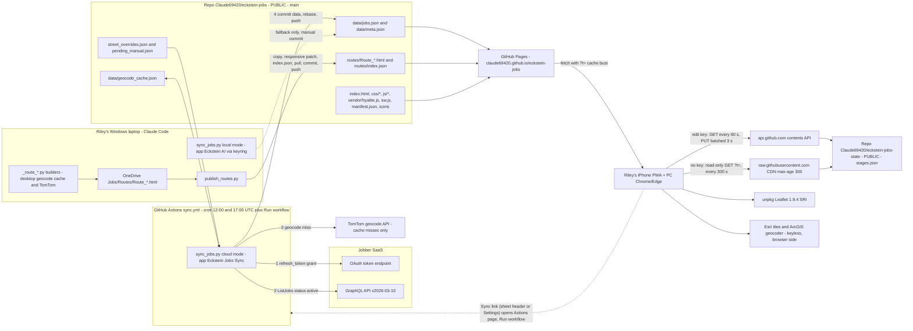

# Eckstein Jobs: APP MASTER (handoff and single source of truth)

> **Read this file first**, at the start of every session and again after any context compaction.
> This repo is **public**, so this file contains **no secret values**. Secrets are named, and their storage locations are described, but their values never appear here.
> Last full rewrite: **2026-09-25** (baseline HEAD `dd9cf03`, 53 jobs).
> Last major update: **R-1 (2026-09-26)**: job stages, Liquid Glass reskin, multi-file frontend (`index.html`, `css/`, `js/`, `vendor/`).

**Contents**
0. [Read first](#0-read-first)
1. [Business context and users](#1-business-context-and-users)
2. [Quick reference](#2-quick-reference)
3. [Architecture and data flow](#3-architecture-and-data-flow)
4. [Components in depth](#4-components-in-depth)
5. [Data files and schemas](#5-data-files-and-schemas)
6. [Secrets and auth](#6-secrets-and-auth)
7. [Operations runbook](#7-operations-runbook)
8. [Troubleshooting matrix](#8-troubleshooting-matrix)
9. [Design decisions](#9-design-decisions-adr-style)
10. [Known limitations and tech debt](#10-known-limitations-and-tech-debt)
11. [Roadmap and in-flight work](#11-roadmap--in-flight)
12. [CHANGELOG](#12-changelog)

---

## 0. READ FIRST

**What this is.** "Eckstein Jobs" is an iPhone Home Screen PWA **and** a first-class desktop web app on Riley's PC (Chrome/Edge, 1440×900), with an Apple-style "Liquid Glass" look. Views:
- **Jobs:** a full-screen map plus a list of every active Jobber job, filtered by Client **or** by Stage, with a one-click shop route per stage.
- **Routes:** route maps that Claude built on the desktop and published.
- **Plan** (sheet title "Plan a Route"): an in-browser route optimizer that works without Claude.
- **Settings** (from the ⚙ control): theme, glass style, the stage edit key, data sync.

**Job stages** (Ready to start → Excavation → Base → Prep → Passed inspection → Poured) are stored in a separate public repo, `Claude69420/eckstein-jobs-state` (§5 "Stage data", ADR-20). Devices with an edit key can move stages; others see them read-only.

It is a static site on GitHub Pages at <https://claude69420.github.io/eckstein-jobs/>. A GitHub Actions cron (`sync.yml`) refreshes the data headlessly at **7:00 AM and 12:00 PM Winnipeg time (CDT)**. The cron calls the Jobber GraphQL API with a dedicated read-only Jobber app, and does not use Claude or the Max plan.

### Standing rules (Claude must follow these every time)

| # | Rule |
|---|---|
| 1 | **Never read, print, or relay secret values.** This covers the Jobber client ID, secret and refresh tokens; the TomTom key; the Windows keyring contents (`eckstein_jobber`); `%USERPROFILE%\.config\eckstein_jobber\credentials.json`; `%USERPROFILE%\.config\eckstein_jobs_sync\refresh_token.txt`; GitHub secrets; and the **stage edit key** (a fine-grained PAT stored per device in `localStorage['ej_gh_token']` and in Riley's password manager). **Riley pastes secrets himself.** Name a secret and say where it lives; never show its value. In the Browser pane, never read `localStorage.ej_gh_token`, never call `EJ.store.getKeyForShare()`, and never type a key into Settings → Stages. |
| 2 | **The repo is PUBLIC.** Never commit secret values, phone numbers, emails, or other personal contact details. **Never copy a desktop builder's `TOMTOM_KEY = "..."` line into this repo.** Private-individual client names already appear in `data/jobs.json` (the "Other" bucket), which is a known, accepted tradeoff (see §10). Don't add more personal data. The stage edit key never goes into either repo. The state repo is public too: `stages.json` (including each device label `by`) and its commit messages (`stage: #684 <street> -> base`) are visible to anyone, so device names must not contain personal info. |
| 3 | **Log every app change in the [CHANGELOG](#12-changelog) of this file, in the same commit as the change.** Also keep §11 (ROADMAP / IN-FLIGHT) current while a feature is mid-build, so a resumed session knows exactly where work stopped. Bot data syncs are not logged individually. |
| 4 | **After building any route map, run the publish step:** `python C:/Users/Riley/eckstein-jobs/publish_routes.py`. The file must be named `Route_*.html` in `C:/Users/Riley/OneDrive/Documents/Eckstein/Riley/Jobs/Routes`, or it never reaches the app. |
| 5 | **Commands given to Riley must be PowerShell-safe.** His terminal is Windows PowerShell 5.1. No `&&`, no `/c/...` paths, and no `<` input redirection. Use forms like `git -C C:/Users/Riley/eckstein-jobs pull --rebase`, one command per line. **Claude's own Bash tool is Git Bash**: `/c/Users/...` paths work there, but `git -C C:/Users/Riley/eckstein-jobs …` works in **both** shells, so prefer that form in any command Riley might end up running. Put gh on the PATH first with `export PATH="$PATH:/c/Program Files/GitHub CLI"`. Bash-only lines (`export`, `grep`, `cat`, `sleep`, `/c/...`) must be labelled Claude-only. |
| 6 | **Route numbering rule.** When a route starts at the shop, the shop marker is **`S`** (green) and the first site is **#1**. When a route starts at a site, that site is **#1**. **Estimates:** haversine km × **1.39** gives drive km. Drive time uses **40 km/h** urban or **70–80 km/h** rural. Always prefix estimates with `~` and label them "no live traffic". |
| 7 | **Manual refresh means "Run workflow"** (`gh workflow run sync.yml -R Claude69420/eckstein-jobs`). **Never use "Re-run jobs"** on an old run. |
| 8 | **Never hand-edit `data/jobs.json` or `data/meta.json`.** The bot rebuilds both from scratch every run. Put per-job user state in a **separate file keyed by `jobNumber`**. Street overrides and pending jobs are merged by `sync_jobs.py`. **Stages are merged by the frontend and never written by the bot** (see §5 "Stage data"). |
| 9 | **Keep the two Jobber apps separate.** The desktop MCP app is "Eckstein AI" (read/write, keyring, port 8080). The cloud sync app is "Eckstein Jobs Sync" (read-only, GitHub secrets, port 8081). Never put desktop credentials in GitHub, and never run `get_refresh_token.py` with desktop credentials. |
| 10 | **Pull before you push.** The bot commits `data/` twice a day. **Commit first, then pull, then push:** `git -C C:/Users/Riley/eckstein-jobs add js/app.js APP_MASTER.md` (list the paths you actually changed) → `git -C C:/Users/Riley/eckstein-jobs commit -m "app: what changed"` → `git -C C:/Users/Riley/eckstein-jobs pull --rebase` → `git -C C:/Users/Riley/eckstein-jobs push` (this exact path form works in both PowerShell and Git Bash). A plain `pull --rebase` **refuses to run with uncommitted edits** ("cannot pull with rebase: You have unstaged changes"), because this clone has no `rebase.autoStash` and `pull.rebase=false`; `git pull --rebase --autostash` (what `publish_routes.py` uses) is the alternative. If Claude's `git push` is **blocked by the auto-mode safety classifier** (it once flagged a push of job data to this public repo as "data exfiltration"), **stop and ask Riley to run the push himself** with `git -C C:/Users/Riley/eckstein-jobs push`. |
| 11 | **Geocodes: read back and verify.** Check TomTom's `freeformAddress` and postal code. TomTom mis-snaps rural towns and duplicate street names to other provinces. Server-side sync has a Manitoba bounding-box guard; the desktop builders don't. |
| 12 | **Adding a client key touches 5 places in 2 files:** `CLIENT_KEYS` in `sync_jobs.py` (around L36–42), plus the "ONE place" constants block in `js/app.js` (L9–20): L13 `var CLIENT_KEYS` (insert before `'Other'`), L14 `var COL`, L15 `var LABEL`, L16 `var SHORT` (list-row badge). `css/tokens.css` has no client tokens (its header L5 says so). A `clientKey` missing from the app's `CLIENT_KEYS` no longer vanishes: `clientGroup()` (app.js L57) files it under "Other / Residential" (amber). §7.8. |
| 13 | **Multi-step feature work never sits on local `main`.** Any push of `main` deploys to Riley's phone in about 1 minute, and `publish_routes.py` runs `git pull --rebase --autostash` + `git push` on the *current* branch.<br>(a) Do R-1 and other multi-session work on a branch: `git -C C:/Users/Riley/eckstein-jobs switch -c r1-stages`. Commit there, with the CHANGELOG entry in the same commit. Optionally run `git -C C:/Users/Riley/eckstein-jobs push -u origin r1-stages` as an off-site backup (Pages serves only `main`).<br>(b) **Before running `publish_routes.py` or making any hotfix**, commit or stash the branch work and run `git -C C:/Users/Riley/eckstein-jobs switch main`. On a branch with no upstream, the script dies at `git pull` ("There is no tracking information for the current branch"), with the route files written but not committed. On a branch pushed with `-u`, it silently commits and pushes the routes to that branch, and they never go live, because Pages serves only `main`.<br>(c) To ship R-1: ONE squash commit (build spec §1.7): `git -C C:/Users/Riley/eckstein-jobs switch main` → `git -C C:/Users/Riley/eckstein-jobs pull --rebase` → `git -C C:/Users/Riley/eckstein-jobs merge --squash r1-stages` → commit with the CHANGELOG entry → push → verify live. Rollback = `git revert` of that single commit (§7.15). For later multi-session work either a squash or `merge --ff-only` is fine; record which one was used in §11.<br>(d) Record the branch name, and whether it is pushed or merged, in the §11 Work log. |

**Where the other context lives:**
- `C:/Users/Riley/OneDrive/Documents/University/Year 5/Claude Code/ROUTING_PLAYBOOK.md` is private and holds routing rules and the TomTom key. **Read it before any routing work.** Some parts are stale (see §10).
- Claude memory (folder `C:/Users/Riley/.claude/projects/C--Users-Riley-OneDrive-Documents-University-Year-5-Claude-Code/memory/`):
  - `project_route_mapping.md` (routing workflow);
  - `project_eckstein_jobs_app.md` (this app; indexed in that folder's `MEMORY.md`).
- **Pointers to this file** (all in place as of 2026-09-25):
  - `C:/Users/Riley/eckstein-jobs/CLAUDE.md` (tracked in the repo) auto-loads when the Claude Code session's working directory is the repo.
  - `C:/Users/Riley/OneDrive/Documents/University/Year 5/Claude Code/CLAUDE.md` (out of repo) auto-loads in Claude's usual working directory and routes app work here.
  - Memory `…/memory/project_eckstein_jobs_app.md` (out of repo, listed in `MEMORY.md`): "Read APP_MASTER.md before any app work". The auto-memory entry **points here (done 2026-09-25)**, so this file is found after compaction even from the Claude Code folder.
  - `ROUTING_PLAYBOOK.md`, section "Eckstein Jobs phone app", first bullet ("Master doc").
- The out-of-repo stale pointers found during the 2026-09-25 doc review (folder `CLAUDE.md` routing table, `ROUTING_PLAYBOOK.md` "Leaflet + OSM" heading and local-run wording) were **fixed on 2026-09-25**.
- **Out-of-repo pointers updated for R-1 on 2026-09-26** (not versioned here): memory `project_eckstein_jobs_app.md` now says R-1 shipped as one squash commit and R-2 is next (`docs/r2-plan.md`); `ROUTING_PLAYBOOK.md` "Eckstein Jobs phone app" section (L88–90) now lists the views Jobs (Client or Stage filter, stage slider, stage route) / Routes / Plan / Settings and the state repo.

### Current state and in-flight work (as of 2026-09-26, after the 12:04 UTC sync)

The app is **live and healthy**:
- **53 jobs, 53 mapped, 0 failed**: 52 active in Jobber plus 1 pending manual job, 9001.
- Geocode cache: 312 entries.
- 65 published routes (the 2 waiting desktop routes were published 2026-09-25 in `bce1803`).
- When this was written, local `main` was level with `origin/main` at `d1e9dfb` (bot sync 2026-09-26 12:04 UTC). **Every number in this box is a snapshot** and goes stale twice a day. After `git pull --rebase`, re-read `data/meta.json` before quoting counts to Riley.
- Every scheduled sync since the 2026-09-17 token fix has been green. The one failure since then was a "Re-run jobs" push rejection on 09-24, now fixed by `8b2e72f`.
- **Open security item:** `%USERPROFILE%\.config\eckstein_jobs_sync\refresh_token.txt` still exists (32 bytes, written 2026-09-15 22:05 CDT, never deleted) and likely holds the live sync-app refresh token in plaintext. Ask Riley to run (PowerShell): `Remove-Item "$env:USERPROFILE\.config\eckstein_jobs_sync\refresh_token.txt"`. Claude never reads it. Remove this bullet (and the matching §10 item) once Riley confirms.

**R-1 (job stages, Client|Stage filter, one-click stage route, stage slider, Liquid Glass reskin): SHIPPED 2026-09-26 as `005a671`** (ONE squash commit of branch `r1-stages`; local WIP commits `be33936` build + `7b5449d` review fixes + a docs WIP) onto `main`. Live-verified 2026-09-26. Riley decided on 2026-09-26 (R-2 Q7) to ship now. Built, tested (Node 15/15 + 38/38), browser-accepted and reviewed; see the §12 entry and the §11 Work log. Squash hash: `005a671`.

**Open Riley steps** (`docs/r1-build-spec.md` §3; Claude guides, never handles the key):
1. Create the fine-grained stage edit key (§6 recipe F).
2. **Delete and re-add the Home Screen icon** (status bar, theme colour and icon changed). Note any saved planner routes first: they live only in that app's storage.
3. Paste the key on the iPhone (inside the installed app) and on the PC: Settings → Stages → paste → Save.
4. Share edit access with crew: Settings → Stages → Share edit access.
5. Delete `refresh_token.txt` (security item above).
6. Confirm the new look on his iPhone PWA (the one R-1 acceptance item Claude cannot test).

**Next feature: R-2** (Setup stage, before/after-work items, route editing, pricing): **planned**, answers recorded 2026-09-26, plan in `docs/r2-plan.md`. Build starts after R-1 ships (§11 "R-2").

### Resuming after compaction or in a new session (do this before anything else)
1. Read §0 and the §11 **Work log**.
2. **Claude only, in Git Bash (Bash tool):**
   ```bash
   git -C C:/Users/Riley/eckstein-jobs status --short
   git -C C:/Users/Riley/eckstein-jobs branch -vv
   git -C C:/Users/Riley/eckstein-jobs stash list
   git -C C:/Users/Riley/eckstein-jobs log --oneline --decorate -10 --all
   git -C C:/Users/Riley/eckstein-jobs diff --stat
   git -C C:/Users/Riley/eckstein-jobs log --oneline origin/main..HEAD
   ```
3. Compare what git shows with the Work log's *Uncommitted* and *Half-done* lines. If they disagree, trust git, describe the difference to Riley, and never discard changes without his OK.
4. Compare the newest CHANGELOG entry with `git -C C:/Users/Riley/eckstein-jobs log -5 --oneline`. A missing entry means the previous session stopped before logging, so add it.
5. Run `preview_list`. If the preview is down, `preview_start` with name `eckstein-jobs`.
6. Check the *Answers from Riley* of the §11 block you are working on. An unanswered question that changes storage, accounts, keys or repo visibility stays blocking: ask Riley.
7. Continue from *Next step*. Update the Work log after every meaningful step, not only at the end.

---

## 1. Business context and users

- **Eckstein Repair** is Riley's concrete and asphalt restoration contractor in Winnipeg, Manitoba. Crews restore **utility cuts** (sidewalk, street, asphalt path, paving stone, driveway) after gas and sewer work.
- **Shop:** 1279 Loudoun Rd, Winnipeg, at (49.8401, −97.2546). Some desktop builders use the more precise 49.840127, −97.254552.
- **Commercial clients (client keys and map colours):**

| Key | Jobber companyName (exact) | Colour | Typical work and identifiers |
|---|---|---|---|
| `Crown` | Crown Pipeline Ltd. | `#2563eb` blue | Gas utility cuts; 6-digit permits (35xxxx, including 357xxx), City `M0xxxxx` permits (`M` plus 6 digits; seen only on Crown jobs), gas numbers, "(gas)" |
| `Harris` | Harris Holdings Ltd. | `#dc2626` red | 6-digit permits (35xxxx including 357xxx, 32xxxx, 34xxxx) and TM traffic permits (`TM` plus 5 digits) |
| `ACV` | ACV Sewer & Water | `#16a34a` green | Sewer/water restorations |
| `MyTec` | MyTec Industry Ltd | `#7c3aed` purple | — |
| `NoLimits` | No Limits Underground Ltd. | `#0d9488` teal | Added 2026-09-23 (first job was on Beaumont St) |
| `Other` | anything else | `#f59e0b` amber | "Other / Residential": one-off accounts and private homeowners |

- **Crew roles** that appear in route names: cuts & cleanup, setup, excavation, base, prep, asphalt, steel, measurements. David's measurements route is one example.
- **Users:**
  - **Riley** uses the app on his phone in the field. The PWA is pinned to his home screen. On 2026-09-25 he said it has been "very helpful this week".
  - Since R-1 the PC (Chrome/Edge) is a first-class device too (Riley, 2026-09-25).
  - He triggers manual syncs from the **Sync** link beside the status line in the sheet header (`.sheet-sub`, index.html L105; on iPhone visible only while the sheet is open, on the PC panel always), or Settings → Data → "Sync from Jobber now" (L189). Both open the Actions page, which needs a GitHub login with write access (the `Claude69420` account).
  - The site is public, but nobody else is a known regular user yet. Crew get stage edit access through Settings → Stages → "Share edit access" (§6 recipe F).
- **Where Claude works:** Claude Code on Riley's Windows laptop (a Surface Laptop Studio). The working directory is `C:/Users/Riley/OneDrive/Documents/University/Year 5/Claude Code`. The app repo lives **outside OneDrive** at `C:/Users/Riley/eckstein-jobs`.

---

## 2. Quick reference

| Item | Value |
|---|---|
| Live URL | <https://claude69420.github.io/eckstein-jobs/> |
| Repo | <https://github.com/Claude69420/eckstein-jobs> (**PUBLIC**, branch `main`, created 2026-09-16 02:55 UTC) |
| Local clone | `C:/Users/Riley/eckstein-jobs` (outside OneDrive) |
| GitHub account | `Claude69420`. It was created by Riley for this app. The gh CLI is logged in as this account through a device login. |
| gh CLI | `C:/Program Files/GitHub CLI/gh.exe`. In Git Bash, run `export PATH="$PATH:/c/Program Files/GitHub CLI"` first. |
| Actions page | <https://github.com/Claude69420/eckstein-jobs/actions/workflows/sync.yml> (the app's **Sync** links point here) |
| Secrets page | <https://github.com/Claude69420/eckstein-jobs/settings/secrets/actions> |
| Pages settings | <https://github.com/Claude69420/eckstein-jobs/settings/pages> (legacy build, source `main` at `/`, HTTPS enforced, no custom domain) |
| Jobber app: cloud sync | **"Eckstein Jobs Sync"**: Clients read and Jobs read only, refresh-token rotation **OFF**. Callback registered as `https://claude69420.github.io/eckstein-jobs/callback`; `get_refresh_token.py` actually uses `http://localhost:8081/callback`. |
| Jobber app: desktop MCP | **"Eckstein AI"**: read/write. Token in Windows Credential Manager (keyring service `eckstein_jobber`, user `token`), callback `http://localhost:8080/callback`. |
| GitHub secrets (names) | `JOBBER_CLIENT_ID`, `JOBBER_CLIENT_SECRET`, `JOBBER_REFRESH_TOKEN`, `TOMTOM_KEY`. `GH_PAT` is referenced by the workflow but **not set**. |
| Schedule | Cron `0 12 * * *` and `0 17 * * *` UTC. That is 7:00 AM and 12:00 PM CDT, or **6:00 AM and 11:00 AM CST** from 2026-11-01 to 2027-03-14. Runs start about 5 minutes late and data is live about 6 minutes after the cron time. |
| Jobber API | GraphQL `https://api.getjobber.com/api/graphql`, header `X-JOBBER-GRAPHQL-VERSION: 2026-03-10`. OAuth token endpoint `https://api.getjobber.com/api/oauth/token`. |
| Geocoders | Server: TomTom Search (cache misses only). Browser planner: Esri ArcGIS World Geocoder (no key). |
| Map tiles | Esri Canvas, keyless: light `World_Light_Gray_Base` + `World_Light_Gray_Reference`, dark `World_Dark_Gray_Base` + `World_Dark_Gray_Reference`; `maxNativeZoom 16`, `maxZoom 19`, **no CSS filter**. Reference (label) tiles sit in a custom pane `labels` (z 450: above route lines at 400, below markers at 600). |
| Leaflet | 1.9.4 from unpkg with SRI (`crossorigin=""`): CSS `sha256-p4NxAoJBhIIN+hmNHrzRCf9tD/miZyoHS5obTRR9BMY=`, JS `sha256-20nQCchB9co0qIjJZRGuk2/Z9VM+kNiyxNV1lvTlZBo=`. Cached cache-first by `sw.js`. |
| State repo | `Claude69420/eckstein-jobs-state` (**PUBLIC**, no Pages, branch `main`, file `stages.json`). Local clone `C:/Users/Riley/eckstein-jobs-state`: **pull before any hand edit** (§7.14). |
| Stage API | With a key: `https://api.github.com/repos/Claude69420/eckstein-jobs-state/contents/stages.json`. Without: `https://raw.githubusercontent.com/Claude69420/eckstein-jobs-state/main/stages.json` (CDN `Cache-Control: max-age=300`). |
| Stage edit key | Fine-grained PAT on `Claude69420`, "Only select repositories → eckstein-jobs-state", Contents: Read and write, expiry ≤ 1 year. Stored per device in `localStorage['ej_gh_token']` and in Riley's password manager. The value never appears in docs (§6). |
| Tests | `node C:/Users/Riley/eckstein-jobs/tests/tsp.test.js` (15 tests) and `node C:/Users/Riley/eckstein-jobs/tests/stages.test.js` (39). Node v24, no npm, no dependencies. The same lines work in PowerShell. |
| Desktop route output | `C:/Users/Riley/OneDrive/Documents/Eckstein/Riley/Jobs/Routes` |
| Desktop builders and playbook | `C:/Users/Riley/OneDrive/Documents/University/Year 5/Claude Code/` (`_route_*.py`, `_map_*.py`, `ROUTING_PLAYBOOK.md`) |
| Local preview | The `.claude/launch.json` config `eckstein-jobs` in the Claude Code folder runs `python -m http.server 8765 --directory C:/Users/Riley/eckstein-jobs`, served at <http://localhost:8765/>. On localhost / 127.0.0.1 / [::1] **with no key**, stages run in **local mode** (`localStorage['ej_stages']`, this machine only, never shared). |
| Python for local sync | `C:/Users/Riley/OneDrive/Documents/Agents/.venv/Scripts/python.exe` (has `keyring` and `requests`) |

**Key files in the repo** (sizes are the committed LF sizes, as served; a Windows checkout with `core.autocrlf=true` can show CRLF copies a little larger):

| File | Role |
|---|---|
| `index.html` | Markup, inline boot script (L18–46: theme/glass before first paint), stylesheet and script tags (load order §4.3a). 282 lines, 21.1 KB |
| `css/tokens.css` | Design tokens: light, `[data-theme="dark"]`, Tinted overrides, stage colours `--stage-1..6`. 159 lines, 7.3 KB |
| `css/glass.css` | Glass material; MIT notice for sohumsuthar/liquid-glass in its header (L1–31), file rules L33–42. 171 lines, 8.7 KB |
| `css/components.css` | Geometry and content styles, desktop ≥900 px block, reduced motion. 444 lines, 34.4 KB |
| `js/tsp.js` | Global `TSP`: optimizer, leg estimates, Google Maps parts; also a Node module. 375 lines, 15.1 KB |
| `js/stages.js` | Global `Stages`: `STAGES` + the stage store; also a Node module. 776 lines, 39.1 KB |
| `js/ui.js` | Global `UI`: shell, sheets, toast, `StageSlider`, refraction gate. 485 lines, 27.5 KB |
| `js/app.js` | App logic (one IIFE); the single home of `CLIENT_KEYS`/`COL`/`LABEL`/`SHORT`/`SHOP`. 1,168 lines, 75.8 KB |
| `vendor/hyalite.js`, `vendor/hyalite.LICENSE` | Third-party desktop refraction, byte-for-byte, **never edit** (51,559 B; LICENSE 1,070 B). §9 "Third-party code" |
| `sw.js` | Service worker, cache `ej-v2`. 128 lines, 5.6 KB |
| `manifest.json` | PWA install metadata (638 B) |
| `icons/icon-180.png` · `icon-192.png` · `icon-512.png` · `icon-maskable-512.png` | apple-touch-icon · favicon + manifest `any` · manifest `any` · manifest `maskable` (17.4 / 19.4 / 100.6 / 95.8 KB; all opaque RGB) |
| `tests/tsp.test.js`, `tests/stages.test.js` | Node tests, no npm (stages test mocks `fetch`). 471 and 947 lines |
| `docs/liquid-glass-brief.md` | R-1 design brief (137 KB) |
| `docs/r1-build-spec.md` | R-1 build spec; **overrides the brief** (6.8 KB) |
| `docs/r2-plan.md` | R-2 plan and build spec (6.8 KB), §11 "R-2" |
| `.gitattributes` | `vendor/* -text` (never convert line endings, so the hyalite hash stays stable) |
| `sync_jobs.py` | Jobber to `data/*.json` sync (stdlib only, 222 lines) |
| `.github/workflows/sync.yml` | Cron and manual workflow ("Sync jobs from Jobber") |
| `get_refresh_token.py` | One-time OAuth consent helper for the sync app (run by Riley) |
| `publish_routes.py` | Copies desktop `Route_*.html` into `routes/`, makes them responsive, rebuilds `routes/index.json`, then commits and pushes |
| `data/jobs.json`, `data/meta.json` | Generated by the bot every run |
| `data/geocode_cache.json` | Repo geocode cache, committed by the bot |
| `data/street_overrides.json`, `data/pending_manual.json` | Hand-maintained inputs to the sync |
| `routes/Route_*.html`, `routes/index.json` | Published route maps and their index |
| `CLAUDE.md` | Short pointer to this file |
| `APP_MASTER.md` | This file |
| `.gitignore` | `__pycache__/` and `*.pyc` |

---

## 3. Architecture and data flow


```mermaid
flowchart LR
  subgraph JOBBER["Jobber SaaS"]
    JO["OAuth token endpoint"]
    JG["GraphQL API v2026-03-10"]
  end
  TT["TomTom geocode API - cache misses only"]
  subgraph GHA["GitHub Actions sync.yml - cron 12:00 and 17:00 UTC plus Run workflow"]
    SJ["sync_jobs.py cloud mode - app Eckstein Jobs Sync"]
  end
  subgraph REPO["Repo Claude69420/eckstein-jobs - PUBLIC - main"]
    IN["street_overrides.json and pending_manual.json"]
    GC["data/geocode_cache.json"]
    OUT["data/jobs.json and data/meta.json"]
    RT["routes/Route_*.html and routes/index.json"]
    FE["index.html, css/*, js/*, vendor/hyalite.js, sw.js, manifest.json, icons"]
  end
  STATE["Repo Claude69420/eckstein-jobs-state - PUBLIC - stages.json"]
  GHAPI["api.github.com contents API"]
  RAW["raw.githubusercontent.com CDN max-age 300"]
  UNPKG["unpkg Leaflet 1.9.4 SRI"]
  PAGES["GitHub Pages - claude69420.github.io/eckstein-jobs"]
  PHONE["Riley's iPhone PWA + PC Chrome/Edge"]
  ESRI["Esri tiles and ArcGIS geocoder - keyless, browser side"]
  subgraph DESK["Riley's Windows laptop - Claude Code"]
    BLD["_route_*.py builders - desktop geocode cache and TomTom"]
    RH["OneDrive Jobs/Routes/Route_*.html"]
    PUB["publish_routes.py"]
    LOC["sync_jobs.py local mode - app Eckstein AI via keyring"]
  end

  SJ -- "1 refresh_token grant" --> JO
  SJ -- "2 ListJobs status active" --> JG
  IN --> SJ
  GC <--> SJ
  SJ -- "3 geocode miss" --> TT
  SJ -- "4 commit data, rebase, push" --> OUT
  OUT --> PAGES
  RT --> PAGES
  FE --> PAGES
  PAGES -- "fetch with ?t= cache bust" --> PHONE
  PHONE --> ESRI
  PHONE --> UNPKG
  PHONE -- "edit key: GET every 60 s, PUT batched 3 s" --> GHAPI
  GHAPI --> STATE
  PHONE -- "no key: read-only GET ?t=, every 300 s" --> RAW
  RAW --> STATE
  PHONE -. "Sync link (sheet header or Settings) opens Actions page, Run workflow" .-> GHA
  BLD --> RH
  RH --> PUB
  PUB -- "copy, responsive patch, index.json, pull, commit, push" --> RT
  LOC -. "fallback only, manual commit" .-> OUT
```

**Data flow narrative:**
1. **Sync.** At 12:00 and 17:00 UTC (actual start about 12:04 and 17:05), or on a manual **Run workflow**, GitHub Actions runs `python sync_jobs.py` with the four secrets. The script:
   - swaps the stored refresh token for an access token;
   - pages through all **active** Jobber jobs;
   - cleans addresses, applies `street_overrides.json`, extracts permits and maps clients to colour keys;
   - geocodes cache-first (TomTom only on a miss, Manitoba box guard);
   - appends `pending_manual.json` entries;
   - writes `data/geocode_cache.json`, `data/jobs.json` and `data/meta.json`.
2. **Commit.** The workflow commits `data/` as `eckstein-sync-bot` ("Sync jobs YYYY-MM-DD HH:MM UTC"), rebases onto `origin/main` with `-X theirs` (fresh data wins), and pushes with up to 4 tries.
3. **Deploy.** The push to `main` triggers GitHub's "pages build and deployment", which takes about 31–106 s (typically 35–47 s). Files are served with `Cache-Control: max-age=600`.
4. **App.** `js/app.js` `loadData()` (L618–656) fetches `data/jobs.json`, `data/meta.json` (optional) and `routes/index.json` with `?t=<now>` and `cache:'no-store'`, checking `r.ok`. In parallel it calls `store.load()` for the stages, then merges them (`mergeStages`, L598) and renders the Jobs map and list and the Routes cards. ↻ (`#rf`) re-runs `loadData()` in place (no page reload). The Plan view geocodes typed addresses with Esri in the browser and runs the optimizer in `js/tsp.js`.
5. **Routes.** Claude builds route maps on the desktop with per-route Python builders into OneDrive `.../Jobs/Routes/Route_*.html`. Then `publish_routes.py`:
   - copies new or changed files into `routes/`;
   - injects a phone-responsive media query;
   - rebuilds `routes/index.json`;
   - runs `git pull --rebase --autostash`, commits and pushes.
6. **Local fallback.** With no Jobber cloud env vars set, `sync_jobs.py` borrows the desktop MCP's keyring token ("Eckstein AI"). It writes only `data/`, and a human or Claude commits and pushes by hand.
7. **Stages.** The frontend is authoritative. Devices with an edit key read and write `stages.json` in the state repo through the GitHub contents API (poll 60 s; writes batched 3 s into one commit); devices without a key read the raw CDN copy (poll 300 s). The sync bot never reads or writes the stage store, and stage writes never trigger this site's Pages builds (§5 "Stage data", ADR-20).

---

## 4. Components in depth

### 4.1 Sync pipeline: `sync_jobs.py`

It uses only the standard library (`urllib`, no `requests`), so the workflow has no pip step. All paths are relative to the script (`ROOT = Path(__file__).resolve().parent`), so the working directory doesn't matter.

**Execution flow:**
1. `DATA.mkdir(exist_ok=True)`.
2. `get_access_token()` (auth modes below).
3. `raw = fetch_active_jobs(token)` (the function itself prints nothing); then `main()` prints `jobber: N active jobs` (L172).
4. It loads four inputs:
   - `geocode_cache.json` (default `{}`)
   - `street_overrides.json` (keys converted to `int`)
   - `pending_manual.json` (default `[]`)
   - env `TOMTOM_KEY` (stripped)

   `load_json` swallows **any** exception and returns the default. A corrupt file is silently treated as empty, and a corrupt cache means every address gets re-geocoded.
5. For each Jobber job, it builds a record and, if `street` is non-empty, geocodes it. After any job where `api_calls` is a nonzero multiple of 5, it sleeps 0.2 s. Quirk: this repeats on later cache hits until the next API call.
6. It appends pending manual jobs, geocoded the same way.
7. It sorts by `-jobNumber`, so 9001 comes first, then 699, 698 and so on.
8. It writes `geocode_cache.json` (indent=2), `jobs.json` (indent=1) and `meta.json` (indent=1), in that order.
9. It prints `done: N jobs, M mapped, F failed, A geocode calls, cache C`, then `  FAILED: #<n> '<street>' / <city>` for each unmapped job.
10. It returns 0. **Geocode failures never fail the run.** Only exceptions do (auth, GraphQL, network, KeyError/TypeError on an unexpected response shape).

**Auth: cloud mode.** It is used when `JOBBER_CLIENT_ID`, `JOBBER_CLIENT_SECRET` and `JOBBER_REFRESH_TOKEN` are **all** non-empty after `.strip()`.
- It prints `auth: cloud mode (refresh_token grant) [client_id len 36, secret len 64, refresh len N]`. Only lengths are printed. **The baseline is 36 / 64 / 32**; the refresh length was 59 before the 09-17 fix.
- It sends a form-encoded `POST https://api.getjobber.com/api/oauth/token` with `grant_type=refresh_token`, `refresh_token`, `client_id` and `client_secret`. Timeout 20 s.
- On an `HTTPError` it prints `auth: Jobber token endpoint HTTP <code> -> <first 300 chars of body>`, then a hint (`sync_jobs.py` L75, verbatim: `auth: invalid_client => JOBBER_CLIENT_ID/JOBBER_CLIENT_SECRET wrong; invalid_grant => JOBBER_REFRESH_TOKEN wrong/expired`), and re-raises.
- **Rotation:** if the response's `refresh_token` differs from the input, it writes the new one to the file named by env `ROTATED_TOKEN_FILE` and prints `auth: Jobber ROTATED the refresh token -> written to ROTATED_TOKEN_FILE...`. If that env var is unset, it prints `auth: WARNING Jobber rotated ... ROTATED_TOKEN_FILE not set`.
- It returns `tok["access_token"]`.

**Auth: local mode.** It is used when any Jobber env var is missing. It prints `auth: local mode (desktop keyring)`, then:
```python
sys.path.insert(0, r"C:\Users\Riley\OneDrive\Documents\Agents")
from agents.services.eckstein_jobber.auth import get_access_token as _local
```
- This reuses the **desktop MCP app "Eckstein AI"**. Its credentials are in `%USERPROFILE%\.config\eckstein_jobber\credentials.json` (client_id, client_secret, redirect_uri). Its tokens (access, refresh, `expires_at`) are in Windows Credential Manager through keyring, service `eckstein_jobber`, user `token`.
- The order it tries:
  1. Use the cached access token if it is still valid (60 s buffer).
  2. Otherwise refresh and save the result back to keyring. If Jobber omits a new refresh token, the old one is kept.
  3. If the refresh fails, it **silently falls back to an interactive browser consent flow on `http://localhost:8080/callback`**, which blocks until consent is given.
- It needs `keyring` and `requests`, both present in the Agents venv.

**Jobber GraphQL fetch:**
- URL `https://api.getjobber.com/api/graphql`.
- Headers: `Authorization: Bearer <token>`, `X-JOBBER-GRAPHQL-VERSION: 2026-03-10` (`sync_jobs.py` line 30; the same value is in the desktop `server.py` lines 59–60, so **bump both together**), and `Content-Type: application/json`.
- Query `ListJobs($filter: JobFilterAttributes, $first: Int, $after: String)` on `jobs(filter, first, after)`:
  - `nodes { id jobNumber title jobStatus client { id name companyName } property { address { street1 city } } createdAt updatedAt }`
  - `pageInfo { hasNextPage endCursor }`

  This is the same shape as the MCP tool `jobber_list_jobs` (`server.py:916`).
- Variables: `{"filter": {"status": "active"}, "first": 100, "after": <cursor>}`. "Active" also covers on-hold jobs.
- Pagination: at most 50 pages × 100, a **5,000-job hard cap** with silent truncation.
- Retries: 5 attempts per page on any exception, sleeping `2**attempt` (1, 2, 4, 8 s), then it raises. A 401 is retried pointlessly.
- GraphQL errors:
  - `"errors"` with no `data` raises `RuntimeError("Jobber GraphQL error: [...]")`, **not retried**. Throttling shows up this way.
  - Errors alongside data are silently accepted.
  - `data` null with no `errors` key passes the guard (`if "errors" in res and not res.get("data")`, L117) and then raises `TypeError: 'NoneType' object is not subscriptable` at `res["data"]["jobs"]` (L119). A missing `data` key (or a missing `jobs` inside it) raises `KeyError`.
  - A GraphQL-level **401** (token exchange fine, access token rejected) is retried 5 times over about 15 s inside `fetch_active_jobs` with **no logging**, then surfaces as a bare `urllib.error.HTTPError: HTTP Error 401: Unauthorized` traceback. The body is never printed (only token-endpoint errors print a body, L72–76). See §7.13.
- `id`, `client.id`, `createdAt` and `updatedAt` are fetched but **not written out**, so `jobNumber` is the only stable key in the output.
- Statuses seen on 2026-09-25: `action_required` 33, `unscheduled` 11, `upcoming` 4, `late` 4, plus the synthetic `pending` 1.

**Transform rules:**
- `client = companyName or name or "Unknown"`.
- `jobNumber = int(jobNumber)`.
- `city = address.city or "Winnipeg"`.
- `clientKey = CLIENT_KEYS.get(client, "Other")`. `CLIENT_KEYS` is at `sync_jobs.py` around lines 36–42:
  ```python
  "Crown Pipeline Ltd.": "Crown", "Harris Holdings Ltd.": "Harris", "ACV Sewer & Water": "ACV",
  "MyTec Industry Ltd": "MyTec", "No Limits Underground Ltd.": "NoLimits"
  ```
- `street = overrides.get(jobNumber) or clean_addr(street1)`. An override replaces the street wholesale and is **not** cleaned.
- `clean_addr`, applied in order:
  ```python
  s = (s or "").replace("&amp;", "&")
  s = re.sub(r"\s*\(.*?\)\s*", " ", s)      # (parenthetical)
  s = re.sub(r"\s*\[.*?\]\s*", " ", s)      # [bracketed]
  s = re.sub(r"\bUnits?\s*[\d\-,\s]+", "", s, flags=re.I)
  s = re.sub(r"\b(Rear Lane|Lane)\b", "", s, flags=re.I)
  return re.sub(r"\s+", " ", s).strip(" -,")
  ```
  Quirks, verified by running it:
  - `"Unit 2 59 Market Blvd"` becomes `"Market Blvd"`: a leading unit eats the civic number.
  - `"Units 1-4, 200 Portage Ave"` becomes `"Portage Ave"`.
  - `"Kildonan Lane"` becomes `"Kildonan"`: real "Lane" names get stripped.
  - A trailing `(Unit 2)` or `Unit 2` is handled correctly.
- `extract_permit(title)`:
  ```python
  t = (title or "").replace("&amp;", "&")
  perms = re.findall(r"\b(?:M\d{5,6}|TM\d{4,6}|CTR\d+|\d{5,6})\b", t)
  if perms: return " / ".join(dict.fromkeys(perms))   # order-preserving de-dupe
  return "(gas)" if "Gas" in t else ""                # case-sensitive "Gas"
  ```
  Any standalone 5–6 digit number counts as a permit.
- **Pending manual jobs** (`pending_manual.json`):
  - Output fields: `streetRaw = street`, `permit ""`, `status "pending"`, `unscheduled false`, `pending true`, and `city` defaulting to Winnipeg.
  - They are geocoded through the same cache, but their TomTom calls are **not counted** in `geocode_api_calls`.
  - They are never auto-removed.
- **Every run rebuilds `jobs.json` from scratch.** Any user-set per-job state must live in a separate file keyed by `jobNumber`. Overrides and pending jobs are merged in by the sync; **stages are merged by the frontend and never written by the bot** (§5 "Stage data").

### 4.2 GitHub Actions workflow: `.github/workflows/sync.yml` ("Sync jobs from Jobber")

**Triggers:**
- `schedule` `0 12 * * *` and `0 17 * * *` (UTC only).
- `workflow_dispatch: {}` for manual **Run workflow**.
- In practice runs start a median of 4.9 min late (range 4.3–5.6 min over 20 scheduled runs; none dropped). GitHub cron can be delayed or dropped under load.

**Permissions and concurrency:**
- `permissions: contents: write` is required, because the repo's default workflow permission is read.
- `concurrency: group: sync-jobs, cancel-in-progress: false` makes runs queue. GitHub keeps at most one *pending* run per group, so a newer pending run replaces an older pending one.

**Steps** (on `ubuntu-latest`):
1. `actions/checkout@v5` with `fetch-depth: 0` (full history, needed for the rebase).
2. `actions/setup-python@v6` with Python `3.12`.
3. **Pull jobs + geocode**: `python sync_jobs.py` with env `JOBBER_CLIENT_ID`, `JOBBER_CLIENT_SECRET`, `JOBBER_REFRESH_TOKEN` and `TOMTOM_KEY` from secrets, plus `ROTATED_TOKEN_FILE=${{ runner.temp }}/rotated_refresh_token`.
4. **Persist rotated refresh token (if any)** (`if: always()`, `GH_TOKEN=${{ secrets.GH_PAT }}`). If the rotated file is non-empty:
   - With `GH_TOKEN` set, it runs `gh secret set JOBBER_REFRESH_TOKEN --repo <repo> < file` and prints `Updated JOBBER_REFRESH_TOKEN secret.`
   - Otherwise it emits `::warning::Jobber rotated the refresh token but no GH_PAT secret is set; add GH_PAT (repo scope) or re-paste JOBBER_REFRESH_TOKEN.`
   - Either way it runs `rm -f` on the file.

   The built-in `GITHUB_TOKEN` cannot write secrets. **`GH_PAT` is not set today.**
5. **Commit updated data** (no `always()`, so it is skipped if step 3 failed):
   1. Set the git identity to `eckstein-sync-bot` / `sync-bot@users.noreply.github.com`.
   2. `git add data/`. If nothing is staged it prints `No changes.` and exits 0. That never happens in practice, because `updated_utc` changes every run, so **every successful run commits** (about 2 per day).
   3. Commit `Sync jobs YYYY-MM-DD HH:MM UTC`.
   4. Push loop, `for i in 1..4`:
      - `git fetch origin main`, then `git rebase -X theirs origin/main`. "theirs" is the commit being replayed, so **fresh data wins**. On a rebase failure: `git rebase --abort`, `::error::Rebase onto main failed`, exit 1.
      - `git push origin HEAD:main`. On success it prints `Pushed.`. On rejection it prints `Push rejected (attempt i); retrying...` and sleeps `i*5` s (5, 10, 15, 20).
      - After 4 failures: `::error::Could not push after retries`, exit 1.
6. The push triggers GitHub's own "pages build and deployment", which takes about 31–106 s (typically 35–47 s; measured over 26 successful builds, min 31.1 s for `b9e06af`, max 105.6 s for `8478daf`).

**Timing:** the job itself takes a median of 12 s (max 28 s). End to end, data is live at about the cron time + 6 min, so roughly **7:06 AM and 12:06 PM CDT**. Example from 2026-09-25: cron 17:00, start 17:04:54, commit 17:05:01, live 17:06:12.

**Run history** (27 runs, 2026-09-16 to 2026-09-25):
- 20 succeeded and 7 failed, across 28 attempts with 21 successful.
- Schedule: 20 runs, 17 succeeded.
- Dispatch: 7 runs, 3 succeeded and 4 failed. Three of those failures were setup-time 401s. The fourth was run 35943677247, whose attempt 1 succeeded and whose re-run attempt 2 failed.
- The 21 successful attempts match the 21 bot commits, from `9740cd4` to `dd9cf03`.
- All successful runs had `0 failed` geocodes.
- There have been 0 "Jobber ROTATED" messages ever.

### 4.3 Frontend: `index.html`, `css/*`, `js/*`, `vendor/`, `sw.js`, `manifest.json`, `icons/`

Line numbers are as of the R-1 squash commit. None of these files contains a secret; the geocoder and tiles are keyless. The pre-R-1 single-file frontend (old CSS token table, hard-coded colours, 92 px header, popups, old TSP analysis, `showResult` map leak, `ej-v1`) is documented in git history at `48af459:APP_MASTER.md` §4.3 and `d1e9dfb:index.html`.

**(a) Load order and degradation (`index.html`)**
1. `<head>`: meta (`viewport … viewport-fit=cover`, `apple-mobile-web-app-capable`, `mobile-web-app-capable`, `apple-mobile-web-app-status-bar-style` **`default`** (was `black-translucent`), `apple-mobile-web-app-title`, `theme-color`, `description`); `manifest.json`; `apple-touch-icon` `icons/icon-180.png` (`sizes="180x180"`) and `icon` `icons/icon-192.png`; Leaflet CSS with SRI; the inline boot script (L18–46); then `css/tokens.css`, `css/glass.css`, `css/components.css` (L47–49; **source order is precedence**).
2. The boot script reads `ej_theme` (auto|light|dark) and `ej_glass` (liquid|tinted|solid) in try/catch; sets `html[data-theme]`, `[data-glass]`, `[data-glass-user]` and the `.is-standalone` class; sets `meta theme-color` to `#EFEFEF` (light) or `#474749` (dark); picks Tinted automatically under `prefers-reduced-transparency` (unless the user chose a glass); defines `window.getUiPrefs` / `setUiPrefs`; fires a `uiprefs` event on every change (app.js swaps the basemap, ui.js re-runs the refraction gate).
3. End of `<body>` (L276–280): Leaflet JS with SRI, then `js/tsp.js`, `js/stages.js`, `js/ui.js`, `js/app.js`.
4. `vendor/hyalite.js` is **not** in the HTML: `ui.js` injects it on `window` load only if the refraction gate passes (m).
5. The service worker is registered at the end of `app.js` (L1162).
6. Degradation: no Leaflet (`HAS_MAP` false) → status "map library failed to load — check the connection and reload", lists and stages still work; `stages.js` failed → `NULL_STORE` (read-only); `tsp.js` failed → toast "Route optimizer failed to load — reload the app".
7. Debug hook `window.EJ` = `{jobs, mode, sel, store, map, reload, esc, stops, lastResult}`. `EJ.store.getKeyForShare()` returns the key: **never call it** (Rule 1).

**(b) Layout**
- **iPhone (<900 px):** `#jmap` is full-bleed (`position:fixed`, `100dvh`, z 0). `#ctl` is a glass capsule at the top right: locate, ↻ `#rf`, ⚙ Settings (zoom ± are desktop-only; the Leaflet zoom control is off). `#accessory` is the collapsed sheet; it holds `#filterbar` = `#mode` (Client|Stage segmented control), `#count`, the Route split button (`#routeSel` + chevron `#routeMore`, 44×44 hit) and `#chips`. `#tabs` is the tab bar (Jobs · Routes · Plan). A tab, or a tap/swipe up on the accessory, opens `#sheet` with detents: medium (52 % of the height), large (opaque, `.is-opaque`, plus `#scrim`) and closed. In the Jobs view `#filterbar` moves into the sheet head. Focusing a text field snaps the sheet to large before the keyboard opens. The toast wraps to 2 lines; while a sheet is large it moves to the bottom (`.toast.is-low`).
- **Desktop (≥900 px, `components.css` L404):** `#sheet` becomes a 380 px left inset glass panel (12 px margins) with `.panel-views` icon buttons (Jobs, Routes, Plan, Settings); accessory, tab bar and scrim are hidden; `#detail` replaces the panel while open. Thin styled scrollbars inside the panel (L423–426, any mouse/trackpad device). Hover on a pin (fine pointer, after 120 ms) shows `#map-card` with the compact slider `#mcStage`; hovering another pin replaces it (even a pinned one); interacting with the card pins it; it closes on map click, on Esc, or 250 ms after the pointer leaves an unpinned card. "Details" opens `#detail`.
- **Esc** closes, in order: the route menu, the card, the detail, the iPhone sheet.
- **Z-order:** map 0 · map-card 30 · ctl 40 · accessory and tab bar 50 · scrim 55 · sheets 60 · route menu 65 · toast 70. `#jmap` is its own stacking context and contains Leaflet's 200–1000 z-indexes (fixes the old z-index 1000 clash). No `L.popup`, `bindPopup` or `bindTooltip` anywhere (`components.css` L401: Leaflet's inline opacity breaks the glass).

**(c) DOM ids**
- Kept from before: `jmap chips q jlist rf upd tabs v-jobs v-routes v-plan rlist stops addr addAddr addShop pickJob clearStops pickbox fxs fxe rt opt pres saveR plist savedlist`.
- Retired: `top` (old header), `pmap` (old planner map).
- New: shell `ctl accessory filterbar mode count routeSel routeMore route-menu scrim sheet v-settings toast`; detail `detail dTitle dSub dTags dStage dLock dDir dAdd dCopy dInfo` (+ dynamic `dStageInfo`); map card `map-card mcTitle mcSub mcStage mcLock mcMore`; planner `fxeRow`; Settings `setTheme setGlass` (segmented), `stStatus`, `stKey` (masked password field), `stSave stMsg stShare stRemove stDevice setUpd`, headings `setAppH setStH setDataH setAboutH`; dynamic `srRt` (Return to shop) and `srOot` (Include out-of-town) inside a stage-route result.

**(d) Constants** (`js/app.js` L9–20, "the ONE place")
- L13 `CLIENT_KEYS` (order of chips and groups), L14 `COL`, L15 `LABEL`, L16 `SHORT` (row badges), L17 `SHOP = {name:'Shop (1279 Loudoun Rd)', lat:49.8401, lon:-97.2546, shop:true}`, L18 `APP_URL`, L19 `ROUTE_CONFIRM_ABOVE = 25`.
- Other colours are tokens in `css/tokens.css`: `--canvas` `#EFEFEF`/`#474749`, `--accent`, `--stage-1..6` (§5), `--uns-ring #b45309` and `--pend-ring #7c3aed` (same meaning as before), `--route` and `--route-casing`, glass tints.

**(e) Jobs view**
- **Filter model:** `MODE` is `client` or `stage` (`ej_mode`). `SEL.client` / `SEL.stage` are arrays of selected keys (`ej_vis_client`, `ej_vis_stage`); empty = All. Chips use "solo, then add": from All a tap selects only that chip, later taps add or remove, "All" resets. Client chips are drawn only for clients with jobs (or selected). Stage chips are always the 6 stages with digits 1–6; on iPhone in Stage mode they wrap onto 2 rows (`.chips--wrap`) with short names and no per-chip counts (counts in the aria-label, the route menu and the group headers); on the PC they show full names and counts. Chip counts ignore search. An active search shows as a “query” chip in the accessory; tapping it clears the search.
- **Search `#q`** (placeholder "Search jobs, clients, permits"): street, permit, jobNumber, title, city, client, client label, stage label and short label; rAF-throttled.
- **List:** grouped by the current mode; each group header shows a live count "(n)" and a **Route** button (routes every job in that group, plus search). Trailing pill: the stage in Client mode, the client in Stage mode. Tags: PENDING, UNSCHED, "not mapped".
- **Pins `.jpin`:** 22 px circles with a 44 px hit area; colour from the client or the stage; the stage digit in Stage mode; `.is-uns` gets the `#b45309` ring, `.is-pend` a dashed `#7c3aed` outline, `.is-selected` scales 1.35. Markers are reused and re-iconed only when their signature changes.
- **Map:** initial `setView([49.8951,-97.1384],11)`; first fit covers the shown Winnipeg jobs (`maxZoom 14`); `fitVisible` on chip changes (`maxZoom 15`); padding avoids the glass (`UI.mapPadding`). Light/dark basemaps swap on theme change once the new base has loaded (4 s safety net). No tile filter.
- **Pin tap** opens `#detail` and **never changes the zoom**; it only pans when the pin is under the glass. **List-row tap** does the same, but zooms to 15 only if its pin is off-screen and zoom < 14 (`focusJob`, L447–460).
- **Detail sheet:** stage slider `#dStage`; Directions (`google.com/maps/dir/?api=1&destination=lat,lon`, replaces the old popup "Navigate"); Add to Plan; Copy address ("street, city, MB"); info lines (title; address and client; "Stage set <time> by <device>").

**(f) Stage slider and moves**
- `UI.StageSlider` (`ui.js` L334–417): 6 discrete stops; drag with a lens that magnifies the thumb; label buttons; Arrow/Home/End keys; `role="slider"`. On the PC, mouse hover over the track previews the stage under the pointer ("Click to move here"); nothing is saved until a click.
- Moves are optimistic: `applyStage` (app.js L541) patches the pin, row, chip counts, group counts and Route count in place and **never re-filters**, so a moved job stays visible until the next render. Toast "Moved to X" with Undo for 5 s. A failed save rolls back with an error toast (overlapping moves roll back to the last saved stage).
- Read-only devices get a locked slider and the note "Stages are read-only on this device." with a "Settings → Stages" button; it and every stage-error toast's "Settings" action call `UI.openSettings('stages')` (opens Settings scrolled to Stages).

**(g) One-click shop route**
- The Route split button: the main half `#routeSel` shows "Route N" when chips are selected, where N counts the **mapped Winnipeg jobs** in the selection plus search (out-of-town only if there are no Winnipeg jobs); with nothing selected it reads "Route" and opens the menu. The chevron `#routeMore` opens the glass popover `#route-menu`, listing all 6 stages with routable counts (any stage in 2 taps, whatever the mode or filter; search still applies). Each list group header also has "Route".
- The route starts at SHOP (fixed start, labels `S` then 1..n) with an open end. Result switches: "Return to shop" (`#srRt`) and "Include out-of-town (n)" (`#srOot`). Out-of-town = `city` ≠ Winnipeg (case-insensitive); excluded by default and listed under the result. Unmapped jobs are listed in a note. A `confirm()` above 25 stops states how many Google Maps links the route needs. Title "<selection> from shop"; caption "N jobs + shop".
- The result opens in the Plan view but lives in its own state (`#pres` / `lastResult`): **the Plan's own stops and switches are never touched.** "Edit stops" copies the route into the stop list (asks first if the Plan has stops; Undo restores).

**(h) Planner, on the single map**
- The result is drawn in `routeLayer` on `#jmap`; job pins are hidden while the Plan view shows a result (`window.onViewChange`). A Plan "Optimize route" writes the optimized order back to `stops`. Job stops keep `jobNumber`; typed stops keep the geocoder's `Match_addr` as `match`, shown under the stop.
- Geocoder (app.js L733–741): regex `\b(mb|manitoba|winnipeg)\b`; `searchExtent=-98.6,49.0,-95.8,50.7` (Altona inside).
- The picker is multi-select and respects the current filter and search (All / Add N). `#fxe` is disabled while "Return to start" is ticked.
- Result block: total `~min · ~km`; caption "… · ~ straight-line ×1.39 at 40 km/h (70 km/h rural legs) · no live traffic"; a Google Maps button or "Part i/n" buttons; Save `#saveR`; `#plist` (row tap pans to the stop).
- Route pins `.rpin` are 26 px rounded squares (so route "3" is not confused with stage digit 3); the shop is `.is-shop`, the last stop `.is-end`. The route line is two solid polylines: casing weight 8 and line weight 5.
- Saved routes: `ej_routes`, cap 50, newest first; names ≤120 chars; stops cleaned to `{name, lat, lon, shop?, jobNumber?, match?}`; delete asks for confirmation; loading re-shows the route without re-optimizing.

**(i) Routes view**
- Cards open `routes/<file>`. In the Home Screen app (`.is-standalone`) they open with `target=_blank`, a viewer with a Done button (fixes the old "no back button").

**(j) Settings `#v-settings`**
- Appearance: Theme Auto/Light/Dark, Glass Liquid/Tinted/Solid.
- Stages: status line per mode ("Shared on GitHub — edits on" / "Read-only — no edit key on this device" / "Saved on this device only (local preview)" / "Edit key rejected — stages are read-only", plus pending count, last sync, last error); the hint "Needs a fine-grained GitHub key with Contents: Read and write on eckstein-jobs-state."; paste-key field and Save (validates with an authenticated GET, then calls `navigator.storage.persist()`; the success message says the first move confirms write access); Share edit access (`navigator.share`, clipboard fallback; text = app link, key, iPhone/PC steps); Remove key; device name (`ej_device`, max 40 chars).
- Data: status, "Sync from Jobber now" (Actions page), "Reload data".
- About: "Eckstein Jobs · version R-1" plus third-party notices (§9 "Third-party code").

**(k) Escaping:** every job, route and geocoder string reaches the DOM through `textContent` or `esc()`; no raw `innerHTML` of data.

**(l) Service worker `sw.js` (cache `ej-v2`)**
- Install: `skipWaiting`; tolerant precache of `SHELL` (L16–30: `./`, `index.html`, the 3 CSS, the 4 JS, `manifest.json`, `icon-180`, `icon-192`, `vendor/hyalite.js`) and of the 2 unpkg Leaflet URLs (`CDN`, L32–35). A missing file never fails install.
- Activate: deletes every cache that is not `ej-v2` (so `ej-v1` goes), then `clients.claim`.
- Same-origin GET: **plain network-first** (no slow-network timer: it could mix an old cached page with new css/js after a deploy). A full 200, non-redirected response is stored under origin + path with no query; the offline fallback matches with `ignoreSearch`; the scope root and `index.html` are interchangeable for navigations.
- Version-pinned unpkg URLs: cache-first (SRI is still enforced by the page).
- `api.github.com` and `raw.githubusercontent.com` are never intercepted or cached (`NEVER`, L37); Esri tiles and the geocoder are not intercepted either.
- **Rule:** if the Leaflet URL or version changes, update the index.html SRI hashes and the `sw.js` `CDN` list together, and bump `C`.

**(m) Glass and the refraction gate**
- Material in `css/glass.css` (ADR-17). Liquid/Tinted/Solid via `html[data-glass]`.
- Refraction (`ui.js` `refractGate`, L421–451) runs only when **all** hold: a Chromium brand in `navigator.userAgentData`, hover + fine pointer, width ≥900 px, not `prefers-contrast: more`, not `prefers-reduced-transparency`, Glass = Liquid. Then `vendor/hyalite.js` is loaded once; if `Hyalite.supported()`, it watches `.lens-panel` (blur 12) and `.lens-ctl` (blur 3) and `html` gets `lg-refract`. The gate re-runs on `uiprefs`, width, hover/pointer (`FINE.on`), contrast and transparency changes. Everywhere else the frosted CSS glass is the expected look.

**(n) Manifest and icons**
- `manifest.json`: `name`/`short_name` "Eckstein Jobs"; `description` "All open Eckstein Repair jobs with stages, route maps, and a route planner."; `start_url` `./index.html`; `scope` `./`; `display` `standalone`; `background_color` and `theme_color` `#EFEFEF` (were `#f4f5f7` / `#0f172a`).
- Icons: 192 `any`, 512 `any`, and a separate `icon-maskable-512.png` for `maskable`; the 180 px icon is referenced only by the `apple-touch-icon` link. Artwork: a white map pin with a route glyph on a blue-to-indigo gradient, on an isometric tile grid (replaces the white "EJ" on blue). All opaque RGB.
- **iOS reads the status-bar style, theme colour and icon only at install time:** after R-1, Riley must **delete and re-add the Home Screen icon**.

### 4.4 Route publishing: `publish_routes.py`

Run it with `python C:/Users/Riley/eckstein-jobs/publish_routes.py`. It is stdlib only, so any Python works. With `--no-push`, it writes the files and `index.json` locally but skips git. In order, it does this:

1. **Copy.**
   - `SRC = C:/Users/Riley/OneDrive/Documents/Eckstein/Riley/Jobs/Routes` and `DST = <repo>/routes/`.
   - It globs **only `Route_*.html`**, so `Map_*.html` and the older names (`Excavation_Route*`, `Two_Crew_Dispatch`, `Tuesday_Route_from_Acure*`, `Crown_OutOfWinnipeg_*`, `Paving_Stones_Route`, `Prepour_Inspection_Route`, `Asphalt_Combined_Route`, `April_28th_Route_Map`, `Winnipeg_Route_Map*`) are never published.
   - It builds the responsive version, compares it to the repo copy, and writes only the files that changed (counted as `changed`).
2. **Responsive patch.**
   - `ANCHOR = "#wrap{display:flex;height:100vh}#map{flex:1}"`
   - `RESP = "@media(max-width:760px){#wrap{flex-direction:column}#map{flex:none;height:52vh}#side{width:100%!important;flex:1;min-height:0;border-left:0;border-top:1px solid #d0d4db}}"`
   - `make_responsive`: if `RESP` is already in the HTML, it leaves the file alone. Otherwise it runs `html.replace(ANCHOR, ANCHOR+RESP, 1)`.
   - **This is an exact string match that fails silently.** Any change to the anchor (a `;` before `}`, spaces, `height:100%`, reordered rules, renamed ids, or different minification) means the page publishes without the patch and shows a 450 px sidebar on phones. A slightly *different* embedded media query gets a second one appended, which is harmless.
   - Today all 65 desktop `Route_*.html` files contain the anchor and all 65 repo copies contain RESP (re-checked 2026-09-26). 70 of the 86 `_route_*.py`/`_map_*.py` builders embed the exact RESP string themselves; 71 `_*.py` files contain ANCHOR (those 70 plus `_multiclient_map.py`).
   - **Any reskin of the builder template must keep that exact anchor, or `ANCHOR`/`RESP` must be updated to match.**
3. **`routes/index.json`.**
   - It is rebuilt from the **repo's** `routes/Route_*.html`, not the desktop folder. There is no delete sync.
   - Title: `<title>` found by regex, with only `&amp;`→`&` unescaped, falling back to the file stem.
   - Date: the mtime of the desktop source file, or of the repo file if the source is gone. Format `"%b %d, %Y %I:%M %p"`, local time.
   - Sorted newest first and written with `indent=1`.
4. **Git** (runs in the repo; `check=True` on pull, add, commit and push; the `diff --cached --quiet` return code decides whether to commit):
   1. `git pull --rebase --autostash -q` (added in `fd9a073`, because the bot commits `data/` at about 12:04 and 17:05 UTC).
   2. `git add routes/`.
   3. `git diff --cached --quiet`. If there is nothing to commit, it prints `nothing to commit` and stops here.
   4. `git commit -m "Publish routes (N updated)"`.
   5. `git push`, then it prints "pushed".

   Any failure throws a traceback, leaving the files written but not committed. There is no co-author trailer.

**State on 2026-09-25:**
- `git log -- routes/` shows only `5ffea76`. **No "Publish routes" commit has ever been made.**
- `routes/index.json` has **63 entries**. The newest is `Route_David_Measurements.html` (Sep 15, 2026 06:39 AM) and the oldest is `Route_14Sites_Map.html` (May 03).
- Two desktop routes are unpublished: `Route_Setup_ShopToEmily.html` (Sep 21, "Setup Route - Shop to Emily & McDermot") and `Route_Princess_Cuts.html` (Sep 24, "Route from Princess & William").
- **Update 2026-09-25:** both were published in `bce1803` (the first "Publish routes" commit, after the git-identity fix); `routes/index.json` has 65 entries.

### 4.5 Desktop route builders (on Riley's laptop, not in the repo)

- **Scripts:**
  - 82 `_route_*.py` scripts, often in pairs or versions (`_x.py` + `_x_finalize.py`, `_v2`/`_v3`).
  - 4 `_map_*.py`: `_map_all_outstanding.py`, `_map_asphalt_aug26.py`, `_map_marc_list.py`, `_map_restoration_zones.py`.
  - **There is no shared module.** Each builder is a self-contained copy-and-edit of an earlier one, using only stdlib (`math, json, os, itertools/random, urllib`). A representative example is `_route_david_measurements.py`.
- **Inputs, hand-edited at the top of each builder:**
  - `START`: `{addr, note, lat/lon or q}`.
  - `REST`: `[{addr, note, [permit], lat/lon or q}]`.
  - An optional fixed end.
  - Stops come from Riley's chat lists, Jobber, or spreadsheets.
  - The April-era `new-jobs-route` skill (`C:/Users/Riley/.claude/skills/new-jobs-route/`, which reads the Harris/Crown spreadsheets plus `Routes/route_registry.{csv,json}` and `Routes/_pending_jobs.json`) has been **dormant since Apr 27**. It is still installed and its trigger phrases ("build the next route", "new jobs route") still match. **Do not use it**; follow §7.5a instead.
- **Geocoding:**
  - Desktop cache: `C:/Users/Riley/OneDrive/Documents/Eckstein/Riley/Jobs/Routes/geocode_cache.json` (296 entries, same key format).
  - 30 `_route_*`/`_map_*` builders (31 `_*.py` in total) define a local `geocode()` that is cache-first with TomTom on a miss (`https://api.tomtom.com/search/2/geocode/{q}.json?key=…&limit=1&countrySet=CA`), saving after each hit. 5 more read the desktop cache only. The rest hardcode coordinates.
  - **The TomTom key is a literal in 31 desktop `_*.py` files and in the playbook** (`<redacted — see ROUTING_PLAYBOOK.md>`). It has been verified absent from every tracked repo file, commit and published HTML.
  - There is **no Manitoba guard**. For rural towns, bound the search by hand (`&lat=&lon=&radius=`) and pin corrections manually (see the playbook's "Manually-corrected geocodes").
- **Optimizer:**
  - Up to about 8 free stops: `itertools.permutations`.
  - More than that: nearest-neighbour, then 2-opt, then or-opt, then random restarts (`range(300…2500)`, most often 500; `range(2500)` is in `_route_combined_v3.py`).
  - Shapes: fixed start with open end; fixed start and end; fully open; fixed prefix; "rounds".
- **Estimates:**
  - km × 1.39, at 40 km/h. 70 km/h is used only in `_route_crown_south.py` and `_route_outoftown_south.py`.
  - Always `~`, with the note "~ estimated (haversine x 1.39 @ 40 km/h) - no live traffic".
- **Numbering:** shop-start builders (42 `_route_*`/`_map_*` files) label the start `S`.
  - Most (32 files, 35 occurrences) use `label = "S" if is_start else ("E" if is_end else str(i))`, i.e. a **fixed end shows `E`**, not a number.
  - 5 use `"S" if is_start else str(i)`; a few use `i==0` / `i==len(seq)-1` variants of the same S/E pattern.
  - Site-start builders use `str(i+1)`.
- **Colours:**
  - Start `#16a34a`, end `#dc2626`, and other stops a per-route theme colour (for example `#0891b2` or `#0369a1`), which is also used for the header, stats, buttons and badges.
  - Polyline: theme colour, weight 3, dash `8,6`.
  - The all-jobs client palette is the same as the app's.
- **HTML layout:**
  - `#wrap{display:flex;height:100vh}#map{flex:1}` plus `#side{width:450px…}` (450–500 px).
  - The sidebar has `.hdr`, `.stats` (`~N min · ~N km`), `.est` (a yellow disclaimer), `.btns` (Google Maps links) and `ol.stops`. Each row has a number badge, a bold address, an optional note, a permit badge, and `+~X min · ~Y km`.
  - Markers are 30 px divIcons. A row click runs `setView(...,14)` and opens the popup. The map starts with `fitBounds` padding 40–50.
  - **`<title>` becomes the app card title.**
- **Google Maps links:**
  - `https://www.google.com/maps/dir/lat,lon/lat,lon/...`.
  - For more than 10 stops, Part 1 is `SEQ[:mid]` and Part 2 is `SEQ[mid-1:]` (25 builders, overlapping at index `mid-1`; 2 use `[:mid+1]`/`[mid:]`), with `mid=len(SEQ)//2` (27 builders). Example: `_route_acure_v2.py` `url1 = gm(SEQ[:mid])`.
- **Tiles:** Leaflet 1.9.4 with the Esri Light Gray Base and Reference layers (`maxZoom:19, maxNativeZoom:16`, base filter `brightness(0.9) contrast(1.2)`). 71 of 86 `_route_*`/`_map_*` builders use Esri arcgis, and none of them uses OSM or CARTO. **But 3 older builders (`_build_route_map.py`, `_multiclient_map.py`, `_route2_finalize.py`) still hardcode raw `tile.openstreetmap.org` tiles** (the provider that returns 403); don't reuse them as templates.
- **Output:**
  - Files go to `.../Jobs/Routes/<Name>.html`. Open one with **Claude only, in Git Bash:** `start "" "C:/Users/Riley/OneDrive/Documents/Eckstein/Riley/Jobs/Routes/Route_Name.html"`. **Riley, in PowerShell:** `Invoke-Item "C:\Users\Riley\OneDrive\Documents\Eckstein\Riley\Jobs\Routes\Route_Name.html"` (replace Route_Name with the real file name).
  - Print only ASCII to the console to avoid a Windows `UnicodeEncodeError`.
  - **Name it `Route_*.html` to publish it.**
- **Routes folder today:**
  - 85 `.html` files: 65 `Route_*`, 5 `Map_*`, and 15 with legacy names.
  - Also April-era CSV/TXT/XLSX/PDF files, `route_registry.*`, `_pending_jobs.json` (dormant; a dict with `spreadsheet_total_winnipeg`, `registry_keys`, `new_jobs` and `already_routed`, **not** the manual-pending mechanism), and `geocode_cache.json`.
- **Legacy all-jobs map:**
  - `_map_all_outstanding.py` (249 lines, last changed 09-21) reads `_jobber_all_open.json` (44 jobs, last changed 09-17) and the desktop `_pending_manual.json`, and writes `Routes/Map_AllOutstanding_Jobber.html`.
  - It has client colours, an amber border for unscheduled jobs, a dashed purple border for pending jobs, legend filter chips, its own hardcoded TomTom key, and uses the desktop cache.
  - **It has been SUPERSEDED by the app since 2026-09-17.** It still runs, but it is not the source of truth, and `publish_routes.py` never publishes it.

### 4.6 Geocoding: server (TomTom) vs browser (Esri) vs desktop

| | Server sync (`sync_jobs.py`) | Browser planner (`js/app.js` L733–741) | Desktop builders |
|---|---|---|---|
| Provider | TomTom Search `…/search/2/geocode/{quote(key)}.json?key=<TOMTOM_KEY>&limit=1&countrySet=CA` | Esri ArcGIS `findAddressCandidates`, no key | TomTom (hardcoded key) or hand-set coordinates |
| Key location | GitHub secret `TOMTOM_KEY` | none (keeps the public repo keyless) | literal in 31 scripts plus the playbook |
| Cache | `data/geocode_cache.json` (312 entries), key `"<street>, <city>, MB, Canada"` → `[lat, lon]` | none | `…/Jobs/Routes/geocode_cache.json` (296 entries) |
| Guard | `MB_BOX = (48.9, 50.9, -99.8, -95.3)`: outside the box counts as a failure | `searchExtent=-98.6,49.0,-95.8,50.7` (Altona inside); regex `\b(mb\|manitoba\|winnipeg)\b` decides whether ", Winnipeg, MB" is appended; the matched address (`Match_addr`) is shown under the stop | none |

Server failure handling. None of these is cached, so each is retried, and billed again where an API call happens, on every run:

| Log line | Meaning | Counted as API call |
|---|---|---|
| `  !! no TOMTOM_KEY; cannot geocode: <key>` | Key missing | no |
| `  !! geocode error <key>: <exc>` | HTTP or network error | yes |
| `  !! geocode NONE: <key>` | No results | yes |
| `  !! geocode OUTSIDE MB (mis-snap): <key> -> lat,lon` | Outside the box | yes |
| (none) | Blank street, skipped | no |

- A success prints `  geocoded: <key> -> lat,lon` and is cached. **A wrong result inside Manitoba is cached forever.** Fix it by editing or deleting the key, or by adding a street override.
- **Cache divergence (desktop vs repo), as of 2026-09-25:**
  - 293 keys in common, with 0 coordinate conflicts.
  - 19 keys only in the repo (bot geocodes of Jobber spellings like "350 River Avenue").
  - 3 keys only on the desktop ("Beaumont St", "Des Hivernants & Cinnamon Teal", "Ellice Ave & Kennedy St").
  - **Nothing syncs them.** New corrections must go into **both**. A merge (union, preferring manually corrected values) is safe but needs Riley's go-ahead.
- **Known mis-snaps:** Oakbank → Ontario, Steinbach → Alberta, 38 Penrose → Moncton NB, and Hillbrook/Highcliff/Allard mis-snapped by a bad bias. Both caches contain the playbook's manual corrections (Oakbank Co-Op Dr, Barnes, Steinbach Market Blvd, Landmark Eagle Cove, St Adolphe 420 Main, Portage & Harris).

### 4.7 Relationship to the desktop Business OS

- The `eckstein_jobber` MCP server (Ernest's full read/write Jobber server) lives at `C:/Users/Riley/OneDrive/Documents/Agents/agents/services/eckstein_jobber/` (`auth.py`, `server.py`). It is registered in `%APPDATA%\Claude\claude_desktop_config.json`.
- It is **not part of the app's runtime**. The app shares only the GraphQL version and query shape, plus the keyring token in local mode.
- `agents/services/jobber_field/` is a restricted variant that uses the same credentials path, keyring entry and 8080 callback. It is not registered today.
- Possible, but not observed: several MCP processes (Claude Desktop plus each Claude Code session) sharing one keyring token could try to refresh it at the same moment.

---

## 5. Data files and schemas

### `data/jobs.json` (generated; array, sorted by jobNumber descending)
Snapshot 2026-09-25: 53 records (Winnipeg plus Altona, Portage la Prairie and Carman).

| Field | Type | Meaning |
|---|---|---|
| `jobNumber` | int | Jobber job number. **9000+ means a pending manual job.** This is the only stable key. |
| `client` | str | companyName, falling back to name, then "Unknown" |
| `clientKey` | str | `Crown`, `Harris`, `ACV`, `MyTec`, `NoLimits` or `Other` (drives colour and filter) |
| `street` | str | Override or `clean_addr` result; may be `""` |
| `streetRaw` | str | Jobber `property.address.street1` as-is (not used by the UI) |
| `city` | str | Default "Winnipeg" |
| `title` | str | `&amp;` decoded |
| `permit` | str | Permits joined with `" / "`, or `"(gas)"`, or `""` (21 of 53 are empty) |
| `status` | str | `action_required`, `unscheduled`, `upcoming`, `late`, or `pending` (not displayed) |
| `unscheduled` | bool | `status == "unscheduled"` |
| `pending` | bool | True only for jobs from `pending_manual.json` |
| `lat`, `lon` | float or null | Coordinates |
| `ok` | bool | Mapped |

`jobs.json` has **no `stage` field, by design**: the app adds `x.stage` at load from the state repo (`js/app.js` L627 and `mergeStages` L598; see "Stage data" below).

### `data/meta.json` (generated)

| Field | Meaning |
|---|---|
| `updated_utc` | ISO-8601 time to the second, with `+00:00` (e.g. `2026-09-25T17:05:01+00:00`) |
| `total` | Records in jobs.json, including pending |
| `mapped` | Count with `ok == true` |
| `failed` | List of `"#<jobNumber> <street or '(blank)'>"` |
| `by_client` | Count per clientKey |
| `cache_entries` | Geocode cache size after the run |
| `geocode_api_calls` | TomTom calls for Jobber jobs this run, failures included, pending jobs excluded |

Snapshot: 53 total, 53 mapped, 0 failed. Crown 21, Harris 14, Other 8, ACV 7, MyTec 2, NoLimits 1. Cache 312; 2 calls.

**Job count over time:** 45 (09-17) → 44–46 (09-18 to 09-23) → 49 (09-24 01:36, commit `1b1baca`) → 52 (09-24 17:05) → 51 (09-25 12:04) → 53 (09-25 17:05).

### `data/geocode_cache.json` (generated and committed by the bot; hand-editable to fix geocodes)
`{ "<street>, <city>, MB, Canada": [lat, lon], ... }`. It has 312 entries, all ending `, MB, Canada`.

### `data/street_overrides.json` (hand-maintained)
`{ "<jobNumber>": "<clean street>" }`. The string keys are converted to int by the sync. There are 16 entries today (571, 636–643, 648, 660, 661, 665, 666, 670, 671), many of them intersections like `"Princess St & William Ave"`. Entries for finished jobs are harmless.

### `data/pending_manual.json` (hand-maintained)
An array of `{jobNumber, client, street, city?, title?}`, with jobNumber 9001 and up by convention. Current contents:
```json
[
 {"jobNumber":9001,"client":"Crown Pipeline Ltd.","street":"Jessie Ave & Warsaw Ave","city":"Winnipeg","title":"PENDING - Jessie & Warsaw (permit TBD, not in Jobber yet)"}
]
```
The desktop copy `…/Claude Code/_pending_manual.json` holds the same entry, but only the legacy map reads it. **Only the repo file matters for the app.**

### Stage data (R-1): canonical definition (use these exact keys everywhere)

| Order | Key | Label (Riley's wording) | Short label | Light (`tokens.css` L33–38) | Dark (L135–140) |
|---|---|---|---|---|---|
| 1 | `ready` | Ready to start | Ready | rgb(97 85 245) | rgb(109 124 255) |
| 2 | `excavation` | Excavation | Excav. | rgb(172 127 94) | rgb(183 138 102) |
| 3 | `base` | Base | Base | rgb(255 141 40) | rgb(255 146 48) |
| 4 | `prep` | Prep | Prep | rgb(255 204 0), **black** glyph | rgb(255 214 0), black glyph |
| 5 | `inspected` | Passed inspection | Passed | rgb(203 48 224) | rgb(219 52 242) |
| 6 | `poured` | Poured | Poured | rgb(52 199 89) | rgb(48 209 88) |

- **Colours:** Riley never answered Q5, so these are Claude's defaults (iOS system colours, brief §2.5). Change them in `css/tokens.css` only; JS refers only to `var(--stage-N)`. Prep's black ink is hard-coded in `js/app.js` L70 (`stageVars`) and `js/ui.js` L343 and L362 (`StageSlider`): change those too if Prep's colour ever changes. The digit 1–6 is shown on stage pins and chips.
- **Store shape** (the same for every backend): `{"version":1,"stages":{"<jobNumber>":{"stage":"<key>","at":"<ISO-8601 UTC>","by":"<device label>"}}}`. Only non-`ready` entries are stored. A missing or unknown entry means `ready`.
- **The frontend is authoritative and does the merge** (`js/app.js` L627 and `mergeStages` L598: `x.stage = normStage(STAGEMAP[x.jobNumber])`), so a change shows at once. For stages, this replaces the older "have `sync_jobs.py` merge it in" pattern (Rule 8, ADR-08).
- **The sync bot must never write the stage store.** `sync.yml` pushes after `git rebase -X theirs` (L68), which would silently overwrite a stage change made between checkout and push. **Orphan cleanup** (job numbers no longer in `jobs.json`) is **not implemented** in the app: orphans are harmless and are removed by hand only (§7.14), never by `sync_jobs.py`.
- **Where the code goes:** `STAGES` (key, label, short) in `js/stages.js` L23–30; the slider is `js/ui.js` `StageSlider` (L334–417); filter, pins, moves and the stage route in `js/app.js`; colours in `css/tokens.css`. The store is `stages.json` at the root of the separate public repo `Claude69420/eckstein-jobs-state` (branch `main`), ADR-20.

**Stage store API** (`Stages.createStore(env?)`, `js/stages.js` L226–760; `env` injects fetch/storage/timers for the tests):
- **Modes** (`mode()`, L269–272):
  - `github`: key saved and accepted; read/write through the contents API.
  - `readonly`: no key on a non-local host; reads the raw CDN with `?t=`.
  - `local`: no key and the hostname is `localhost`, `127.0.0.1`, `[::1]` or `::1`; uses `localStorage['ej_stages']` in the same file shape.
  - `invalid`: the key got 401, a non-rate-limit 403, or a 404 on PUT; behaves read-only and falls back to the raw read. It resets on reload until the next rejection.
  - A saved key always wins over local mode, **even on localhost**.
- **Public API:** getters `mode`, `writable`, `lastError`, `pending`; `hasKey()`, `status()`; `peek()` (synchronous: cached last good map plus unsaved changes, used for the first paint); `load()` (map of non-ready entries, never rejects); `set(jobNumber, key, {label})` (optimistic, resolves `{status:'saved'|'queued'}`, rejects `Error{code: readonly|auth|conflict|http}`); `flush()`, `onChange(fn)`, `onStatus(fn)`, `start()`, `stop()`; `setKey(input)` → `{ok}` or `{ok:false, reason}`; `removeKey()`, `getKeyForShare()`, `deviceLabel()`, `setDeviceLabel()`. Module exports: `STAGES`, `stageIndex`, `normalize`, `createStore`, `API_URL`, `RAW_URL`, `_util`.
- **Constants (L45–56):** `BATCH_MS` 3000 (moves within 3 s become one commit); `POLL_GITHUB_MS` 60000 and `POLL_READONLY_MS` 300000, only while the page is visible, plus an immediate poll on `visibilitychange` to visible and on `online`; `MAX_ATTEMPTS` 3 with 400/800 ms backoff on 409, 422 and 5xx (re-GET, re-apply this device's changes, last write per job wins); `REQUEST_TIMEOUT_MS` 20000. API headers: `Authorization: Bearer`, `Accept: application/vnd.github+json`, `X-GitHub-Api-Version: 2022-11-28` (content is base64-decoded; the sha comes from the same GET).
- **Write-ahead / offline queue:** `localStorage['ej_stage_queue']` = `{version:1, changes:{jn:{stage,at,by,label}}}`. It replays on `online`, `visibilitychange` and the next poll. Going to the background or `pagehide` saves an open batch at once.
- **Last-good cache:** `localStorage['ej_stages_cache']` = `{version, at, map}` (public stage data only, never the key), written after every good read, save and `setKey`. It seeds the map on a cold start (`peek()`), so an offline start shows the last known stages. A device that has never loaded stages shows every job as Ready ("Offline — stages not loaded yet").
- **Damaged-file guard** (`isDamaged`, L156–161; `MSG.damaged`): non-empty text that is not `{"stages":{...}}` (a hand-edit typo) is never written over. Reads keep the last known map with the status "stages.json in eckstein-jobs-state is damaged … saving is paused until it is fixed", and saves are rejected (code `http`), so the file is never overwritten. Fix: §7.14.
- **Newer-format guard** (added 2026-09-26, `remoteVersion` + `MSG.newer`): this app writes file format `version: 1` only. If `stages.json` has `version` > 1 (written by a newer app, e.g. R-2's v2 with job items), stages still display, but saves are rejected (code `http`) with "Stages were saved by a newer version of the app — close and reopen the app to update, then try again" and **no PUT is made**, so a device still running old code can never strip fields a newer app wrote. R-2 must keep this pattern (bump the supported version, refuse anything newer).
- **Write-access errors on save:** a PUT answered 404 (key can read but not write) → code `auth`, mode `invalid`, status "This key can read but not write eckstein-jobs-state — it needs Contents: Read and write". 401/403 → code `auth`, "Edit key rejected — Settings → Stages". A rate-limit 403/429 → code `http`, "GitHub is busy (rate limit) — try again in a few minutes".
- **Commit messages:** one job `stage: #684 <street or title, max 80 chars> -> base`; several `stages: #684 -> base, #699 -> prep` (up to 30 listed, then "+N more"). All commits are authored as the key owner, `Claude69420`.
- **File format:** 2-space JSON plus a trailing newline; numeric job keys ascending; unknown top-level fields preserved; `at` is ISO UTC without milliseconds; `by` is the device label (default "iPhone app" in standalone, "PC" on Windows, otherwise "browser"; max 40 chars); moving to `ready` deletes the entry; job keys must match `^[0-9A-Za-z-]{1,32}$`. Entries with unknown stage keys are dropped on read, so the next save removes them from the file.
- **Pending jobs:** when a pending 9000+ job is replaced by its real Jobber job (§7.6), move its stage entry to the new jobNumber in the state repo's `stages.json` (in the app: after the sync, set the real job's stage; the old 9000+ entry becomes a harmless orphan, removable by hand. Or rename the key by hand, §7.14).

### `routes/index.json` (generated by `publish_routes.py`)
`[{"file": "Route_X.html", "title": "<title text>", "date": "Sep 15, 2026 06:39 AM"}, ...]`, newest first. It has 65 entries (2026-09-26).

### Browser-side state

Every read and write is wrapped in try/catch; the app works (with defaults) when storage is blocked.

| Key or store | Contents |
|---|---|
| `ej_routes` | Saved planner routes: `[{name (≤120 chars), when (ISO), seq: [{name, lat, lon, shop?, jobNumber?, match?}], rt}]`, newest first, cap 50. No sync. |
| `ej_mode` | Filter mode, `client` or `stage` |
| `ej_vis_client`, `ej_vis_stage` | Arrays of selected chip keys per mode (empty = All) |
| `ej_theme`, `ej_glass` | Appearance (`auto`/`light`/`dark`, `liquid`/`tinted`/`solid`), read by the boot script |
| `ej_gh_token` | The stage edit key, per device. **Secret** (Rule 1) |
| `ej_stages` | Local mode only (localhost preview), same shape as `stages.json` |
| `ej_stage_queue` | Unsaved stage changes (write-ahead / offline queue) |
| `ej_stages_cache` | Last good stage map `{version, at, map}`, public data only; seeds an offline cold start |
| `ej_device` | Device name for `by`, max 40 chars |
| Cache Storage `ej-v2` | Same-origin GET responses keyed by origin + path (no query), plus the 2 pinned unpkg Leaflet files. `ej-v1` is deleted on activate. |

- The Home Screen app's storage is separate from Safari's (WebKit bug 181849): keys, routes and preferences do not carry between them.
- `navigator.storage.persist()` is requested after a key is saved.
- **Any new key must be wrapped in try/catch** and added to this table.

---

## 6. Secrets and auth

**Claude never reads or relays any value below. Riley pastes and rotates secrets himself. Claude can name them, say where they live, and walk Riley through the steps.**

| Secret | Lives in | Used by | Last set (UTC) | Notes |
|---|---|---|---|---|
| `JOBBER_CLIENT_ID` | GitHub Actions secret | sync step | 2026-09-16 03:09:02 | "Eckstein Jobs Sync" app, 36 chars |
| `JOBBER_CLIENT_SECRET` | GitHub Actions secret | sync step | 2026-09-16 03:09:23 | 64 chars |
| `JOBBER_REFRESH_TOKEN` | GitHub Actions secret | sync step | **2026-09-17 16:44:43** | 32 chars. Rotation is OFF, so it is stable. |
| `TOMTOM_KEY` | GitHub Actions secret, plus a plaintext copy in `ROUTING_PLAYBOOK.md` (line 15) and 31 desktop scripts | server geocoding and desktop builders | 2026-09-16 03:11:14 | Never copy into the repo |
| `GH_PAT` | **not set** | workflow step "Persist rotated refresh token" | — | Only needed if Jobber ever rotates the token |
| Stage edit key (fine-grained PAT, suggested name "Eckstein stages", owner `Claude69420`) | Each device's `localStorage['ej_gh_token']` (iPhone app, PC browser, crew devices) and Riley's password manager | `Authorization` header to `api.github.com` only (read/write `stages.json`); scope **only `eckstein-jobs-state`, Contents: Read and write** | Riley supplies the date (not created yet as of 2026-09-26) | Expiry ≤ 1 year: log the **date**, never the value. Recipe F |
| Desktop Jobber app credentials | `%USERPROFILE%\.config\eckstein_jobber\credentials.json` (client_id, client_secret, redirect_uri) | desktop MCP and local-mode sync | — | Outside OneDrive on purpose |
| Desktop Jobber tokens | Windows Credential Manager via keyring: service `eckstein_jobber`, user `token` (JSON: access_token, refresh_token, expires_at) | desktop MCP and local-mode sync | auto-refreshes about hourly | Never read |
| Sync-app refresh token file | `%USERPROFILE%\.config\eckstein_jobs_sync\refresh_token.txt` | written by `get_refresh_token.py` | 2026-09-15 22:05 CDT (file mtime) | Temporary. Delete it right after pasting (recipe A step 5). Claude never reads it. **It still exists as of 2026-09-25** (32 bytes, never deleted) and likely holds the live token; see §0 "Current state" and §10. |
| gh CLI auth | gh's own credential store (device login as `Claude69420`) | Claude's `gh`/`git push` | — | — |

Public-repo note: Actions logs are public. Secret values are masked (`***`), but the auth line's **lengths** are visible, which is intended.

### The two Jobber apps (and why they are separate)

| | Desktop MCP app | Cloud sync app |
|---|---|---|
| Jobber app name | **"Eckstein AI"** (Private) | **"Eckstein Jobs Sync"** |
| Used by | `eckstein_jobber` MCP (Ernest); `sync_jobs.py` in local mode | `sync_jobs.py` in cloud mode (GitHub Actions) |
| Scopes | Read/write on clients, quotes, jobs, invoices, properties, schedules, requests, products and users | **Read-only: Clients and Jobs** |
| Refresh-token rotation | Not documented; `auth.py` copes either way | **OFF** |
| Callback | `http://localhost:8080/callback` | `http://localhost:8081/callback` in the script. The registered URL is `https://claude69420.github.io/eckstein-jobs/callback`, because Jobber's form rejects localhost entries while still allowing localhost automatically. |
| Code | `Agents/agents/services/eckstein_jobber/auth.py`, `server.py` | `sync_jobs.py`, `get_refresh_token.py`, `sync.yml` |

**Why separate.** A refresh token belongs to one OAuth grant. The desktop MCP refreshes about every 60 minutes and saves back to keyring. If Actions shared that grant, one side's refresh or re-consent could invalidate the other's stored token. The result would be `invalid_grant` in CI, and the desktop MCP falling back to browser consent. A dedicated read-only app with rotation off gives a stable, least-privilege token that is safe to keep in a public repo's Actions secrets and never disturbs Ernest.

**Rules:**
- Never put desktop app credentials in GitHub secrets.
- Never run `get_refresh_token.py` with desktop credentials.
- Never point the desktop MCP at the sync app.

Claude declined to extract or relay the desktop token during setup, and must keep doing so.

### Regenerate or rotate: step lists (Riley performs the secret-handling steps)

**A. Replace `JOBBER_REFRESH_TOKEN`** (after a 401 "refresh token is not valid", a rotation, or re-consent). All commands are PowerShell.
1. Have the sync app's Client ID and Client secret ready. They are in the Jobber Developer Center (<https://developer.getjobber.com/>) under Apps → "Eckstein Jobs Sync".
2. Run:
   ```powershell
   python C:\Users\Riley\eckstein-jobs\get_refresh_token.py
   ```
   It asks for the client_id (visible) and client_secret (hidden) and starts a listener on `localhost:8081`. It then **prints and opens** the consent URL, `https://api.getjobber.com/api/oauth/authorize?client_id=...&redirect_uri=http%3A%2F%2Flocalhost%3A8081%2Fcallback&response_type=code` (`redirect_uri` is URL-encoded). **That printed URL contains the sync app's client_id, so don't paste the terminal output into chat** (get_refresh_token.py L43–44).
3. Approve in Jobber. The page says "Eckstein Jobs Sync authorized." The script:
   - exchanges the code (`grant_type=authorization_code`) at the token endpoint;
   - writes the refresh token to `%USERPROFILE%\.config\eckstein_jobs_sync\refresh_token.txt`;
   - never prints the secret or the refresh token. If there is no code, it prints a redirect-URI hint. If there is no refresh token, it prints only the response keys.
4. Paste the token into GitHub, using either option:
   - **Web:** <https://github.com/Claude69420/eckstein-jobs/settings/secrets/actions> → `JOBBER_REFRESH_TOKEN` → Update, then paste the file's contents.
   - **PowerShell** (no `<` redirection in PS 5.1):
     ```powershell
     Get-Content "$env:USERPROFILE\.config\eckstein_jobs_sync\refresh_token.txt" -Raw | gh secret set JOBBER_REFRESH_TOKEN -R Claude69420/eckstein-jobs
     ```
     If `gh` isn't found, use `& "C:\Program Files\GitHub CLI\gh.exe"` in place of `gh`.
5. Delete the file:
   ```powershell
   Remove-Item "$env:USERPROFILE\.config\eckstein_jobs_sync\refresh_token.txt"
   ```
6. Trigger **Run workflow**. In the log, confirm `auth: cloud mode ... [client_id len 36, secret len 64, refresh len 32]` and `Pushed.`
7. Add a CHANGELOG entry (the secret *name* and date only).

**B. Rotate `JOBBER_CLIENT_SECRET` (or replace the whole sync app).**
1. In the Jobber Developer Center → "Eckstein Jobs Sync", regenerate the secret. For a new app, create it with **Clients read and Jobs read only**, **refresh-token rotation OFF**, and callback `https://claude69420.github.io/eckstein-jobs/callback`.
2. Riley updates `JOBBER_CLIENT_SECRET` (and `JOBBER_CLIENT_ID` for a new app) on the secrets page.
3. Do recipe A to get a refresh token under the new credentials.
4. Run the workflow and check the lengths line.

**C. Rotate `TOMTOM_KEY`.**
1. Create a new key in the TomTom developer portal.
2. Riley updates the GitHub secret `TOMTOM_KEY`.
3. **Riley** updates the private copies. Claude never handles the key value. The copies are `ROUTING_PLAYBOOK.md` line 15 and the `TOMTOM_KEY = ` line in 31 desktop `_*.py` builders. To list those files (both forms print file paths only, never the key):
   - **Riley, in PowerShell:**
     ```powershell
     Select-String -Path "C:\Users\Riley\OneDrive\Documents\University\Year 5\Claude Code\_*.py" -Pattern 'TOMTOM_KEY = ' -List | Select-Object -ExpandProperty Path
     ```
   - **Claude only, in Git Bash:** `grep -l "TOMTOM_KEY = " "/c/Users/Riley/OneDrive/Documents/University/Year 5/Claude Code/"_*.py`

   Riley replaces the old key in each listed file on the laptop only. These files are never committed to the repo.
4. Revoke the old key, then Run workflow. A run with no new addresses makes 0 calls, so check the next run that geocodes something new.

**D. Add `GH_PAT`** (optional hardening for token rotation).
1. Logged in as `Claude69420`, create a token:
   - a fine-grained PAT limited to `Claude69420/eckstein-jobs` with **Secrets: Read and write** (plus the Metadata read it implies), or
   - a classic PAT with `repo` scope.
2. Riley pastes it as the repo secret `GH_PAT`.
3. Log it in the CHANGELOG. Set a calendar reminder for its expiry date.

**E. Desktop "Eckstein AI" re-auth** (only if the MCP or local sync can't refresh).
- The next local call opens browser consent on `localhost:8080`. Riley approves, and the new token is saved to keyring automatically.
- Make sure nothing else is holding port 8080.

**F. Create, rotate or share the stage edit key** (build spec §3). Claude never sees or types the value.
1. Riley, logged in as `Claude69420`: github.com → Settings → Developer settings → Fine-grained tokens → Generate. Name "Eckstein stages", expiry 1 year, Repository access **Only select repositories → `eckstein-jobs-state`**, Permissions → Repository → **Contents: Read and write**. Copy it into his password manager.
2. On each device (iPhone: inside the installed Home Screen app, not Safari): Settings → Stages → paste → Save. Save checks the key with an authenticated GET. Saving again replaces the key. A GET cannot prove write access (the repo is public), so the **first move** confirms it; if it fails, see §8 "Edit key rejected".
3. Crew: Settings → Stages → **Share edit access** (share sheet, or clipboard on the PC). The text holds the app link, the key and the iPhone/PC steps; send it privately.
4. Rotate: create a new key, re-paste it on every device, revoke the old one on GitHub, log the date in the CHANGELOG.
5. Remove from a device: Settings → Stages → Remove key (that device becomes read-only).

---

## 7. Operations runbook

**Conventions:**
- Repo paths are written `C:/Users/Riley/eckstein-jobs`, which works in both Git Bash and PowerShell (`git -C /c/...` fails in PowerShell with exit 128).
- Bash-only lines (`export`, `grep`, `cat`, `sleep`, `/c/...`) are labelled **Claude only**.
- Commands for Riley are PowerShell and use `C:/...` or `C:\...`. Never put `<placeholder>` text in a command Riley may paste: `<` is a parse error in PowerShell 5.1.
- In Git Bash, always run `export PATH="$PATH:/c/Program Files/GitHub CLI"` before `gh`.
- Claude's Bash tool **blocks foreground `sleep`**. Re-run a list command until the result appears, or use the Monitor tool with an until-loop.

### 7.1 Riley says "update all jobs" (or asks for the current job list or map)
1. Trigger the cloud sync, wait for it, pull, and diff. Don't use the desktop `_map_all_outstanding.py`, which is superseded. **Claude only, in Git Bash (Bash tool). Riley: use the PowerShell line in §7.2 instead.** Shell state (env vars such as `PATH` and `OLD`) does **not** persist between Bash tool calls, so each call below re-exports `PATH`, and it takes **three separate calls**:
   - **Call A** (trigger):
     ```bash
     export PATH="$PATH:/c/Program Files/GitHub CLI"; gh workflow run sync.yml -R Claude69420/eckstein-jobs
     ```
   - **Call B** (repeat this call until a new run with a newer `createdAt` appears; don't use `sleep`):
     ```bash
     export PATH="$PATH:/c/Program Files/GitHub CLI"; gh run list --workflow sync.yml --event workflow_dispatch -R Claude69420/eckstein-jobs -L 1 --json databaseId,status,createdAt
     ```
   - **Call C** (paste the `databaseId` from Call B in place of `RUNID`; never write `<run-id>`, because bash parses `<` as input redirection):
     ```bash
     export PATH="$PATH:/c/Program Files/GitHub CLI"; gh run watch RUNID -R Claude69420/eckstein-jobs --exit-status; OLD=$(git -C C:/Users/Riley/eckstein-jobs rev-parse HEAD); git -C C:/Users/Riley/eckstein-jobs pull --rebase -q; cat /c/Users/Riley/eckstein-jobs/data/meta.json; python -c "import json,subprocess as s;R='C:/Users/Riley/eckstein-jobs';o={x['jobNumber']:x for x in json.loads(s.check_output(['git','-C',R,'show','$OLD:data/jobs.json']))};n={x['jobNumber']:x for x in json.load(open(R+'/data/jobs.json'))};print('NEW',[(k,n[k]['street'],n[k]['city'],n[k]['clientKey']) for k in sorted(set(n)-set(o))]);print('GONE',[(k,o[k]['street']) for k in sorted(set(o)-set(n))])"
     ```
   `OLD` pins the pre-sync commit, so the diff is right even when the clone was several bot commits behind (a `HEAD~1` diff is not). Taking `OLD` just before the pull is equivalent to taking it before the trigger, because local HEAD doesn't move until the pull. **Capture `OLD` in the same call as the pull and diff.**
2. Report to Riley:
   - total, mapped and failed;
   - NEW jobs, and any out-of-town ones;
   - GONE jobs (closed or completed in Jobber).
3. Fix failures (§7.7). Remind Riley the live site updates about 1–2 minutes after the push; he should tap ↻, and the CDN cache can add up to about 10 minutes.
4. If the run fails, go to §7.13 (triage), §7.3 and §8.

### 7.2 Force a sync
- **Riley, on his phone:**
  1. Open the Jobs sheet (tap the accessory bar or a tab) and tap **Sync** next to the status line, or ⚙ → Data → **Sync from Jobber now**. On the PC the same "Sync" link is always in the panel. It opens the Actions page, which needs a GitHub login as `Claude69420`.
  2. Tap **Run workflow** → branch `main` → **Run workflow**.
  3. Wait 1–2 minutes and tap ↻ (top-right capsule; reloads data and stages in place, not the page).
  4. **Never tap "Re-run jobs" on an old run.**
- **Riley, in PowerShell:** `gh workflow run sync.yml -R Claude69420/eckstein-jobs`
- **Claude:** see §7.1 step 1.

### 7.3 Watch or debug a run
**Claude only, in Git Bash (Bash tool). Not for Riley's PowerShell.** Replace `RUNID` with the id from the list (never type `<run-id>`: bash reads `<` as input redirection). Each Bash call starts fresh, so keep the `export` in the same call as `gh`.
```bash
export PATH="$PATH:/c/Program Files/GitHub CLI"
gh run list --workflow sync.yml -R Claude69420/eckstein-jobs -L 10
gh run view RUNID -R Claude69420/eckstein-jobs              # summary + annotations
gh run view RUNID -R Claude69420/eckstein-jobs --log-failed # failing step's log
gh run view RUNID -R Claude69420/eckstein-jobs --log | grep -E "auth:|jobber:|done:|FAILED|!!|Pushed|rejected|::"
```
What a healthy log looks like:
- `auth: cloud mode ... [client_id len 36, secret len 64, refresh len 32]`
- `jobber: N active jobs`
- `done: N jobs, N mapped, 0 failed, A geocode calls, cache C`
- `Pushed.`

Then match any error against §8. Pages builds are listed at <https://github.com/Claude69420/eckstein-jobs/deployments>, or via `gh api repos/Claude69420/eckstein-jobs/pages/builds/latest`.

### 7.4 Run the sync locally (fallback when Actions or cloud auth is broken)
**Riley, in PowerShell.** Only if a street isn't cached yet, first run this line **on its own** (not pasted as part of the block below). It prompts for the key, so the key never lands in PowerShell history. Press Enter to skip.
```powershell
$env:TOMTOM_KEY = Read-Host "Paste the TomTom key from ROUTING_PLAYBOOK.md"
```
Don't set `TOMTOM_KEY` to placeholder text: a non-empty bogus value turns every cache miss into `!! geocode error … HTTP Error 4xx` (counted as an API call) instead of the clear `!! no TOMTOM_KEY` message (`sync_jobs.py` L152–159, L177). Then run:
```powershell
Remove-Item Env:JOBBER_CLIENT_ID, Env:JOBBER_CLIENT_SECRET, Env:JOBBER_REFRESH_TOKEN -ErrorAction SilentlyContinue
git -C C:/Users/Riley/eckstein-jobs pull --rebase
& "C:\Users\Riley\OneDrive\Documents\Agents\.venv\Scripts\python.exe" C:\Users\Riley\eckstein-jobs\sync_jobs.py
git -C C:/Users/Riley/eckstein-jobs add data/
git -C C:/Users/Riley/eckstein-jobs commit -m "Sync jobs (local)"
git -C C:/Users/Riley/eckstein-jobs push
```
**Claude, in Git Bash:**
```bash
"/c/Users/Riley/OneDrive/Documents/Agents/.venv/Scripts/python.exe" /c/Users/Riley/eckstein-jobs/sync_jobs.py
```
Run it without the Jobber env vars set, and don't print or paste the TomTom key into commands or logs. If new addresses need geocoding, prefer the cloud run.

What to expect:
- `auth: local mode (desktop keyring)`. If the desktop token can't refresh, a browser consent opens on port 8080.
- It writes only `data/`, so commit and push as shown above.

### 7.5a Build a new route map (desktop)
1. Read `ROUTING_PLAYBOOK.md` for the rules. Never print its TomTom key. Tiles are Esri Light Gray (ADR-06; the playbook heading was fixed on 2026-09-25).
2. Confirm with Riley:
   - the start (the shop or a site);
   - a fixed end or an open end, and whether to return to the shop;
   - the exact stops;
   - the crew or purpose, for the title.
3. Pull first (`git -C C:/Users/Riley/eckstein-jobs pull --rebase`). Take coordinates for any active job from `data/jobs.json` by jobNumber or street. They are already verified with the MB guard. Geocode only addresses that are not in `jobs.json`, checking the desktop cache first, and read back `freeformAddress` and the postal code (Rule 11).
4. Copy the closest template to a new `_route_<name>.py` in the Claude Code folder:
   - shop start with hardcoded coordinates and `S` labels: `_route_setup_shop2.py` (writes `Route_Setup_ShopToEmily.html`);
   - site start: `_route_david_measurements.py` (starts at Watt St & Munroe Ave; no `geocode()`, no `S` labels);
   - needs geocoding: `_route_princess_cuts.py`. It contains a TomTom key literal: keep it local, and never print it or copy it into the repo.
   - Never use `_build_route_map.py`, `_multiclient_map.py` or `_route2_finalize.py` (raw OSM tiles, §4.5).
5. Write `C:/Users/Riley/OneDrive/Documents/Eckstein/Riley/Jobs/Routes/Route_<Name>.html` with a meaningful `<title>`, and keep the exact ANCHOR. Run it with any Python and print ASCII only.
6. Publish from `main` (§7.5 and Rule 13). This also publishes every other unpublished desktop `Route_*.html` (none as of 2026-09-26: all 65 are published), so tell Riley if there are any.
7. Verify that live `routes/index.json` lists the new file.

**Do not use the April `new-jobs-route` skill** (`C:/Users/Riley/.claude/skills/new-jobs-route/`), even when its trigger phrases match ("build the next route", "new jobs route"). It reads obsolete spreadsheets and the April route registry. Use this recipe instead.

### 7.5 Publish a route (a standing step after every route build)
1. The builder writes `C:/Users/Riley/OneDrive/Documents/Eckstein/Riley/Jobs/Routes/Route_<Name>.html`, with a meaningful `<title>` (it becomes the card title) and the **exact** anchor `#wrap{display:flex;height:100vh}#map{flex:1}`.
2. Run `python C:/Users/Riley/eckstein-jobs/publish_routes.py`. **Run it only while `main` is checked out and holds no unfinished feature commits** (Rule 13). It prints `index: N routes (M new/changed)`, then either `pushed` or `nothing to commit` (it still runs `git pull --rebase --autostash` either way). Use `--no-push` to only stage the files locally.
3. Verify: `git -C C:/Users/Riley/eckstein-jobs log -1 --oneline` should show "Publish routes (N updated)". Open the live Routes tab after about 1–2 minutes.
4. If the push is blocked by the auto-mode classifier, ask Riley to run this in PowerShell:
   ```powershell
   git -C C:/Users/Riley/eckstein-jobs push
   ```
   If the script died before committing, ask him to run `python C:/Users/Riley/eckstein-jobs/publish_routes.py` himself.
5. **Removing a published route:** rename or move the desktop source first (for example to `Old_Route_X.html`), or the next publish re-copies it. Then (**Claude in Git Bash, or Riley in PowerShell; both shells accept these paths**):
   ```powershell
   git -C C:/Users/Riley/eckstein-jobs rm routes/Route_X.html
   python C:/Users/Riley/eckstein-jobs/publish_routes.py --no-push
   git -C C:/Users/Riley/eckstein-jobs add routes/
   git -C C:/Users/Riley/eckstein-jobs commit -m "Remove route X"
   git -C C:/Users/Riley/eckstein-jobs pull --rebase
   git -C C:/Users/Riley/eckstein-jobs push
   ```
   Running with `--no-push` regenerates `index.json` from the repo files.

### 7.6 Add or remove a pending manual job (a job not in Jobber yet)
1. `git -C C:/Users/Riley/eckstein-jobs pull --rebase`
2. Edit `data/pending_manual.json`:
   - **Add:** `{"jobNumber":9002,"client":"<exact companyName for colour, e.g. Crown Pipeline Ltd.>","street":"<street or 'A St & B Ave'>","city":"Winnipeg","title":"PENDING - <short> (permit TBD, not in Jobber yet)"}`. Use the next unused 9000+ number.
   - **Remove:** delete the entry once the real job exists in Jobber, or the job **shows twice**. If the pending job has a stage entry (§5 "Stage data"), move it to the new jobNumber in `Claude69420/eckstein-jobs-state` `stages.json` (§7.14), or set the real job's stage in the app after the sync.
3. Commit ("pending: add 9002 …" or "pending: remove 9001 (now Jobber #NNN)") with a CHANGELOG entry, then `git -C C:/Users/Riley/eckstein-jobs pull --rebase`, then push.
4. Trigger a sync (§7.2). The frontend reads `jobs.json`, not the pending file, so the change only shows after a sync. Check that `meta.json` shows it mapped (the dashed purple PENDING pin).
5. The desktop copy `…/Claude Code/_pending_manual.json` only matters for the legacy map. Keep it in step only if Riley still uses that map.

### 7.7 Add a street override (unmapped, badly parsed or mis-placed job)
1. Find the job: `meta.json` → `failed`, the log `FAILED: #n '<street>' / <city>`, or an UNMAPPED tag in the app.
2. Edit `data/street_overrides.json` and add `"<jobNumber>": "<clean street>"`, for example `"672": "Princess St & William Ave"`.
3. If the old location was **cached wrong inside Manitoba**, also delete or correct that key in `data/geocode_cache.json`, and correct the desktop cache the same way.
4. Commit with a CHANGELOG entry, then `git -C C:/Users/Riley/eckstein-jobs pull --rebase`, push, and trigger a sync. Verify with `done: … 0 failed`, and the `geocoded: <key> -> lat,lon` line (read back that the location is right).
5. For a manual coordinate, add `"<street>, <city>, MB, Canada": [lat, lon]` to **both** caches, verified against a map.

### 7.8 Add a new client colour
0. If Riley gives only a display name (for example "Acme Paving"), find the exact Jobber `companyName`:
   - `grep -i acme /c/Users/Riley/eckstein-jobs/data/jobs.json` (Claude only, Git Bash) works only if the client has an active job.
   - Otherwise use the read-only desktop MCP tool `jobber_search_clients`.
   - The match is exact and case-sensitive, including punctuation such as "Ltd." (compare `"Crown Pipeline Ltd."` with `"MyTec Industry Ltd"` in `sync_jobs.py` L36–42). For an individual with no companyName, the sync uses `name`.

**Key, colour and verification rules:**
- **Key:** PascalCase, with no spaces or punctuation (for example `Acme`).
- **Colour:**
  - Must not already be used by a client (blue, red, green, purple, teal or amber).
  - Must not clash with the stage palette (`css/tokens.css` L33–38 light, L135–140 dark; §5 "Stage data"), the unscheduled ring `#b45309`, the pending ring `#7c3aed`, or the route blue `--route`.
  - White chip text must stay readable (contrast of at least 3:1).
  - Suggested next colours: pink `#db2777`, then slate `#475569`. **Avoid** indigo `#4f46e5` (too close to Ready, rgb(97 85 245)) and lime `#65a30d` (too close to Poured green).
- **Verify:** after the sync, `data/meta.json` `by_client` shows `"Acme": N`. If Acme's jobs still count under `Other`, the companyName did not match exactly. A client with 0 active jobs shows no chip, which is expected.
- **Line numbers** below are as of the R-1 squash commit. Locate the lines with **Claude only, in Git Bash:** `grep -n "var CLIENT_KEYS\|var COL\|var LABEL\|var SHORT" /c/Users/Riley/eckstein-jobs/js/app.js` (**Riley, in PowerShell:** `Select-String -Path C:\Users\Riley\eckstein-jobs\js\app.js -Pattern 'var (CLIENT_KEYS|COL|LABEL|SHORT) '`).

**Steps:**
1. Get the **exact** Jobber `companyName` (from `jobs.json` `client`, or the Jobber MCP; see step 0).
2. `sync_jobs.py`: add `"<exact companyName>": "<Key>"` to `CLIENT_KEYS` (around lines 36–42).
3. `js/app.js` (the "ONE place" block, L9–20; no CSS token needed):
   - L13 `CLIENT_KEYS`: add `'<Key>'` before `'Other'` (it sets chip and group order). Without it, the jobs show under Other / Residential.
   - L14 `COL`: add `<Key>: '#hex'`, a colour distinct from blue, red, green, purple, teal and amber.
   - L15 `LABEL`: add `<Key>: '<Display name>'`.
   - L16 `SHORT`: add `<Key>: '<short badge name>'` (list-row pill in Stage mode).
4. Optional: add it to `_map_all_outstanding.py` and the playbook's colour list, both private and desktop-side.
5. Preview locally (§7.12), then commit with a CHANGELOG entry, pull `--rebase`, and push.
6. Trigger a sync so `clientKey` is regenerated, and check the app.

### 7.9 Re-authorize Jobber or replace the refresh token
Follow §6 recipe A. Riley runs it; Claude only guides. To confirm afterwards, trigger Run workflow and check for `refresh len 32` and `Pushed.`

### 7.10 Change the schedule (and the DST note)
- The crons are in UTC in `.github/workflows/sync.yml`.
  - **Current:** `0 12 * * *` and `0 17 * * *`, which is 7:00 and 12:00 CDT, or 6:00 and 11:00 CST.
  - To keep **7 AM and noon during CST** (2026-11-01 to 2027-03-14), change them to `0 13 * * *` and `0 18 * * *`, then change them back on 2027-03-14.
  - The alternative is to leave them as they are and tell Riley.
- Edit the file, update the comment lines, add a CHANGELOG entry, then commit and push. Check the next scheduled run on the Actions page.
- GitHub cron starts about 5 minutes late and can be dropped under load. Public-repo crons are auto-disabled after 60 days without repo activity; bot commits should count as activity.

### 7.11 Make the site private later (outline: Cloudflare Pages plus Cloudflare Access)
1. **Export first.** Saved planner routes live in each device's `localStorage` (`ej_routes`) and won't carry over to a new origin. Neither will the stage edit key (`ej_gh_token`): every device re-pastes it at the new URL (§6 F). Stage data itself stays in the state repo.
2. Create a Cloudflare account. In **Workers & Pages → Create → Pages → Connect to Git**, pick `Claude69420/eckstein-jobs` on branch `main`, with no build command and output directory `/`. The result is `https://<project>.pages.dev`.
3. **Zero Trust → Access → Applications → Add → Self-hosted.** Set the domain to `<project>.pages.dev` (and preview subdomains). The policy is **Allow** for emails in an allowlist (Riley plus crew), using the One-time PIN login. Set a long session duration (for example 1 month), because iOS standalone PWAs re-prompt.
4. Verify the gated site works on the phone, and reinstall it on the home screen from the new URL.
5. Make the GitHub repo **private** (Settings → General → Danger zone). Actions minutes on a private repo are about 60 per month at 2 runs per day, well within the free tier. **Disable GitHub Pages**, since a private repo on the free plan can't serve Pages anyway.
6. Update the app's **Sync** link if needed (it still points at GitHub Actions, which is fine for Riley). Update the URLs in this doc and in `CLAUDE.md`.
7. Caveat: data that was already public (git history, possible forks, crawls) can't be recalled. Consider a stage-data backend behind the same Access policy (see §11).

**Who does what, and in what order** (these override the outline above where they differ):
- **Riley does the account steps himself:**
  - creates the Cloudflare account;
  - installs the Cloudflare Workers & Pages GitHub App on the `Claude69420` account, with access to `eckstein-jobs` (needed to build a private repo);
  - sets up Zero Trust / Access.
  Claude guides and verifies, but never creates accounts or enters credentials.
- **Order:**
  1. Connect Cloudflare Pages while the repo is still public. Verify that `<project>.pages.dev` serves the app **and** redeploys after the next bot commit.
  2. Add the Access policy, then verify the login and data loading on Riley's phone.
  3. Riley exports any saved planner routes and reinstalls the PWA from the new URL.
  4. Only then change visibility. Riley does it in Settings, or Claude runs `gh repo edit Claude69420/eckstein-jobs --visibility private --accept-visibility-change-consequences` only after Riley's explicit OK in chat.
  5. Disable GitHub Pages.
  6. Confirm the next scheduled sync is green and that Cloudflare redeployed.
- **Update every pointer to the old URL:**
  - this file (§0, §2, §3);
  - repo `CLAUDE.md`;
  - `C:/Users/Riley/OneDrive/Documents/University/Year 5/Claude Code/CLAUDE.md`;
  - memory files `project_eckstein_jobs_app.md` and `project_route_mapping.md`;
  - `ROUTING_PLAYBOOK.md` (Eckstein Jobs section).
  Log the change in the CHANGELOG.
- The sync app's registered callback `https://claude69420.github.io/eckstein-jobs/callback` stops resolving. That is harmless, because `get_refresh_token.py` uses `localhost:8081`.
- After the move, see the §8 row "(After Cloudflare Access only) 'failed to load data' while the app was left open".

### 7.12 Preview or test a frontend change locally, then deploy
1. Run both Node tests first: `node C:/Users/Riley/eckstein-jobs/tests/tsp.test.js` (15 pass) and `node C:/Users/Riley/eckstein-jobs/tests/stages.test.js` (39/39).
2. Start the preview: from the Claude Code folder run `preview_start` with name `eckstein-jobs`, which runs `python -m http.server 8765 --directory C:/Users/Riley/eckstein-jobs`. Then open <http://localhost:8765/>.
   - No key means **local mode**: the slider is writable, stages stay on this machine, and Settings → Stages shows "Saved on this device only (local preview)".
   - To test read-only mode, open the preview through the PC's LAN IP: any non-local hostname reads the real raw file.
   - **Never paste a real key in the preview:** a key saved on localhost writes to the real state repo.
   - The service worker registers on localhost as well. Use a hard reload, or clear site data if it gets stale.
3. Check at 375×812 and at 1440×900, in Light and Dark and in Liquid/Tinted/Solid, with zero console errors. Refraction check on the PC in Chrome/Edge: `html` has the class `lg-refract` (gate in §4.3m).
4. Service worker: old-cache cleanup already exists. Bump `C` (to `ej-v3`) only when `sw.js`, its `SHELL` list or its `CDN` URLs change, and keep `SHELL` in step with new files.
5. Commit the change **together with its CHANGELOG entry**. Commit directly on `main` only for a single, complete change. For multi-step work, follow Rule 13 (feature branch). Commit first, then pull, then push (a plain `pull --rebase` refuses to run with uncommitted edits; Rule 10). These paths work in both Git Bash and PowerShell (list the paths you changed; the R-1 set was `index.html css js vendor tests icons docs sw.js manifest.json .gitattributes APP_MASTER.md`):
   ```bash
   git -C C:/Users/Riley/eckstein-jobs add js/app.js APP_MASTER.md
   git -C C:/Users/Riley/eckstein-jobs commit -m "app: what changed"
   git -C C:/Users/Riley/eckstein-jobs pull --rebase
   git -C C:/Users/Riley/eckstein-jobs push
   ```
6. Wait about 31–106 s (typically 35–47 s) for the Pages build, then verify <https://claude69420.github.io/eckstein-jobs/?t=1>. The CDN `max-age=600` can delay changes by up to about 10 minutes. On the phone, new **code** shows after closing and relaunching the app.
7. Backfill the commit hash in the CHANGELOG on the next commit.

### 7.13 Triage a failed sync ("the sync failed", "got a 401")
- **There is no nightly run.** Scheduled runs are at 12:00 and 17:00 UTC: 7:00 AM and noon CDT, or 6:00 and 11:00 AM CST. "Last night" or "this morning" means the 12:00 UTC run.

**Claude only, in Git Bash (Bash tool):**
1. `gh run list --workflow sync.yml -R Claude69420/eckstein-jobs -L 10` gives the failed run's id, event and time.
2. `gh run view RUNID -R Claude69420/eckstein-jobs --log-failed | grep -E "auth:|jobber:|Traceback|HTTPError|Error|::"` (replace `RUNID` with the id from step 1; `<run-id>` would be parsed as a redirection)
3. Classify the failure:
   - `auth: Jobber token endpoint HTTP 401 -> …` means the token endpoint failed. Body `invalid_grant` or "refresh token is not valid" means the refresh token (recipe A). `invalid_client` means the client ID or secret (recipe B). Compare the lengths line with 36 / 64 / 32.
   - A normal `auth: cloud mode …` line and **no** token-endpoint line, followed after about 15 s of retries by a traceback in `fetch_active_jobs` ending `HTTPError: HTTP Error 401: Unauthorized`, means GraphQL rejected the access token (see §8).
   - `auth: local mode` means a secret is empty (see §8).
4. `gh secret list -R Claude69420/eckstein-jobs` shows when each secret was last updated (names and dates only). A recent change points to a mis-paste. Also check the previous green run for a rotation: `gh run view <prev-id> -R Claude69420/eckstein-jobs --log | grep ROTATED`.
5. Give Riley the recipe as PowerShell. Claude never runs `get_refresh_token.py`, never reads the token file, and never sets a secret value.
6. After Riley's fix:
   - Run `gh workflow run sync.yml -R Claude69420/eckstein-jobs` and watch the run.
   - Confirm `refresh len 32`, `done: … 0 failed` and `Pushed.`
   - Add an INC entry to the CHANGELOG: date, cause, secret *name*, and the failed and fixing run ids. Then update §0.

### 7.14 Fix, move or restore a stage by hand (state repo)
- **Prefer the app** (any device with a key). By hand only for a damaged file, orphan cleanup, a pending-job rename, or a bulk restore.
- By hand (these paths work in both shells):
  ```powershell
  git -C C:/Users/Riley/eckstein-jobs-state pull
  ```
  Edit `C:/Users/Riley/eckstein-jobs-state/stages.json`, keeping the exact shape (§5 "Stage data"; valid JSON, 2-space indent, `"stages":{...}` present), then:
  ```powershell
  git -C C:/Users/Riley/eckstein-jobs-state commit -am "stages: hand fix (what and why)"
  git -C C:/Users/Riley/eckstein-jobs-state push
  ```
- **Damaged file** ("stages.json … is damaged"): fix the JSON by hand as above, or revert the bad commit there (`git -C C:/Users/Riley/eckstein-jobs-state revert HASH`, replacing `HASH`; find it with `git -C C:/Users/Riley/eckstein-jobs-state log --oneline -10`). Saving resumes on the next read.
- **Undo a mistaken move or restore history:** the state repo's commit log is the audit trail; `git revert` the stage commit there, or copy an older `stages.json` back.
- Devices with a key see the change within about 60 s (immediately on return to the foreground); devices without one within about 10 minutes (CDN 5 min + 5-min poll).

### 7.15 Roll back R-1
1. `git -C C:/Users/Riley/eckstein-jobs switch main` and `git -C C:/Users/Riley/eckstein-jobs pull --rebase`.
2. `git -C C:/Users/Riley/eckstein-jobs revert HASH`, replacing `HASH` with the R-1 squash hash from §12 (one commit; restores the pre-R-1 app).
3. `git -C C:/Users/Riley/eckstein-jobs push`, then verify <https://claude69420.github.io/eckstein-jobs/?t=1>.

After a rollback: stage data stays in the state repo, untouched (a later re-ship picks it up); the status-bar style and icon revert, so Riley re-adds the Home Screen icon again; the old `sw.js` (`ej-v1`) never deletes `ej-v2`, which is harmless. Log it in the CHANGELOG.

---

## 8. Troubleshooting matrix

| Symptom | Cause | Fix |
|---|---|---|
| Sync run red: `auth: Jobber token endpoint HTTP 401 -> The provided refresh token is not valid.` | `JOBBER_REFRESH_TOKEN` is wrong, expired or rotated. INC-1 (09-16 to 09-17) was a mis-paste: the logged length was 59 instead of 32. | §6 recipe A (Riley re-runs `get_refresh_token.py` and re-pastes). |
| `HTTP 400/401 -> ...invalid_client...` | Client ID or secret wrong | Re-paste both (lengths should be 36 and 64). §6 recipe B. |
| `auth: cloud mode …` looks normal, then a traceback in `fetch_active_jobs` ending `urllib.error.HTTPError: HTTP Error 401: Unauthorized` (no `auth: Jobber token endpoint` line; the body is not logged) | The token exchange worked, but Jobber rejected the access token at GraphQL. The "Eckstein Jobs Sync" app was disconnected or its access revoked in Jobber, or the account's API access changed. | Riley checks in Jobber that "Eckstein Jobs Sync" is still connected. If it was removed, use recipe A (re-consent). If it is connected, Run workflow once; if the 401 repeats, use recipe A. Full triage: §7.13. |
| Lengths in `auth: cloud mode [...]` differ from 36 / 64 / 32 | Mis-pasted secret (extra characters, or the wrong value) | Re-paste. Whitespace is already stripped (`b9e06af`). |
| CI log shows `auth: local mode (desktop keyring)` then `ModuleNotFoundError: No module named 'agents'` | A Jobber secret is missing or empty in Actions | Restore the secret. |
| `auth: Jobber ROTATED ...` plus `::warning::... no GH_PAT ...` | Jobber rotated the token. The current run is fine; **the next run gets a 401.** | Add `GH_PAT` (§6 D) or do recipe A. It has never happened so far (0 of 21). |
| Traceback `URLError` or timeout with no `auth: Jobber token endpoint` line | Network blip | Run workflow again. |
| `RuntimeError: Jobber GraphQL error: [...]` | GraphQL error, including throttling (not retried) | Run again later. |
| `KeyError: 'data'`/`'jobs'` or `TypeError: 'NoneType' object is not subscriptable` | API response shape changed (`data` missing gives KeyError; `data: null` with no `errors` gives TypeError) or version header problem | Check `GRAPHQL_VERSION = "2026-03-10"` in `sync_jobs.py` and the desktop `server.py`, and bump both. |
| `! [rejected] main -> main (fetch first)` on a **re-run** of an old run (INC-2, 09-24) | A re-run is pinned to its original commit; before the fix, the plain push lost to a newer bot commit. | Fixed by `8b2e72f` (rebase plus retries). Use **Run workflow**, not "Re-run jobs". |
| `::error::Rebase onto main failed` | A conflict that `-X theirs` can't resolve (for example modify/delete) | Inspect `main`, then trigger a fresh Run workflow. |
| `::error::Could not push after retries` | Persistent contention or branch protection | Check for overlapping runs or protection rules, then re-run. |
| "Node.js 20 is deprecated" annotations | Old action versions | Fixed (`checkout@v5`, `setup-python@v6`, `8b2e72f`). Bump again if new warnings appear. |
| Scheduled runs stopped | Workflow auto-disabled (60 days without activity) or a GitHub outage | Actions → workflow → **Enable workflow**, then Run workflow. |
| Sync happens an hour early in winter | DST: the cron is UTC | §7.10. |
| Job shows an **UNMAPPED** tag, `meta.failed` is non-empty, or the log has `FAILED: #n` | Blank or unparseable street, `geocode NONE`, `OUTSIDE MB (mis-snap)`, or no TomTom key | Street override (§7.7) or a manual cache entry, then sync. The run itself stays green. |
| Pin in the wrong place **inside Manitoba** | A bad geocode cached forever | Edit or delete that key in `data/geocode_cache.json` (and the desktop cache), or add an override, then sync. |
| Geocode lands in the **wrong province** (Oakbank→Ontario, Steinbach→Alberta, 38 Penrose→Moncton NB; Hillbrook/Highcliff/Allard from a bad bias) | TomTom mis-snap of duplicate or rural names | The server has the MB box guard. For desktop builders, bound the search by hand (`&lat=&lon=&radius=`), read back `freeformAddress` and the postal code, and pin manually. |
| Job missing from the app even though it is in `jobs.json` | An active chip selection or search text; both are remembered across reloads (`ej_mode`, `ej_vis_*`; the search shows as a “…” chip in the accessory) | Tap "All" and clear the search (tap the search chip). Unknown clients now show under Other / Residential. |
| Same job shows twice (PENDING plus real) | The pending entry wasn't removed after the job was ticketed in Jobber | §7.6 remove, then sync. |
| App shows old data | The CDN caches for 10 minutes; job data does not auto-refresh on resume (only stages poll); or the sync hasn't run yet | Check `data/meta.json` `updated_utc` on the live site and tap ↻ (re-fetches data and stages in place). If a run is missing, check Actions. |
| App shows old **code** after a deploy | Network-first service worker plus the Pages CDN (`max-age=600`) | Close and relaunch the app; allow up to ~10 minutes. If stuck, clear the site's website data or reinstall the Home Screen app. |
| "failed to load data" / toast "Couldn’t load job data" | `jobs.json` is 404 or corrupt, or the device is offline with nothing cached yet | Open `/data/jobs.json` on the live site. Check the last bot commit and the Pages build. Offline, the last good copy is served. |
| Status briefly shows "map library failed to load — check the connection and reload", no map | Leaflet (unpkg) unreachable on a first start, or an SRI mismatch (the Leaflet URL changed without its hash) | Retry online (Leaflet is cached after the first online start). Lists, stages and Settings still work. For SRI: §4.3l rule. |
| App completely blank or frozen | A JS error in `js/*.js` (the old corrupt-`ej_routes` blank screen is fixed: storage is guarded) | Reproduce in the Browser pane and read the console (step 4 below). |
| (After Cloudflare Access only, §7.11) "failed to load data" while the app was left open | The Access session expired, so `fetch('data/jobs.json')` is redirected cross-origin to the Access login and fails | Tap ↻; a full reload shows the login. Use a long session duration. |

#### Map is blank grey: decision tree
1. **Which map?** The app has one map, `#jmap` (Plan results draw on it too; `#pmap` is retired). Or is it a published route page (`routes/Route_*.html`, a separate page with its own Leaflet setup)?
2. **Read the status text (`#upd` in the sheet header, or Settings → Data):**
   - "map library failed to load …" (briefly, before data loads): Leaflet did not load (see the row above).
   - "failed to load data": the data fetch failed.
   - "N/N mapped · updated …": the data loaded. Go to step 3.
3. **Are the coloured dots visible on the grey?**
   - **Dots but no tiles:** tiles are blocked or Esri is down. From Git Bash (Claude only): `curl -s -o /dev/null -w "%{http_code}\n" "https://server.arcgisonline.com/ArcGIS/rest/services/Canvas/World_Light_Gray_Base/MapServer/tile/10/347/235"` (a downtown Winnipeg tile; expect 200; dark theme uses `World_Dark_Gray_Base`). On the phone, check content blockers, VPN and Low Data Mode.
   - **No dots:** the map always starts at `setView([49.8951,-97.1384],11)`, so a grey map with no dots means a filter or search hides every job (tap "All", clear the search), every job is unmapped, or you are in the Plan view with a result shown (job pins are hidden there).
   - **Grey in part of the map, or the wrong size:** `invalidateSize()` runs in `window.onLayout` (app.js L923) on every iPhone/desktop layout switch; resize the window or reload.
4. **Reproduce from the desktop:** open <https://claude69420.github.io/eckstein-jobs/> in Claude's browser pane (`preview_start` with that `url`), then read the console errors and failed network requests.

| Symptom | Cause | Fix |
|---|---|---|
| Map grey or blank, with **"Access blocked / tile usage policy" (403)** | Raw `tile.openstreetmap.org` blocks `file://` and unidentified use (09-14) | Use Esri Light Gray Canvas (current). Never use OSM tiles. |
| Map tiles with **"API KEY REQUIRED"** watermarks | Keyless CARTO (09-14/15) | Use Esri. Never use keyless CARTO. |
| CARTO tiles never load | Host typo `basemap` vs `basemaps` | Moot: use Esri. |
| Map looks topographic or busy | Esri `World_Street_Map` was tried and rejected | Esri Light Gray (or Dark Gray) Base plus Reference; the app no longer uses a CSS filter (desktop builders still do). |
| Tiles look soft past zoom 16 | `maxNativeZoom 16` upscales tiles | Expected. |
| `L is not defined`, empty maps | **Fixed in R-1:** Leaflet is cached cache-first by `sw.js` after the first online start, and the app runs without it (`HAS_MAP` false) | See the "map library failed to load" row above. |
| **404 "There isn't a GitHub Pages site here"** right after enabling Pages or the first push | The first Pages deployment takes a few minutes | Wait 1–10 minutes. Check Settings → Pages shows the source `main` at `/` and a successful build. |
| A Pages build shows **errored** ("Page build failed") | Superseded by a newer push seconds later (for example `8b2e72f` at 09-24 01:44) | Harmless if the next build is `built`. |
| Route missing from the Routes tab | The file isn't named `Route_*.html`; the publish step was skipped; the push failed; or the CDN is caching | Rename and run `publish_routes.py`. Check `git log -- routes/`. |
| Route page shows side-by-side panes on a phone | The builder's CSS no longer matches `ANCHOR` exactly, so the patch was silently skipped | Restore the exact anchor, or update `ANCHOR`/`RESP`, then republish. |
| A deleted route comes back | Its desktop source still exists, so publish re-copies it | Rename the desktop file first (§7.5). |
| Route opened from the app has no way back (iOS) | **Fixed in R-1:** in the Home Screen app, route cards open with `target=_blank` (a viewer with a Done button) | If it recurs, relaunch the app. |
| `publish_routes.py` traceback at `git pull --rebase` or `push` | Network trouble, a conflict, or a local change | Resolve, then re-run. The files are already written to `routes/`. |
| `publish_routes.py` fails with `CalledProcessError: ['git', 'commit', …] returned non-zero exit status 128` (added 2026-09-25) | The clone has no git identity | Run `git -C C:/Users/Riley/eckstein-jobs config user.name "Riley"` and `git -C C:/Users/Riley/eckstein-jobs config user.email` followed by Riley's usual commit email in quotes, then re-run the publish (files already written are picked up). |
| **Claude's `git push` is blocked by the auto-mode safety classifier** (flagged as "data exfiltration" to a public repo; this happened on the first push, 09-15) | Harness safety policy, not a git error | **Don't work around it.** Ask Riley to run `git -C C:/Users/Riley/eckstein-jobs push` in PowerShell. |
| Riley's command fails: "The token '&&' is not a valid statement separator", or `/c/...` path not found | Bash syntax given to PowerShell 5.1 | Re-issue it PowerShell-safe: one command per line, `git -C C:/Users/Riley/eckstein-jobs …`. |
| Planner: a typed address isn't found or lands in the wrong place | **Mostly fixed in R-1** (extent south edge 49.0 covers Altona; regex has word boundaries; the matched address shows under the stop) | Check the matched address under the stop; type the town plus ", MB", or add the stop from the jobs list. |
| Planner freezes with 15+ stops | **Fixed in R-1** (`js/tsp.js`: 60 stops in well under 0.3 s) | — |
| Google Maps "Part" links have more than 10 points | **Fixed in R-1** (`TSP.gmapsParts`: parts of ≤10 points with overlapping endpoints) | — |
| Local sync opens a browser consent page, or fails binding port 8080 | Desktop token expired or unrefreshable; 8080 in use | Complete the consent; stop whatever holds 8080. |
| Local sync prints `!! no TOMTOM_KEY; cannot geocode` | The env var isn't set locally | Riley sets the key with the Read-Host line in §7.4, or use the cloud run. |
| Map zoom controls draw over the header while scrolling on mobile | **Fixed in R-1** (no header; `#jmap` is its own stacking context; Leaflet zoom control off) | — |

#### Stages, edit key and Liquid Glass (R-1)
Most of these are toasts or the Settings → Stages status line.

| Symptom | Cause | Fix |
|---|---|---|
| "Edit key rejected — Settings → Stages" | 401 (typo, expired, revoked) or a 403 that is not a rate limit (repo not selected, or no Contents: write) | Riley checks or recreates the key (§6 F) and re-pastes it. |
| Save said "Key saved…" but the first move says "Edit key rejected", or Settings says "This key can read but not write eckstein-jobs-state — it needs Contents: Read and write" | The repo is public, so any key passes the validation GET; the first PUT gets 403 (fine-grained key without Contents: write) or 404 (key that cannot write the repo) | Grant **Contents: Read and write** on `eckstein-jobs-state` (or create a new key, §6 F) and re-paste it. |
| "This key can't see stages.json in eckstein-jobs-state (404)…" on Save | Repo or file renamed or deleted, or the key cannot see the repo | Restore `stages.json` on `main`; check the key's repository access. |
| "That doesn't look like a GitHub key." | Format check: 10–255 printable characters after stripping whitespace | Copy the key again in full. |
| "Couldn't save the key on this device (storage blocked)" | Private browsing or blocked storage | Use a normal window or the installed app. |
| "Stages were saved by a newer version of the app — close and reopen the app to update, then try again" | That device still runs older app code and the file is a newer format | Close the app fully (swipe it away) and reopen it; it loads the new code (network-first). |
| "stages.json in eckstein-jobs-state is damaged (not valid stage JSON) — saving is paused until it is fixed" | A hand edit broke the file (not `{"stages":{...}}`) | Every device keeps showing the last known stages. Fix the JSON by hand in the state repo, or revert the bad commit there (§7.14). |
| "GitHub is busy (rate limit) — try again in a few minutes" | 403/429 with `x-ratelimit-remaining: 0`, `retry-after`, or a "rate limit" message | Wait. Each device with a key polls 60×/h against 5,000/h per key; rapid writes can hit secondary limits. |
| "Couldn't save — stages changed on another device…" / "Couldn’t save (changed elsewhere) — try again" | 3 consecutive 409/422 | Retry the move. |
| "Offline — stage changes will save…" / "Saved offline — will sync" / Settings "N changes waiting to sync" | Changes queued in `ej_stage_queue` | They replay when back online (or on the next poll or foreground). |
| "Offline — stages not loaded yet (every job shows as Ready)" | First start on this device while offline: no `ej_stages_cache` yet | Go online once; later offline starts show the last known stages. |
| Another device doesn't show a move | Devices without a key: up to about 10 min (raw CDN `max-age=300` plus the 300 s poll). With a key: about 60 s, immediately when the app returns to the foreground | Wait, or add a key. |
| Slider locked, "Stages are read-only on this device." | No key, or the key was rejected | Tap "Settings → Stages" on the note, paste the key (§6 F). |
| Old status-bar style or old icon on iPhone | iOS keeps install-time metadata | Delete and re-add the Home Screen icon (note saved planner routes first). |
| No refraction on the PC | The gate needs all of: Chromium brand in `userAgentData`, hover + fine pointer, width ≥900, not `prefers-contrast: more`, not `prefers-reduced-transparency`, Glass = Liquid, `Hyalite.supported()` | None needed: frosted glass is the expected fallback on Safari, Firefox and iPhone. |
| Preview (localhost) writes to the real state repo | A key is saved in localhost's storage (a key always wins over local mode) | Settings → Stages → Remove key. |

---

## 9. Design decisions (ADR-style)

- **ADR-01 Hosting: GitHub Pages on a dedicated account (`Claude69420`), public repo** (2026-09-15).
  - Free, zero-ops, with deploy-on-push.
  - Riley was told about the privacy tradeoff and hasn't asked to change it.
  - Upgrade path: Cloudflare Pages plus Access (§7.11).
- **ADR-02 Headless refresh through a GitHub Actions cron calling Jobber GraphQL directly.**
  - No Claude and no Max-plan usage.
  - Runs at 7 AM and noon CDT, as Riley asked, plus manual dispatch (the app's Sync link).
- **ADR-03 A dedicated Jobber app "Eckstein Jobs Sync".**
  - Read-only (Clients and Jobs), least privilege.
  - Rotation OFF, so the stored token stays stable.
  - Its own grant, so it never contends with the desktop "Eckstein AI" token.
  - Callback registered as the Pages `/callback` because Jobber rejects localhost entries (localhost is allowed automatically). The helper uses port 8081 so it doesn't clash with the MCP on 8080.
- **ADR-04 Claude never handles secret values.**
  - Riley pasted all 4 secrets.
  - Claude declined to extract the desktop token.
  - Logs show only lengths.
- **ADR-05 Browser geocoding through keyless Esri; server geocoding through TomTom from a secret.**
  - This keeps any key out of the public repo.
- **ADR-06 Tiles: Esri World Light Gray Canvas (Base plus Reference), with the base dimmed by `brightness(0.9) contrast(1.2)` and `maxNativeZoom 16`.**
  - Chosen after OSM returned 403 and CARTO showed a typo and then "API KEY REQUIRED" watermarks, and after World_Street_Map looked too topographic.
  - Applied to the app and to the desktop builders in use at the time (reported then as "all 68"). Today 71 of 86 `_route_*`/`_map_*` builders use Esri; 3 older builders (`_build_route_map.py`, `_multiclient_map.py`, `_route2_finalize.py`) still use raw OSM tiles (§4.5).
  - **Amended by R-1 (app only; desktop builders unchanged):** a dark theme uses Esri `World_Dark_Gray_Base` plus `_Reference`; the `brightness(0.9) contrast(1.2)` filter is removed (the `--canvas` colours `#EFEFEF`/`#474749` match the tiles and drive `theme-color`); reference labels sit in pane `labels` (z 450) above route lines.
- **ADR-07 `sync_jobs.py` is stdlib-only.** No pip step, so the workflow is fast (about 12 s) and has no dependency drift.
- **ADR-08 `jobs.json` is rebuilt from scratch every run.**
  - The output is always a faithful mirror of Jobber's active jobs.
  - Human inputs live in separate files keyed by `jobNumber` (`street_overrides.json`, `pending_manual.json`), and the sync merges them. **Future per-job state (stages) also lives in a separate store keyed by `jobNumber`, but is merged by the frontend and never written by the bot** (§5 "Stage data"), so a stage change shows at once and the bot's `-X theirs` rebase can't overwrite it.
- **ADR-09 Manitoba bounding-box guard (`48.9–50.9 N, −99.8 to −95.3 E`) on server geocodes.** Wrong-province snaps become visible failures, not silently wrong pins.
- **ADR-10 The geocode cache is committed to the repo.** That minimises TomTom calls (2 on the last run) and makes fixes auditable. It was seeded from the desktop cache on 2026-09-15.
- **ADR-11 Route maps stay desktop-built, self-contained HTML and are published by copying.**
  - Builders stay flexible per route.
  - The phone-responsive patch is injected at publish time.
  - Only `Route_*.html` files are published, which is an explicit opt-in.
- **ADR-12 The workflow rebases with `-X theirs` and retries the push 4 times.**
  - Freshly generated data always wins.
  - Re-runs and overlapping runs can't fail the push (INC-2).
  - `concurrency` queues runs instead of cancelling them.
- **ADR-13 `publish_routes.py` runs `pull --rebase --autostash` before committing.** Local route publishes never collide with bot commits (`fd9a073`).
- **ADR-14 The frontend is vanilla, static, with no build step.**
  - Trivial to deploy and edit. PWA via `manifest.json` and a network-first service worker, so installs work and new deploys appear on the next launch.
  - **Amended by R-1:** multi-file static: `index.html`, 3 CSS files, 4 JS files and vendored hyalite. The scripts are plain ES2017 sharing globals (`TSP`, `Stages`, `UI`, `window.*` hooks): no modules, no bundler, no npm. `tsp.js` and `stages.js` also load in Node (`module.exports` guard) for the dependency-free tests. Leaflet 1.9.4 from pinned unpkg with SRI. Deploy is still push-to-Pages.
- **ADR-15 Estimate and numbering conventions are shared across the desktop and the app planner.**
  - 1.39 × haversine, at 40 or 70 km/h, always with `~`.
  - Shop = `S` and the first site = #1.
  - Google Maps coordinate URLs. **Amended by R-1:** the app splits them into parts of ≤10 points each with overlapping endpoints (`TSP.gmapsParts`), not Part 1/2; the caption adds "(70 km/h rural legs)" when a leg is rural (ADR-21).
- **ADR-16 Commands for Riley are PowerShell; Claude's tooling is Git Bash.** This follows the incident where bash syntax failed in Riley's terminal.
- **ADR-17 Glass on the navigation layer only** (R-1).
  - Glass surfaces: the control capsule, accessory, tab bar, sheets/panel, map card, route menu and toast. Content (pins, rows, chips, slider, planner) uses flat fills. Never glass on glass.
  - `-webkit-backdrop-filter` and `backdrop-filter` always carry identical **literal** values, never `var()`; the only exception is the unprefixed line under `.lg-refract`, which consumes `--hyalite`.
  - No backdrop-root properties on any ancestor of a `.glass` element (isolation, contain, content-visibility, filter, transform, opacity<1, mask, clip-path, mix-blend-mode, will-change, backdrop-filter). Every glass element is a direct child of `<body>`.
  - No Leaflet popups or tooltips: their inline opacity breaks the glass.
  - Liquid/Tinted/Solid modes; a large iPhone sheet goes opaque; Increase Contrast makes glass opaque. Source: `css/glass.css` L33–42 and `css/components.css` L1–4.
- **ADR-18 Desktop-only refraction** (R-1). Vendored hyalite v0.5.0, unmodified, lazy-loaded behind the gate (§4.3m); it watches only `.lens-panel` (blur 12) and `.lens-ctl` (blur 3). The iPhone gets frosted CSS glass only: WebKit accepts but does not render `backdrop-filter:url()`, and the pending WebKit fix would not help over a panned map (brief §1.6).
- **ADR-19 One map for jobs and planner** (R-1). `#pmap` is retired. Plan results draw in `routeLayer` on `#jmap`; job pins are hidden while the Plan view shows a result. Fixes the old one-map-per-optimize leak.
- **ADR-20 Stages live in a separate public GitHub state repo** (decided 2026-09-25, amended by research; R-1).
  - `Claude69420/eckstein-jobs-state`, `stages.json` on `main`, through the contents API with a per-device fine-grained key scoped to that repo only (Contents: Read and write). The key cannot change the app; stage writes never trigger this site's Pages builds and never collide with the sync bot.
  - No key in any URL or setup link: an iOS Home Screen app does not share storage with Safari (WebKit bug 181849). Crew get the key through "Share edit access" and paste it inside the installed app.
  - Devices without a key read the raw CDN copy, read-only. Local mode (`ej_stages`) only on localhost.
  - Writes: optimistic UI, 3 s batching into one commit, sha-merge retry on 409/422 (≤3), write-ahead queue for offline, damaged-file guard. The state repo's commit log is the audit trail. Stages are not written back to Jobber.
- **ADR-21 Optimizer in `js/tsp.js`** (R-1).
  - Exact Held-Karp for ≤8 free stops. Otherwise nearest-neighbour seed, 2-opt, or-opt (segments of 1–3, both directions), double-bridge kicks and 4 restarts, all from a seeded mulberry32 PRNG, so the result is deterministic. Replaces the 300 random restarts.
  - About 30–100 ms for 60 stops and about 70–80 ms for 100 on the PC (`tests/tsp.test.js`; varies per run).
  - Rural legs: road km > 15 **and** at least one end outside the Winnipeg box (49.71–50.00 N, −97.36 to −96.94 E) use 70 km/h, otherwise 40 km/h. Stricter than the build spec's plain "legs > 15 km".
- **ADR-22 Filter and stage-control UX** (R-1; spec defaults, Riley may change).
  - "Solo, then add" chips; one mode at a time (Client **or** Stage, never combined); the "Route N" button uses the current selection plus search.
  - Any stage is routable in 2 taps: the Route split button's chevron opens a menu of all 6 stages; each list group header has its own "Route".
  - Desktop: panel on the left; Settings in the capsule; tabs Jobs · Routes · Plan.
  - Stage control: the detail-sheet slider plus the desktop hover card. No inline slider in the list row; a row tap opens the detail slider.
- **ADR-23 Ship R-1 as ONE squash commit** (build spec §1.7). Amends the brief's two-merge plan and §11's old "reskin and stages ship as separate merges". Rollback is a single revert (§7.15).

### Third-party code
Settings → About points here (brief §1.5).

| Component | Source and pin | Licence and how it is used |
|---|---|---|
| hyalite v0.5.0 | <https://github.com/VII-Cae/hyalite--liquid-glass> @ `b9f27192a7256bf5295bf027b582b86864f9b59d` (2026-09-11). `vendor/hyalite.js` 51,559 B, sha256 base64 `W9bgoiNDjtup/m/Q6ljco7usmk8/pvKWlkdPOgUPKew=` (hex `5bd6e0a223438edba9fe6fd0ea58dca3bbac9a4f3fa6f29696474f3a050f29ec`) | MIT © 2026 VII-Cae (VII). Unmodified; verbatim `vendor/hyalite.LICENSE`; `.gitattributes` `vendor/* -text`. Never pass `edge: 0`. Needs `img-src data:` if a CSP is ever added. |
| sohumsuthar/liquid-glass | `css/liquid-glass-core.css` @ `fb0e2dd` (2026-08-28) | MIT © 2026 Sohum Suthar. Adapted into `css/glass.css`; full notice and modification list in its header (L1–31). |
| rdev/liquid-glass-react | — | MIT © 2025 MAX ROVENSKY. Ideas only, no code copied. Add the notice if code is ever copied. |
| Leaflet 1.9.4 | unpkg with the two SRI hashes in §2 | BSD-2-Clause. |
| Esri Canvas tiles and ArcGIS geocoder | Keyless | Esri terms of use and attribution (`ESRI_ATTR`, `js/app.js` L128). The legacy Canvas services are "no longer updated" and could be deactivated without notice. Contingency (Riley's decision): ArcGIS static basemap tiles with a referrer-restricted token Riley creates. |

- Verify the hyalite hash: **Claude only, in Git Bash:** `openssl dgst -sha256 -binary /c/Users/Riley/eckstein-jobs/vendor/hyalite.js | openssl base64 -A`. **Riley, in PowerShell:** `Get-FileHash C:\Users\Riley\eckstein-jobs\vendor\hyalite.js -Algorithm SHA256` (prints the hex form).
- Upgrade hyalite: replace the file and LICENSE byte-for-byte from the new pinned commit, then update the commit, size and hashes here (and the About notice if the version changes).

---

## 10. Known limitations and tech debt

**Privacy and ops**
- **The repo, Pages site and Actions logs are public.** `jobs.json` exposes client names (including 5 private homeowners in "Other"), addresses and permits. The fix is §7.11.
- **`GH_PAT` isn't set.** If Jobber ever rotates the refresh token, the run that sees it succeeds and the next run fails with a 401. Risk is low (0 rotations in 21 runs).
- **DST shift:** from 2026-11-01 the syncs run at 6:00 and 11:00 AM local unless the crons change (§7.10).
- GitHub cron starts about 5 minutes late and can be dropped. Public-repo crons auto-disable after 60 days without activity (a hedged risk).
- Every successful run commits (about 2 per day), so history grows by about 730 commits a year. This is acceptable.
- Delete the refresh-token file after each paste (§6 A step 5).
- **Open:** `%USERPROFILE%\.config\eckstein_jobs_sync\refresh_token.txt` still exists (32 bytes, written 2026-09-15 22:05 CDT, never deleted) and likely holds the live sync-app refresh token. Ask Riley to run: `Remove-Item "$env:USERPROFILE\.config\eckstein_jobs_sync\refresh_token.txt"`. Claude never reads it. Remove this item once Riley confirms.
- Local mode shares the desktop keyring token with several MCP processes, so concurrent refreshes could race (not observed). It can also block on browser consent on port 8080.

**Sync and data**
- Pagination has a 5,000-job cap with silent truncation.
- GraphQL `errors` responses aren't retried, and 401s are retried pointlessly.
- `load_json` silently swallows corruption, so a corrupt cache means a full re-geocode.
- Failed geocodes aren't cached, so they are re-billed every run. Wrong results inside Manitoba are cached forever.
- `clean_addr` quirks: a leading "Unit N" eats the civic number, and real "Lane" street names get stripped.
- `extract_permit` treats any 5–6 digit number as a permit, and its "Gas" check is case-sensitive.
- Jobber `id`, `createdAt` and `updatedAt` are dropped, so `jobNumber` is the only key.
- Pending manual jobs are never auto-removed (duplicate risk). There are separate desktop and repo copies.
- **Geocode-cache divergence risk:**
  - The desktop cache has 296 entries and the repo cache 312. 19 keys are repo-only and 3 are desktop-only; there are 0 conflicts.
  - Nothing syncs them. Corrections must be made twice.
  - Jobber's "Avenue" and the hand-typed "Ave" create duplicate keys.
  - The desktop side has no MB guard.
- The TomTom key is a literal in 31 desktop scripts and the playbook. That is local only, but it must never reach the repo.

**Route publishing and desktop**
- Only `Route_*.html` files are published.
- There is no delete sync, and publish re-copies desktop sources.
- `ANCHOR` is an exact-match string that fails silently.
- A failure mid-script leaves files uncommitted.
- `publish_routes.py` needs a git identity in the clone (fixed locally 2026-09-25; §8 row "exit status 128" if the clone is re-created).
- Builders have no shared module (copy-and-edit drift). 3 older builders still use raw OSM tiles (§4.5). The playbook is partly stale: it says the cache has "~225" entries and its client colour list is missing NoLimits. (Its "update all jobs" section is marked SUPERSEDED, its local run is labelled "Fallback only", and its "HTML map format" heading says Esri; those were fixed on 2026-09-25.)

**Frontend** (`index.html`, `css/`, `js/`, `sw.js`)
- **Fixed by R-1** (details in git history `48af459:APP_MASTER.md` §10): the 300-restart planner freeze, dead Branch B, fixed end ignored with Return-to-start (the checkbox is now disabled), biased shuffle, exact-threshold inconsistency, `pmap` leak, 2-way Google Maps split, picker ignoring filters (now multi-select; duplicates still allowed), discarded geocoder match, geocoder regex and extent, no HTML escaping, unguarded localStorage, `ej-v1` growth, offline not working, Leaflet uncached and without SRI, unchecked `r.ok`, unknown `clientKey` hiding jobs, 92 px header, z-index clash, iOS route pages without a back button, 7 tokens and no dark mode, no 180 px icon.
- **Still true:**
  - Chip counts ignore the search box (by design); the route-menu counts count routable (mapped, Winnipeg-first) jobs, so they can differ from chip counts (by design).
  - Search skips `status` and `streetRaw`; Jobber `status` (late/upcoming) is never shown.
  - The view (tab) is not remembered (mode and filter are).
  - Job data does not auto-refresh on resume; only stages poll.
  - A round trip can still visit a manually added end-shop twice.
  - Saved routes are **per device** (`ej_routes`, cap 50, no sync, lost if site data is cleared or the origin changes).
  - Icons are opaque RGB (fine for iOS).
  - Without Leaflet, the "map library failed to load" status is replaced by the data status once jobs load (cosmetic).
- **New with R-1:**
  - **The iPhone cannot refract.** Refraction is desktop Chromium only; Safari, Firefox and the iPhone get frosted glass. `corner-shape: squircle` needs Chromium 139+.
  - Read-only lag: up to about 10 min on devices without a key; about 60 s with one.
  - Offline cold start shows the last known stages (`ej_stages_cache`), but a device that has never loaded stages shows every job as Ready. Moves made offline are queued.
  - Unknown stage keys and invalid job keys in `stages.json` are dropped on read, so the next save removes them. A file that is not stage JSON at all is protected by the damaged-file guard (saving pauses; §7.14).
  - Orphan entries (jobs that left Jobber) are never cleaned automatically.
  - All state-repo commits are authored as the key owner (`Claude69420`). The `by` field is the only device identity, and it is public.
  - The key sits in `localStorage`, so XSS would expose it (mitigated: every job string goes through `esc()` or `textContent`). It is also readable from that device's console through `window.EJ.store.getKeyForShare()`.
  - Deleting the Home Screen icon (needed for the status-bar change) likely deletes that app's storage: saved planner routes, the key, the device name, preferences and queued stage changes (brief §8; not verified).
  - The stage route's out-of-town exclusion uses the `city` field, while the rural-speed rule uses the coordinate box. Suburbs whose `city` is not "Winnipeg" (for example West St. Paul) are excluded by default even though they are near.
  - A moved job stays in a filtered view until the next render (by design; counts update at once).
  - On iPhone the Sync link is visible only inside the open sheet (also in Settings → Data).
  - On iPhone in Stage mode the chips wrap onto 2 rows without per-chip counts (counts are in the aria-label, the route menu and the group headers); untested on a real iPhone SE width.
  - Client chips use "solo, then add" (spec default); the old app hid one client per tap.
  - The state repo has 4 throwaway contract-test commits from 2026-09-26 (§12). Harmless; leave them.
  - Esri legacy Canvas tiles may be deactivated without notice (§9 "Third-party code").

---

## 11. ROADMAP / IN-FLIGHT

### R-1: Job stages, stage filter, stage routing, stage slider, and "Liquid Glass" reskin

**Status: SHIPPED 2026-09-26 as `005a671`** (ONE squash commit of `r1-stages` onto `main`), live-verified. Built, tested, browser-accepted and reviewed. Riley decided on 2026-09-26 (R-2 Q7) to ship now. Remaining: his steps and his iPhone acceptance of the look.

**Work log** (newest first; update after every step)
- Last updated: 2026-09-26 (shipped `005a671`; live-verified; hash backfilled)
- Branch: **`r1-stages`** (from `main` @ `48af459` + bot data), local WIP commits `be33936` (build) and `7b5449d` (review fixes, sw plain network-first, damaged-file guard). Pushed to origin: no (local only; plus a third local WIP commit with the APP_MASTER ship update). **Squash-merged to `main` as `005a671` and pushed 2026-09-26** (`git merge --squash r1-stages`, ADR-23). The local branch is kept only as history; safe to delete (`git -C C:/Users/Riley/eckstein-jobs branch -D r1-stages`).
- Uncommitted: none.
- **Live check 2026-09-26 (after push, Pages build `005a671` built):** `https://claude69420.github.io/eckstein-jobs/?t=r1live` in the Browser pane at 1200×760: service worker `sw.js` active, Cache Storage = `ej-v2` only (`ej-v1` deleted), 53 jobs loaded, `53/53 mapped · updated Sep 26, 12:05 PM`, store mode `readonly` (no key on that browser), `writable` false, no `lastError`, `html.lg-refract` on (desktop Chromium refraction gate passed).
- **Next (resume here):** (1) ~~squash-merge, push~~ DONE `005a671`; (2) ~~verify live, backfill the hash~~ DONE 2026-09-26; (3) give Riley his steps (§0 "Open Riley steps"; §6 recipe F); (4) out-of-repo pointers: already updated 2026-09-26 (§0 "Where the other context lives"), only re-check them; (5) record Riley's iPhone OK below; then (6) start R-2 (`docs/r2-plan.md`).
- **2026-09-26 verification and review:** workflow `wf_b6eb06d9-c72`: browser acceptance at 375×812 and 1440×900, light and dark, local stage mode on localhost, plus 5 review lenses (correctness, iOS Safari, security, requirements fidelity, performance). Together they found 48 issues (10 major, 38 minor); a separate APP_MASTER doc-gap lens listed the edits for this file. 2 fix rounds fixed all majors and most minors; re-verification found 0 critical/major. The main session then removed the `sw.js` slow-network timer and made the Route chevron hit area 44×44. Remaining minors (accepted): route-menu counts can differ from chip counts by design (the menu counts routable jobs); 2-row stage chips untested on a real iPhone SE width; client chips use "solo, then add" (spec default; the old app hid one client per tap).
- **2026-09-26 build:** workflow `wf_05a16edb-bb9` (4 parallel agents: `js/tsp.js` + test, `js/stages.js` + test, UI shell/CSS/app, assets: hyalite/icons/sw/manifest). Tests now: `node tests/tsp.test.js` 15 passed; `node tests/stages.test.js` 38/38. The stages agent ran a live contract test against a throwaway file in the state repo (4 commits, `stages.json` untouched; §12).
- **2026-09-25:** master doc + pointers; answers recorded; storage decided; state repo created (`007f3b0`); design brief + build spec saved (`48af459`).
- Decisions: §9 ADR-17 to ADR-23; storage ADR-20; design detail in `docs/r1-build-spec.md` (overrides `docs/liquid-glass-brief.md`).
- Blocked on: nothing. Stage **writes** on Riley's devices need the edit key he creates (§6 F).

**Riley's request, 2026-09-25 (verbatim):**
> "I have been using the web app this week. Very helpful. I would like to add the ability to track each job through its different stages. Ready to start, excavation, base, Prep, Passed inspection, Poured. I would like the ability to filter by either client like how we have it, or to choose to filter by stage. I would also like the ability to one click route map from the shop all jobs in a given stage. In order to move jobs between stages, I should be able to click or hover on the dot on the map or click on the job in the sidebar list and there's a slider that moves through the different stages that I can click into a given stage. I would like you to also reskin and re theme this app to have app liquid glass theme and to fit into what looks like an Apple esque Very smooth very sleek UI. I believe there is a Github repository for Liquid Glass you might want to use online for the styling and visuals."

He also asked that:
- this master doc exist **before any work starts** (done 2026-09-25);
- it be read automatically after compaction (pointers in `CLAUDE.md` and Claude memory);
- **all changes to the app are logged in it** from now on.

**Answers from Riley (2026-09-25, via the question panel):**
- **Where stages are saved:** "GitHub + one-time key (Recommended)". Stages live in a GitHub repo file; every move is a timestamped commit; syncs across devices; Riley creates one GitHub key.
- **Who can move stages:** "Anyone with the link". Interpreted as: anyone Riley sends the **setup link** to can edit (amended 2026-09-25: there is no setup link and no key in any URL; crew get the key through Settings → Stages → "Share edit access", ADR-20). The key is **never** embedded in the public site code (GitHub secret scanning would revoke it, and anyone could then edit). People with only the plain site link see stages read-only.
- **Default stage for new jobs:** "Ready to start". Poured jobs stay visible until the job is closed in Jobber, then drop off automatically (they leave `jobs.json`).
- **Phone:** "iPhone". Then, in a follow-up message: *"Note that I also wanted to render nicely on my PC and have the liquid glass look on my PC in the web."* So **PC (Chrome/Edge on Windows) is a first-class target** with the full Liquid Glass look.
- Not asked; Claude defaults (change if Riley objects): stage route starts at the shop, open end, with a "return to shop" toggle; includes pending 9000+ jobs; out-of-town jobs (city not Winnipeg) are listed separately and excluded by default with a toggle; Stage mode colours dots by stage and shows the client as a small badge; desktop shows a hover preview and a click opens the stage control; stages are **not** written back to Jobber; the published desktop route maps keep their current look.

**Decided design (2026-09-25) — SUPERSEDED — historical; do not act on** (current: §9 ADR-20 and §5 "Stage data"):
- **State repo:** `Claude69420/eckstein-jobs-state` (public, no Pages), file `stages.json` on `main`, shape per §5 "Stage data". Separate from the app repo so the edit key cannot modify the app, stage writes do not trigger Pages builds, and the sync bot never touches it.
- **Edit key:** a fine-grained personal access token that **Riley** creates on the `Claude69420` account: Repository access = only `eckstein-jobs-state`; Permissions = Contents: Read and write; expiry 1 year or less (log the expiry date, never the value). Stored per device in localStorage (key `ej_gh_token`, inside try/catch). Claude never sees or types the value.
- **Sharing edit access (amended 2026-09-25 after research):** no setup link and no key in any URL. An iOS Home Screen app does not share storage with Safari (WebKit bug 181849), so a link opened from Messages could never hand the key to the installed app. Instead Settings → Stages has a masked "Paste edit key" field and a **"Share edit access"** button that sends (share sheet / clipboard) the app link, the key and install steps; the recipient pastes the key inside the installed app. See `docs/r1-build-spec.md` §1.2.
- **Reads:** devices with a key use the GitHub API (`GET https://api.github.com/repos/Claude69420/eckstein-jobs-state/contents/stages.json`, `Accept: application/vnd.github.raw+json` as first planned; the code uses `application/vnd.github+json` and decodes the base64 content, §5), which is fresh, and poll every ~60 s while the app is visible. Devices without a key read `https://raw.githubusercontent.com/Claude69420/eckstein-jobs-state/main/stages.json` (read-only; CDN up to ~5 min stale; no API rate limit).
- **Writes:** optimistic UI, then `PUT` with `sha`. On 409/422, re-GET, re-apply this device's pending change on top (last write per job wins) and retry up to 3 times; on failure roll back and show an error. Batch changes made within ~3 s into one commit, message like `stage: #684 SW Corner Ellice & Kennedy -> base`.
- **History/undo:** the state repo's commit log is the audit trail; any stage can be restored from it.

**Requirements breakdown:**
1. **Stages:** Ready to start → Excavation → Base → Prep → Passed inspection → Poured, per job, keyed by `jobNumber` (pending 9000+ jobs included).
2. **Filter mode:** a toggle between **Client** (current chips) and **Stage** (chips per stage). The map colours and list groups follow the chosen mode.
3. **One-click stage route:** from the shop through every mapped job in a stage, using the numbering rule (shop `S`, then #1..n) and the standard estimates.
4. **Stage control:** a 6-stop stage slider in the job **detail sheet** (opened by tapping a pin or a list row) and, on desktop, in the **hover card** over a pin. (Originally "in the map popup and inline in the sidebar row"; popups were dropped because they break the glass, ADR-17/ADR-22.)
5. **Reskin:** an Apple-like "Liquid Glass" look (translucent blurred surfaces, soft depth, smooth motion). Riley thinks there is a GitHub repo for it.
   - **Identify and vet it before using it.** Check the licence, the size, and whether it works on **iOS Safari**. Riley's app is an iOS home-screen PWA, and SVG-displacement "refraction" effects commonly work in Chromium only.
   - Fall back to pure CSS `backdrop-filter` / `-webkit-backdrop-filter` glass.

**SUPERSEDED — historical; do not act on (removed at ship):** the pre-build planning blocks — the storage options table ((a) localStorage, (b) GitHub repo file [chosen, as a separate repo], (c) Cloudflare Worker + KV behind Access, (d) Jobber custom field), "If option (b) is chosen, implementation rules" (it pointed at the **wrong repo**, `eckstein-jobs/data/stages.json`), the `index.html`-line "Implementation notes", "Open questions for Riley", "If the answers are not recorded here" and "Safe to build before the answers". They are in git at `48af459:APP_MASTER.md` §11 and are superseded by `docs/r1-build-spec.md`, §5 "Stage data" and §9 ADR-17 to ADR-23.

**Account and secret steps are Riley's.** He creates the fine-grained key (§6 recipe F) and types it into the app himself. Claude only guides and never sees or enters the value.

**Acceptance checklist** (ticked 2026-09-26 unless noted; "browser" = workflow `wf_b6eb06d9-c72` acceptance in the local preview, local stage mode)
- [x] Move a job to Base from the desktop hover card and from the detail sheet (list row or pin): the pin and row update in place without closing the card or sheet (browser). Shared backend: batching, 409 merge-retry, offline queue and rollback covered by `tests/stages.test.js` (38/38) and the live contract test. **Second real device:** after Riley's key.
- [x] Client/Stage toggle: chips, pin colours and list groups follow the mode; the mode and selection are remembered after reload (browser).
- [x] Stage route from the shop, `S` then #1..n, `~` min and km, "no live traffic"; every Google Maps part ≤10 points; 60 stops well under 300 ms, no freeze (`tests/tsp.test.js` 15 passed; browser).
- [x] Pending 9000+ jobs show their stage; unknown or missing stages show as Ready to start (`tests/stages.test.js`; browser).
- [x] Reskin checked at 375×812 and 1440×900, light and dark (browser). **[ ] Riley confirmed it on his iPhone PWA** (open until he does).
- [x] `sw.js` at `ej-v2` with old-cache cleanup; CHANGELOG entry for the ship; §2, §4.3, §5, §7.8, §7.12, §8, §9, §10 updated to the new structure and line numbers.

When Riley confirms on his iPhone, mark R-1 **done** here and in §0.

### R-2: Setup stage, before/after-work items (lane closure, street cut, asphalt, pavers, cuts & cleanup), route editing, pricing

**Status: planning, answers received (2026-09-26).** Plan: `docs/r2-plan.md` (updated with the answers). Build starts after R-1 ships (Q7). R-1 continues independently.

**Riley's request, 2026-09-26 (verbatim):**
> "After each site is poured, there are a couple additional stages that not every job moves through but we will need to track and route map them. Asphalt and paving stones need to be done, as well as cuts and cleanup. Asphalt needs to be done before cuts and cleanup if its a road cut, but can be done after if its just isolations so its not always linear progression but always after concrete is poured. As well paving stones can be done after cuts and cleanup if theyre just blockout etc but need to be done first if its a full paving stone section of sidewalk or something. I think the best way for this is if there is a checkbox for asphalt and paving stones available during the previous stages that when poured puts them on a separate list that can be mapped (asphalt of pavers). I just dont want things to become too cluttered adding more stuff. Importantly, often sites get invoiced after the concrete is poured before asphalt, paving stones and cleanup are complete, so if the asphalt/pavers checkbox is set to positive then even when the jobs are marked complete in jobber they need to remain on this list until both asphalt, paving stones, and cleanup are all complete.
>
> THinking more, some sites need street cuts before we can excavate so you could add a street cut checkbox as well and these could be routed separately. And a lane closure checkbox so we can see if we need to book it in advance of setup and excavation. These two could be substages of Ready to start and if they are checked off as required, they must be checked off as completed. Maybe a slider for each with N/A, Required, Completed (for cuts) or N/A, Required, Booked (for lane closures, and a date wheel for start and end of booked lane closure) or something would be clean, that way if none required then it moves into next stage and if completed then it moves into next stage, only Required holds it back. These jobs could be allowed to move to setup stage without the cuts, but lane closure would hold them in back keeping them in the setup stage (oh yeah, I also want to add a setup stage between start and excavation. Cuts would hold up moving to excavation.  I like the toggle switch/slider option and this should be used for the apshalt/pavers options as well in the later stages as mentioned above.
>
> I would also like option to route setup and cleanup together as its the same crew. As well for routing, it should do all jobs in the respective stage by default but I should be able to deselect individual jobs if I want them skipped for the given route, or add custom stops if needed. Once route is calculated I should be able to drag the stops around like in apple maps if I want to manually reorder, and there can be a button for reoptimize.
>
> Additionally, when available the prices from the job from Jobber should also be displayed, as well as the total value of jobs in each stage. There needs to be a universal toggle switch for this Show/Hide Pricing so that i can view everything with or without.
>
> This is a lot of new information and there are probably a couple ways to structure these. Please provide feedback on my ideas and a plan of how you will implement them. [...] please please please ask me any questions for clarification, i want this to be done right the first time. and provide feedback if you think there is a better way of doing things. And ask specifically about our workflow/process/order of ops if something doesnt make sense. This needs to be super clear and bulletproof, and I dont want additional clutter more than necessary"

**Facts checked 2026-09-26:** Jobber's Job type exposes `total`, `uninvoicedTotal` and `lineItems { name description quantity unitPrice totalPrice }` (seen in the desktop MCP server's `GetJob` query). The sync currently fetches only `status: active` jobs, so jobs closed for invoicing drop out of `jobs.json`.

**Answers from Riley (2026-09-26, question panel; quoted where he typed text):**
- **Q1 Stage meaning:** "The base crew". A job's stage is the work happening now / next ("Setup" = needs setup, "Passed inspection" = ready to pour). Routing a stage = that crew's list.
- **Q2 Gates:** "Job stays in ready to start until lane closure is booked (cant progress to setup yet). Street cuts we can still set up, but job is blocked from moving to excavation." So lane closure `Required` blocks Ready → Setup; street cut `Required` blocks Setup → Excavation.
- **New item (Q2 text):** "there is one more checkbox/toggle that can be added in the ready to start. Assessed. This is if an on site or virtual assessment has been completed. This doesnt need to be a blocker, i just want it tracked so we can route unassessed jobs". Claude's design: 3-way switch `Not yet · Virtual · On site` (default Not yet), shown in Ready to start / Setup, never blocks; "Unassessed" list = Ready/Setup jobs still Not yet.
- **Q3 Cuts & cleanup:** "Every job needs yes, the cuts are release cuts not a full depth road cut so they are done by the crewmember performing the cleanup, combined with cleanup and different than the pre excavation street cuts". So `Cuts & cleanup` becomes To do automatically at Poured on every job (2-way `To do · Done`), separate from pre-excavation street cuts.
- **Q4 Price privacy:** "Only my devices". Prices encrypted in the public data; only devices where Riley pastes a separate pricing key decrypt them; crew with the edit key never see prices.
- **Q5 Price shown:** "Job total". Jobber job `total` in list rows, chip totals and route totals; the job sheet also shows "Uninvoiced $X" when part is billed. (Confirm on a real job whether `total` is pre-tax.)
- **Q6 Finished but still open in Jobber:** "Keep showing it". A job that is poured with cuts & cleanup Done and asphalt/pavers Done or N/A stays visible (with a "field work done" check) until it leaves Jobber's active list.
- **Q7 Ship v1:** "Ship v1 now". R-1 ships as soon as its verification passes; R-2 builds on it.
- **Q8 Auto-flags:** "Yes, from line items". The sync pre-sets Asphalt / Pavers to Required when a job's Jobber line items mention asphalt, or paving stones / pavers (only a boolean hint is published; line-item text and prices stay private). A manual N/A overrides the hint.
- **Claude's extra safety net (told to Riley 2026-09-26):** a job closed in Jobber stays in the app whenever work has started (stage beyond Ready, or any item Required) and field work is not complete, tagged "Closed in Jobber". A job cancelled mid-way can be cleared from its sheet with "Remove from app".

### Backlog (not requested yet; suggest only)
- Add `GH_PAT`, or accept the risk. Decide on the DST cron (§7.10).
- Consider a periodic geocode-cache union (with Riley's OK).
- Offline now works for the last-synced data, the last known stages and Leaflet (R-1). Remaining: auto-refresh job data on app resume; show Jobber `status` (late/upcoming); validate write access at key Save (a dry-run check); an optional app-side orphan cleanup; keep `getKeyForShare` off `window.EJ`.

---

## 12. CHANGELOG

### How to log a change (protocol)
1. **Every** change to app code, workflow, data-input files (`street_overrides.json`, `pending_manual.json`, manual cache edits), secrets (name and date only), schedule, or hosting gets an entry here, **in the same commit** as the change. The bot's `Sync jobs …` data commits are **not** logged individually.
2. Newest entry first. Use the template below.
3. The hash isn't known before committing, so write `Commit: (this commit)`. Next time you touch this file, backfill the short hash (for example `git -C C:/Users/Riley/eckstein-jobs log --oneline -3 -- APP_MASTER.md`; substitute the file you changed).
4. Also update the affected sections (schemas §5, runbook §7, limitations §10) and the ROADMAP status (§11). If work stops mid-feature, write in the §11 **Work log** exactly what is done, what is half-done, which files are uncommitted, and what comes next.
5. Never include secret values or personal contact details.

```markdown
### YYYY-MM-DD — <short title>
- **What:** <the change, concretely>
- **Why:** <request / incident / reason>
- **Files:** <paths>
- **Commit:** `<short hash>` (or "(this commit)" → backfill)
- **Verified:** <run id / live URL check / preview test>
- **Rollback:** `git revert <hash>` (+ any manual steps, e.g. secret or schedule)
```

---

### 2026-09-26 — pending: remove 9001 Jessie & Warsaw (job cancelled)
- **What:** Removed pending manual job #9001 ("Jessie Ave & Warsaw Ave", Crown) from `data/pending_manual.json` (now an empty list), then ran the sync so `data/jobs.json` drops it. It had no stage entry in the state repo. Backfilled `a538397` in the entry below.
- **Why:** Riley 2026-09-26: "Jessie & Warsaw job has been cancelled and can be removed. I dont see a way to get rid of it" (pending manual jobs live only in this file; the app has no remove button for them; §7.6).
- **Files:** `data/pending_manual.json`, `APP_MASTER.md`. Made in a temporary worktree of `main` (`C:/Users/Riley/eckstein-jobs-hotfix`, branch `hotfix-9001`, removed afterwards) because R-2 build agents were editing the main clone on `r2`.
- **Commit:** (this commit). **Verified:** sync run after push (see the next bot commit); `jobs.json` no longer contains 9001. **Rollback:** `git revert` this commit, then run the sync.

### 2026-09-26 — Stages: never write over a newer-format stages.json (forward-compat guard before R-2)
- **What:** `js/stages.js` records the file's `version` on every read (`remoteVersion`) and refuses to save when it is greater than 1 (error `MSG.newer`, code `http`, no PUT; the UI rolls the move back with that message). Stages from a newer file still display. New test in `tests/stages.test.js` (now 39/39).
- **Why:** R-2 will write `stages.json` v2 (job items). Without this guard, a phone or PC still running R-1 code (cached, or offline-queued moves replayed later) would rewrite the file with only `stage/at/by` and silently strip every item. Shipping the guard now, before anyone has an edit key, closes that window.
- **Files:** `js/stages.js`, `tests/stages.test.js`, `APP_MASTER.md` (§5 store notes, §8 row).
- **Commit:** `a538397`. **Verified:** `node tests/stages.test.js` 39/39, `node tests/tsp.test.js` 15 passed. **Rollback:** `git revert a538397` (safe while the file is still v1).

### 2026-09-26 — docs: backfill R-1 hash `005a671`, record the live check
- **What:** Backfilled `005a671` in §0, §11 and the §12 R-1 entry; recorded the post-push live check in the §11 Work log.
- **Files:** `APP_MASTER.md`. **Commit:** (this commit). **Rollback:** not needed (docs only).

### 2026-09-26 — R-1: job stages, Client|Stage filter, one-click stage route, stage slider, Liquid Glass reskin (squash of `r1-stages`)
- **What:**
  - **Stages** Ready to start → Excavation → Base → Prep → Passed inspection → Poured, stored in the public state repo `Claude69420/eckstein-jobs-state` (`js/stages.js`: github / readonly / local / invalid modes, 3 s batched commits, sha-merge retry, offline write-ahead queue, last-good cache `ej_stages_cache`, damaged-file guard, write-access errors). Settings → Stages: paste/remove the edit key, Share edit access, device name.
  - **Filter** by Client **or** Stage ("solo, then add" chips, remembered); search covers client and stage; live group counts; search chip.
  - **One-click shop route:** "Route N" split button, a route menu of all 6 stages, and a Route button per list group; Return-to-shop and Include-out-of-town switches; confirm above 25; its result never overwrites the Plan ("Edit stops" copies it).
  - **Stage slider** in the detail sheet and the desktop hover card (optimistic, Undo 5 s, rollback on error).
  - **Planner:** new optimizer `js/tsp.js` (Held-Karp ≤8, heuristic otherwise, deterministic), ≤10-point Google Maps parts, 70 km/h rural legs, results on the single map, `jobNumber`/`match` on stops, multi-select picker, geocoder fixes.
  - **Liquid Glass reskin:** full-bleed map, glass capsule, accessory, tab bar, iPhone sheets with detents, desktop left panel (PC first-class), light/dark (Esri Dark Gray), Liquid/Tinted/Solid, desktop refraction via vendored hyalite v0.5.0 behind a gate; new icons (incl. 180 px and maskable); status bar `default`; `theme-color` `#EFEFEF`/`#474749`; manifest description and colours.
  - **Service worker `ej-v2`:** path-keyed, `ignoreSearch` offline fallback, plain network-first, unpkg Leaflet cache-first, GitHub hosts never intercepted, old caches deleted. Leaflet SRI. Guarded localStorage and escaping everywhere.
- **Why:** Riley's 2026-09-25 request (§11, verbatim) plus "render nicely on my PC … liquid glass look on my PC"; Riley chose to ship on 2026-09-26 (R-2 Q7).
- **Files:** `index.html`, `css/tokens.css`, `css/glass.css`, `css/components.css`, `js/tsp.js`, `js/stages.js`, `js/ui.js`, `js/app.js`, `vendor/hyalite.js`, `vendor/hyalite.LICENSE`, `sw.js`, `manifest.json`, `icons/icon-180.png`, `icons/icon-192.png`, `icons/icon-512.png`, `icons/icon-maskable-512.png`, `tests/tsp.test.js`, `tests/stages.test.js`, `docs/r2-plan.md`, `.gitattributes`, `APP_MASTER.md`.
- **Commit:** `005a671` (the squash of local WIP `be33936` + `7b5449d` + the docs WIP).
- **Verified:** `node tests/tsp.test.js` 15 passed; `node tests/stages.test.js` 38/38; browser acceptance at 375×812 and 1440×900, light and dark, local stage mode on localhost; browser acceptance + 5 review lenses found 48 issues (10 major, 38 minor), 2 fix rounds fixed all majors and most minors, re-verification found 0 critical/major; remaining minors: the Route chevron hit area (fixed by the main session to 44×44), route-menu counts can differ from chip counts by design (the menu counts routable jobs), 2-row stage chips untested on a real iPhone SE width, client chips use "solo, then add" (spec default; the old app hid one client per tap); live state-repo contract test (entry below). Live check after push (2026-09-26): Pages built `005a671`; live site loads 53 jobs, `ej-v2` only, read-only without a key, refraction on (§11 Work log).
- **Rollback:** §7.15 (`git revert` of this one commit restores the pre-R-1 app). Stage data stays in the state repo. Riley re-adds the Home Screen icon again.
- **Riley action:** **Delete and re-add the Home Screen icon.** The status bar changed from `black-translucent` to `default`, `theme-color` is now dynamic (`#EFEFEF`/`#474749`), and the icon is new; iOS reads these only at install. Before deleting it, note any saved planner routes: they live only in that app's storage. Then: create the stage edit key (§6 F; build spec §3.1); paste it on the iPhone (inside the installed app) and on the PC (§3.2); share edit access with crew (§3.3); delete `refresh_token.txt` (§3.4). Then confirm the new look on his iPhone.

### 2026-09-26 — State repo contract test (no change to this repo)
- **What:** the `js/stages.js` build agent ran a live `gh api` contract test against a throwaway file in `Claude69420/eckstein-jobs-state`: 4 commits titled "(throwaway)", `26b282c` create, `200f39b` update, `20b1cee` same content, `bb6d96d` delete (15:03–15:04 UTC). `stages.json` untouched (still the compact `{"version":1,"stages":{}}`; the first real save rewrites it as 2-space JSON). The local clone `C:/Users/Riley/eckstein-jobs-state` is 4 commits behind origin: pull before any hand edit. **Commit:** none here.

### 2026-09-25 — R-1 design brief + reconciled build spec (docs only)
- **What:** Saved the Liquid Glass research output as `docs/liquid-glass-brief.md` and wrote `docs/r1-build-spec.md`, which overrides the brief with Riley's answers (GitHub state-repo storage, no key in URLs, defaults for open calls, PC first-class, single squash merge). Amended §11 "Decided design" (setup link replaced by "Share edit access").
- **Why:** R-1 needs one build-ready spec that a fresh or post-compaction session can execute without re-deriving decisions.
- **Files:** `docs/liquid-glass-brief.md` (new), `docs/r1-build-spec.md` (new), `APP_MASTER.md`.
- **Commit:** `48af459`.
- **Verified:** docs only.
- **Rollback:** `git revert <hash>`.

### 2026-09-25 — Created the stage state repo `Claude69420/eckstein-jobs-state` (R-1 step 2)
- **What:** New public repo with `stages.json` = `{"version":1,"stages":{}}` and a README. Local clone at `C:/Users/Riley/eckstein-jobs-state` (repo-local git identity set). No Pages.
- **Why:** R-1 decided design (§11): stages live in a separate repo so the app's edit key cannot modify the app, and stage writes never trigger Pages builds or collide with the sync bot.
- **Files:** in the new repo only (`stages.json`, `README.md`). No change to this repo except this entry.
- **Commit:** state repo initial commit `79e2829` (`Initial empty stage store`); this entry was logged in `007f3b0`.
- **Verified:** `https://raw.githubusercontent.com/Claude69420/eckstein-jobs-state/main/stages.json` returns the empty store; repo is public on branch `main`.
- **Rollback:** `gh repo delete Claude69420/eckstein-jobs-state` (only if R-1 is abandoned; it would erase stage history).

### 2026-09-25 — Fix: `publish_routes.py` could not commit (no git identity in the clone)
- **What:** Set a repo-local git identity (`git config user.name` / `user.email` in `C:/Users/Riley/eckstein-jobs/.git/config`; not versioned). Then published the two waiting routes (`Route_Setup_ShopToEmily.html`, `Route_Princess_Cuts.html`); the site now lists 65 routes.
- **Why:** `publish_routes.py` runs a plain `git commit`. This clone had no identity configured (Claude's own commits pass `-c user.name=… -c user.email=…`), so the first publish with real changes died with `git commit … returned non-zero exit status 128`. Earlier test runs had nothing to commit, which hid the bug.
- **Files:** none versioned (local `.git/config` only); `routes/` via the publish commit.
- **Commit:** `bce1803` (publish; its message says "0 updated" because the failed run had already written the files).
- **Verified:** publish pushed `476a442..bce1803`; `routes/index.json` has 65 entries.
- **Rollback:** none needed. If the clone is ever re-created, re-run the two `git config` commands (see §8 row "publish_routes.py commit exit 128").

### 2026-09-25 — Created APP_MASTER.md + CLAUDE.md pointers (doc only)
- **What:**
  - Created this master handoff document: architecture, runbook, troubleshooting, ADRs, limitations, roadmap and changelog.
  - Added `CLAUDE.md` in the repo root, pointing here with the standing rules.
  - Added out-of-repo pointers, because sessions usually run from the Claude Code folder, not the repo: a folder `CLAUDE.md`, the auto-memory entry `project_eckstein_jobs_app.md` (indexed in `MEMORY.md`), and a "Master doc" bullet in `ROUTING_PLAYBOOK.md`.
- **Why:** Riley asked, before any work on R-1 (stages and Liquid Glass reskin) begins, for a detailed doc that future or compacted sessions read first, and for every app change to be logged here.
- **Files:** `APP_MASTER.md` (new), `CLAUDE.md` (new). No code changes. Out of repo (not versioned here): `C:/Users/Riley/OneDrive/Documents/University/Year 5/Claude Code/CLAUDE.md`, `C:/Users/Riley/.claude/projects/C--Users-Riley-OneDrive-Documents-University-Year-5-Claude-Code/memory/project_eckstein_jobs_app.md` + its `MEMORY.md` index line, `ROUTING_PLAYBOOK.md` ("Master doc" bullet).
- **Commit:** `476a442`. Baseline HEAD at the time of writing: `dd9cf03`.
- **Verified:** documentation only; no secret values included.
- **Rollback:** `git rm APP_MASTER.md CLAUDE.md`.

- **Same day, after review:** recorded Riley's answers (§11), the decided stage-storage design (separate state repo + scoped key + setup link) and the PC-first-class requirement; fixed the stale out-of-repo pointers (folder `CLAUDE.md` routing table, `ROUTING_PLAYBOOK.md` OSM heading and local-run wording).

### 2026-09-25 — R-1 requested (planning only)
- **What:** Riley requested job stages, a stage filter, one-click stage routes, a stage slider, and a Liquid Glass reskin. Clarifying questions were sent. See §11.
- **Files:** none. **Commit:** none.

### 2026-09-17 → ongoing — Bot sync cadence
- **What:**
  - `eckstein-sync-bot` commits `data/` on every successful run, about twice a day at roughly 12:04 and 17:05 UTC, plus manual dispatches.
  - 21 bot commits so far, from `9740cd4` (2026-09-17 16:45:51 UTC) to `dd9cf03` (2026-09-25 17:05:01 UTC).
  - Every successful attempt had 0 failed geocodes.
  - Job count: 45 → 53.
- **Commit:** bot commits `Sync jobs YYYY-MM-DD HH:MM UTC` (not logged individually).

### 2026-09-24 01:44 UTC — Verified the hardened workflow (INC-2 closed)
- **What:** Dispatch run 35944223677 was green and logged "Pushed.", producing bot commit `9e7ae70`. The Pages build for `8b2e72f` errored because it was superseded 9 s later by the `9e7ae70` build (harmless).
- **Commit:** `9e7ae70` (bot).

### 2026-09-23 20:44 CDT (2026-09-24 01:44 UTC) — Workflow: rebase before push, bump actions; add No Limits client colour
- **What:**
  - `sync.yml`: `fetch-depth: 0`; `git fetch origin main` + `git rebase -X theirs origin/main` before pushing; push to `HEAD:main` with 4 retries (5/10/15/20 s back-off); `actions/checkout@v5` and `actions/setup-python@v6`.
  - `sync_jobs.py`: `"No Limits Underground Ltd.": "NoLimits"`.
  - `index.html`: `NoLimits:'#0d9488'` in `COL`, plus `LABEL` "No Limits Underground" and the `keys` entry.
- **Why:**
  - INC-2: a "Re-run jobs" on an old run (pinned to `8478daf`) was rejected with `! [rejected] main -> main (fetch first)`.
  - Clears the Node 20 deprecation warning.
  - A new client, No Limits Underground (a job on Beaumont St), was landing in "Other".
- **Files:** `.github/workflows/sync.yml`, `sync_jobs.py`, `index.html`.
- **Commit:** `8b2e72f`.
- **Verified:** run 35944223677 green, "Pushed.". The Node 20 warnings are gone on every run since.

### 2026-09-24 01:38 UTC — INC-2: re-run push rejected (no code change at the time)
- **What:**
  - Run 35943677247: attempt 1 (dispatch 01:36:34 on `8478daf`) succeeded and pushed `1b1baca`.
  - Attempt 2 ("Re-run jobs", 01:37:57) synced correctly: 48 active → 49 jobs, 4 new geocodes (137 Innovation Dr, Donnelly & Waller, Main St Altona, Colony St).
  - Its local commit `abcb250` was rejected on push at 01:38:07. The live site was never stale.
- **Fix:** `8b2e72f` (above). **Rule:** use Run workflow, not Re-run jobs.

### 2026-09-17 11:47 CDT — publish: rebase onto bot data commits before pushing
- **What:** `publish_routes.py` runs `git pull --rebase --autostash -q` before `git add routes/`, commit and push.
- **Why:** the bot now commits `data/` twice a day. Local route publishes would otherwise be rejected or diverge.
- **Files:** `publish_routes.py`.
- **Commit:** `fd9a073`.

### 2026-09-17 16:44 UTC — INC-1 resolved: `JOBBER_REFRESH_TOKEN` re-pasted (secret change, no commit)
- **What:** Riley re-pasted the existing 32-char refresh token from `refresh_token.txt` (written by `get_refresh_token.py` on 2026-09-15 22:05 CDT) into `JOBBER_REFRESH_TOKEN` at 16:44:43. The logged refresh length went from 59 to 32. No new consent was needed (the token file was never rewritten after 09-15).
- **Verified:** dispatch 35248569053 at 16:45:38 was green (45 jobs, 45 mapped), producing the first bot commit `9740cd4`. Green ever since.

### 2026-09-16 03:11 UTC → 2026-09-17 16:45 UTC — INC-1: Jobber auth 401 (6 failed runs, about 37.5 h outage)
- **Timing:** first failure 35050867644 at 2026-09-16 03:11:41; last failure 35219120178 at 2026-09-17 12:04:56 (about 33 h of failed runs); secret updated 16:44:43 and first green run 35248569053 started 16:45:38.
- **What:**
  - Every run failed at `get_access_token()` with `HTTP Error 401`: dispatches 35050867644, 35051053892 and 35051131645, then scheduled runs 35093801776, 35126009808 and 35219120178.
  - After `1f8b0bf`, the logged body was "The provided refresh token is not valid." (invalid_grant). So the client ID and secret were fine, and `JOBBER_REFRESH_TOKEN` was mis-pasted.
- **Fix:** see the 2026-09-17 entry. The diagnostics came from `b9e06af` and `1f8b0bf`.

### 2026-09-15 22:17 CDT — app: refresh + force-sync buttons in header
- **What:**
  - Added the header "↻" button (`#rf`, reloads the page).
  - Added the "Sync" link to the Actions workflow page (Run workflow).
- **Why:** Riley asked for a force-update button.
- **Files:** `index.html`.
- **Commit:** `3ddfcd1`.

### 2026-09-15 22:15 CDT — sync: log Jobber auth error body + secret lengths (diagnostic)
- **What:** On a token-endpoint `HTTPError`, print the HTTP code, the first 300 chars of the body, and an invalid_client / invalid_grant hint. Print the secret lengths (never the values) in the cloud-mode line.
- **Why:** to diagnose INC-1.
- **Files:** `sync_jobs.py`.
- **Commit:** `1f8b0bf`.

### 2026-09-15 22:14 CDT — sync: strip pasted whitespace from secrets
- **What:** `.strip()` on the Jobber env vars and `TOMTOM_KEY`.
- **Why:** the first cloud run got a 401, and pasted whitespace was suspected. It was not the cause, but the guard is kept.
- **Files:** `sync_jobs.py`.
- **Commit:** `b9e06af`.

### 2026-09-15 21:49 CDT — Eckstein Jobs app: PWA, Jobber sync, routes (initial)
- **What:**
  - Initial repo: `index.html` (Jobs, Routes and Plan a Route tabs; Leaflet; Esri Light Gray tiles; in-browser TSP; Esri geocoder), `sw.js` (`ej-v1`), `manifest.json` and `icons/`.
  - `sync_jobs.py`, `.github/workflows/sync.yml` (cron 12:00 and 17:00 UTC plus dispatch), `get_refresh_token.py`, `publish_routes.py`.
  - `data/` seeded (geocode cache seeded from the desktop cache; `street_overrides.json`; `pending_manual.json` with 9001 Jessie & Warsaw).
  - `routes/` with 63 existing desktop `Route_*.html` files and `index.json`.
- **Why:** Riley wanted a mobile-friendly site with:
  - the all-jobs list;
  - every route map Claude builds pushed to it automatically;
  - automatic refresh each morning and at noon, as headless as possible;
  - pinning to his home screen;
  - later, a route-planning tab usable without Claude, and a force-update button.
- **Files:** everything in the repo.
- **Commit:** `5ffea76`.
- **Note:** Claude's first push was blocked by the auto-mode safety classifier ("data exfiltration" to a new public repo). **Riley ran the first push himself**; later pushes by Claude worked.

### 2026-09-15/16 — Manual setup steps (no commits)
- **Riley:**
  - created the GitHub account `Claude69420` and approved the gh CLI device login;
  - ran the first `git push`;
  - ran `get_refresh_token.py` in PowerShell to consent the sync app;
  - pasted `JOBBER_CLIENT_ID`, `JOBBER_CLIENT_SECRET`, `JOBBER_REFRESH_TOKEN` and `TOMTOM_KEY` (03:09 to 03:11 UTC 09-16).
- **Claude:**
  - used the Claude-in-Chrome extension to create the Jobber developer app "Eckstein Jobs Sync" (Clients and Jobs read, rotation OFF, callback `https://claude69420.github.io/eckstein-jobs/callback`);
  - completed the GitHub device-authorization page;
  - enabled GitHub Pages (legacy, `main` at `/`).
- Repo created 2026-09-16 02:55:42 UTC.
- **Lesson:** Claude once gave Riley bash syntax (`cd /c/... && ...`), which failed in PowerShell 5.1. Commands for Riley must be PowerShell-safe (standing rule 5).

### 2026-09-15 — PWA creation request (pre-app milestone)
- Riley asked for the phone app. Decisions ADR-01 to ADR-05 were made (GitHub Pages; Actions cron; dedicated read-only Jobber app; Claude never handles secrets; keyless Esri geocoding in the browser).

### 2026-09-14/15 — Map tile provider switches (desktop builders, later the app)
1. `tile.openstreetmap.org` returned 403 "Access blocked / tile usage policy" for `file://` pages.
2. CARTO first failed because of a host typo (`basemap` vs `basemaps`), then showed "API KEY REQUIRED" watermarks.
3. Esri `World_Street_Map` worked but looked topographic.
4. **Settled** on Esri World Light Gray Canvas Base plus Light Gray Reference labels, with the base dimmed by `brightness(0.9) contrast(1.2)` and `maxNativeZoom 16`.

This was applied to the desktop builders in use at the time (reported then as all 68), and to the app from day one. Three older builders (`_build_route_map.py`, `_multiclient_map.py`, `_route2_finalize.py`) were never switched and still use raw OSM tiles (§4.5).

### ~2026-08 — Route numbering rule standardised
- Starting at the shop gives shop `S` and first site #1. Starting at a site makes that site #1. Estimates are ~haversine×1.39 at 40 km/h urban (70–80 rural) with "no live traffic".

### ~Spring/summer 2026 — Desktop route-map era (pre-app)
- Claude built dozens of optimized route maps as self-contained Leaflet HTML through per-route Python builders (`_route_*.py`), plus a desktop all-jobs map from Jobber (`_map_all_outstanding.py`).
- The rules are in `ROUTING_PLAYBOOK.md` and Claude memory `project_route_mapping.md`.
- The April-era `new-jobs-route` skill (spreadsheets plus route registry) has been dormant since Apr 27.
- The oldest route in the app is `Route_14Sites_Map.html` (May 03).
